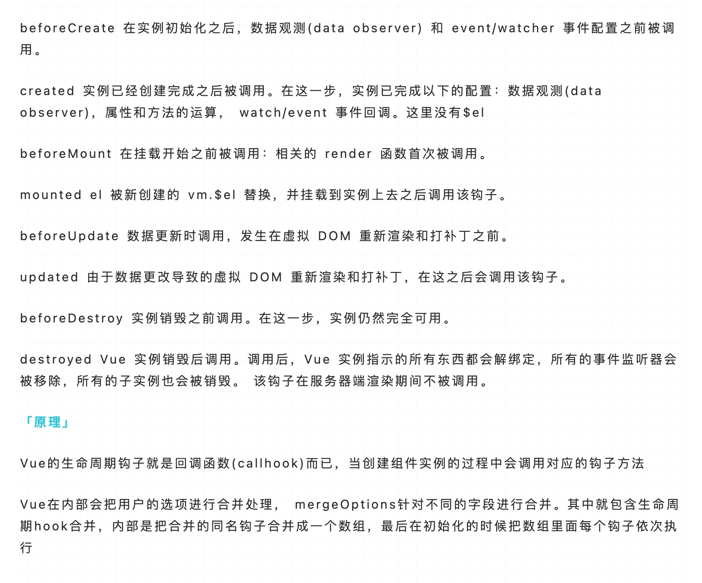
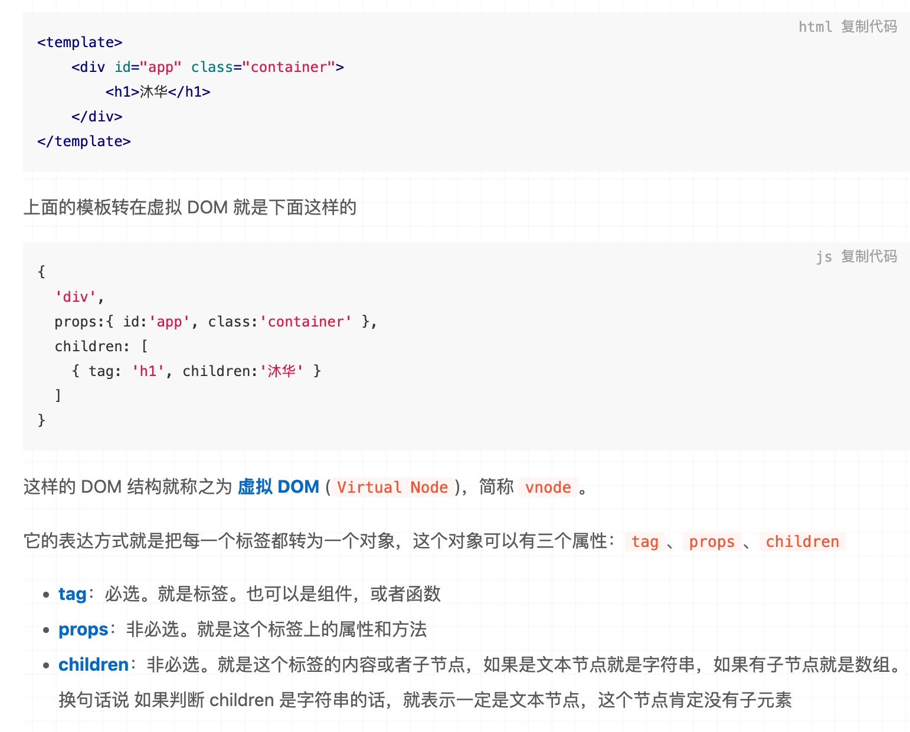

## Vue2.x
### data 为什么是一个函数？
data之所以是一个函数，是因为一个组件可能会多处调用，而每一次调用就会执行data函数并返回新的数据对象，这样，可以避免多处调用之间的数据污染。


因为组件是用来复用的，且 JS 里对象是引用关系，如果组件中 data 是一个对象，那么这样作用域没有隔离，子组件中的 data 属性值会相互影响，如果组件中 data 选项是一个函数，那么每个实例可以维护一份被返回对象的独立的拷贝，组件实例之间的 data 属性值不会互相影响；而 new Vue 的实例，是不会被复用的，因此不存在引用对象的问题。


著作权归作者所有。商业转载请联系作者获得授权，非商业转载请注明出处。

1. 一个组件被复用多次的话，也就会创建多个实例。本质上，这些实例用的都是同一个构造函数。 
2. 如果 data 是对象的话，对象属于引用类型，会影响到所有的实例。所以为了保证组件不同的实例之间 data 不冲突，data 必须是一个函数。
### 响应式原理
**vue2.0缺陷，如果数据层级过多，则会出现大量的递归，造成内存性能损耗。**

数据响应式就是**拦截数据的访问与更新**，在其 发生这些操作的时候可以让我们知晓。所以，**数据响应式是用来服务双向数据绑定的。**

`Vue`初始化时会用 `Object.defineProperty()`给 `data` 中每一个属性添加` getter` 和 `setter`


具体来说：
1. `vue` 初始化阶段`(beforeCreate 之后 create 之前)`两个钩子之间执行的，遍历 `data/props`，调用 `Object.defineProperty` 给每个属性加上 `getter、setter`。


有双向绑定的东西：
2. 同时实例化一个 `Dep`，`Dep` 可以理解为一个消息中心。数据的变更最终是要通知到 `Watcher` 的，`Dep` 中收集了这些数据要通知的 `Watcher`。当 `getter` 触发时，当前的 `Watcher（Dep.target）` 会被加入 `dep` 中；当 `setter` 触发时，`dep` 会调用 `notify` 方法，通知其收集的所有`Watcher`。`Dep` 就是一个消息中心，代码也很简单，目的就是收集 `Watcher`，当数据变更时，调用所有 `Watcher` 的 `update` 方法。
3. `Watcher` 是一个观察者，数据变化时会调用其 `update` 方法，更新对应视图。在组件 `mount` 的时候，会实例化一个 `Watcher`，每个组件对应一个 `Watcher`。因此 Vue 每次更新都是以`组件`为单位，`diff`算法也是以组件为单位进行对比，`这也是组件必须只有一个根元素的原因`。
4. `Watcher` 实例化之后，会修改 `Dep.target`，将其指向自己。接着组件挂载，模板渲染，`data` 中的值被读取，触发其 `getter`，`Dep` 收集当前的 `Watcher`，形成闭环。


整个双向绑定（包含响应式）的过程总结下来就是：
在 `data` 初始化时，将其属性转换成 `getter` 和 `setter`，同时实例化一个 `Dep`。视图渲染时， `getter` 触发，`Dep` 会收集 `Watcher`；在 `setter` 触发时，`Dep` 会通知其收集的 `Watcher` 更新视图。`Wathcer` 在组件挂载时实例化，`Watcher` 与组件一一对应。


### 响应式原理详细解析


分为三部分：
- Vue 初始化
- 模板渲染
- 组件渲染
#### Vue 初始化
从 `new Vue` 开始，经过了一系列调用 `init`、`initState`、`initData`、`observe`、`new Obsever`、`defineReactive`
```vue
<template>
  <div>
    {{ message }}
  </div>
</template>
<script>
new Vue({
  data() {
    return {
      message: "hello world",
    };
  },
});
</script>
```
```js
// new Vue 的地方开始分析。
// 执行 new Vue 时会依次执行以下方法
// 1. Vue.prototype._init(option)
// 2. initState(vm)
// 3. observe(vm._data)
// 4. new Observer(data)

// 5. 调用 walk 方法，遍历 data 中的每一个属性，监听数据的变化。
function walk(obj) {
  const keys = Object.keys(obj);
  for (let i = 0; i < keys.length; i++) {
    defineReactive(obj, keys[i]);
  }
}

// 6. 执行 defineProperty 监听数据读取和设置。
function defineReactive(obj, key, val) {
  // 为每个属性创建 Dep（依赖搜集的容器，后文会讲）
  const dep = new Dep();
  // 绑定 get、set
  Object.defineProperty(obj, key, {
    get() {
      const value = val;
      // 如果有 target 标识，则进行依赖搜集
      if (Dep.target) {
        dep.depend();
      }
      return value;
    },
    set(newVal) {
      val = newVal;
      // 修改数据时，通知页面重新渲染
      dep.notify();
    },
  });
}
```


通过 get、set 监听 Data 中的数据变化，同时为每一个属性创建 Dep 用来搜集使用该 Data 的 Watcher。

图中我们可以看到，Vue 初始化时，进行了数据的 get、set 绑定，并创建了一个 Dep 对象。对于数据的 get、set 绑定我们并不陌生，但是 Dep 对象什么呢？Dep 对象用于依赖收集，它实现了一个发布订阅模式，完成了数据 Data 和渲染视图 Watcher 的订阅，我们一起来剖析一下。
```ts
class Dep {
  // 根据 ts 类型提示，我们可以得出 Dep.target 是一个 Watcher 类型。
  static target: ?Watcher;
  // subs 存放搜集到的 Watcher 对象集合
  subs: Array<Watcher>;
  constructor() {
    this.subs = [];
  }
  addSub(sub: Watcher) {
    // 搜集所有使用到这个 data 的 Watcher 对象。
    this.subs.push(sub);
  }
  depend() {
    if (Dep.target) {
      // 搜集依赖，最终会调用上面的 addSub 方法
      Dep.target.addDep(this);
    }
  }
  notify() {
    const subs = this.subs.slice();
    for (let i = 0, l = subs.length; i < l; i++) {
      // 调用对应的 Watcher，更新视图
      subs[i].update();
    }
  }
}
```


了解 Data 和 Dep 之后，我们来继续揭开 Watcher 的面纱。

编译模板，创建 Watcher，并将 Dep.target 标识为当前 Watcher。
```js
class Watcher {
  constructor(vm, expOrFn) {
    // 将 vm._render 方法赋值给 getter。
    // expOrFn 就是 vm._render
    this.getter = expOrFn;
    this.value = this.get();
  }
  get() {
    // 给 Dep.target 赋值为当前 Watcher 对象
    Dep.target = this;
    // this.getter 其实就是 vm._render
    // vm._render 用来生成虚拟 dom、执行 dom-diff、更新真实 dom。
    // 重新触发_render函数，生成VDom、更新Dom
    const value = this.getter.call(this.vm, this.vm);
    return value;
  }
  addDep(dep) {
    // 收集当前的Watcher为依赖
    // 将当前的 Watcher 添加到 Dep 收集池中
    dep.addSub(this);
  }
  update() {
    if (this.lazy) {
      this.dirty = true;
    } else if (this.sync) {
      this.run();
    } else {
      // 开启异步队列，批量更新 Watcher
      queueWatcher(this);
    }
  }
  run() {
    // 和初始化一样，会调用 get 方法，更新视图
    const value = this.get();
  }
}
```
源码中我们看到，Watcher 实现了渲染方法 _render 和 Dep 的关联， 初始化 Watcher 的时候，打上 Dep.target 标识，然后调用 get 方法进行页面渲染。加上上文的 Data，目前 Data、Dep、Watcher 三者的关系如下：


Vue 通过 defineProperty 完成了 Data 中所有数据的代理，当数据触发 get 查询时，会将当前的 Watcher 对象加入到依赖收集池 Dep 中，当数据 Data 变化时，会触发 set 通知所有使用到这个 Data 的 Watcher 对象去 update 视图。


#### 模板渲染
编译模板时，如果使用到了 Data 中的数据，就会触发 Data 的 get 方法，然后调用 Dep.addSub 将 Watcher 搜集起来。

数据更新时，会触发 Data 的 set 方法，然后调用 dep.notify，进而调用 watcher.update 方法，将所有使用到这个 Data 的 Watcher 加入一个异步队列。

最终执行 _render 方法完成页面更新。

但现在我们并不知道 Wacher 是从哪里创建的，带着这个问题，我们接着往下探索。上文中，我们分析了初始化 Vue 过程中处理数据的部分，接下来，我们分析一下数据渲染的部分。其实 new Vue 执行到最后，会调用 mount 方法，将 Vue 实例渲染成 dom 。
```js
// new Vue 执行流程。
// 1. Vue.prototype._init(option)
// 2. vm.$mount(vm.$options.el)
// 3. render = compileToFunctions(template) ，编译 Vue 中的 template 模板，生成 render 方法。
// 4. Vue.prototype.$mount 调用上面的 render 方法挂载 dom。
// 5. mountComponent

// 6. 创建 Watcher 实例
const updateComponent = () => {
  vm._update(vm._render());
};
// 结合上文，我们就能得出，updateComponent 就是传入 Watcher 内部的 getter 方法。
new Watcher(vm, updateComponent);

// 7. new Watcher 会执行 Watcher.get 方法
// 8. Watcher.get 会执行 this.getter.call(vm, vm) ，也就是执行 updateComponent 方法
// 9. updateComponent 会执行 vm._update(vm._render())

// 10. 调用 vm._render 生成虚拟 dom
Vue.prototype._render = function (): VNode {
  const vm: Component = this;
  const { render } = vm.$options;
  let vnode = render.call(vm._renderProxy, vm.$createElement);
  return vnode;
};
// 11. 调用 vm._update(vnode) 渲染虚拟 dom
Vue.prototype._update = function (vnode: VNode) {
  const vm: Component = this;
  if (!prevVnode) {
    // 初次渲染
    vm.$el = vm.__patch__(vm.$el, vnode, hydrating, false);
  } else {
    // 更新
    vm.$el = vm.__patch__(prevVnode, vnode);
  }
};
// 12. vm.__patch__ 方法就是做的 dom diff 比较，然后更新 dom，这里就不展开了。
```
看完 Vue 模板渲染的过程，我们可以得到如下的流程图：


我们就知道了 Watcher 其实是在 Vue 初始化的阶段创建的，属于生命周期中 beforeMount 的位置创建的，创建 Watcher 时会执行 render 方法，最终将 Vue 代码渲染成真实的 DOM。


上图分析了 Vue 初始化到渲染 DOM 的整个过程，最后我们再分析一下，当数据变化时，Vue 又是怎么进行更新的？其实，在上图也能看出，在 Data 变化时，会调用 Dep.notify 方法，随即调用 Watcher 内部的 update 方法，此方法会将所有使用到这个 Data 的 Watcher 加入一个队列，并开启一个异步队列进行更新，最终执行 _render 方法完成页面更新。


#### 组件渲染
```ts
// 从模板编译开始，当发现一个自定义组件时，会执行以下函数
// 1. compileToFunctions(template)
// 2. compile(template, options);
// 3. const ast = parse(template.trim(), options)
// 4. const code = generate(ast, options)
// 5. createElement

// 6. createComponent
export function createComponent(
  Ctor: Class<Component> | Function | Object | void,
  data: ?VNodeData,
  context: Component,
  children: ?Array<VNode>,
  tag?: string
): VNode | Array<VNode> | void {
  // $options._base 其实就是全局 Vue 构造函数，在初始化时 initGlobalAPI 中定义的：Vue.options._base = Vue
  const baseCtor = context.$options._base;
  // Ctor 就是 Vue 组件中 <script> 标签下 export 出的对象
  if (isObject(Ctor)) {
    // 将组件中 export 出的对象，继承自 Vue，得到一个构造函数
    // 相当于 Vue.extend(YourComponent)
    Ctor = baseCtor.extend(Ctor);
  }
  const vnode = new VNode(`vue-component-${Ctor.cid}xxx`);
  return vnode;
}

// 7. 实现组件继承 Vue，并调用 Vue._init 方法，进行初始化
Vue.extend = function (extendOptions: Object): Function {
  const Super = this;
  const Sub = function VueComponent(options) {
    // 调用 Vue.prototype._init，之后的流程就和首次加载保持一致
    this._init(options);
  };
  // 原型继承，相当于：Component extends Vue
  Sub.prototype = Object.create(Super.prototype);
  Sub.prototype.constructor = Sub;
  return Sub;
};
```


#### 总结
1. 从 new Vue 开始，首先通过 get、set 监听 Data 中的数据变化，同时创建 Dep 用来搜集使用该 Data 的 Watcher。
2. 编译模板，创建 Watcher，并将 Dep.target 标识为当前 Watcher。
3. 编译模板时，如果使用到了 Data 中的数据，就会触发 Data 的 get 方法，然后调用 Dep.addSub 将 Watcher 搜集起来。
4. 数据更新时，会触发 Data 的 set 方法，然后调用 Dep.notify 通知所有使用到该 Data 的 Watcher 去更新 DOM。

### 如何实现数组响应式的？

所以在 Vue 中修改数组的索引和长度是无法监控到的。需要通过以上 7 种变异方法修改数组才会触发数组对应的 watcher 进行更新。
```js
// src/obserber/array.js\
// 先保留数组原型\
const arrayProto = Array.prototype;\
// 然后将arrayMethods继承自数组原型\
// 这里是面向切片编程思想（AOP）--不破坏封装的前提下，动态的扩展功能\
export const arrayMethods = Object.create(arrayProto);\
let methodsToPatch = [\
  "push",\
  "pop",\
  "shift",\
  "unshift",\
  "splice",\
  "reverse",\
  "sort",\
];\
methodsToPatch.forEach((method) => {\
  arrayMethods[method] = function (...args) {\
    //   这里保留原型方法的执行结果\
    const result = arrayProto[method].apply(this, args);\
    // 这句话是关键\
    // this代表的就是数据本身 比如数据是{a:[1,2,3]} 那么我们使用a.push(4)  this就是a  ob就是a.__ob__ 这个属性就是上段代码增加的 代表的是该数据已经被响应式观察过了指向Observer实例\
    const ob = this.__ob__;\
\
    // 这里的标志就是代表数组有新增操作\
    let inserted;\
    switch (method) {\
      case "push":\
      case "unshift":\
        inserted = args;\
        break;\
      case "splice":\
        inserted = args.slice(2);\
      default:\
        break;\
    }\
    // 如果有新增的元素 inserted是一个数组 调用Observer实例的observeArray对数组每一项进行观测\
    if (inserted) ob.observeArray(inserted);\
    // 之后咱们还可以在这里检测到数组改变了之后从而触发视图更新的操作--后续源码会揭晓\
    return result;\
  };\
});
```


**无法检测通过索引改变数组的操作。**
对于对象而言，每一次的数据变更都会对对象的属性进行一次枚举，一般对象本身的属性数量有限，所以对于遍历枚举等方式产生的性能损耗可以忽略不计，但是对于数组而言呢？数组包含的元素量是可能达到成千上万，假设对于每一次数组元素的更新都触发了枚举/遍历，其带来的性能损耗将与获得的用户体验不成正比，故vue无法检测数组的变动。


无法检测通过索引改变数组的操作。即`vm.items[indexOfItem] = newValue`
Vue对数组的7个变异方法（push、pop、shift、unshift、splice、sort、reverse）实现了响应式。这里就不做测试了。我们测试一下通过索引改变数组的操作，能不能被监听到。遍历数组，用Object.defineProperty对每一项进行监测。
```js
function defineReactive(data, key, value) {
	 Object.defineProperty(data, key, {
		 enumerable: true,
		 configurable: true,
		 get: function defineGet() {
			 console.log(`get key: ${key} value: ${value}`)
			 return value
		 },
		 set: function defineSet(newVal) {
			 console.log(`set key: ${key} value: ${newVal}`)
			 value = newVal
		 }
	 })
}
 
function observe(data) {
	Object.keys(data).forEach(function(key) {
		defineReactive(data, key, data[key])
	})
}
 
let arr = [1, 2, 3]
observe(arr)
```
```js
...
// 取出 Array的原型prototype 存储在 arrayProto变量中，
const arrayProto = Array.prototype
// 在这个原型基础之上create一个新的对象 arrayMethods
export const arrayMethods = Object.create(arrayProto)

const methodsToPatch = [
  'push',
  'pop',
  'shift',
  'unshift',
  'splice',
  'sort',
  'reverse'
]

/**
 * Intercept mutating methods and emit events
 */
 // 接下来遍历数组这7个方法，在这些方法原有功能的基础上，额外添加了通知 更新(ob.dep.notify())的操作
methodsToPatch.forEach(function (method) {
  // cache original method  存储原本的方法
  const original = arrayProto[method]
  // def为引入的方法，作用是通知更新
  def(arrayMethods, method, function mutator (...args) {
    // 先是正常调用当前方法
    const result = original.apply(this, args)
    const ob = this.__ob__
    let inserted
    switch (method) {
      case 'push':
      case 'unshift':
        inserted = args
        break
      case 'splice':
        inserted = args.slice(2)
        break
    }
    // 给新增的属性添加监听依赖
    if (inserted) ob.observeArray(inserted)
    // notify change
    // 最后 dep.notify() 通知更新
    ob.dep.notify()
    return result
  })
})
```
#### 解决方案
1. ​this.$set(array, index, data)
```js
//这是个深度的修改，某些情况下可能导致你不希望的结果，因此最好还是慎用
this.dataArr = this.originArr
this.$set(this.dataArr, 0, {data: '修改第一个元素'})
console.log(this.dataArr)        
console.log(this.originArr)  //同样的 源数组也会被修改 在某些情况下会导致你不希望的结果 
```
2. splice
```js
//因为splice会被监听有响应式，而splice又可以做到增删改。
```
3. 利用临时变量进行中转
```js
let tempArr = [...this.targetArr]
tempArr[0] = {data: 'test'}
this.targetArr = tempArr
```
### 为什么只对对象劫持，而要对数组进行方法重写？
因为对象最多也就几十个属性，拦截起来数量不多，但是数组可能会有几百几千项，拦截起来非常耗性能，所以直接重写数组原型上的方法，是比较节省性能的方案。
### 如何实现对象新增属性响应式的？
无法检测数组/对象的新增？Vue检测数据的变动是通过Object.defineProperty实现的，所以无法监听数组的添加操作是可以理解的，因为是在构造函数中就已经为所有属性做了这个检测绑定操作。

#### 解决方案
1. this.$set(obj, key ,value) - 可实现增、改
2. watch时添加deep：true深度监听，只能监听到属性值的变化，新增、删除属性无法监听
```js
this.$watch('blog', this.getCatalog, {
    deep: true
    // immediate: true // 是否第一次触发
  });
```
3. watch时直接监听某个key
```js
watch: {
  'obj.name'(curVal, oldVal) {
    // TODO
  }
}
```
### Vue.mixin的使用场景和原理?
- Vue的mixin的作用就是抽离公共的业务逻辑，原理类似对象的继承，当组件初始化的时候，会调用mergeOptions方法进行合并，采用策略模式针对不同的属性进行合并。 如果混入的数据和本身组件的数据有冲突，采用本身的数据为准。
- 缺点：命名冲突、数据来源不清晰
### Vue.set方法是如何实现的？
- vue给对象和数组本身都增加了dep属性
- 当给对象新增不存在的属性的时候，就会触发对象依赖的watcher去更新
- 当修改数组索引的时候，就调用数组本身的splice方法去更新数组
### Vue.use是干什么的？
Vue.use是用来使用插件的。我们可以在插件中扩展全局组件、指令、原型方法等。 会调用install方法将Vue的构建函数默认传入，在插件中可以使用vue，无需依赖vue库。
### watch原理
`computed`和`watch`内部都是利用了`watcher`，`user watcher`的过程如下：
1. Vue 在`initWatch`过程中，创建`Watcher`，并设置标志位 `user` 为`true`，并判断用户是否设置了`immediate`为`true`，如果是，立即执行回调；
2. `watch`的对象`update`时，判断是否设置了`sync`为`true`，如果是，不加入异步队列，直接更新；
3. `Watcher`更新时判断标志位`user`是否为`true`，如果是，则执行用户传入的` cb`，把`newVal`和`oldVal`传入。
### computed原理
```js
computed: {
  name() {
    return `My name is ${this.user.name}`;
  }
}
```
`computed watcher`的过程如下：
1. Vue 在 `initComputed` 过程中，创建标志位`lazy`为`true`的`Watcher`：
2. 因为初始化的时候`dirty=lazy=true`，会调用` watcher.evaluate` 方法进行一次求值 `this.getter.call(vm, vm)` ，此时会访问`this.user.name`，所以会触发其依赖收集。这时候`Dep.target`的值为`computed watcher`，依赖收集完后，`this.user.name`的`dep`中就有了`computed watcher`；
3. 然后在`watcher.evaluate`中将`dirty`设置为`false`；
4. 如果`Dep.target`存在，则调用 `watcher.depend` 进行一次`render watcher`的收集；
```js
// 创建computed的getter的工厂函数
function createComputedGetter (key) {
  return function computedGetter () {
    const watcher = this._computedWatchers && this._computedWatchers[key]
    if (watcher) {
      if (watcher.dirty) {
        watcher.evaluate()
      }
      if (Dep.target) {
        watcher.depend()
      }
      return watcher.value
    }
  }
}
```
1. 当 `name` 值改变时，会触发`set`，然后通知 `computed watcher`，执行 `update` 方法，并将`dirty`设置为`true`。
2. 再次访问`computed`属性时，如果`dirty`为`false`，则不会执行 `watcher.evaluate` 方法，直接返回之前缓存的值，如果`dirty`为`true`，则重新计算。
### computed与watch原理

### computed与watch区别


通俗来讲，既能用 computed 实现又可以用 watch 监听来实现的功能，推荐用 computed， 重点在于 `computed 的缓存功能` computed 计算属性是用来`声明式`的描述一个值依赖了其它的值，当所依赖的值或者变量 改变时，计算属性也会跟着改变； watch 监听的是已经在 data 中定义的变量，当该变量变化时，会触发 watch 中的方法。

- watch 属性监听 是一个对象，键是需要观察的属性，值是对应回调函数，主要用来监听某些特定数据的变化，从而进行某些具体的业务逻辑操作,监听属性的变化，需要在数据变化时执行异步或开销较大的操作时使用
    - watch基本使用的时候是浅监听  (deep:true)
    - watch监听引用类型，拿不到oldVal
        - 因为指针相同，此时已经指向了新的val
- computed 计算属性 属性的结果会被缓存，当 computed 中的函数所依赖的属性没有发生改变的时候，那么调用当前函数的时候结果会从缓存中读取。除非依赖的响应式属性变化时才会重新计算，主要当做属性来使用 computed 中的函数必须用 return 返回最终的结果 computed 更高效，优先使用。data 不改变，computed 不更新。
    - 使用场景 computed：当一个属性受多个属性影响的时候使用，例：购物车商品结算功能 watch：当一条数据影响多条数据的时候使用，例：搜索数据。
    - computed有缓存，data不变则不会重新计算
### 双向绑定的实现原理
双向数据绑定就是视图层或者数据层中的一方发生变化，相对应的另一层也会发生变化。数据响应式就是拦截数据的访问与更新，在其发生这些操作的时候可以让我们知晓。所以，数据响应式是用来服务双向数据绑定的。

- Vue采用的是**数据劫持加发布者**-**订阅者模式**的方式。
- 通过`Object.defineProperty()`来劫持各个属性的`setter`和`getter`。在数据变动时发布消息给订阅者，触发响应的监听回调。
- 每个`vue`属性都是通过`Object.defineProperty(obj, prop, descriptor)`实现数据劫持(`data` 和 `props` 各个属性的 `getter` 和 `setter`，`getter` 做依赖收集，`setter` 派发更新。
)，为每个属性分配一个订阅者集合的管理数组`dep`；
- 然后在编译的时候在该属性的数组`dep`中添加订阅者，`v-model`会添加一个订阅者，`{{}}`也会，`v-bind`也会，只要用到该属性的指令理论上都会。
- 接着为`input`会添加监听事件，修改值就会为该属性赋值，触发该属性的`set`方法，在`set`方法内通知订阅者数组`dep`，订阅者数组循环调用各订阅者的`update`方法更新视图。


**对象和数组处理的差异:**
数据响应式对于对象数据是完全OK的，但是对于数组的话就会有问题，因为对于对象数据，其数据变化主要为值的变化，基本上都是通过赋值操作完成，但是对于数组，其除了通过赋值操作实现数组项的数据变化外，还可以通过方法实现对数组数据的变化，故需要对数组做一些特定的操作即来拦截数组的这些方法。主要拦截的数组方法为 push、pop、shift、unshift、splice、reverse、sort，对于这些方法不需要完全重写，只用在使用它们的时候走一边我们自定义的操作实现数据拦截后在让它们按原来的操作继续即可。具体实现如下，先获取 Array.prototype，再通过 def 方法修改原型上的这些方法，对于push、unshift、splice因为能插入新项，故通过 observe 方法劫持(侦测)这些数据(插入新项)。最后在 Observer 类中通过 Object.setPrototypeOf 让数组的原型变为 array.js 中重写的数组原型即可。


### 组件间传值的方法有哪些?
#### props/$emit
props: 父组件A通过props的方式向子组件B传递。(父传子)
$emit: B to A 通过在 B 组件中 $emit, A 组件中 v-on 的方式实现。(子传父)
1. 父组件向子组件传值
父组件通过props向下传递数据给子组件。注：组件中的数据共有三种形式：data、props、computed。
子组件接收到数据之后，不能直接修改父组件的数据。会报错，所以当父组件重新渲染时，数据会被覆盖。如果子组件内要修改的话推荐使用 computed。
```vue
//App.vue父组件
<template>
  <div id="app">
    //前者自定义名称便于子组件调用，后者要传递数据名
    <users v-bind:users="users"></users>  </div>
</template>
<script>
import Users from "./components/Users"
export default {
  name: 'App',
  data(){
    return{
      users:["Henry","Bucky","Emily"]
    }
  },
  components:{
    "users":Users
  }
}
```
```vue
//users子组件
<template>
  <div class="hello">
    <ul>
      <li v-for="user in users">{{user}}</li>//遍历传递过来的值，然后呈现到页面
    </ul>
  </div>
</template>
<script>
export default {
  name: 'HelloWorld',
  props:{
    users:{           //这个就是父组件中子标签自定义名字
      type:Array,
      required:true
    }
  }
}
</script>
```
2. 子组件向父组件传值（通过事件形式）
子组件通过events给父组件发送消息，实际上就是子组件把自己的数据发送到父组件。
```vue
// 子组件
<template>
  <header>
    //绑定一个点击事件
    <h1 @click="changeTitle">{{title}}</h1>
  </header>
</template>
<script>
export default {
  name: 'app-header',
  data() {
    return {
      title:"Vue.js Demo"
    }
  },
  methods:{
    changeTitle() {
      //自定义事件  传递值“子向父组件传值”
      this.$emit("titleChanged","子向父组件传值");
    }
  }
}
</script>
```
```vue
// 父组件
<template>
  <div id="app">
    <app-header v-on:titleChanged="updateTitle" ></app-header>//与子组件titleChanged自定义事件保持一致
   // updateTitle($event)接受传递过来的文字
    <h2>{{title}}</h2>
  </div>
</template>
<script>
import Header from "./components/Header"
export default {
  name: 'App',
  data(){
    return{
      title:"传递的是一个值"
    }
  },
  methods:{
    updateTitle(e){   //声明这个函数
      this.title = e;
    }
  },
  components:{
   "app-header":Header,
  }
}
</script>
```
#### .sync
可以帮我们实现父组件向子组件传递的数据 的双向绑定，所以子组件接收到数据后可以直接修改，并且会同时修改父组件的数据。
```vue
// Parent.vue
<template>
    <child :page.sync="page"></child>
</template>
<script>
export default {
    data(){
        return {
            page:1
        }
    }
}

// Child.vue
export default {
    props:["page"],
    computed(){
        // 当我们在子组件里修改 currentPage 时，父组件的 page 也会随之改变
        currentPage {
            get(){
                return this.page
            },
            set(newVal){
                this.$emit("update:page", newVal)
            }
        }
    }
}
</script>
```
#### v-model
和`.sync`类似，可以实现将父组件传给子组件的数据为双向绑定，子组件通过`$emit`修改父组件的数据。
```vue
// Parent.vue
<template>
    <child v-model="value"></child>
</template>
<script>
export default {
    data(){
        return {
            value:1
        }
    }
}

// Child.vue
<template>
    <input :value="value" @input="handlerChange">
</template>
export default {
    props:["value"],
    // 可以修改事件名，默认为 input
    model:{
        event:"updateValue"
    },
    methods:{
        handlerChange(e){
            this.$emit("input", e.target.value)
            // 如果有上面的重命名就是这样
            this.$emit("updateValue", e.target.value)
        }
    }
}
</script>
```
#### `$emit/$on`
子组件通过派发事件的方式给父组件数据，或者触发父组件更新等操作。

原理：这种方法通过一个空的Vue实例作为中央事件总线（事件中心），用它来触发事件和监听事件,巧妙而轻量地实现了任何组件间的通信，包括父子、兄弟、跨级。
原理：注册的事件存起来，等触发事件时再调用。定义一个类去处理事件，并挂载到Vue实例的this上即可注册和触发事件，也可拓展一些事件管理
```js
// Child.vue 派发
export default {
  data(){
      return { msg: "这是发给父组件的信息" }
  },
  methods: {
      handleClick(){
          this.$emit("sendMsg",this.msg)
      }
  },
}
// Parent.vue 响应
<template>
    <child v-on:sendMsg="getChildMsg"></child>
    // 或 简写
    <child @sendMsg="getChildMsg"></child>
</template>

export default {
    methods:{
        getChildMsg(msg){
            console.log(msg) // 这是父组件接收到的消息
        }
    }
}
```
#### 事件总线 `EventBus` (常用任意两个组件之间通讯)
EventBus 是中央事件总线，不管是父子组件，兄弟组件，跨层级组件等都可以使用它完成通信操作。
```js
// 方法一
// 抽离成一个单独的 js 文件 Bus.js ，然后在需要的地方引入
// Bus.js
import Vue from "vue"
export default new Vue()

// 方法二 直接挂载到全局
// main.js
import Vue from "vue"
Vue.prototype.$bus = new Vue()

// 方法三 注入到 Vue 根对象上
// main.js
import Vue from "vue"
new Vue({
    el:"#app",
    data:{
        Bus: new Vue()
    }
})
```
```js
// 在需要向外部发送自定义事件的组件内
<template>
    <button @click="handlerClick">按钮</button>
</template>
import Bus from "./Bus.js"
export default{
    methods:{
        handlerClick(){
            // 自定义事件名 sendMsg
            Bus.$emit("sendMsg", "这是要向外部发送的数据")
        }
    }
}

// 在需要接收外部事件的组件内
import Bus from "./Bus.js"
export default{
    mounted(){
        // 监听事件的触发
        Bus.$on("sendMsg", data => {
            console.log("这是接收到的数据：", data)
        })
    },
    beforeDestroy(){
        // 取消监听
        Bus.$off("sendMsg")
    }
}
```
#### Vuex 状态管理（vue的核心插件、用于任意组件的任意通讯，需注意刷新后有可能vuex数据会丢失）


Vuex实现了一个单向数据流，在全局拥有一个State存放数据，当组件要更改State中的数据时，必须通过Mutation进行，Mutation同时提供了订阅者模式供外部插件调用获取State数据的更新。而当所有异步操作(常见于调用后端接口异步获取更新数据)或批量的同步操作需要走Action，但Action也是无法直接修改State的，还是需要通过Mutation来修改State的数据。最后，根据State的变化，渲染到视图上。

vuex 是 vue 的状态管理器，存储的数据是响应式的。但是并不会保存起来，刷新之后就回到了初始状态，具体做法应该在vuex里数据改变的时候把数据拷贝一份保存到localStorage里面，刷新之后，如果localStorage里有保存的数据，取出来再替换store里的state。
#### $attrs/$listeners
多级组件嵌套需要传递数据时，通常使用的方法是通过vuex。但如果仅仅是传递数据，而不做中间处理，使用 vuex 处理，未免有点大材小用。为此Vue2.4 版本提供了另一种方法----`$attrs/$listeners`

- `$attrs`：包含了父作用域中不被 prop 所识别 (且获取) 的特性绑定 (class 和 style 除外)。当一个组件没有声明任何 prop 时，这里会包含所有父作用域的绑定 (class 和 style 除外)，并且可以通过 v-bind="$attrs" 传入内部组件。通常配合 inheritAttrs 选项一起使用。
- `$listeners`：包含了父作用域中的 (不含 .native 修饰器的) v-on 事件监听器。它可以通过 v-on="$listeners" 传入内部组件。

`$attrs`与`$listeners`是两个对象，`$attrs`里存放的是父组件中绑定的非`Props`属性，`$listeners`里存放的是父组件中绑定的非原生事件。
```vue
// index.vue
<template>
  <div>
    <h2>浪里行舟</h2>
    <child-com1
      :foo="foo"
      :boo="boo"
      :coo="coo"
      :doo="doo"
      title="前端工匠"
    ></child-com1>
  </div>
</template>
<script>
const childCom1 = () => import("./childCom1.vue");
export default {
  components: { childCom1 },
  data() {
    return {
      foo: "Javascript",
      boo: "Html",
      coo: "CSS",
      doo: "Vue"
    };
  }
};
</script>
```
```vue
// childCom1.vue
<template class="border">
  <div>
    <p>foo: {{ foo }}</p>
    <p>childCom1的$attrs: {{ $attrs }}</p>
    <child-com2 v-bind="$attrs"></child-com2>
  </div>
</template>
<script>
const childCom2 = () => import("./childCom2.vue");
export default {
  components: {
    childCom2
  },
  inheritAttrs: false, // 可以关闭自动挂载到组件根元素上的没有在props声明的属性
  props: {
    foo: String // foo作为props属性绑定
  },
  created() {
    console.log(this.$attrs); // { "boo": "Html", "coo": "CSS", "doo": "Vue", "title": "前端工匠" }
  }
};
</script>
```
```vue
// childCom2.vue
<template>
  <div class="border">
    <p>boo: {{ boo }}</p>
    <p>childCom2: {{ $attrs }}</p>
    <child-com3 v-bind="$attrs"></child-com3>
  </div>
</template>
<script>
const childCom3 = () => import("./childCom3.vue");
export default {
  components: {
    childCom3
  },
  inheritAttrs: false,
  props: {
    boo: String
  },
  created() {
    console.log(this.$attrs); // { "coo": "CSS", "doo": "Vue", "title": "前端工匠" }
  }
};
</script>
```
```vue
// childCom3.vue
<template>
  <div class="border">
    <p>childCom3: {{ $attrs }}</p>
  </div>
</template>
<script>
export default {
  props: {
    coo: String,
    title: String
  }
};
</script>
```
#### provide/inject
这对选项需要一起使用，以允许一个祖先组件向其所有子孙后代注入一个依赖，不论组件层次有多深，并在起上下游关系成立的时间里始终生效。一言而蔽之：祖先组件中通过provider来提供变量，然后在子孙组件中通过inject来注入变量。provide / inject API 主要解决了跨级组件间的通信问题，不过它的使用场景，主要是子组件获取上级组件的状态，跨级组件间建立了一种主动提供与依赖注入的关系。

`provide`：可以让我们指定想要提供给后代组件的数据或方法。
`inject`：在任何后代组件中接收想要添加在这个组件上的数据或方法，不管组件嵌套多深都可以直接拿来用。

要注意的是 provide 和 inject 传递的数据不是响应式的，也就是说用 inject 接收来数据后，provide 里的数据改变了，后代组件中的数据不会改变，除非传入的就是一个可监听的对象。

```js
// 父组件
export default{
    // 方法一 不能获取 methods 中的方法
    provide:{
        name:"沐华",
        age: this.data中的属性
    },
    // 方法二 不能获取 data 中的属性
    provide(){
        return {
            name:"沐华",
            someMethod:this.someMethod // methods 中的方法
        }
    },
    methods:{
        someMethod(){
            console.log("这是注入的方法")
        }
    }
}

// 后代组件
export default{
    inject:["name","someMethod"],
    mounted(){
        console.log(this.name)
        this.someMethod()
    }
}
```
可以看到，在 A.vue 里，我们设置了一个 provide: name，值为 浪里行舟，它的作用就是将 name 这个变量提供给它的所有子组件。而在 B.vue 中，通过 inject 注入了从 A 组件中提供的 name 变量，那么在组件 B 中，就可以直接通过 this.name 访问这个变量了，它的值也是 浪里行舟。这就是 provide / inject API 最核心的用法。

需要注意的是：provide 和 inject 绑定并不是可响应的。这是刻意为之的。然而，如果你传入了一个可监听的对象，那么其对象的属性还是可响应的,所以，上面 A.vue 的 name 如果改变了，B.vue 的 this.name 是不会改变的，仍然是 浪里行舟。


provide与inject 怎么实现数据响应式:
一般来说，有两种办法：
- provide祖先组件的实例，然后在子孙组件中注入依赖，这样就可以在子孙组件中直接修改祖先组件的实例的属性，不过这种方法有个缺点就是这个实例上挂载很多没有必要的东西比如props，methods
- 使用2.6最新API Vue.observable 优化响应式 provide(推荐)


```vue
// A 组件 
<div>
      <h1>A 组件</h1>
      <button @click="() => changeColor()">改变color</button>
      <ChildrenB />
      <ChildrenC />
</div>
......
  data() {
    return {
      color: "blue"
    };
  },
  // provide() {
  //   return {
  //     theme: {
  //       color: this.color //这种方式绑定的数据并不是可响应的
  //     } // 即A组件的color变化后，组件D、E、F不会跟着变
  //   };
  // },
  provide() {
    return {
      theme: this//方法一：提供祖先组件的实例
    };
  },
  methods: {
    changeColor(color) {
      if (color) {
        this.color = color;
      } else {
        this.color = this.color === "blue" ? "red" : "blue";
      }
    }
  }
  // 方法二:使用2.6最新API Vue.observable 优化响应式 provide
  // provide() {
  //   this.theme = Vue.observable({
  //     color: "blue"
  //   });
  //   return {
  //     theme: this.theme
  //   };
  // },
  // methods: {
  //   changeColor(color) {
  //     if (color) {
  //       this.theme.color = color;
  //     } else {
  //       this.theme.color = this.theme.color === "blue" ? "red" : "blue";
  //     }
  //   }
  // }
```
```vue
// F 组件 
<template functional>
  <div class="border2">
    <h3 :style="{ color: injections.theme.color }">F 组件</h3>
  </div>
</template>
<script>
export default {
  inject: {
    theme: {
      //函数式组件取值不一样
      default: () => ({})
    }
  }
};
</script>
```
#### ref
这两种方法的弊端是，无法在跨级或兄弟间通信。
- ref：如果在普通的 DOM 元素上使用，引用指向的就是 DOM 元素；如果用在子组件上，引用就指向组件实例
- $parent / $children：访问父 / 子实例

需要注意的是：这两种都是直接得到组件实例，使用后可以直接调用组件的方法或访问数据。
```js
// component-a 子组件
export default {
  data () {
    return {
      title: 'Vue.js'
    }
  },
  methods: {
    sayHello () {
      window.alert('Hello');
    }
  }
}
```
```vue
// 父组件
<template>
  <component-a ref="comA"></component-a>
</template>
<script>
  export default {
    mounted () {
      const comA = this.$refs.comA;
      console.log(comA.title);  // Vue.js
      comA.sayHello();  // 弹窗
    }
  }
</script>
```
#### $root
`$root` 可以拿到 App.vue 里的数据和方法。
#### $children / $parent （不推荐使用，不易于后期维护，一旦页面层次发生变化，就需要重新考虑层级关系）
- `$children：`获取到一个包含所有子组件(不包含孙子组件)的 VueComponent 对象数组，可以直接拿到子组件中所有数据和方法等。
- `$parent`：获取到一个父节点的 VueComponent 对象，同样包含父节点中所有数据和方法等。
```js
// Parent.vue
export default{
    mounted(){
        this.$children[0].someMethod() // 调用第一个子组件的方法
        this.$children[0].name // 获取第一个子组件中的属性
    }
}

// Child.vue
export default{
    mounted(){
        this.$parent.someMethod() // 调用父组件的方法
        this.$parent.name // 获取父组件中的属性
    }
}
```
#### slot
就是把子组件的数据通过插槽的方式传给父组件使用，然后再插回来。
```vue
// Child.vue
<template>
    <div>
        <slot :user="user"></slot>
    </div>
</template>
export default{
    data(){
        return {
            user:{ name:"沐华" }
        }
    }
}

// Parent.vue
<template>
    <div>
        <child v-slot="slotProps">
            {{ slotProps.user.name }}
        </child>
    </div>
</template>
```
#### 总结
常见使用场景可以分为三类：
- 父子通信：
    - props
    - $emit / v-on
    - $attrs / $listeners
    - ref
    - .sync
    - v-model
    - $children / $parent
- 兄弟通信：
    - EventBus
    - Vuex
    - $parent
- 跨级通信：
    - provide/inject
    - EventBus
    - Vuex
    - $attrs / $listeners
    - $root
### Vue模板渲染的原理是什么？

### Vue模版编译原理


- 将模板编译成渲染函数可以分为两个步骤:
    - 将模板解析成AST (抽象语法树)
    - 使用AST生成渲染函数
- 从逻辑上来看 模板编译主要是分为三个部分:
    - 将模板字符串转换成 elment ASTs (解析器)
    - 遍历AST标记静态节点 （优化器），即不需要修改的地方标注出来，后面的虚拟 Dom 对比时便会忽略这个，提升新能
    - 使用AST生成渲染函数 （代码生成器）


- render 函数 => vNode 虚拟dom => 真实 dom
- template 模板 => Ast 抽象语法树 => render => vNode 虚拟dom => 真实 dom
- 转换为 render 函数过程 ：(parse) 生成 ast => (optimize) 优化ast => (generate) 生成 render 函数
#### Vue模板
- 模板不是html,有指令、插值、JS表达式、能实现判断、循环
- 模板一定是转换为某种JS代码，即为模板编译。
#### Vue 的版本
很多人使用 Vue 的时候，都是直接通过 vue-cli 生成的模板代码，并不知道 Vue 其实提供了两个构建版本。
- vue.js： 完整版本，包含了模板编译的能力；
- vue.runtime.js： 运行时版本，不提供模板编译能力，需要通过 vue-loader 进行提前编译。

#### 主流程
- 模板编译，将模板代码转化为 AST；
- 优化 AST，方便后续虚拟 DOM 更新；
- 生成代码，将 AST 转化为可执行的代码；
```js
const baseCompile = (template, options) => {
  // 解析 html，转化为 ast
  const ast = parse(template.trim(), options)
  // 优化 ast，标记静态节点
  optimize(ast, options)
  // 将 ast 转化为可执行代码
  const code = generate(ast, options)
  return {
    ast,
    render: code.render,
    staticRenderFns: code.staticRenderFns
  }
}
```
#### 模板编译，将模板代码转化为 AST(parse)
首先看到 parse 方法，该方法的主要作用就是解析 HTML，并转化为 AST（抽象语法树）。
**AST**
```vue
new Vue({
  el: '#app',
  template: `
    <div>
      <h2 v-if="message">{{message}}</h2>
      <button @click="showName">showName</button>
    </div>
  `,
  data: {
    name: 'shenfq',
    message: 'Hello Vue!'
  },
  methods: {
    showName() {
      alert(this.name)
    }
  }
})
```


AST 为一个树形结构的对象，每一层表示一个节点，第一层就是 `div`（`tag: "div"`）。`div` 的子节点都在 `children` 属性中，分别是 `h2` 标签、空行、`button` 标签。我们还可以注意到有一个用来标记节点类型的属性：`type`，这里 `div` 的 `type` 为 `1`，表示是一个元素节点，`type` 一共有三种类型：
1. 元素节点；
2. 表达式；
3. 文本；

在 `h2` 和 `button` 标签之间的空行就是 `type` 为 `3` 的文本节点，而 `h2` 标签下就是一个表达式节点。


**解析HTML**
parse 的整体逻辑较为复杂，我们可以先简化一下代码，看看 parse 的流程。
```js
import { parseHTML } from './html-parser'

export function parse(template, options) {
  let root
  parseHTML(template, {
    // some options...
    start() {}, // 解析到标签位置开始的回调
    end() {}, // 解析到标签位置结束的回调
    chars() {}, // 解析到文本时的回调
    comment() {} // 解析到注释时的回调
  })
  return root
}
```
可以看到 parse 主要通过 parseHTML 进行工作，这个 parseHTML 本身来自于开源库：htmlparser.js，只不过经过了 Vue 团队的一些修改，修复了相关 issue。
下面我们一起来理一理 parseHTML 的逻辑。
```js
export function parseHTML(html, options) {
  let index = 0
  let last,lastTag
  const stack = []
  while(html) {
    last = html
    let textEnd = html.indexOf('<')

    // "<" 字符在当前 html 字符串开始位置
    if (textEnd === 0) {
      // 1、匹配到注释: <!-- -->
      if (/^<!\--/.test(html)) {
        const commentEnd = html.indexOf('-->')
        if (commentEnd >= 0) {
          // 调用 options.comment 回调，传入注释内容
          options.comment(html.substring(4, commentEnd))
          // 裁切掉注释部分
          advance(commentEnd + 3)
          continue
        }
      }

      // 2、匹配到条件注释: <![if !IE]>  <![endif]>
      if (/^<!\[/.test(html)) {
        // ... 逻辑与匹配到注释类似
      }

      // 3、匹配到 Doctype: <!DOCTYPE html>
      const doctypeMatch = html.match(/^<!DOCTYPE [^>]+>/i)
      if (doctypeMatch) {
        // ... 逻辑与匹配到注释类似
      }

      // 4、匹配到结束标签: </div>
      const endTagMatch = html.match(endTag)
      if (endTagMatch) {}

      // 5、匹配到开始标签: <div>
      const startTagMatch = parseStartTag()
      if (startTagMatch) {}
    }
    // "<" 字符在当前 html 字符串中间位置
    let text, rest, next
    if (textEnd > 0) {
      // 提取中间字符
      rest = html.slice(textEnd)
      // 这一部分当成文本处理
      text = html.substring(0, textEnd)
      advance(textEnd)
    }
    // "<" 字符在当前 html 字符串中不存在
    if (textEnd < 0) {
      text = html
      html = ''
    }
    
    // 如果存在 text 文本
    // 调用 options.chars 回调，传入 text 文本
    if (options.chars && text) {
      // 字符相关回调
      options.chars(text)
    }
  }
  // 向前推进，裁切 html
  function advance(n) {
    index += n
    html = html.substring(n)
  }
}
```
上述代码为简化后的 `parseHTML`，`while` 循环中每次截取一段 `html `文本，然后通过正则判断文本的类型进行处理，这就类似于编译原理中常用的有限状态机。每次拿到 `"<"` 字符前后的文本，`"<"` 字符前的就当做文本处理，`"<"` 字符后的通过正则判断，可推算出有限的几种状态。


其他的逻辑处理都不复杂，主要是开始标签与结束标签，我们先看看关于开始标签与结束标签相关的正则。
```js
const ncname = '[a-zA-Z_][\\w\\-\\.]*'
const qnameCapture = `((?:${ncname}\\:)?${ncname})`
const startTagOpen = new RegExp(`^<${qnameCapture}`)
```


所以我们简化一下这个正则：
```js
const ncname = '[a-zA-Z_][\\w\\-\\.]*'
const startTagOpen = new RegExp(`^<${ncname}`)
const startTagClose = /^\s*(\/?)>/
const endTag = new RegExp(`^<\\/${ncname}[^>]*>`)
```


除了上面关于标签开始和结束的正则，还有一段用来提取标签属性的正则，真的是又臭又长。
```js
const attribute = /^\s*([^\s"'<>\/=]+)(?:\s*(=)\s*(?:"([^"]*)"+|'([^']*)'+|([^\s"'=<>`]+)))?/
```


理清正则后可以更加方便我们看后面的代码。
```js
while(html) {
  last = html
  let textEnd = html.indexOf('<')

  // "<" 字符在当前 html 字符串开始位置
  if (textEnd === 0) {
    // some code ...

    // 4、匹配到标签结束位置: </div>
    const endTagMatch = html.match(endTag)
    if (endTagMatch) {
      const curIndex = index
      advance(endTagMatch[0].length)
      parseEndTag(endTagMatch[1], curIndex, index)
      continue
    }

    // 5、匹配到标签开始位置: <div>
    const startTagMatch = parseStartTag()
    if (startTagMatch) {
      handleStartTag(startTagMatch)
      continue
    }
  }
}
// 向前推进，裁切 html
function advance(n) {
  index += n
  html = html.substring(n)
}

// 判断是否标签开始位置，如果是，则提取标签名以及相关属性
function parseStartTag () {
  // 提取 <xxx
  const start = html.match(startTagOpen)
  if (start) {
    const [fullStr, tag] = start
    const match = {
      attrs: [],
      start: index,
      tagName: tag,
    }
    advance(fullStr.length)
    let end, attr
    // 递归提取属性，直到出现 ">" 或 "/>" 字符
    while (
      !(end = html.match(startTagClose)) &&
      (attr = html.match(attribute))
    ) {
      advance(attr[0].length)
      match.attrs.push(attr)
    }
    if (end) {
      // 如果是 "/>" 表示单标签
      match.unarySlash = end[1]
      advance(end[0].length)
      match.end = index
      return match
    }
  }
}

// 处理开始标签
function handleStartTag (match) {
  const tagName = match.tagName
  const unary = match.unarySlash
  const len = match.attrs.length
  const attrs = new Array(len)
  for (let i = 0; i < l; i++) {
    const args = match.attrs[i]
    // 这里的 3、4、5 分别对应三种不同复制属性的方式
    // 3: attr="xxx" 双引号
    // 4: attr='xxx' 单引号
    // 5: attr=xxx   省略引号
    const value = args[3] || args[4] || args[5] || ''
    attrs[i] = {
      name: args[1],
      value
    }
  }

  if (!unary) {
    // 非单标签，入栈
    stack.push({
      tag: tagName,
      lowerCasedTag:
      tagName.toLowerCase(),
      attrs: attrs
    })
    lastTag = tagName
  }

  if (options.start) {
    // 开始标签的回调
    options.start(tagName, attrs, unary, match.start, match.end)
  }
}

// 处理闭合标签
function parseEndTag (tagName, start, end) {
  let pos, lowerCasedTagName
  if (start == null) start = index
  if (end == null) end = index

  if (tagName) {
    lowerCasedTagName = tagName.toLowerCase()
  }

  // 在栈内查找相同类型的未闭合标签
  if (tagName) {
    for (pos = stack.length - 1; pos >= 0; pos--) {
      if (stack[pos].lowerCasedTag === lowerCasedTagName) {
        break
      }
    }
  } else {
    pos = 0
  }

  if (pos >= 0) {
    // 关闭该标签内的未闭合标签，更新堆栈
    for (let i = stack.length - 1; i >= pos; i--) {
      if (options.end) {
        // end 回调
        options.end(stack[i].tag, start, end)
      }
    }

    // 堆栈中删除已关闭标签
    stack.length = pos
    lastTag = pos && stack[pos - 1].tag
  }
}
```
在解析开始标签的时候，如果该标签不是单标签，会将该标签放入到一个堆栈当中，每次闭合标签的时候，会从栈顶向下查找同名标签，直到找到同名标签，这个操作会闭合同名标签上面的所有标签。
理清了 parseHTML 的逻辑后，我们回到调用 parseHTML 的位置，调用该方法的时候，一共会传入四个回调，分别对应标签的开始和结束、文本、注释。
```js
parseHTML(template, {
  // some options...

  // 解析到标签位置开始的回调
  start(tag, attrs, unary) {},
  // 解析到标签位置结束的回调
  end(tag) {},
  // 解析到文本时的回调
  chars(text: string) {},
  // 解析到注释时的回调
  comment(text: string) {}
})
```


**处理开始标签**
首先看解析到开始标签时，会生成一个 AST 节点，然后处理标签上的属性，最后将 AST 节点放入树形结构中。
```js
function makeAttrsMap(attrs) {
  const map = {}
  for (let i = 0, l = attrs.length; i < l; i++) {
    const { name, value } = attrs[i]
    map[name] = value
  }
  return map
}
function createASTElement(tag, attrs, parent) {
  const attrsList = attrs
  const attrsMap = makeAttrsMap(attrsList)
  return {
    type: 1,       // 节点类型
    tag,           // 节点名称
    attrsMap,      // 节点属性映射
    attrsList,     // 节点属性数组
    parent,        // 父节点
    children: [],  // 子节点
  }
}

const stack = []
let root // 根节点
let currentParent // 暂存当前的父节点
parseHTML(template, {
  // some options...

  // 解析到标签位置开始的回调
  start(tag, attrs, unary) {
    // 创建 AST 节点
    let element = createASTElement(tag, attrs, currentParent)

    // 处理指令: v-for v-if v-once
    processFor(element)
    processIf(element)
    processOnce(element)
    processElement(element, options)

    // 处理 AST 树
    // 根节点不存在，则设置该元素为根节点
   	if (!root) {
      root = element
      checkRootConstraints(root)
    }
    // 存在父节点
    if (currentParent) {
      // 将该元素推入父节点的子节点中
      currentParent.children.push(element)
      element.parent = currentParent
    }
    if (!unary) {
    	// 非单标签需要入栈，且切换当前父元素的位置
      currentParent = element
      stack.push(element)
    }
  }
})
```


**处理结束标签**
标签结束的逻辑就比较简单了，只需要去除栈内最后一个未闭合标签，进行闭合即可。
```js
parseHTML(template, {
  // some options...

  // 解析到标签位置结束的回调
  end() {
    const element = stack[stack.length - 1]
    const lastNode = element.children[element.children.length - 1]
    // 处理尾部空格的情况
    if (lastNode && lastNode.type === 3 && lastNode.text === ' ') {
      element.children.pop()
    }
    // 出栈，重置当前的父节点
    stack.length -= 1
    currentParent = stack[stack.length - 1]
  }
})
```


**处理文本**
处理完标签后，还需要对标签内的文本进行处理。文本的处理分两种情况，一种是带表达式的文本，还一种就是纯静态的文本。
```js
parseHTML(template, {
  // some options...

  // 解析到文本时的回调
  chars(text) {
    if (!currentParent) {
      // 文本节点外如果没有父节点则不处理
      return
    }
    
    const children = currentParent.children
    text = text.trim()
    if (text) {
      // parseText 用来解析表达式
      // delimiters 表示表达式标识符，默认为 ['{{', '}}']
      const res = parseText(text, delimiters))
      if (res) {
        // 表达式
        children.push({
          type: 2,
          expression: res.expression,
          tokens: res.tokens,
          text
        })
      } else {
        // 静态文本
        children.push({
          type: 3,
          text
        })
      }
    }
  }
})
```
下面我们看看 parseText 如何解析表达式。
```js
// 构造匹配表达式的正则
const buildRegex = delimiters => {
  const open = delimiters[0]
  const close = delimiters[1]
  return new RegExp(open + '((?:.|\\n)+?)' + close, 'g')
}

function parseText (text, delimiters){
  // delimiters 默认为 {{ }}
  const tagRE = buildRegex(delimiters || ['{{', '}}'])
  // 未匹配到表达式，直接返回
  if (!tagRE.test(text)) {
    return
  }
  const tokens = []
  const rawTokens = []
  let lastIndex = tagRE.lastIndex = 0
  let match, index, tokenValue
  while ((match = tagRE.exec(text))) {
    // 表达式开始的位置
    index = match.index
    // 提取表达式开始位置前面的静态字符，放入 token 中
    if (index > lastIndex) {
      rawTokens.push(tokenValue = text.slice(lastIndex, index))
      tokens.push(JSON.stringify(tokenValue))
    }
    // 提取表达式内部的内容，使用 _s() 方法包裹
    const exp = match[1].trim()
    tokens.push(`_s(${exp})`)
    rawTokens.push({ '@binding': exp })
    lastIndex = index + match[0].length
  }
  // 表达式后面还有其他静态字符，放入 token 中
  if (lastIndex < text.length) {
    rawTokens.push(tokenValue = text.slice(lastIndex))
    tokens.push(JSON.stringify(tokenValue))
  }
  return {
    expression: tokens.join('+'),
    tokens: rawTokens
  }
}
```

```html
<div>是否登录：{{isLogin ? '是' : '否'}}</div>
```


#### 优化 AST，方便后续虚拟 DOM 更新（optimize）
通过上述一些列处理，我们就得到了 Vue 模板的 AST。由于 Vue 是响应式设计，所以拿到 AST 之后还需要进行一系列优化，确保静态的数据不会进入虚拟 DOM 的更新阶段，以此来优化性能。

```js
export function optimize (root, options) {
  if (!root) return
  // 标记静态节点
  markStatic(root)
}
```
```js
// 简单来说，就是把所以静态节点的 static 属性设置为 true。
function isStatic (node) {
  if (node.type === 2) { // 表达式，返回 false
    return false
  }
  if (node.type === 3) { // 静态文本，返回 true
    return true
  }
  // 此处省略了部分条件
  return !!(
    !node.hasBindings && // 没有动态绑定
    !node.if && !node.for && // 没有 v-if/v-for
    !isBuiltInTag(node.tag) && // 不是内置组件 slot/component
    !isDirectChildOfTemplateFor(node) && // 不在 template for 循环内
    Object.keys(node).every(isStaticKey) // 非静态节点
  )
}

function markStatic (node) {
  node.static = isStatic(node)
  if (node.type === 1) {
    // 如果是元素节点，需要遍历所有子节点
    for (let i = 0, l = node.children.length; i < l; i++) {
      const child = node.children[i]
      markStatic(child)
      if (!child.static) {
        // 如果有一个子节点不是静态节点，则该节点也必须是动态的
        node.static = false
      }
    }
  }
}
```
#### 生成代码，将 AST 转化为可执行的代码(generate)
得到优化的 AST 之后，就需要将 AST 转化为 render 方法。还是用之前的模板，先看看生成的代码长什么样：
```html
<div>
  <h2 v-if="message">{{message}}</h2>
  <button @click="showName">showName</button>
</div>
```
```js
{
  render: "with(this){return _c('div',[(message)?_c('h2',[_v(_s(message))]):_e(),_v(" "),_c('button',{on:{"click":showName}},[_v("showName")])])}"
}
```
```js
with (this) {
    // 这里的 _c 对应的是虚拟 DOM 中的 createElement 方法。
    return _c(
      'div',
      [
        (message) ? _c('h2', [_v(_s(message))]) : _e(),
        _v(' '),
        _c('button', { on: { click: showName } }, [_v('showName')])
      ])
    ;
}
```
具体转化方法就是一些简单的字符拼接，下面是简化了逻辑的部分，不做过多讲述。
```js
export function generate(ast, options) {
  const state = new CodegenState(options)
  const code = ast ? genElement(ast, state) : '_c("div")'
  return {
    render: `with(this){return ${code}}`,
    staticRenderFns: state.staticRenderFns
  }
}

export function genElement (el, state) {
  let code
  const data = genData(el, state)
  const children = genChildren(el, state, true)
  code = `_c('${el.tag}'${
    data ? `,${data}` : '' // data
  }${
    children ? `,${children}` : '' // children
  })`
  return code
}
```
#### 示例
```js
 // 插值 
 const template =  `<p> {{ message }} </p>`


{
  ast: {
    type: 1,
    tag: 'p',
    attrsList: [],
    attrsMap: {},
    rawAttrsMap: {},
    parent: undefined,
    children: [ [Object] ],
    plain: true,
    static: false,
    staticRoot: false
  },
  render: "with(this){return _c('p',[_v(_s(message))])}",
  staticRenderFns: [],
  errors: [],
  tips: []
} 
```
```js
//  表达式  
const template = `<p> {{ flag ? message : 'no message  found'}} </p>`


{
  ast: {
    type: 1,
    tag: 'p',
    attrsList: [],
    attrsMap: {},
    rawAttrsMap: {},
    parent: undefined,
    children: [ [Object] ],
    plain: true,
    static: false,
    staticRoot: false
  },
  render: `with(this){return _c('p',[_v("\\n    "+_s(flag ? message : 'no message  found')+"\\n   ")])}`,
  staticRenderFns: [],
  errors: [],
  tips: []
}
```
```js
//  属性和动态属性
const template = `
   <div id="container" :index="currentIndex">
     
   </div>
`


{
    ast: {
      type: 1,
      tag: 'div',
      attrsList: [ [Object], [Object] ],
      attrsMap: { id: 'container', ':index': 'currentIndex' },
      rawAttrsMap: {},
      parent: undefined,
      children: [ [Object] ],
      plain: false,
      attrs: [ [Object], [Object] ],
      hasBindings: true,
      static: false,
      staticRoot: false
    },
    render: `with(this){return _c('div',{attrs:{"id":"container","index":currentIndex}},[_c('img',{attrs:{"src":imgSrc}})])}`,
    staticRenderFns: [],
    errors: [],
    tips: []
  }
```
```js
//  条件 v-if 
const template = `
    <div>
        <p v-if="flag === 'a'">A</p>
        <p v-else>B</p>
    </div>
`


{
    ast: {
      type: 1,
      tag: 'div',
      attrsList: [],
      attrsMap: {},
      rawAttrsMap: {},
      parent: undefined,
      children: [ [Object] ],
      plain: true,
      static: false,
      staticRoot: false
    },
    render: `with(this){return _c('div',[(flag === 'a')?_c('p',[_v("A")]):_c('p',[_v("B")])])}`,
    staticRenderFns: [],
    errors: [],
    tips: []
  }
```
```js
// 遍历  v-for
const template = `
    <ul v-for="item in list" :key="item.id">
        <li>{{item.title}}</li>
    </ul>
`


{
  ast: {
    type: 1,
    tag: 'ul',
    attrsList: [],
    attrsMap: { 'v-for': 'item in list', ':key': 'item.id' },
    rawAttrsMap: {},
    parent: undefined,
    children: [ [Object] ],
    for: 'list',
    alias: 'item',
    key: 'item.id',
    plain: false,
    static: false,
    staticRoot: false,
    forProcessed: true
  },
  render: "with(this){return _l((list),function(item){return _c('ul',{key:item.id},[_c('li',[_v(_s(item.title))])])})}",
  staticRenderFns: [],
  errors: [
    'Cannot use v-for on stateful component root element because it renders multiple elements.'
  ],
  tips: []
}
```
```js
// v-model
const template = `<input type="text" v-model="name">`


{
    ast: {
      type: 1,
      tag: 'input',
      attrsList: [ [Object], [Object] ],
      attrsMap: { type: 'text', 'v-model': 'name' },
      rawAttrsMap: {},
      parent: undefined,
      children: [],
      plain: false,
      attrs: [ [Object] ],
      hasBindings: true,
      directives: [ [Object] ],
      static: false,
      staticRoot: false,
      props: [ [Object] ],
      events: { input: [Object] }
    },
    render: `with(this){return _c('input',{directives:[{name:"model",rawName:"v-model",value:(name),expression:"name"}],attrs:{"type":"text"},domProps:{"value":(name)},on:{"input":function($event){if($event.target.composing)return;name=$event.target.value}}})}`,
    staticRenderFns: [],
    errors: [],
    tips: []
  }
```
### 生命周期
#### 生命周期是什么？
Vue实例从创建到销毁的过程，就是Vue实例的生命周期。这个过程包括数据监听、编译模板、将实例挂载到DOM并在数据变化时更新DOM等。
#### 生命周期有哪些？



生命周期主要包括**创建阶段**、**挂载阶段**、**运行阶段**和**销毁阶段**。每一个阶段包含两个生命周期钩子函数。


**Vue3相比原有的生命周期，基本都是存在的，Vue3只不过有了新的命名：beforeDestroy变成了beforeUnmounted；destroy变成了unmounted，名字变了但是原理还是没变的；**
#### 生命周期的整体流程图示


#### 父子生命周期的执行顺序
- 组件的调用顺序都是先父后子,渲染完成的顺序是先子后父。
- 组件的销毁操作是先父后子，销毁完成的顺序是先子后父。
- 加载渲染过程：父 beforeCreate->父 created->父 beforeMount->子 beforeCreate->子 created->子 beforeMount- >子 mounted->父 mounted
- 子组件更新过程：父 beforeUpdate->子 beforeUpdate->子 updated->父 updated
- 父组件更新过程：父 beforeUpdate -> 父 updated
- 销毁过程： 父 beforeDestroy->子 beforeDestroy->子 destroyed->父 destroyed
### nextTick的用处？
修改了三个变量，那问题来了，是每修改一次，DOM就更新一次吗？不是的，Vue采用的是异步更新的策略，通俗点说就是，同一事件循环内多次修改，会统一进行一次视图更新，这样才能节省性能嘛。

Vue是异步更新，所以数据一更新，视图却还没更新，所以拿到的还是上一次的旧视图数据，那么想要拿到最新视图数据怎么办呢？
```js
this.name = '林三心'
this.$nextTick(() => {
    console.log(this.$refs.testDiv.innerHTML) // 林三心
})
```
### nextTick 实现原理


nextTick 中的回调是在下次 DOM 更新循环结束之后执行的延迟回调。在修改数据之后立即使用这个方法，获取更新后的 DOM。主要思路就是采用微任务优先的方式调用异步方法去执行 nextTick 包装的方法。
简单的理解是：当数据更新了，在 dom 中渲染后， 自动执行该函数。Vue 实现响应式并不是数据发生变化之后 DOM 立即变化，Vue 是异步执行 DOM 更新的。created 钩子函数进行的 DOM 操作一定要放在Vue.nextTick() 的回调函数中，原因是在函数执行的时候 DOM 其实并未进行任何渲染。常用的场景是在进行获取数据后，需要对新视图进行下一步操作或者其他操作时，发现获取不到 dom。因为赋值操作只完成了数据模型的改变并没有完成视图更新。


Vue是异步渲染的。data改变之后，DOM不会立刻去渲染，不会立即就能就能拿到更新后的DOM，来进行操作。$nextTick会在DOM之后被触发，以获取最新的DOM节点。

nextTick 就是创建一个异步任务，那么它自然要等到同步任务执行完成后才执行。

nextTick 是 Vue 提供的一个全局 API,是在下次 DOM 更新循环结束之后执行延迟回调，在修改数据之后使用$nextTick，则可以在回调中获取更新后的 DOM；

在下次 DOM 更新循环结束之后执行延迟回调，在修改数据之后立即使用 nextTick 来获取更新后的 DOM。 nextTick 主要使用了宏任务和微任务。 根据执行环境分别尝试采用 Promise、MutationObserver、setImmediate，如果以上都不行则采用 setTimeout 定义了一个异步方法，多次调用 nextTick 会将方法存入队列中（页面渲染会将data的修改做整合，多次data修改只会渲染一次），通过这个异步方法清空当前队列。
#### nextTick 用法
```vue
<template>
  <div>{{ name }}</div>
</template>
<script>
export default {
  data() {
    return {
      name: ""
    }
  },
  mounted() {
    console.log(this.$el.clientHeight) // 0
    this.name = "hardingcheng"
    console.log(this.$el.clientHeight) // 0
    this.$nextTick(() => {
      console.log(this.$el.clientHeight) // 18
    });
  }
};
</script>
```
#### nextTick 原理分析

在执行 `this.name = '沐华'` 的时候，就会触发 `Watcher` 更新，`watcher` 会把自己放到一个队列。用队列的原因是比如多个数据变更就更新视图多次的话，性能上就不好了，所以对视图更新做一个异步更新的队列，避免重复计算和不必要的DOM操作，在下一轮事件循环的时候刷新队列，并执行已去重的任务(nextTick的回调函数)，更新视图。

然后调用`nextTick()`
```js
export function queueWatcher (watcher: Watcher) {
  ...
  // 因为每次派发更新都会引起渲染，所以把所有 watcher 都放到 nextTick 里调用
  // 这里参数 flushSchedulerQueue 方法就会被放入事件循环，主线程任务的行完后就会执行这个函数，对 watcher 队列排序、遍历、执行 watcher 对应的 run 方法，然后 render，更新视图
  nextTick(flushSchedulerQueue)
}
```
也就是说`this.name = 'hardingcheng'`的时候，任务队列可以简单理解成这样 `[flushSchedulerQueue]`。然后下一行 `console.log(...)`，由于会更新视图的任务`flushSchedulerQueue`在任务队列里没有执行，所以无法拿到更新后的视图。
然后执行到`this.$nextTick(fn)`的时候，添加一个`异步任务`，这时的任务队列可以简单理解成这样`[flushSchedulerQueue, fn]`。
然后同步任务就执行完了，接着按顺序执行任务队列里的任务，第一个任务执行就会更新视图，后面自然能得到更新后的视图了。
#### nextTick 源码剖析
这里整个源码分为两部分，一是判断当前环境能使用的最合适的 API 并保存异步函数，二是调用异步函数 执行回调队列。
**环境判断：**
主要是判断用哪个宏任务或微任务，因为宏任务耗费的时间是大于微任务的，所以成先使用微任务。判断顺序如下
- Promise
- MutationObserver
- setImmediate
- setTimeout
```js
export let isUsingMicroTask = false // 是否启用微任务开关
const callbacks = [] // 回调队列
let pending = false // 异步控制开关，标记是否正在执行回调函数

// 该方法负责执行队列中的全部回调
function flushCallbacks () {
  // 重置异步开关
  pending = false
  // 防止nextTick里有nextTick出现的问题
  // 所以执行之前先备份并清空回调队列
  const copies = callbacks.slice(0)
  callbacks.length = 0
  // 执行任务队列
  for (let i = 0; i < copies.length; i++) {
    copies[i]()
  }
}
let timerFunc // 用来保存调用异步任务方法
// 判断当前环境是否支持原生 Promise
if (typeof Promise !== 'undefined' && isNative(Promise)) {
  // 保存一个异步任务
  const p = Promise.resolve()
  timerFunc = () => {
    // 执行回调函数
    p.then(flushCallbacks)
    // ios 中可能会出现一个回调被推入微任务队列，但是队列没有刷新的情况
    // 所以用一个空的计时器来强制刷新任务队列
    if (isIOS) setTimeout(noop)
  }
  isUsingMicroTask = true
} else if (!isIE && typeof MutationObserver !== 'undefined' && (
  isNative(MutationObserver) ||
  MutationObserver.toString() === '[object MutationObserverConstructor]'
)) {
  // 不支持 Promise 的话，在支持MutationObserver的非 IE 环境下
  // 如 PhantomJS, iOS7, Android 4.4
  let counter = 1
  const observer = new MutationObserver(flushCallbacks)
  const textNode = document.createTextNode(String(counter))
  observer.observe(textNode, {
    characterData: true
  })
  timerFunc = () => {
    counter = (counter + 1) % 2
    textNode.data = String(counter)
  }
  isUsingMicroTask = true
} else if (typeof setImmediate !== 'undefined' && isNative(setImmediate)) {
  // 使用setImmediate，虽然也是宏任务，但是比setTimeout更好
  timerFunc = () => {
    setImmediate(flushCallbacks)
  }
} else {
  // 以上都不支持的情况下，使用 setTimeout
  timerFunc = () => {
    setTimeout(flushCallbacks, 0)
  }
}

// 环境判断结束就会得到一个延迟回调函数 timerFunc
// 然后进入核心的 nextTick
```
**nextTick()核心：**
我们用 `Vue.nextTick()` 或者 `this.$nextTick()` 都是调用 `nextTick()` 这个方法。
- 这里代码不多，主要逻辑就是：
    - 把传入的回调函数放进回调队列`callbacks`。
    - 执行保存的异步任务`timeFunc`，就会遍历`callbacks`执行相应的回调函数了。
```js
export function nextTick (cb?: Function, ctx?: Object) {
  let _resolve
  // 把回调函数放入回调队列
  callbacks.push(() => {
    if (cb) {
      try {
        cb.call(ctx)
      } catch (e) {
        handleError(e, ctx, 'nextTick')
      }
    } else if (_resolve) {
      _resolve(ctx)
    }
  })
  if (!pending) {
    // 如果异步开关是开的，就关上，表示正在执行回调函数，然后执行回调函数
    pending = true
    timerFunc()
  }
  // 如果没有提供回调，并且支持 Promise，就返回一个 Promise
  if (!cb && typeof Promise !== 'undefined') {
    return new Promise(resolve => {
      _resolve = resolve
    })
  }
}
```
可以看到最后有返回一个 Promise 是可以让我们在不传参的时候用的，如下
```js
this.$nextTick().then(()=>{ ... })
```
### Diff算法


Vue的diff算法是平级比较，不考虑跨级比较的情况。内部采用深度递归的方式+双指针方式比较
- 先比较两个节点是不是相同节点
- 相同节点比较属性，复用老节点
- 先比较儿子节点，考虑老节点和新节点儿子的情况
- 优化比较：头头、尾尾、头尾、尾头
- 比对查找，进行复用


Diff算法vdom中国最核心，最关键的部分。


- h函数
    -vnode函数
- patch
    - patchVnode
        - addVnodes，removeVnodes
        - updateChildren
### 既然vue通过数据劫持可以精准的探测数据变化，为什么还要进行diff检测差异？
- 响应式数据变化，Vue确实可以在数据变化的时候，响应式系统可以立刻得知。但是如何每个属性都添加watcher的话，性能会非常的差。
- 粒度过细，会导致更新不精准

- 所以采用watcher + Diff算法来检测差异。

### Diff的key重要性


Vue 中使用虚拟 dom 且根据 diff 算法进行新旧 DOM 对比，从而更新真实 dom ，key 是虚拟 DOM 对象的唯一标识, 在 diff 算法中 key 起着极其重要的作用。

key 在 diff 算法中的角色。key 的特殊 attribute 主要用在 Vue 的虚拟 DOM 算法，在新旧 nodes 对比时辨识 VNodes。如果不使用 key，Vue 会使用一种最大限度减少动态元素并且尽可能的尝试就地修改/复用相同类型元素的算法。而使用 key 时，它会基于 key 的变化重新排列元素顺序，并且会移除 key 不存在的元素。

- key的作用主要是为了高效的更新虚拟dom，其原理是vue在patch过程中通过key可以精准判断两个节点是否是同一个，从而避免频繁更新不同元素，使得整个patch过程更加高效，减少dom操作量，提高性能。
    - key会用在虚拟DOM算法（diff算法）中，用来辨别新旧节点。
    - 不带key的时候会最大限度减少元素的变动，尽可能用相同元素。（就地复用）
    - 带key的时候，会基于相同的key来进行排列。（相同的复用）
    - 带key还能触发过渡效果，以及触发组件的生命周期
- 不带key的速度是更快的。原因有如下：在上述例子中，不带key的省略了销毁和创建dom的开销，只需要替换文本节点就ok了，而带key的却需要进行patch流程，而且需要把能复用的那部分元素找出来，将不能复用的消除，并且重新创建新的dom元素。
- 


另外，若不设置key还可能在列表更新时候引发一些隐藏的bug。

vue中在使用相同标签名元素的过渡切换时，也会使用到key属性，其目的也是为了让vue可以区分它们，否则vue只会替换其内部属性而不会触发过渡效果。


- Vue在patch过程中，通过key可以判断两个虚拟节点是否是相同节点
- 没有key会导致更新的时候出问题
- 尽量不要采用索引作为key


#### 不能用index做key


影响性能：当用index作为key的时候，删除节点后面的所有节点都会导致重新渲染，因为index变化了，可以也就变化了。
### 事件有哪些修饰符？

### 什么是自定义指令？有哪些生命周期？


### 什么是动态组件？动态组件的钩子如何执行？


### Keep-alive的作用？使用keep-alive的组件如何监控组件切换？

### v-if、v-show、v-html 的原理


## Vue3.x
### Vue 3.0 自定义指令有哪些变化？


### Setup
setup函数是一个新的组件选项。作为在组件内使用Composition Api的入口点。下面我们分为4个方面来讲解它。
- 调用时机
- this指向
- 函数参数
- 返回值

#### 调用时机
创建组件实例，然后初始化props，紧接着就调用setup函数。 从生命周期的角度来看，它会在beforeCreate之前执行。也就是创建组件先执行setup、beforeCreate、create。
```vue
<template>
  <div>蛙人</div>
</template>
<script>
export default {
  name: 'App',
  setup() {
    console.log("hey 蛙人")
  }
}
</script>
```
#### this指向
由于不能在setup函数中使用data、methods，为了避免使用Vue出错，所以把setup函数中this修改为了undefined。
```js
<template>
  <div>蛙人</div>
</template>
<script>
export default {
  name: 'App',
  setup() {
    console.log(this); // undefined
  }
}
</script>
```
#### 函数参数
- props
    - 注意一点，props数据不能使用解构，否则响应式数据失效
- context
    - 该参数提供一个上下文对象，从原来的2.x中选择性的暴露了一些属性。
        - 上面，attrs和slots都是内部组件实例上对应项的代理，可以确保在更新后仍然还是最新的值。所以这里可以使用解构语法。
        - attrs
        - slots
        - emit
```js
<template>
  <div>蛙人</div>
</template>
<script>
export default {
  name: 'App',
  props: {
      title: {
          type: String
      }
  },
  setup({ title }) {
    console.log(title) // 这里响应式数据将失效
  }
}
</script>
```
```js
<template>
  <div>蛙人</div>
</template>
<script>
export default {
  name: 'App',
  props: {
      title: {
          type: String
      }
  },
  setup(props, { attrs, slots, emit } ) {
    console.log(attrs) 
  }
}
</script>
```
#### 返回值
可以将setup函数返回值渲染到页面上。但前提是，setup返回值必须是一个对象，否则返回其它值则渲染无效。
```js
<template>
  <div>蛙人</div>
</template>
<script>
export default {
  name: 'App',
  props: {
      title: {
          type: String
      }
  },
  setup() {
    const name = "蛙人"
    return {
       name
    }
  }
}
</script>
```
### Composition API和React Hooks对比
- 前者setup只会被调用一次，而后者函数会被多次调用
- 前者无需useMemo useCallback，因为setup只调用一次
- 前者无需考虑调用顺序，而后者需要保证hooks的顺序一致
- 前者reactive + ref 比后者useState,要难理解
### 响应式原理以及响应式的变化


- defineProperty API 的局限性最大原因是它只能针对单例属性做监听。
- Vue2.x中的响应式实现正是基于defineProperty中的descriptor，对 data 中的属性做了遍历 + 递归，为每个属性设置了 getter、setter。这也就是为什么 Vue 只能对 data 中预定义过的属性做出响应的原因，在Vue中使用下标的方式直接修改属性的值或者添加一个预先不存在的对象属性是无法做到setter监听的，这是defineProperty的局限性。
- Proxy API的监听是针对一个对象的，那么对这个对象的所有操作会进入监听操作， 这就完全可以代理所有属性，将会带来很大的性能提升和更优的代码。
- Proxy 可以理解成，在目标对象之前架设一层“拦截”，外界对该对象的访问，都必须先通过这层拦截，因此提供了一种机制，可以对外界的访问进行过滤和改写。
- 响应式是惰性的
- 在 Vue.js 2.x 中，对于一个深层属性嵌套的对象，要劫持它内部深层次的变化，就需要递归遍历这个对象，执行 Object.defineProperty 把每一层对象数据都变成响应式的，这无疑会有很大的性能消耗。在 Vue.js 3.0 中，使用 Proxy API 并不能监听到对象内部深层次的属性变化，因此它的处理方式是在 getter 中去递归响应式，这样的好处是真正访问到的内部属性才会变成响应式，简单的可以说是按需实现响应式，减少性能消耗。


Vue3.x 改用 Proxy 替代 Object.defineProperty。因为 Proxy 可以直接监听对象和数组的变化，并且有多达 13 种拦截方法。并且作为新标准将受到浏览器厂商重点持续的性能优化。

Proxy 只会代理对象的第一层。判断当前 Reflect.get 的返回值是否为 Object，如果是则再通过 reactive 方法做代理， 这样就实现了深度观测。

监测数组的时候可能触发多次 get/set，那么如何防止触发多次呢？
我们可以判断 key 是否为当前被代理对象 target 自身属性，也可以判断旧值与新值是否相等，只有满足以上两个条件之一时，才有可能执行 trigger。

- Vue3 数据劫持底层主要是使用 ES6 的 Proxy 实现。
  - Proxy 的优势如下:
    - Proxy 可以直接监听对象（const proxy = new Proxy(target, handler)）；defineProperty 需要遍历对象属性进行监听。
    - Proxy 可以直接监听对象新增的属性；defineProperty 只能劫持一开始就存在的属性，新增属性需要手动 Observer。
    - Proxy 可以直接监听数组的变化；defineProperty 无法监听数组的变化。
    - Proxy 有多达 13 种拦截方法：不限于 get、set、has、deleteProperty、apply、ownKeys、construct 等等；除开 get 和 set 其他都是 defineProperty 不具备的。
    - Proxy 返回的是一个新对象，我们可以只操作新的对象达到目的；defineProperty 只能遍历对象属性直接修改；
  - Proxy 的劣势如下:
    - ES6 的 Proxy 的存在浏览器兼容性问题。
    - Proxy 和 Reflect 结合实现 Vue3 底层数据劫持原理。Reflect 设计的目的是为了优化 Object 的一些操作方法以及合理的返回 Object 操作返回的结果，对于一些命令式的 Object 行为，Reflect 对象可以将其变为函数式的行为。比如 （'name' in obj） = Reflect.has(obj, 'name')


Vue3 的代码在 vue-next 仓库中，响应式部分在reactivity文件夹中，并且可独立引用。Vue3 的响应式多了一个副作用函数，即`effect`函数，指的是响应式数据在发生变更的时候，要执行的函数。

1. `reactive` 函数对包裹的对象进行 `proxy `代理，在 `get` 中利用 `track` 函数进行依赖收集，在 `set` 中利用 `trigger` 派发更新。
```ts
function reactive(obj: any) {
  const proxy = new Proxy(obj, {
    get(target, key, receiver) {
      track(target, key);
      let res = Reflect.get(target, key);
      return res;
    },
    set: function (target, key, value, receiver) {
      const res = Reflect.set(target, key, value, receiver);
      trigger(target, key);
      return res;
    }
  });
  return proxy;
}
```
2. 依赖收集在 `targetMap` 中，其是一个`WeakMap`，`key`是响应式对象，`value`是`Map`类型的 `depsMap`。`depsMap`的`key`是响应式对象的`key`，`value`是 `effect` 函数。
```ts
type KeyToDepMap = Map<any, Dep>
const targetMap = new WeakMap<any, KeyToDepMap>()

function trigger(target: any, key: ObjKeyType) {
  const depsMap = targetMap.get(target);
  if (!depsMap) {
    return;
  }

  let deps = depsMap.get(key);
  if (deps) {
    deps.forEach((efn: EffectFn) => efn());
  }
}

function track(target: any, key: ObjKeyType) {
  if (effectStack.length === 0) return;

  let depMap = targetMap.get(target);
  if (!depMap) {
    targetMap.set(target, (depsMap = new Map()))
  }

  let deps = depMap.get(key);
  if (!deps) {
    depMap.set(key, (deps = new Set()));
  }

  // 添加栈顶副作用作为依赖
  deps.add(getCurrentEffect());
}
```
4. 响应式Data更新的时候会触发 trigger，然后从`targetMap`中取出对应的依赖进行更新。
5. `effect`函数的创建时机包括 mountComponent、computed、watch 等。


### ref原理
`ref` 是一个语法糖，返回一个对象，其在`get`中调用`track`，`set`中调用`trigger`。
```js
function ref(value) {
  const res = {
    get value() {
      track(res, 'value');
      return value;
    },
    set value(newVal) {
      value = newVal;
      trigger(res, 'value');
    }
  };

  return res;
}
```
### 如何理解 ref toRef 和 toRefs
#### ref
- 生成值类型的响应式数据
- 可用于模板和reactive
- 通过.value修改值
#### toRef
- 针对一个响应式（reactive封装）的prop
- toRef如果用于普通对象（非响应式对象），产出的结果不具备响应式
- 创建一个ref，具有响应式
- 两者保持引用关系

#### toRefs
- 将响应式对象（reactive封装）转换为普通对象
- 对象的每个prop都是对应的ref
- 两者保持引用关系

#### 为什么使用ref
- 返回值类型，会丢失响应式
- 如在setup,computed,合成函数，都有可能返回值类型
- Vue如不定义ref,用户将自造ref,反而混乱
#### 为何需要.value
- ref是一个对象（不丢失响应式），value存储值
- 通过.value属性的get和set实现响应式
- 用于模板、reactive时，不需要.value，其他情况都需要
#### 为何需要toRef和toRefs
- 不丢失响应式的情况下，把对象数据分散、扩散
- 针对的是响应式对象（reactive封装的）非普通对象
- 不创造响应式，而是延续响应式
#### 使用场景


- 用reactive做对象的响应式，用ref做值类型的响应式
- setup中返回toRefs(state)，或者toRef(state,'xxxx')
- 合成函数返回响应式对象时，使用toRefs
### Vue3 的computed原理
1. `computed` 内部用`effect`函数包裹传入的函数`getter`，并执行`getter`，拿到`value`；
2. 内部`effect`中调用了`trigger`，这样computed依赖的值变化的时候，会触发此`effect`函数执行，也就能够触发依赖`computed`的`effect`函数也得到执行；
```js
function computed(getter) {
  let value;
  let res;
  effect(() => {
    value = getter();
    trigger(res, 'value');
  })
  res = {
    get value() {
      track(this, 'value');
      return value;
    }
  }
  return res;
}
```
### Vue3 的watch原理
### watch和watchEffect的区别
watch特性：
1. 具有一定的惰性lazy 第一次页面展示的时候不会执行，只有数据变化的时候才会执行
2. 参数可以拿到当前值和原始值
3. 可以侦听多个数据的变化，用一个侦听起承载
4. 如果要监听多个属性, 以数组的方式传入
```js
setup() {
	const name = ref('leilei')
	watch(name, (curVal, prevVal) => {
    	console.log(curVal, prevVal)
    })
}
template: `Name: <input v-model="name" />

setup() {
	const nameObj = reactive({name: 'leilei', englishName: 'bob'})
    监听一个数据
	watch(() => nameObj.name, (curVal, prevVal) => {
    	console.log(curVal, prevVal)
    })
    监听多个数据 
	watch([() => nameObj.name, () => nameObj.name], ([curName, curEng], [prevName, curEng]) => {
    	console.log(curName, curEng, '----', prevName, curEng)
        setTimeout(() => {
            stop1()
        }, 5000)
    })
    const { name, englishName } = toRefs(nameObj)
}
template: `Name: <input v-model="name" /> englishName: <input v-model="englishName" />`

// watch也可以变为非惰性的 立即执行的 添加第三个参数 immediate: true
watch([() => nameObj.name, () => nameObj.name], ([curName, curEng], [prevName, curEng]) => {
	console.log(curName, curEng, '----', prevName, curEng)
    setTimeout(() => {
        stop1()
    }, 5000)
}, {
	immediate: true
})
```
```vue
<template>
  <div>
      {{name}} <button @click="setName">改变名称</button>
  </div>
</template>

<script lang="ts">
import { defineComponent,ref,watch } from 'vue';

export default defineComponent({
  name: '',
  setup() {
      let name =ref('张三') 
      let setName = () => {
          name.value = '李四'
      }
      watch(name, (newValue,oldValue)=>{
        console.log(newValue,oldValue);
      })
      return {
          name,
          setName,
      }
  }
});
</script>

<style scoped>

</style>
```
```vue
 {{province}}  {{city}} <button @click="setArea">改变城市</button> <br>

let area = reactive({
        province: '广东',
        city: '深圳'
      }) 
      let setArea = () => {
        area.province = '湖南'
        area.city = '长沙'
      }
      // watch引用类型中的一个属性
      watch(()=>area.province,(newValue,oldValue) => {
        console.log(newValue,oldValue);
      })
      return {
          name,
          setName,
          ...toRefs(area),
          setArea
      }
```
watchEffect:
watchEffect可以不用直接指定要监听的数据，回调函数中使用的那些响应式数据就监听那些响应式数据，默认初始时就会执行第一次。
1. 没有过多的参数 只有一个回调函数
2. 立即执行，没有惰性，页面的首次加载就会执行。
3. 自动检测内部代码，代码中有依赖 便会执行
4. 不需要传递要侦听的内容 会自动感知代码依赖，不需要传递很多参数，只要传递一个回调函数
5. 不能获取之前数据的值 只能获取当前值
6. 一些异步的操作放在这里会更加合适
7. watchEffect的第三个参数, 初始化就立即监听, 和深度监听
```js
watchEffect(() => {
	console.log(nameObj.name) 
})
const stop = watchEffect(() => {
	console.log(nameObj.name) 
    setTimeout(() => {
    	stop()
    }, 5000)
})
const stop1 = watch([() => nameObj.name, () => nameObj.name], ([curName, curEng], [prevName, curEng]) => {
	console.log(curName, curEng, '----', prevName, curEng)
    setTimeout(() => {
        stop1()
    }, 5000)
})
```
```vue
<template>
  <div>
    {{ name }} <button @click="setName">改变名称</button> <br />
    {{ province }} {{ city }} <button @click="setArea">改变城市</button> <br />
  </div>
</template>

<script lang="ts">
import { defineComponent, ref, watch, reactive, toRefs , watchEffect } from "vue";

export default defineComponent({
  name: "",
  setup() {
    let name = ref("张三");
    let setName = () => {
      name.value = "李四";
    };
    watch(name, (newValue, oldValue) => {
      console.log(newValue, oldValue);
    });
    let area = reactive({
      province: "广东",
      city: "深圳",
    });
    let setArea = () => {
      area.province = "湖南";
      area.city = "长沙";
    };
    // watch引用类型中的一个属性
    // watch(()=>area.province,(newValue,oldValue) => {
    //   console.log(newValue,oldValue);
    // })

    // 监听多个属性
    // watch([() => area.province, () => area.city], (newValue, oldValue) => {
    //   console.log(newValue, oldValue);
    // });

    // 立即监听和深度监听
    // watch([() => area.province, () => area.city], (newValue, oldValue) => {
    //   console.log(newValue, oldValue);
    // },{
    //     immediate: true,
    //     deep: true
    //   });

    // watchEffect 用到那个属性就会监听那个属性
    watchEffect(() => {
      console.log(area.province,area.city,name.value);
      
    })

    return {
      name,
      setName,
      ...toRefs(area),
      setArea,
    };
  },
});
</script>

<style scoped>
</style>
```
共同点`watch` 和 `watchEffect` 会共享以下四种行为：
1. 停止监听：组件卸载时都会自动停止监听
2. 清除副作用：onInvalidate 会作为回调的第三个参数传入
3. 副作用刷新时机：响应式系统会缓存副作用函数，并异步刷新，避免同一个 tick 中多个状态改变导致的重复调用
4. 监听器调试：开发模式下可以用 onTrack 和 onTrigger 进行调试
### nextTick 原理分析 

 
- nextTick 是将回调推迟到下一个 DOM 更新周期之后执行。在更改了一些数据以等待 DOM 更新后立即使用它。
- 都会用 nextTick，也都知道 nextTick 作用是在下次 DOM 更新循环结束之后，执行延迟回调，就可以拿到更新后的 DOM 相关信息
- 在 vue 中数据发生变化后，dom 的更新是需要一定时间的，而我们在数据更新之后就立即去操作或者获取 dom 的话，其实还是操作和获取的未更新的 dom ，而我们可以调用 nextTick 拿到最新的 dom。
```js
import { createApp, nextTick } from "vue"

const app = createApp({
  setup() {
    const message = ref("Hello!")
    const changeMessage = async newMessage => {
      message.value = newMessage
      await nextTick()
      console.log("Now DOM is updated")
    }
  },
})
```
#### nextTick 用法
```js
 <template>
     <div ref="test">{{name}}</div>
     <el-button @click="handleClick">按钮</el-button>
 </template>
 <script setup>
     import { ref, nextTick } from 'vue'
     const name = ref("沐华")
     const test = ref(null)
     async function handleClick(){
         name.value = '掘金'
         console.log(test.value.innerText) // 沐华
         await nextTick()
         console.log(test.value.innerText) // 掘金
     }
     return { name, test, handleClick }
 </script>
```
Vue3 里这一块有大改，不过事件循环的原理还是一样，只是加了几个专门维护队列的方法，以及关联到 effect，不过好在这里源码的代码不多，所以不如直接看源码会更容易理解。
#### nextTick 源码剖析
```ts
const resolvedPromise: Promise<any> = Promise.resolve()
let currentFlushPromise: Promise<void> | null = null

export function nextTick<T = void>(this: T, fn?: (this: T) => void): Promise<void> {
  const p = currentFlushPromise || resolvedPromise
  return fn ? p.then(this ? fn.bind(this) : fn) : p
}
```
可以看出 nextTick 接受一个函数为参数，同时会创建一个微任务。

在我们页面调用 nextTick 的时候，会执行该函数，把我们的参数 fn 赋值给 p.then(fn)，在队列的任务完成后，fn 就执行了。由于加了几个维护队列的方法，所以执行顺序是这样的：

`queueJob` -> `queueFlush` -> `flushJobs` -> `nextTick参数的 fn`

先看一下入口函数`queueJob`是在哪里调用的，看代码
```js
// packages/runtime-core/src/renderer.ts - 1555行
function baseCreateRenderer(){
  const setupRenderEffect: SetupRenderEffectFn = (...) => {
    const effect = new ReactiveEffect(
      componentUpdateFn,
      () => queueJob(instance.update), // 当作参数传入
      instance.scope
    )
  }
}
```
在 ReactiveEffect 这边接收过来的形参就是 scheduler，最终被用到了下面这里，看过响应式源码的这里就熟悉了，就是派发更新的地方。
```js
// packages/reactivity/src/effect.ts - 330行
export function triggerEffects(
  ...
  if (effect.scheduler) {
    effect.scheduler()
  } else {
    effect.run()
  }
}
```

**queueJob()**
该方法负责维护主任务队列，接受一个函数作为参数，为待入队任务，会将参数 push 到 queue 队列中，有唯一性判断。会在当前宏任务执行结束后，清空队列。
```js
const queue: SchedulerJob[] = []

export function queueJob(job: SchedulerJob) {
  // 主任务队列为空 或者 有正在执行的任务且没有在主任务队列中  && job 不能和当前正在执行任务及后面待执行任务相同
  if ((!queue.length ||
      !queue.includes( job, isFlushing && job.allowRecurse ? flushIndex + 1 : flushIndex )
      ) && job !== currentPreFlushParentJob
  ) {
    // 可以入队就添加到主任务队列
    if (job.id == null) {
      queue.push(job)
    } else {
      // 否则就删除
      queue.splice(findInsertionIndex(job.id), 0, job)
    }
    // 创建微任务
    queueFlush()
  }
}
```
**queueFlush()**
该方法负责尝试创建微任务，等待任务队列执行。
```js
let isFlushing = false // 是否正在执行
let isFlushPending = false // 是否正在等待执行
const resolvedPromise: Promise<any> = Promise.resolve() // 微任务创建器
let currentFlushPromise: Promise<void> | null = null // 当前任务

function queueFlush() {
  // 当前没有微任务
  if (!isFlushing && !isFlushPending) {
    // 避免在事件循环周期内多次创建新的微任务
    isFlushPending = true
    // 创建微任务，把 flushJobs 推入任务队列等待执行
    currentFlushPromise = resolvedPromise.then(flushJobs)
  }
}
```
**flushJobs()**
该方法负责处理队列任务，主要逻辑如下：
- 先处理前置任务队列
- 根据 Id 排队队列
- 遍历执行队列任务
- 执行完毕后清空并重置队列
- 执行后置队列任务
- 如果还有就递归继续执行
```js
function flushJobs(seen?: CountMap) {
  isFlushPending = false // 是否正在等待执行
  isFlushing = true // 正在执行
  if (__DEV__) seen = seen || new Map() // 开发环境下
  flushPreFlushCbs(seen) // 执行前置任务队列
  // 根据 id 排序队列，以确保
  // 1. 从父到子，因为父级总是在子级前面先创建
  // 2. 如果父组件更新期间卸载了组件，就可以跳过
  queue.sort((a, b) => getId(a) - getId(b))
  try {
    // 遍历主任务队列，批量执行更新任务
    for (flushIndex = 0; flushIndex < queue.length; flushIndex++) {
      const job = queue[flushIndex]
      if (job && job.active !== false) {
        if (__DEV__ && checkRecursiveUpdates(seen!, job)) {
          continue
        }
        callWithErrorHandling(job, null, ErrorCodes.SCHEDULER)
      }
    }
  } finally {
    flushIndex = 0 // 队列任务执行完，重置队列索引
    queue.length = 0 // 清空队列
    flushPostFlushCbs(seen) // 执行后置队列任务
    isFlushing = false  // 重置队列执行状态
    currentFlushPromise = null // 重置当前微任务为 Null
    // 如果主任务队列、前置和后置任务队列还有没被清空，就继续递归执行
    if ( queue.length || pendingPreFlushCbs.length || pendingPostFlushCbs.length ) {
      flushJobs(seen)
    }
  }
}
```
**flushPreFlushCbs()**
该方法负责执行前置任务队列，说明都写在注释里了。
```js
export function flushPreFlushCbs( seen?: CountMap, parentJob: SchedulerJob | null = null) {
  // 如果待处理的队列不为空
  if (pendingPreFlushCbs.length) {
    currentPreFlushParentJob = parentJob
    // 保存队列中去重后的任务为当前活动的队列
    activePreFlushCbs = [...new Set(pendingPreFlushCbs)]
    // 清空队列
    pendingPreFlushCbs.length = 0
    // 开发环境下
    if (__DEV__) { seen = seen || new Map() }
    // 遍历执行队列里的任务
    for ( preFlushIndex = 0; preFlushIndex < activePreFlushCbs.length; preFlushIndex+ ) {
      // 开发环境下
      if ( __DEV__ && checkRecursiveUpdates(seen!, activePreFlushCbs[preFlushIndex])) {
        continue
      }
      activePreFlushCbs[preFlushIndex]()
    }
    // 清空当前活动的任务队列
    activePreFlushCbs = null
    preFlushIndex = 0
    currentPreFlushParentJob = null
    // 递归执行，直到清空前置任务队列，再往下执行异步更新队列任务
    flushPreFlushCbs(seen, parentJob)
  }
}
```
**flushPostFlushCbs()**
该方法负责执行后置任务队列，说明都写在注释里了。
```js
let activePostFlushCbs: SchedulerJob[] | null = null

export function flushPostFlushCbs(seen?: CountMap) {
  // 如果待处理的队列不为空
  if (pendingPostFlushCbs.length) {
    // 保存队列中去重后的任务
    const deduped = [...new Set(pendingPostFlushCbs)]
    // 清空队列
    pendingPostFlushCbs.length = 0
    // 如果当前已经有活动的队列，就添加到执行队列的末尾，并返回
    if (activePostFlushCbs) {
      activePostFlushCbs.push(...deduped)
      return
    }
    // 赋值为当前活动队列
    activePostFlushCbs = deduped
    // 开发环境下
    if (__DEV__) seen = seen || new Map()
    // 排队队列
    activePostFlushCbs.sort((a, b) => getId(a) - getId(b))
    // 遍历执行队列里的任务
    for ( postFlushIndex = 0; postFlushIndex < activePostFlushCbs.length; postFlushIndex++ ) {
      if ( __DEV__ && checkRecursiveUpdates(seen!, activePostFlushCbs[postFlushIndex])) {
        continue
      }
      activePostFlushCbs[postFlushIndex]()
    }
    // 清空当前活动的任务队列
    activePostFlushCbs = null
    postFlushIndex = 0
  }
}
```
### .sync 和 v-model 的区别(组件v-model支持参数)
```vue
<template>
  {{title}} 
  <Input v-model:title="title" />
</template>

<script>
import Input from "./components/Input"
export default {
  name: 'App',
  components: {
    Input,
  },
  data() {
    return {
      title: "蛙人",
    }
  },
}
</script>
```
```vue
<template>
  <div class="Input">
      <input type="text" @input="first" :value="title">
  </div>
</template>
<script>
export default {
 name: 'Input',
  props: {
    title: {
        default: () => "蛙人"
    }
  },
  methods: {
      first(e) {
          this.$emit("update:title", e.target.value)
      },
  },
}
</script>
```
#### v-model 的作用
双向绑定实现,单向数据流。
#### .sync 作用

实现父子组件数据之间的双向绑定，与 v-model 类似。区别在于：一个组件上只能有一个 v-model，.sync 修饰符可以有多个。
```js
// 正常父传子：
<com1 :a="num" :b="num2"></com1>
​
​
​
// 加上sync之后父传子：
<com1 :a.sync="num" .b.sync="num2"></com1>
// 它等价于
<com1
  :a="num" @update:a="val=>num=val"
  :b="num2" @update:b="val=>num2=val"></com1>
// 相当于多了一个事件监听，事件名是update:a，回调函数中，会把接收到的值赋值给属性绑定的数据项中。
// 父子组件中使用.sync通信 ,子组件用props接收传递的值(绑定的属性名自己决定) 在子组件中通过$emit方法触发'update:属性名'事件 实现父组件子组件值同时变化
// 子组件
$emit('update:属性名',要修改的值)
```


#### .sync 与 v-model 区别是
- 相同点：都是语法糖，都可以实现父子组件中的数据的双向通信。
- 区别点：
    - 格式不同。 v-model="num", :num.sync="num"
    - v-model： @input + value
    - :num.sync: @update:num 
    - v-model 只能用一次；.sync 可以有多个。
### 组件支持多个v-model
在Vue3.x中支持在单个组件上可以创建多个v-model绑定。
```vue
<template>
  {{title}}
  {{name}}

  <Input v-model:title="title" v-model:name="name"/>
</template>

<script>
import Input from "./components/Input"
export default {
  name: 'App',
  components: {
    Input,
  },
  data() {
    return {
      title: "蛙人",
      name: "www"
    }
  },
}
</script>
```
```vue
<template>
  <div class="Input">
      <input type="text" @input="first" :value="title">
      <input type="text" @input="last" :value="name">
  </div>
</template>
<script>
export default {
 name: 'Input',
  props: {
    title: {
        default: () => "蛙人"
    },
    name: {
        default: () => "前端娱乐圈"
    }
  },
  methods: {
      first(e) {
          this.$emit("update:title", e.target.value)
      },
      last(e) {
          this.$emit("update:name", e.target.value)
      }
  }
}
</script>
```
### Vue 设置自定义指令？
因为 vue 有了常用的内置指令(v-model、v-bind 和 v-on 等)，但是在项目需求你会有多个地方使用到同一个功能。
#### Vue2.0 的自定义指令
- 自定义指定的生命周期： 
    - bind：只调用一次，指令第一次绑定到元素时调用。在这里可以进行一次性的初始化设置。 
    - inserted：被绑定元素插入父节点时调用。 
    - update：所在组件的 VNode 更新时调用，但是可能发生在其子 VNode 更新之前。指令的值可能发生了改变，也可能没有。但是你可以通过比较更新前后的值来忽略不必要的模板更新。 
    - componentUpdated：指令所在组件的 VNode 及其子 VNode 全部更新后调用。 
    - unbind：只调用一次，指令与元素解绑时调用。
    - 总结：bind >> inserted >> update >> componentUpdated >> unbind (小菜鸡的我只用 inserted)
- 参数
  - el：指令所绑定的元素，可以用来直接操作 DOM。
  - binding：一个对象，包含以下 property：
    - name：指令名，不包括 v- 前缀。
    - value：指令的绑定值，例如：v-my-directive="1 + 1" 中，绑定值为 2。
    - oldValue：指令绑定的前一个值，仅在 update 和 componentUpdated 钩子中可用。无论值是否改变都可用。
    - expression：字符串形式的指令表达式。例如 v-my-directive="1 + 1" 中，表达式为 "1 + 1"。
    - arg：传给指令的参数，可选。例如 v-my-directive:foo 中，参数为 "foo"。
    - modifiers：一个包含修饰符的对象。例如：v-my-directive.foo.bar 中，修饰符对象为 { foo: true, bar: true }。
  - vnode：Vue 编译生成的虚拟节点。移步 VNode API 来了解更多详情。
  - oldVnode：上一个虚拟节点，仅在 update 和 componentUpdated 钩子中可用。

```js
<template>
  <div>
    <input type="text" v-myModel="value" />
    {{ value }}
    <input type="checkbox" v-myModel="checked">
    {{checked}}
  </div>
</template>

<script>
export default {
  directives: {
    myModel: {
      inserted(el, binding, vnode) {
        if ((typeof binding.value) == 'undefined') {
          return console.error('v-myModel未赋值')
        }
        // 这里是获取input上type属性值
        const type = vnode.data.attrs.type
        let event = ''
        let targetValue = ''
        // 就是不同的类型有对应的事件和事件下获得的值
        switch (type) {
          case 'text':
            event = 'input'
            targetValue = 'value'
            break;
          case 'textarea':
            event = 'input'
            targetValue = 'value'
            break;
          case 'checkbox':
            event = 'change'
            targetValue = 'checked'
            break;
          case 'radio':
            event = 'change'
            targetValue = 'checked'
            break;
          case 'select':
            event = 'change'
            targetValue = 'value'
            break;

        }
        // binding.value就是给v-myModel的值,这里为1和false给页面渲染使用
        el.value = binding.value
        // 这里的监听就是给组件上的data赋值
        el.addEventListener(event, (e) => {
          vnode.context[binding.expression] = e.target[targetValue]
        })
      },
    }
  },
  data() {
    return {
      value: '1',
      checked: false
    }
  }
}
</script>
```
- 注册一个全局的指令
```js
// 注册一个全局自定义指令 `v-focus`
Vue.directive("focus", {
  // 当被绑定的元素插入到 DOM 中时……
  inserted: function(el) {
    // 聚焦元素
    el.focus();
  },
});
```
- 注册一个局部的指令
```js
directives: {
  focus: {
    // 指令的定义
    inserted: function (el) {
      el.focus()
    }
  }
}
```
#### Vue3.0 自定义指令
- 自定义指令的生命周期：
  - created - 新的！在元素的 attribute 或事件侦听器应用之前调用。
  - bind → beforeMount
  - inserted → mounted
  - beforeUpdate：新的！这是在元素本身更新之前调用的，很像组件生命周期钩子。
  - update → 移除！有太多的相似之处要更新，所以这是多余的，请改用 updated。
  - componentUpdated → updated
  - beforeUnmount：新的！与组件生命周期钩子类似，它将在卸载元素之前调用。
  - unbind -> unmounted
  - vue3.x 自定义指令生命周期 created >> beforeMount >> mounted >> beforeUpdate >> updated >> beforeUnmount >> unmounted
```js
<template>
  <div>
    vue3.x
    <input type="text" v-myModel:value="value" />
    {{ value }}
    <input type="checkbox" v-myModel:checked="checked" />
    {{ checked }}
  </div>
</template>

<script lang='ts'>
import { ref } from 'vue'
export default {
  directives: {
    myModel: {
      mounted(el, binding, vnode) {
        if ((typeof binding.value) == 'undefined') {
          return console.error('v-myModel未赋值')
        }
        // 获得组件的实例对象
        let vm = binding.instance
        // 这里是获取input上type属性值
        const type = vnode.props.type
        let event = ''
        let targetValue = ''
        switch (type) {
          case 'text':
            event = 'input'
            targetValue = 'value'
            break;
          case 'textarea':
            event = 'input'
            targetValue = 'value'
            break;
          case 'checkbox':
            event = 'change'
            targetValue = 'checked'
            break;
          case 'radio':
            event = 'change'
            targetValue = 'checked'
            break;
          case 'select':
            event = 'change'
            targetValue = 'value'
            break;
        }
        el.value = binding.value
        // 给元素添加监听的事件
        el.addEventListener(event, (e) => {
          // binding.arg 为v-myModel:value的value、v-myModel:checked的checked,为了修改组件实例下面的value和checked。
          vm[binding.arg] = e.target[targetValue]
        })
      }
    }
  },
  setup() {
    const value = ref('11')
    const checked = ref(false)
    return {
      value,
      checked
    }
  },
}
</script>
```
### 双向绑定的实现原理
和Vue2.0是一样的 只不过数据劫持由`Object.defineProperty`转为`Proxy`。其他的都是一样的。
```js
/**
 * 自定义vue.js 深入解析vue3.x如何利用proxy来实现双向绑定原理的
 */
// vue构造函数
class Vue {
  constructor(options) {
    // 挂载节点
    this.$el = document.querySelector(options.el);
    this.$data = options.data;
    this.$methods = options.methods;
    // 所有订阅者集合，目标格式（一对多的关系）
    this.deps = {};
    // 调用观察者
    this.observer(this.$data);
    // 调用指令解析器
    this.compile(this.$el);
  }
}
// 指令解析器
Vue.prototype.compile = function (el) {
  let els = el.children;
  for (let i = 0; i < els.length; i++) {
    const domEle = els[i];
    if (domEle.children.length) {
      // 递归获取子节点
      this.compile(domEle);
    }
    // 当节点存在v-model指令
    if (domEle.hasAttribute('v-model')) {
      let attrVal = domEle.getAttribute('v-model');
      domEle.addEventListener('input', (() => {
        // 添加一个订阅者
        this.deps[attrVal].push(new Watcher(domEle, "value", this, attrVal));
        let thisElement = domEle;
        return () => {
          // 更新数据层的数据
          this.$data[attrVal] = thisElement.value;
        }
      })());
    }
    if (domEle.hasAttribute('v-html')) {
      let attrVal = domEle.getAttribute('v-html');
      // 添加一个订阅者
      this.deps[attrVal].push(new Watcher(domEle, 'innerHTML', this, attrVal));
    }
    if (domEle.innerHTML.match(/{{([^\{|\}]+)}}/)) {
      //获取插值表达式内容 - 这里针对单个，表达式做例子
      let attrVal = domEle.innerHTML.replace(/[{{|}}]/g, '');
      this.deps[attrVal].push(new Watcher(domEle, "innerHTML", this, attrVal)); //添加一个订阅者
    }
    if (domEle.hasAttribute('v-on:click')) {
      let attrVal = domEle.getAttribute('v-on:click');
      // 将this指向改为this.$data
      domEle.addEventListener('click', this.$methods[attrVal].bind(this.$data));
    }
  }
}

// 定义发布者，2.x和3.x的区别也就是在这一块
Vue.prototype.observer = function (data) {
  const _this = this;
  for (const key in data) {
    _this.deps[key] = [];
  }
  let handler = {
    get (target, property) {
      return target[property];
    },
    set (target, key, value) {
      let res = Reflect.set(target, key, value);
      const watchers = _this.deps[key];
      watchers.map(item => {
        item.update();
      });
      return res;
    }
  }
  this.$data = new Proxy(data, handler);
}

// 定义订阅者
class Watcher {
  constructor(el, attr, vm, attrVal) {
    this.el = el;
    this.attr = attr;
    this.vm = vm;
    this.val = attrVal;
    // 更新视图
    this.update();
  }
}
// 更新视图
Watcher.prototype.update = function () {
  this.el[this.attr] = this.vm.$data[this.val];
}
```
1. 实现一个数据监听器Observer，能够对数据对象的所有属性进行监听，如有变动可拿到最新值并通知订阅者
2. 实现一个指令解析器Compile，对每个元素节点的指令进行扫描和解析，根据指令模板替换数据，以及绑定相应的更新函数
3. 实现一个Watcher，作为连接Observer和Compile的桥梁，能够订阅并收到每个属性变动的通知，执行指令绑定的相应回调函数，从而更新视图
4. mvvm入口函数，整合以上三者
### 谈谈对组件的理解
- 组件化开发能大幅提高应用开发效率、测试性、复用性
- 常用的组件化技术：属性、自定义事件、插槽
- 降低更新范围，值重新渲染变化的组件
- 高内聚、低耦合、单向数据流
### 请描述组件的渲染流程
产生组件虚拟节点 -> 创建组件的真实节点 -> 插入到页面

### 请描述组件的更新流程
属性更新会触发patchVnode方法，组件的虚拟节点会调用prepatch钩子，然后更新属性，更新组件。


### 函数组件的优势和原理
- 函数式组件的特性：无状态、无生命周期、无this。因此性能会高一点。
- 正常的一个组件是一个类继承了Vue。
- 函数式组件，就是一个普通的函数。
### 组件间传值的方法有哪些?
#### props
```vue
// Parent.vue 传送
<child :msg1="msg1" :msg2="msg2"></child>
<script>
import child from "./child.vue"
import { ref, reactive } from "vue"
export default {
    data(){
        return {
            msg1:"这是传级子组件的信息1"
        }
    },
    setup(){
        // 创建一个响应式数据
        
        // 写法一 适用于基础类型  ref 还有其他用处，下面章节有介绍
        const msg2 = ref("这是传级子组件的信息2")
        
        // 写法二 适用于复杂类型，如数组、对象
        const msg2 = reactive(["这是传级子组件的信息2"])
        
        return {
            msg2
        }
    }
}
</script>

// Child.vue 接收
<script>
export default {
  props: ["msg1", "msg2"],// 如果这行不写，下面就接收不到
  setup(props) {
    console.log(props) // { msg1:"这是传给子组件的信息1", msg2:"这是传给子组件的信息2" }
  },
}
</script>
```
```vue
// Parent.vue 传送
<child :msg2="msg2"></child>
<script setup>
    import child from "./child.vue"
    import { ref, reactive } from "vue"
    const msg2 = ref("这是传给子组件的信息2")
    // 或者复杂类型
    const msg2 = reactive(["这是传级子组件的信息2"])
</script>

// Child.vue 接收
<script setup>
    // 不需要引入 直接使用
    // import { defineProps } from "vue"
    const props = defineProps({
        // 写法一
        msg2: String
        // 写法二
        msg2:{
            type:String,
            default:""
        }
    })
    console.log(props) // { msg2:"这是传级子组件的信息2" }
</script>
```
- 如果父组件是混合写法，子组件纯 Vue3 写法的话，是接收不到父组件里 data 的属性，只能接收到父组件里 setup 函数里传的属性
- 如果父组件是纯 Vue3 写法，子组件混合写法，可以通过 props 接收到 data 和 setup 函数里的属性，但是子组件要是在 setup 里接收，同样只能接收到父组件中 setup 函数里的属性，接收不到 data 里的属性
- 官方也说了，既然用了 3，就不要写 2 了，所以不推荐混合写法。下面的例子，一律只用纯 Vue3 的写法，就不写混合写法了
#### $emit
```vue
// Child.vue 派发
<template>
    // 写法一
    <button @click="emit('myClick')">按钮</buttom>
    // 写法二
    <button @click="handleClick">按钮</buttom>
</template>
<script setup>
    
    // 方法一 适用于Vue3.2版本 不需要引入
    // import { defineEmits } from "vue"
    // 对应写法一
    const emit = defineEmits(["myClick","myClick2"])
    // 对应写法二
    const handleClick = ()=>{
        emit("myClick", "这是发送给父组件的信息")
    }
    
    // 方法二 不适用于 Vue3.2版本，该版本 useContext()已废弃
    import { useContext } from "vue"
    const { emit } = useContext()
    const handleClick = ()=>{
        emit("myClick", "这是发送给父组件的信息")
    }
</script>

// Parent.vue 响应
<template>
    <child @myClick="onMyClick"></child>
</template>
<script setup>
    import child from "./child.vue"
    const onMyClick = (msg) => {
        console.log(msg) // 这是父组件收到的信息
    }
</script>
```
#### expose / ref
父组件获取子组件的属性或者调用子组件方法。
```vue
// Child.vue
<script setup>
    // 方法一 不适用于Vue3.2版本，该版本 useContext()已废弃
    import { useContext } from "vue"
    const ctx = useContext()
    // 对外暴露属性方法等都可以
    ctx.expose({
        childName: "这是子组件的属性",
        someMethod(){
            console.log("这是子组件的方法")
        }
    })
    
    // 方法二 适用于Vue3.2版本, 不需要引入
    // import { defineExpose } from "vue"
    defineExpose({
        childName: "这是子组件的属性",
        someMethod(){
            console.log("这是子组件的方法")
        }
    })
</script>

// Parent.vue  注意 ref="comp"
<template>
    <child ref="comp"></child>
    <button @click="handlerClick">按钮</button>
</template>
<script setup>
    import child from "./child.vue"
    import { ref } from "vue"
    const comp = ref(null)
    const handlerClick = () => {
        console.log(comp.value.childName) // 获取子组件对外暴露的属性
        comp.value.someMethod() // 调用子组件对外暴露的方法
    }
</script>
```
#### attrs
`attrs`：包含父作用域里除 class 和 style 除外的非 props 属性集合。
```vue
// Parent.vue 传送
<child :msg1="msg1" :msg2="msg2" title="3333"></child>
<script setup>
    import child from "./child.vue"
    import { ref, reactive } from "vue"
    const msg1 = ref("1111")
    const msg2 = ref("2222")
</script>

// Child.vue 接收
<script setup>
    import { defineProps, useContext, useAttrs } from "vue"
    // 3.2版本不需要引入 defineProps，直接用
    const props = defineProps({
        msg1: String
    })
    // 方法一 不适用于 Vue3.2版本，该版本 useContext()已废弃
    const ctx = useContext()
    // 如果没有用 props 接收 msg1 的话就是 { msg1: "1111", msg2:"2222", title: "3333" }
    console.log(ctx.attrs) // { msg2:"2222", title: "3333" }
    
    // 方法二 适用于 Vue3.2版本
    const attrs = useAttrs()
    console.log(attrs) // { msg2:"2222", title: "3333" }
</script>
```
#### v-model
可以支持多个数据双向绑定。
```vue
// Parent.vue
<child v-model:key="key" v-model:value="value"></child>
<script setup>
    import child from "./child.vue"
    import { ref, reactive } from "vue"
    const key = ref("1111")
    const value = ref("2222")
</script>

// Child.vue
<template>
    <button @click="handlerClick">按钮</button>
</template>
<script setup>
    
    // 方法一  不适用于 Vue3.2版本，该版本 useContext()已废弃
    import { useContext } from "vue"
    const { emit } = useContext()
    
    // 方法二 适用于 Vue3.2版本，不需要引入
    // import { defineEmits } from "vue"
    const emit = defineEmits(["key","value"])
    
    // 用法
    const handlerClick = () => {
        emit("update:key", "新的key")
        emit("update:value", "新的value")
    }
</script>
```
#### provide / inject
provide / inject 为依赖注入:
`provide`：可以让我们指定想要提供给后代组件的数据或者方法。
`inject`：在任何后代组件中接收想要添加在这个组件上的数据，不管组件嵌套多深都可以直接拿来用。
```vue
// Parent.vue
<script setup>
    import { provide } from "vue"
    provide("name", "沐华")
</script>

// Child.vue
<script setup>
    import { inject } from "vue"
    const name = inject("name")
    console.log(name) // 沐华
</script>
```
#### Vuex
```js
// store/index.js
import { createStore } from "vuex"
export default createStore({
    state:{ count: 1 },
    getters:{
        getCount: state => state.count
    },
    mutations:{
        add(state){
            state.count++
        }
    }
})

// main.js
import { createApp } from "vue"
import App from "./App.vue"
import store from "./store"
createApp(App).use(store).mount("#app")

// Page.vue
// 方法一 直接使用
<template>
    <div>{{ $store.state.count }}</div>
    <button @click="$store.commit('add')">按钮</button>
</template>

// 方法二 获取
<script setup>
    import { useStore, computed } from "vuex"
    const store = useStore()
    console.log(store.state.count) // 1

    const count = computed(()=>store.state.count) // 响应式，会随着vuex数据改变而改变
    console.log(count) // 1 
</script>
```
#### mitt
Vue3 中没有了 EventBus 跨组件通信，但是现在有了一个替代的方案 mitt.js，原理还是 EventBus。
```js
mitt.js
import mitt from 'mitt'
const mitt = mitt()
export default mitt
```
```js
// 组件 A
<script setup>
import mitt from './mitt'
const handleClick = () => {
    mitt.emit('handleChange')
}
</script>

// 组件 B 
<script setup>
import mitt from './mitt'
import { onUnmounted } from 'vue'
const someMethed = () => { ... }
mitt.on('handleChange',someMethed)
onUnmounted(()=>{
    mitt.off('handleChange',someMethed)
})
</script>
```
### Vue模版编译原理
```js
// Vue 的编译模块包含 4 个目录：
// 其中 compiler-core 模块是 Vue 编译的核心模块，并且是平台无关的。而剩下的三个都是在 compiler-core 的基础上针对不同的平台作了适配处理。
compiler-core
compiler-dom // 浏览器
compiler-sfc // 单文件组件
compiler-ssr // 服务端渲染
```
Vue 的编译分为三个阶段，分别是：parse、transform、codegen。
- parse
    -  parse 阶段将模板字符串转化为语法抽象树 AST
- transform
    - transform 阶段则是对 AST 进行了一些转换处理。
- codegen
    - codegen 阶段根据 AST 生成对应的 render 函数字符串。
#### Parse
`Vue` 在解析模板字符串时，可分为两种情况：以 `<` 开头的字符串和不以 `<` 开头的字符串。
不以 `<` 开头的字符串有两种情况：它是`文本节点`或 `{{ exp }} 插值表达式`。
而以 `<` 开头的字符串又分为以下几种情况：
1. 元素开始标签 `<div>`
2. 元素结束标签 `</div>`
3. 注释节点 `<!-- 123 -->`
4. 文档声明 `<!DOCTYPE html>`
```js
while (s.length) {
    if (startsWith(s, '{{')) {
        // 如果以 '{{' 开头
        // (解析双花插值表达式。)
        node = parseInterpolation(context, mode)
    } else if (s[0] === '<') {
        // 以 < 标签开头
        if (s[1] === '!') {
            if (startsWith(s, '<!--')) {
                // 注释
                // (解析注释)
                node = parseComment(context)
            } else if (startsWith(s, '<!DOCTYPE')) {
                // 文档声明，当成注释处理(解析文档声明。)
                node = parseBogusComment(context)
            }
        } else if (s[1] === '/') {
            // 结束标签
            // (解析标签。)
            parseTag(context, TagType.End, parent)
        } else if (/[a-z]/i.test(s[1])) {
            // 开始标签
            // (解析元素节点，它会在内部执行 parseTag()。)
            node = parseElement(context, ancestors)
        }
    } else {
        // 普通文本节点
        // (解析普通文本。)
        node = parseText(context, mode)
    }
}
```
每解析完一个标签、文本、注释等节点时，Vue 就会生成对应的 AST 节点，**并且会把已经解析完的字符串给截断。**
对字符串进行截断使用的是 `advanceBy(context, numberOfCharacters)` 函数，`context `是字符串的上下文对象，`numberOfCharacters `是要截断的字符数。


**AST 节点**
所有的 AST 节点定义都在 compiler-core/ast.ts 文件中，下面是一个元素节点的定义：
```ts
export interface BaseElementNode extends Node {
  type: NodeTypes.ELEMENT // 类型
  ns: Namespace // 命名空间 默认为 HTML，即 0
  tag: string // 标签名
  tagType: ElementTypes // 元素类型
  isSelfClosing: boolean // 是否是自闭合标签 例如 <br/> <hr/>
  props: Array<AttributeNode | DirectiveNode> // props 属性，包含 HTML 属性和指令
  children: TemplateChildNode[] // 字节点
}
```
一些简单的要点已经讲完了，下面我们再从一个比较复杂的例子来详细讲解一下 parse 的处理过程。
```html
<div name="test">
  <!-- 这是注释 -->
  <p>{{ test }}</p>
  一个文本节点
  <div>good job!</div>
</div>
```
上面的模板字符串假设为 s，第一个字符 s[0] 是 < 开头，那说明它只能是刚才所说的四种情况之一。 这时需要再看一下 s[1] 的字符是什么：
- 如果是 !，则调用字符串原生方法 startsWith() 看看是以 '<!--' 开头还是以 '<!DOCTYPE' 开头。虽然这两者对应的处理函数不一样，但它们最终都是解析为注释节点。
- 如果是 /，则按结束标签处理。
- 如果不是 /，则按开始标签处理。

从我们的示例来看，这是一个 `<div>` 开始标签。
这里还有一点要提一下，Vue 会用一个栈 stack 来保存解析到的元素标签。当它遇到开始标签时，会将这个标签推入栈，遇到结束标签时，将刚才的标签弹出栈。它的作用是保存当前已经解析了，但还没解析完的元素标签。这个栈还有另一个作用，在解析到某个字节点时，通过 `stack[stack.length - 1]` 可以获取它的父元素。从我们的示例来看，它的出入栈顺序是这样的：
```js
1. [div] // div 入栈
2. [div, p] // p 入栈
3. [div] // p 出栈
4. [div, div] // div 入栈
5. [div] // div 出栈
6. [] // 最后一个 div 出栈，模板字符串已解析完，这时栈为空
```
接着上文继续分析我们的示例，这时已经知道是 div 标签了，接下来会把已经解析完的 <div 字符串截断，然后解析它的属性。
Vue 的属性有两种情况：
- HTML 普通属性
- Vue 指令
根据属性的不同生成的节点不同，HTML 普通属性节点 type 为 6，Vue 指令节点 type 为 7。所有的节点类型值如下：
```js
ROOT,  // 根节点 0
ELEMENT, // 元素节点 1
TEXT, // 文本节点 2
COMMENT, // 注释节点 3
SIMPLE_EXPRESSION, // 表达式 4
INTERPOLATION, // 双花插值 {{ }} 5
ATTRIBUTE, // 属性 6
DIRECTIVE, // 指令 7
```
属性解析完后，`div` 开始标签也就解析完了，`<div name="test">` 这一行字符串已经被截断。现在剩下的字符串如下：
```html
  <!-- 这是注释 -->
  <p>{{ test }}</p>
  一个文本节点
  <div>good job!</div>
</div>
```
注释文本和普通文本节点解析规则都很简单，直接截断，生成节点。注释文本调用 parseComment() 函数处理，文本节点调用 parseText() 处理。

双花插值的字符串处理逻辑稍微复杂点，例如示例中的 {{ test }}：
1. 先将双花括号中的内容提取出来，即 test，再对它执行 trim()，去除空格。
2. 然后会生成两个节点，一个节点是 INTERPOLATION，type 为 5，表示它是双花插值。
3. 第二个节点是它的内容，即 test，它会生成一个 SIMPLE_EXPRESSION 节点，type 为 4。
```js
return {
  type: NodeTypes.INTERPOLATION, // 双花插值类型
  content: {
    type: NodeTypes.SIMPLE_EXPRESSION,
    isStatic: false, // 非静态节点
    isConstant: false,
    content,
    loc: getSelection(context, innerStart, innerEnd)
  },
  loc: getSelection(context, start)
}
```
剩下的字符串解析逻辑和上文的差不多，就不解释了，最后这个示例解析出来的 AST 如下所示：


从 AST 上，我们还能看到某些节点上有一些别的属性：
- ns，命名空间，一般为 HTML，值为 0。
- loc，它是一个位置信息，表明这个节点在源 HTML 字符串中的位置，包含行，列，偏移量等信息。
- `{{ test }}` 解析出来的节点会有一个 isStatic 属性，值为 false，表示这是一个动态节点。如果是静态节点，则只会生成一次，并且在后面的阶段一直复用同一个，不用进行 diff 比较。

另外还有一个 tagType 属性，它有 4 个值：
```js
export const enum ElementTypes {
  ELEMENT, // 0 元素节点
  COMPONENT, // 1 组件
  SLOT, // 2 插槽
  TEMPLATE // 3 模板
}
```
#### Transform
在 transform 阶段，Vue 会对 AST 进行一些转换操作，主要是根据不同的 AST 节点添加不同的选项参数，这些参数在 codegen 阶段会用到。下面列举一些比较重要的选项：

**cacheHandlers**
如果 `cacheHandlers` 的值为 `true`，则表示开启事件函数缓存。例如` @click="foo"` 默认编译为 `{ onClick: foo }`，如果开启了这个选项，则编译为
```js
{ onClick: _cache[0] || (_cache[0] = e => _ctx.foo(e)) }
```

**hoistStatic**
`hoistStatic` 是一个标识符，表示要不要开启静态节点提升。如果值为 `true`，静态节点将被提升到 `render()` 函数外面生成，并被命名为 `_hoisted_x` 变量。
例如 一个文本节点 生成的代码为 `const _hoisted_2 = /*#__PURE__*/_createTextVNode(" 一个文本节点 ")`。

**prefixIdentifiers**
这个参数的作用是用于代码生成。例如 `{{ foo }}` 在 `module` 模式下生成的代码为 `_ctx.foo`，而在 `function` 模式下是 `with (this) { ... }`。因为在 `module` 模式下，默认为严格模式，不能使用 `with` 语句。

**PatchFlags**
transform 在对 AST 节点进行转换时，会打上 patchflag 参数，这个参数主要用于 diff 比较过程。当 DOM 节点有这个标志并且大于 0，就代表要更新，没有就跳过。
```js
export const enum PatchFlags {
  // 动态文本节点
  TEXT = 1,

  // 动态 class
  CLASS = 1 << 1, // 2

  // 动态 style
  STYLE = 1 << 2, // 4

  // 动态属性，但不包含类名和样式
  // 如果是组件，则可以包含类名和样式
  PROPS = 1 << 3, // 8

  // 具有动态 key 属性，当 key 改变时，需要进行完整的 diff 比较。
  FULL_PROPS = 1 << 4, // 16

  // 带有监听事件的节点
  HYDRATE_EVENTS = 1 << 5, // 32

  // 一个不会改变子节点顺序的 fragment
  STABLE_FRAGMENT = 1 << 6, // 64

  // 带有 key 属性的 fragment 或部分子字节有 key
  KEYED_FRAGMENT = 1 << 7, // 128

  // 子节点没有 key 的 fragment
  UNKEYED_FRAGMENT = 1 << 8, // 256

  // 一个节点只会进行非 props 比较
  NEED_PATCH = 1 << 9, // 512

  // 动态 slot
  DYNAMIC_SLOTS = 1 << 10, // 1024

  // 静态节点
  HOISTED = -1,

  // 指示在 diff 过程应该要退出优化模式
  BAIL = -2
}
```
从上述代码可以看出 patchflag 使用一个 11 位的位图来表示不同的值，每个值都有不同的含义。Vue 在 diff 过程会根据不同的 patchflag 使用不同的 patch 方法。
下图是经过 transform 后的 AST：


可以看到 codegenNode、helpers 和 hoists 已经被填充上了相应的值。codegenNode 是生成代码要用到的数据，hoists 存储的是静态节点，helpers 存储的是创建 VNode 的函数名称（其实是 Symbol）。
在正式开始 transform 前，需要创建一个 transformContext，即 transform 上下文。和这三个属性有关的数据和方法如下：
```js
helpers: new Set(),
hoists: [],

// methods
helper(name) {
  context.helpers.add(name)
  return name
},
helperString(name) {
  return `_${helperNameMap[context.helper(name)]}`
},
hoist(exp) {
  context.hoists.push(exp)
  const identifier = createSimpleExpression(
    `_hoisted_${context.hoists.length}`,
    false,
    exp.loc,
    true
  )
  identifier.hoisted = exp
  return identifier
},
```
我们来看一下具体的 transform 过程是怎样的，用 `<p>{{ test }}</p>` 来做示例。
这个节点对应的是` transformElement()` 转换函数，由于 `p` 没有绑定动态属性，没有绑定指令，所以重点不在它，而是在 `{{ test }} `上。`{{ test }}` 是一个双花插值表达式，所以将它的 `patchFlag` 设为 `1`（动态文本节点），对应的执行代码是 `patchFlag |= 1`。然后再执行 `createVNodeCall()` 函数，它的返回值就是这个节点的 `codegenNode` 值。

```js
node.codegenNode = createVNodeCall(
    context,
    vnodeTag,
    vnodeProps,
    vnodeChildren,
    vnodePatchFlag,
    vnodeDynamicProps,
    vnodeDirectives,
    !!shouldUseBlock,
    false /* disableTracking */,
    node.loc
)
```
`createVNodeCall()` 根据这个节点添加了一个 `createVNode Symbol` 符号，它放在` helpers `里。其实就是要在代码生成阶段引入的帮助函数。
```js
// createVNodeCall() 内部执行过程，已删除多余的代码
context.helper(CREATE_VNODE)

return {
  type: NodeTypes.VNODE_CALL,
  tag,
  props,
  children,
  patchFlag,
  dynamicProps,
  directives,
  isBlock,
  disableTracking,
  loc
}
```

**hoists**
一个节点是否添加到 hoists 中，主要看它是不是静态节点，并且需要将 hoistStatic 设为 true。
```html
<div name="test"> // 属性静态节点
  <!-- 这是注释 -->
  <p>{{ test }}</p>
  一个文本节点 // 静态节点
  <div>good job!</div> // 静态节点
</div>
```
可以看到，上面有三个静态节点，所以 hoists 数组有 3 个值。并且无论静态节点嵌套有多深，都会被提升到 hoists 中。


**type 变化**


从上图可以看到，最外层的 div 的 type 原来为 1，经过 transform 生成的 codegenNode 中的 type 变成了 13。 这个 13 是代码生成对应的类型 VNODE_CALL。另外还有:
```js
// codegen
VNODE_CALL, // 13
JS_CALL_EXPRESSION, // 14
JS_OBJECT_EXPRESSION, // 15
JS_PROPERTY, // 16
JS_ARRAY_EXPRESSION, // 17
JS_FUNCTION_EXPRESSION, // 18
JS_CONDITIONAL_EXPRESSION, // 19
JS_CACHE_EXPRESSION, // 20
```
刚才提到的例子 `{{ test }}`，它的 `codegenNode` 就是通过调用 `createVNodeCall()` 生成的：
```js
return {
  type: NodeTypes.VNODE_CALL,
  tag,
  props,
  children,
  patchFlag,
  dynamicProps,
  directives,
  isBlock,
  disableTracking,
  loc
}
```
可以从上述代码看到，type 被设置为 NodeTypes.VNODE_CALL，即 13。每个不同的节点都由不同的 transform 函数来处理。
#### Codegen
代码生成阶段最后生成了一个字符串，我们把字符串的双引号去掉，看一下具体的内容是什么：
```js
const _Vue = Vue
const { createVNode: _createVNode, createCommentVNode: _createCommentVNode, createTextVNode: _createTextVNode } = _Vue

const _hoisted_1 = { name: "test" }
const _hoisted_2 = /*#__PURE__*/_createTextVNode(" 一个文本节点 ")
const _hoisted_3 = /*#__PURE__*/_createVNode("div", null, "good job!", -1 /* HOISTED */)

return function render(_ctx, _cache) {
  with (_ctx) {
    const { createCommentVNode: _createCommentVNode, toDisplayString: _toDisplayString, createVNode: _createVNode, createTextVNode: _createTextVNode, openBlock: _openBlock, createBlock: _createBlock } = _Vue

    return (_openBlock(), _createBlock("div", _hoisted_1, [
      _createCommentVNode(" 这是注释 "),
      _createVNode("p", null, _toDisplayString(test), 1 /* TEXT */),
      _hoisted_2,
      _hoisted_3
    ]))
  }
}
```

**代码生成模式**
可以看到上述代码最后返回一个 `render()` 函数，作用是生成对应的 `VNode`。其实代码生成有两种模式：`module` 和 `function`，由标识符 `prefixIdentifiers` 决定使用哪种模式。`function` 模式的特点是：使用 `const { helpers... } = Vue` 的方式来引入帮助函数，也就是是 `createVode()` `createCommentVNode()` 这些函数。向外导出使用 `return` 返回整个 `render()` 函数。

module 模式的特点是：使用 es6 模块来导入导出函数，也就是使用 import 和 export。


**静态节点**
另外还有三个变量是用 **_hoisted_** 命名的，后面跟着数字，代表这是第几个静态变量。 再看一下 parse 阶段的 HTML 模板字符串：
```html
<div name="test">
  <!-- 这是注释 -->
  <p>{{ test }}</p>
  一个文本节点
  <div>good job!</div>
</div>
```

这个示例只有一个动态节点，即 `{{ test }}`，剩下的全是静态节点。从生成的代码中也可以看出，生成的节点和模板中的代码是一一对应的。静态节点的作用就是只生成一次，以后直接复用。

可能发现了 `_hoisted_2` 和 `_hoisted_3` 变量中都有一个 `/*#__PURE__*/` 注释。
这个注释的作用是表示这个函数是纯函数，没有副作用，主要用于 tree-shaking。压缩工具在打包时会将未被使用的代码直接删除（shaking 摇掉）。

再来看一下生成动态节点 `{{ test }}` 的代码：` _createVNode("p", null, _toDisplayString(test), 1 /* TEXT */)`。

其中 `_toDisplayString(test)` 的内部实现是：
```js
return val == null
    ? ''
    : isObject(val)
      ? JSON.stringify(val, replacer, 2)
      : String(val)
```
代码很简单，就是转成字符串输出。而 `_createVNode("p", null, _toDisplayString(test), 1 /* TEXT */)` 最后一个参数`1 `就是 `transform` 添加的 `patchflag` 了。


**帮助函数 helpers**
在 transform、codegen 这两个阶段，我们都能看到 helpers 的影子，到底 helpers 是干什么用的？
```js
// Name mapping for runtime helpers that need to be imported from 'vue' in
// generated code. Make sure these are correctly exported in the runtime!
// Using `any` here because TS doesn't allow symbols as index type.
export const helperNameMap: any = {
  [FRAGMENT]: `Fragment`,
  [TELEPORT]: `Teleport`,
  [SUSPENSE]: `Suspense`,
  [KEEP_ALIVE]: `KeepAlive`,
  [BASE_TRANSITION]: `BaseTransition`,
  [OPEN_BLOCK]: `openBlock`,
  [CREATE_BLOCK]: `createBlock`,
  [CREATE_VNODE]: `createVNode`,
  [CREATE_COMMENT]: `createCommentVNode`,
  [CREATE_TEXT]: `createTextVNode`,
  [CREATE_STATIC]: `createStaticVNode`,
  [RESOLVE_COMPONENT]: `resolveComponent`,
  [RESOLVE_DYNAMIC_COMPONENT]: `resolveDynamicComponent`,
  [RESOLVE_DIRECTIVE]: `resolveDirective`,
  [WITH_DIRECTIVES]: `withDirectives`,
  [RENDER_LIST]: `renderList`,
  [RENDER_SLOT]: `renderSlot`,
  [CREATE_SLOTS]: `createSlots`,
  [TO_DISPLAY_STRING]: `toDisplayString`,
  [MERGE_PROPS]: `mergeProps`,
  [TO_HANDLERS]: `toHandlers`,
  [CAMELIZE]: `camelize`,
  [CAPITALIZE]: `capitalize`,
  [SET_BLOCK_TRACKING]: `setBlockTracking`,
  [PUSH_SCOPE_ID]: `pushScopeId`,
  [POP_SCOPE_ID]: `popScopeId`,
  [WITH_SCOPE_ID]: `withScopeId`,
  [WITH_CTX]: `withCtx`
}

export function registerRuntimeHelpers(helpers: any) {
  Object.getOwnPropertySymbols(helpers).forEach(s => {
    helperNameMap[s] = helpers[s]
  })
}
```
其实帮助函数就是在代码生成时从 Vue 引入的一些函数，以便让程序正常执行，从上面生成的代码中就可以看出来。而 helperNameMap 是默认的映射表名称，这些名称就是要从 Vue 引入的函数名称。

另外，我们还能看到一个注册函数 registerRuntimeHelpers(helpers: any()，它是干什么用的呢？
我们知道编译模块 compiler-core 是平台无关的，而 compiler-dom 是浏览器相关的编译模块。为了能在浏览器正常运行 Vue 程序，就得把浏览器相关的 Vue 数据和函数导入进来。`registerRuntimeHelpers(helpers: any()` 正是用来做这件事的，从 compiler-dom 的 runtimeHelpers.ts 文件就能看出来：
```ts
registerRuntimeHelpers({
  [V_MODEL_RADIO]: `vModelRadio`,
  [V_MODEL_CHECKBOX]: `vModelCheckbox`,
  [V_MODEL_TEXT]: `vModelText`,
  [V_MODEL_SELECT]: `vModelSelect`,
  [V_MODEL_DYNAMIC]: `vModelDynamic`,
  [V_ON_WITH_MODIFIERS]: `withModifiers`,
  [V_ON_WITH_KEYS]: `withKeys`,
  [V_SHOW]: `vShow`,
  [TRANSITION]: `Transition`,
  [TRANSITION_GROUP]: `TransitionGroup`
})
```
它运行 `registerRuntimeHelpers(helpers: any()`，往映射表注入了浏览器相关的部分函数。


helpers 是怎么使用的呢?
在 parse 阶段，解析到不同节点时会生成对应的 type。在 transform 阶段，会生成一个 helpers，它是一个 set 数据结构。每当它转换 AST 时，都会根据 AST 节点的 type 添加不同的 helper 函数。


例如，假设它现在正在转换的是一个注释节点，它会执行 `context.helper(CREATE_COMMENT)`，内部实现相当于 `helpers.add('createCommentVNode')`。然后在 `codegen` 阶段，遍历 `helpers`，将程序需要的函数从 Vue 里导入，代码实现如下：
```js
// 这是 module 模式
`import { ${ast.helpers
  .map(s => `${helperNameMap[s]} as _${helperNameMap[s]}`)
  .join(', ')} } from ${JSON.stringify(runtimeModuleName)}\n`
```


**如何生成代码？**
从 codegen.ts 文件中，可以看到很多代码生成函数：
```ts
generate() // 代码生成入口文件
genFunctionExpression() // 生成函数表达式
genNode() // 生成 Vnode 节点
...
```
生成代码则是根据不同的 AST 节点调用不同的代码生成函数，最终将代码字符串拼在一起，输出一个完整的代码字符串。老规矩，还是看一个例子：
```js
const _hoisted_1 = { name: "test" }
const _hoisted_2 = /*#__PURE__*/_createTextVNode(" 一个文本节点 ")
const _hoisted_3 = /*#__PURE__*/_createVNode("div", null, "good job!", -1 /* HOISTED */)
```
看一下这段代码是怎么生成的，首先执行 `genHoists(ast.hoists, context)`，将 `transform` 生成的静态节点数组 `hoists` 作为第一个参数。`genHoists()` 内部实现：
```js
hoists.forEach((exp, i) => {
    if (exp) {
        push(`const _hoisted_${i + 1} = `);
        genNode(exp, context);
        newline();
    }
})
```
从上述代码可以看到，遍历 `hoists` 数组，调用 `genNode(exp, context)`。`genNode()` 根据不同的 `type` 执行不同的函数。
```js
const _hoisted_1 = { name: "test" }
```
这一行代码中的 `const _hoisted_1 =` 由 `genHoists()` 生成，`{ name: "test" }` 由 `genObjectExpression()` 生成。 同理，剩下的两行代码生成过程也是如此，只是最终调用的函数不同。

### 生命周期

#### 生命周期是什么？
Vue实例从创建到销毁的过程，就是Vue实例的生命周期。这个过程包括数据监听、编译模板、将实例挂载到DOM并在数据变化时更新DOM等。
#### 生命周期有哪些？
生命周期主要包括**创建阶段**、**挂载阶段**、**运行阶段**和**销毁阶段**。每一个阶段包含两个生命周期钩子函数。


**Vue3相比原有的生命周期，基本都是存在的，Vue3只不过有了新的命名：beforeDestroy变成了beforeUnmounted；destroy变成了unmounted，名字变了但是原理还是没变的；**
#### 生命周期的整体流程图示


### nextTick 实现原理
nextTick 就是创建一个异步任务，那么它自然要等到同步任务执行完成后才执行。

nextTick 是 Vue 提供的一个全局 API,是在下次 DOM 更新循环结束之后执行延迟回调，在修改数据之后使用$nextTick，则可以在回调中获取更新后的 DOM；

在下次 DOM 更新循环结束之后执行延迟回调，在修改数据之后立即使用 nextTick 来获取更新后的 DOM。 nextTick 主要使用了宏任务和微任务。 根据执行环境分别尝试采用 Promise、MutationObserver、setImmediate，如果以上都不行则采用 setTimeout 定义了一个异步方法，多次调用 nextTick 会将方法存入队列中，通过这个异步方法清空当前队列。
#### nextTick 用法
```vue
 <template>
     <div ref="test">{{name}}</div>
     <el-button @click="handleClick">按钮</el-button>
 </template>
 <script setup>
     import { ref, nextTick } from 'vue'
     const name = ref("沐华")
     const test = ref(null)
     async function handleClick(){
         name.value = '掘金'
         console.log(test.value.innerText) // 沐华
         await nextTick()
         console.log(test.value.innerText) // 掘金
     }
     return { name, test, handleClick }
 </script>
```
Vue3 里这一块有大改，不过事件循环的原理还是一样，只是加了几个专门维护队列的方法，以及关联到 effect，不过好在这里源码的代码不多，所以不如直接看源码会更容易理解。
#### nextTick 原理
Vue更新DOM是异步。vue.js在视图更新采用的是异步更新策略。相同的watcher对象不会被重复添加。

vue用异步队列的方式来控制DOM更新和nextTick回调先后执行，保证了能在dom更新后在执行回调。

Vue 实现响应式并不是数据发生变化之后 DOM 立即变化，而是按一定的策略进行 DOM 的更新。
Vue 在修改数据后，视图不会立刻更新，而是等同一事件循环中的所有数据变化完成之后，再统一进行视图更新。
首先修改数据，这是同步任务。同一事件循环的所有的同步任务都在主线程上执行，形成一个执行栈，此时还未涉及 DOM 。
然后Vue 开启一个异步队列，并缓冲在此事件循环中发生的所有数据改变。如果同一个 watcher 被多次触发，只会被推入到队列中一次。


Vue 在修改数据后，视图不会立刻更新，而是等同一事件循环中的所有数据变化完成之后，再统一进行视图更新
同一事件循环中的代码执行完毕 -> DOM 更新 -> nextTick callback触发


总的来说 nextTick 的实现主要利用了.
- 利用Promise.resolve().then()将任务推入 Micro Task Queue ，借助引擎的 Event Loop 机制处理队列中的任务
- 处理异步任务与回调，对于新添加的异步任务也递归的处理完成。这与引擎处理 Task Queue 的逻辑是一致的

如果不考虑一些低版本浏览器的兼容，Promise就可以完全实现 所以vue3的源码直接使用了Promise,使用js引擎本身的任务调用机制实现dom更新后调用。
    
#### nextTick 源码剖析
```ts
// nextTick 接受一个函数为参数，同时会创建一个微任务
// 在我们页面调用 nextTick 的时候，会执行该函数，把我们的参数 fn 赋值给 p.then(fn)，在队列的任务完成后，fn 就执行了
const resolvedPromise: Promise<any> = Promise.resolve()
let currentFlushPromise: Promise<void> | null = null

export function nextTick<T = void>(this: T, fn?: (this: T) => void): Promise<void> {
  const p = currentFlushPromise || resolvedPromise
  return fn ? p.then(this ? fn.bind(this) : fn) : p
}
```
由于加了几个维护队列的方法，所以执行顺序是这样的：
`queueJob` -> `queueFlush` -> `flushJobs` -> `nextTick参数的 fn`
我们按顺序来，先看一下入口函数 `queueJob` 是在哪里调用的，看代码:
```js
// packages/runtime-core/src/renderer.ts - 1555行
function baseCreateRenderer(){
  const setupRenderEffect: SetupRenderEffectFn = (...) => {
    const effect = new ReactiveEffect(
      componentUpdateFn,
      () => queueJob(instance.update), // 当作参数传入
      instance.scope
    )
  }
}
```
在 `ReactiveEffect` 这边接收过来的形参就是 `scheduler`，最终被用到了下面这里，看过响应式源码的这里就熟悉了，就是派发更新的地方
```ts
// packages/reactivity/src/effect.ts - 330行
export function triggerEffects(
  ...
  if (effect.scheduler) {
    effect.scheduler()
  } else {
    effect.run()
  }
}
```
**queueJob()：**
该方法负责维护主任务队列，接受一个函数作为参数，为待入队任务，会将参数 push 到 queue 队列中，有唯一性判断。会在当前宏任务执行结束后，清空队列。
```ts
const queue: SchedulerJob[] = []

export function queueJob(job: SchedulerJob) {
  // 主任务队列为空 或者 有正在执行的任务且没有在主任务队列中  && job 不能和当前正在执行任务及后面待执行任务相同
  if ((!queue.length ||
      !queue.includes( job, isFlushing && job.allowRecurse ? flushIndex + 1 : flushIndex )
      ) && job !== currentPreFlushParentJob
  ) {
    // 可以入队就添加到主任务队列
    if (job.id == null) {
      queue.push(job)
    } else {
      // 否则就删除
      queue.splice(findInsertionIndex(job.id), 0, job)
    }
    // 创建微任务
    queueFlush()
  }
}
```
**queueFlush():**
该方法负责尝试创建微任务，等待任务队列执行。
```ts
let isFlushing = false // 是否正在执行
let isFlushPending = false // 是否正在等待执行
const resolvedPromise: Promise<any> = Promise.resolve() // 微任务创建器
let currentFlushPromise: Promise<void> | null = null // 当前任务

function queueFlush() {
  // 当前没有微任务
  if (!isFlushing && !isFlushPending) {
    // 避免在事件循环周期内多次创建新的微任务
    isFlushPending = true
    // 创建微任务，把 flushJobs 推入任务队列等待执行
    currentFlushPromise = resolvedPromise.then(flushJobs)
  }
}
```
**flushJobs():**
- 该方法负责处理队列任务，主要逻辑如下：
    - 先处理前置任务队列
    - 根据 Id 排队队列
    - 遍历执行队列任务
    - 执行完毕后清空并重置队列
    - 执行后置队列任务
    - 如果还有就递归继续执行
```ts
function flushJobs(seen?: CountMap) {
  isFlushPending = false // 是否正在等待执行
  isFlushing = true // 正在执行
  if (__DEV__) seen = seen || new Map() // 开发环境下
  flushPreFlushCbs(seen) // 执行前置任务队列
  // 根据 id 排序队列，以确保
  // 1. 从父到子，因为父级总是在子级前面先创建
  // 2. 如果父组件更新期间卸载了组件，就可以跳过
  queue.sort((a, b) => getId(a) - getId(b))
  try {
    // 遍历主任务队列，批量执行更新任务
    for (flushIndex = 0; flushIndex < queue.length; flushIndex++) {
      const job = queue[flushIndex]
      if (job && job.active !== false) {
        if (__DEV__ && checkRecursiveUpdates(seen!, job)) {
          continue
        }
        callWithErrorHandling(job, null, ErrorCodes.SCHEDULER)
      }
    }
  } finally {
    flushIndex = 0 // 队列任务执行完，重置队列索引
    queue.length = 0 // 清空队列
    flushPostFlushCbs(seen) // 执行后置队列任务
    isFlushing = false  // 重置队列执行状态
    currentFlushPromise = null // 重置当前微任务为 Null
    // 如果主任务队列、前置和后置任务队列还有没被清空，就继续递归执行
    if ( queue.length || pendingPreFlushCbs.length || pendingPostFlushCbs.length ) {
      flushJobs(seen)
    }
  }
}
```
**flushPreFlushCbs():**
该方法负责执行前置任务队列，说明都写在注释里了。
```ts
export function flushPreFlushCbs( seen?: CountMap, parentJob: SchedulerJob | null = null) {
  // 如果待处理的队列不为空
  if (pendingPreFlushCbs.length) {
    currentPreFlushParentJob = parentJob
    // 保存队列中去重后的任务为当前活动的队列
    activePreFlushCbs = [...new Set(pendingPreFlushCbs)]
    // 清空队列
    pendingPreFlushCbs.length = 0
    // 开发环境下
    if (__DEV__) { seen = seen || new Map() }
    // 遍历执行队列里的任务
    for ( preFlushIndex = 0; preFlushIndex < activePreFlushCbs.length; preFlushIndex+ ) {
      // 开发环境下
      if ( __DEV__ && checkRecursiveUpdates(seen!, activePreFlushCbs[preFlushIndex])) {
        continue
      }
      activePreFlushCbs[preFlushIndex]()
    }
    // 清空当前活动的任务队列
    activePreFlushCbs = null
    preFlushIndex = 0
    currentPreFlushParentJob = null
    // 递归执行，直到清空前置任务队列，再往下执行异步更新队列任务
    flushPreFlushCbs(seen, parentJob)
  }
}
```
**flushPostFlushCbs():**
该方法负责执行后置任务队列，说明都写在注释里了。
```ts
let activePostFlushCbs: SchedulerJob[] | null = null

export function flushPostFlushCbs(seen?: CountMap) {
  // 如果待处理的队列不为空
  if (pendingPostFlushCbs.length) {
    // 保存队列中去重后的任务
    const deduped = [...new Set(pendingPostFlushCbs)]
    // 清空队列
    pendingPostFlushCbs.length = 0
    // 如果当前已经有活动的队列，就添加到执行队列的末尾，并返回
    if (activePostFlushCbs) {
      activePostFlushCbs.push(...deduped)
      return
    }
    // 赋值为当前活动队列
    activePostFlushCbs = deduped
    // 开发环境下
    if (__DEV__) seen = seen || new Map()
    // 排队队列
    activePostFlushCbs.sort((a, b) => getId(a) - getId(b))
    // 遍历执行队列里的任务
    for ( postFlushIndex = 0; postFlushIndex < activePostFlushCbs.length; postFlushIndex++ ) {
      if ( __DEV__ && checkRecursiveUpdates(seen!, activePostFlushCbs[postFlushIndex])) {
        continue
      }
      activePostFlushCbs[postFlushIndex]()
    }
    // 清空当前活动的任务队列
    activePostFlushCbs = null
    postFlushIndex = 0
  }
}
```
### Reactive
该方法接收一个参数{}创建一个响应式对象。跟Vue2.x的Vue.observable一样。如果该参数不是对象的话，也可以渲染到模板上，但不是响应式的数据。
```vue
<template>
  <div class="test">
    姓名:  {{ name.value }}
    {{ test() }}
  </div>
</template>

<script>
import { reactive } from "vue"
export default {
 name: 'test',
  data() {
    return {

    }
  },
  setup() {
    let name = reactive({value: "蛙人"})
    function test() {
        name.value = "abc"; // 该方法测试响应式数据，可以看到执行完该方法视图也会发生改变
    }
    return {
        name,
        test
    }
  }
}
</script>
```
### ref原理

### Ref
该方法接收一个参数，可以是单个值，也可以是一个对象，并且都是响应式的数据。当传入一个对象时{}，内部将调用reactive方法进行转换为响应式数据。返回值里面带有.value属性取值，当使用模板渲染的时候可省去.value。
```vue
<template>
  <div class="test">
    姓名:  {{ name }}
    {{ test() }}
  </div>
</template>

<script>
import { ref } from "vue"
export default {
 name: 'test',
  data() {
    return {

    }
  },
  setup() {

    let name = ref("蛙人")
    function test() {
        name.value = "abc"; // 只是渲染模板可以省略.value，但是在逻辑中还得写哦
    }
    return {
        name,
        test
    }
  }
}
</script>
```
### Vue3 toRef、torefs的原理
内部其实就是一个类，有get value方法，实际上调用get value方法是做了层代理，取得是state.age，然后触发age的getter从而触发track收集依赖啥的。
### Computed原理

### Computed
该方法可以传入一个函数，默认该函数就是getter，不管getter返回值为一个ref响应式数据还是一个普通变量，数据都是只读不能改变。
```js
<script>
import { ref, computed } from "vue"
export default {
 name: 'test',
 setup() {
    let name = ref("蛙人")
    let test = computed(() => name.value);
    test.value = "123" // 修改无效，只能只读
  }
}
</script>
```
传入一个对象set和get函数方法，这样就可以修改啦。
```js
<script>
import { ref, computed } from "vue"
export default {
 name: 'test',
 setup() {
    let name = ref("蛙人")
    let test = computed({
        get() {
            return name.value;
        },
        set(val) {
            return name.value = val;
        }
    });
    test.value = "123" 
  }
}
</script>
```
### Readonly
该方法接收传入一个对象，默认是只读功能，是深层对象只读，不管嵌套多少层的属性都是只读状态。
```js
<script>
import { readonly } from "vue"
export default {
 name: 'test',
  setup() {
    let obj = {
        name: "蛙人",
        sex: "male",
        prodution: {
            proName: "音响"
        }
    }
    let only = readonly(obj)
    only.name = "前端娱乐圈" // 修改无效
    only.prodution.proName = "欢迎关注" // 修改无效
    console.log(only) 
  }
}
</script>
```
### 移除过滤器filters
在Vue3.x中移除过滤器，不在支持。建议使用computed去替代。贴一个官网例子。
```js
<template>
  <h1>Bank Account Balance</h1>
  <p>{{ accountInUSD }}</p>
</template>

<script>
  export default {
    props: {
      accountBalance: {
        type: Number,
        required: true
      }
    },
    computed: {
      accountInUSD() {
        return '$' + this.accountBalance
      }
    }
  }
</script>
```
### 自定义v-model修饰符
Vue3.x中，添加了可以自定义修饰符，如Api提供的内置方法.trim，新特性我们也可以自定义啦。下面就来演示一下写一个转换字符串大写的修饰符。
```js
<template>
  <Input v-model:str.capitalize="modelModifiers"/>
</template>
<script>
import Input from "./components/Input"
export default {
  name: 'App',
  components: {
    Input
  }
}
</script>
```
```js
<template>
  <div class="Input">
    <input type="text" @input="send">
  </div>
</template>

<script>
export default {
 name: 'Input',
  props: {
      str: String,
      strModifiers: {
          default: () => ({})
      }
  },
  methods: {
      send(e) {
          let value = e.target.value
          if (this.strModifiers.capitalize) { // capitalize 这里的值就是修饰符
            value = value.toUpperCase()
            console.log(value)
          }
          this.$emit("update:str", value)
      }
  }
}
</script>
```
### 废弃on，off，once实例方法
Vue3.x中 $on，$off 和 $once 实例方法已被移除，应用实例不再实现事件触发接口。
```js
<script>
	created() {
        console.log(this.$on, this.$once, this.$off) // undefined undefined undefined
	}
</script>
```
### 自定义指令更改
在Vue3.x中自定义指定写法稍有更改，看下列。
- bind --> beforeMount 指令绑定到元素后发生。只发生一次
- inserted --> mounted  元素插入到父DOM后发生
- beforeUpdate: Vue3.x新添加的，这是在元素更新之前调用，
- componentUpdated --> updated
- beforeUnmount : Vue3.x新添加的，将在卸载元素前调用
- unbind --> unmounted
```js
import { createApp } from 'vue'
import App from './App.vue'

let main = createApp(App)
main.directive("custom", {
    beforeMount(el, attr) {
        console.log(el, attr)
    },
    updated() {
        console.log("updated")
    },
    unmounted() {
        console.log("移除")
    }
})
main.mount('#app')
```
```js
<template>
  <p v-custom v-if="show"></p>
</template>
<script>
export default {
  name: 'App',
  data() {
    return {
      show: true
    }
  },
  created() {
    setTimeout(() => {
      this.show = true;
    }, 5000)
      
    setTimeout(() => {
      this.show = false
    }, 3000)
  }
}
</script>
```
### Vue3.0 有哪些新特性(更新的功能)
- **Composition API**
    - Vue2 中 OptionsAPI
        - 相关业务的代码需要遵循 option 的配置写到特定的区域，导致后续维护非常的复杂，代码可复用性也不高。最难受的是敲代码的时候不得不上下反复横跳
        - Vue2 中逻辑关注点是碎片化的，使得理解和维护复杂组件变得困难。属性选项（options，如 data、computed、methods 等）的分离增加了潜在的逻辑风险。此外，在处理单个逻辑关注点时，我们必须不断地“跳转”相关代码的属性选项块（option blocks）
    - Vue3 中的 CompositionAPI
        - Vue3 的组合式 API 使我们能将与同一个逻辑关注点相关的代码配置在一起，使代码更加明晰、易读。
        - 功能相关的代码都聚合起来了，代码变得井然有序，不再频繁地上下反复横跳。
        - 而 Composition API 带来的出色代码组织和复用能力，让你可以把功能相关的代码抽离出去成为一个可复用的函数 JS、TS 文件，在.vue 文件中通过函数的调用把刚刚这些函数的返回值组合起来，最后返回模板真正需要使用到的东西。（React Hook）
        - 与 React Hooks 对比
          - 同样的逻辑组合、复用能力
          - 只调用一次
            - 符合 JS 直觉
            - 没有闭包变量问题
            - 没有内存/GC 压力
            - 不存在内联回调导致子组件永远更新的问题
- 【低耦合】便于代码拆分，提高复用性（Hooks）
      - Vue2 中的常用代码复用方式 —— 混入 Mixin 和 范围插槽 Scoped Slots，都存在限制。
          - 混入最大的缺点是：依赖关系不清晰，不能直观知道它给组件增加了什么属性，而且还可能导致与现有属性和函数的重名冲突。
          - 使用范围插槽，可以通过 v-slot 属性确切地知道可以访问哪些属性；但缺点是，只能在模板中访问它，它只能在组件范围内用。
     - 得益于全局 Composition API， Vue3 可以轻松做到代码拆分，可以对复用的逻辑进行随意的组合和配置，并放入setup函数内执行。Vue3 的 setup 聚合了所有的逻辑，容易产生面条代码，合理使用自定义 hooks，可以有效的减少面条代码，提升代码可维护性、可复用性。并且 Vue3 的 hooks 比 react 更加简单高效，不会多次执行，不受调用顺序影响，不存在闭包陷阱等等，几乎可以没有任何心智负担的使用。
- 核心 API
    - reactive
    - ref
    - computed
    - readonly
    - watchEffect
    - watch
    - Lifecycle Hooks

- **Fragment**
    - 这个新特性比较简单，就是在模板中可以写多个根节点。
        - 减少无意义的根节点元素
        - 可以平级递归组件
    - Vue3 中，组件的 template 被一层不可见的 Fragment 包裹，支持多个根节点。解决了组件需要被一个唯一根节点包裹的问题，减少了 dom 层级、提升了渲染性能。
    - Vue3中不在要求模版的跟节点必须是只能有一个节点。跟节点和和render函数返回的可以是纯文字、数组、单个节点，如果是数组，会自动转化为 Fragments。
```js
// vue2中在template里存在多个根节点会报错
<template>
  <header></header>
  <main></main>
  <footer></footer>
</template>
 
// 只能存在一个根节点，需要用一个<div>来包裹着
<template>
  <div>
    <header></header>
    <main></main>
    <footer></footer>
  </div>
</template>
```
- **Suspense**
  - Vue3 提供 Suspense 组件，允许程序在等待异步组件加载完成前渲染兜底的内容，如 loading ，使用户的体验更平滑。使用它，需在模板中声明，并包括两个命名插槽：default 和 fallback。Suspense 确保加载完异步内容时显示默认插槽，并将 fallback 插槽用作加载状态。
  - 等待嵌套的异步依赖。再把一个嵌套的组件树渲染到页面上之前，先在内存中进行渲染，并记录所有的存在异步依赖的组件。只有所有的异步依赖全部被resolve之后，才会把整个书渲染到dom中。当你的组件中有一个 async的 setup函数，这个组件可以被看作是一个Async Component，只有当这个组件被Resolve之后，再把整个树渲染出来
  - 可以理解为异步组件的爹。用于方便地控制异步组件的一个挂起和完成状态。
  - Suspense 将异步组件包起来，template #default 中展示加载完成的异步组件，template #fallback 中则展示异步组件挂起状态时需要显示的内容。
  - 很多情况下组件在正确呈现之前需要执行某种异步请求。对于中间的等待过程，通常我们在每个单独的组件中进行处理。`<suspense>` 组件提供了一种替代方法，允许在组件树上进一步处理等待。
  - `<suspense>` 组件有两个插槽，各都只允许一个直接子节点。如果在default 插槽中的节点可用（异步组件可处于该节点组件树的任何深度，并且不需要与`<suspense>`自身出现在同一个模板中。只有该节点所有后代都加载完成时，才认为该节点可用），则展示default 插槽内容；否则展示fallback 插槽内容。
```vue
<template>
  <h1>Suspense</h1>
  <Suspense>
    <template #default>
      <AsyncComponent :timeout="5000"/>
    </template>

    <template #fallback>
      <p class="loading">loading {{ loadingStr }}</p>
    </template>
  </Suspense>
</template>

<script lang="ts">
import {defineComponent} from "vue"
import AsyncComponent from "@/components/AsyncComponent.vue"
import useLoading from "@/composables/useLoading";

export default defineComponent({
  components: {
    AsyncComponent
  },
  setup() {
    const {loading: loadingStr} = useLoading()
    return {loadingStr}
  }
})
</script>
```
- **Teleport**
    - 对标 React Portal。可以做一些关于响应式的设计，如果屏幕宽度比较宽的时候，加入某些元素，屏幕变窄后移除。
    - 组件任意门，让你的组件可以任意地丢到 html 中的任一个 DOM 下。
    - Teleport，即传送门。`<teleport>` 组件能在不改变组件内部元素父子关系的情况下，将子元素“传送”到其他指定节点下渲染，允许我们控制在 DOM 中哪个父节点下渲染 HTML，而不必求助于全局状态或将其拆分为两个组件。
    - 适用于某些逻辑上属于某一组件、视图位置上相对于其他组件的部分。将移动实际的 DOM 节点，而不是被销毁和重新创建，并且它还将使任何组件实例保持活动状态。所有有状态的 HTML 元素（如正在播放的视频）都将保持它们的状态。
```vue
<template>
  <div class="container" style="width: 100px; height: 100px; overflow: hidden">
    <teleport to="body">
      <div class="dialog" style="width: 500px; height: 400px;">
        ...
      </div>
    </teleport>
  </div>
</template>
```
```vue
<template>
<h1>Teleport——任意门</h1>
<div class="customButton" @click="handleToggle">偷袭</div>
<teleport to="body">
<TeleportModal v-if="isOpen" @click="handleToggle"></TeleportModal>
</teleport>
</template>

<script lang="ts">
import {defineComponent, ref} from "vue"
import TeleportModal from "@/components/TeleportModal.vue"

export default defineComponent({
  components: {
    TeleportModal
  },
  setup() {
    const isOpen = ref(false)
    const handleToggle = () => {
      isOpen.value = !isOpen.value
    }

    return {
      isOpen,
      handleToggle
    }
  }
})
</script>
```
- createRenderer API
    - Vue3 中我们可以自由方便地去构建 Web（浏览器）平台或非 Web 平台的自定义渲染器。
    - 将 Virtual DOM 和平台相关的渲染分离，通过 createRendererAPI 我们可以自定义 Virtual DOM 渲染到某一平台中时的所有操作，比如新增、修改、删除一个“元素”，我们可以这些方法中替换或修改为我们自定义的逻辑，从而打造一个我们自定义的渲染器。
    - 调用 createRenderer 以后的返回值是一个 renderer，createApp 这个方法就是这个 renderer 的一个属性方法，用它替代原生的 createApp 方法就可以使用我们自己的自定义渲染器了~
- Typescript
    - Vue3源码使用 TS重写，但不意味着vue3的项目也要使用TS。但Vue3会对 TS有更好的支持
    - 支持 TSX
    - 支持 Class component
    - 代码会变大一些
### Vue3.0 是如何变得更快更小的
- Vue 3 与 Vue 2 相比：
    - 在 bundle 包大小方面（tree-shaking 减少了 41% 的体积）
    - 初始渲染速度方面（快了 55%）
    - 更新速度方面（快了 133%）
    - 内存占用方面（减少了 54%）
- Object.defineProperty => Proxy（响应式原理）
    - 
    - 
    - Vue实现数据双向绑定主要利用的就是: 数据劫持和发布订阅模式。
    - 在 Vue2 中对数据的侦听劫持是在组件初始化时去遍历递归一个对象，给其中的每一个属性用 Object.defineProperty 设置它的 getter 和 setter，然后再把处理好的这些对象挂到组件实例的 this 上面，所以这种方式的数据侦听是在属性层面的，这也是为什么增加对象属性无法被监听的原因，同时这种初始化的操作对于 CPU 来说还是比较昂贵的一个操作。对于 javascript 而言，一个对象肯定越稳定越小性能就越好。
    - 在Vue2.x中，使用Object.defineProperty()来实现响应式对象，对于一些复杂的对象，还需要循环递归的给每个属性增加上getter/setter监听器，这使得组件的初始化非常耗时。vue3中，composition-api提供了一种创建响应式对象的方法reactive，其内部就是利用了Proxy API来实现的，这样就可以不用针对每个属性来一一进行添加，减少开销提升性能。
    - Proxy 不仅消除了 Vue2 中现有的限制（比如对象新属性的增加、数组元素的直接修改不会触发响应式机制，这也是很多新手以为所谓的 bug），而且有着更好的性能：
    - Proxy 之后组件的初始化就不需要这么做这么费时的操作了，因为 Proxy 就是真正意义给一个对象包上一层代理从而去完成数据侦听劫持的操作，所以总的来说这个复杂度是直接少了一个数量级的。只要你对这个代理后的对象访问或修改里面的东西都能被这层代理所感知到，进而去动态地决定返回什么东西给你，并且也不再需要把选项的这些东西再重复挂到组件实例的 this 上面，因为你访问的时候是有这个信息知道你访问的东西是属于 props 还是 data 还是其他的，vue 只需要根据这个信息去对应的数据结构里面拿出来就可以了，单就这一点而言你就可以感觉到组件的内存占用已经少了一半。
      - proxy 是在对象层面上的代理，所以你在对象上新增属性是可以被代理到的。
      - Proxy 还可以代理数组，所以就算你直接修改数组里面的元素也是可以被代理到的。
- 突破 Virtual DOM 瓶颈
  - 所以 Virtual DOM 的更新性能从与模板整体大小相关，提升到了只与动态内容的数量
  - 传统的 Virtual DOM 树
    - vue2.0的源码在处理虚拟DOM时，选择的是将template模板内的所有内容遍历，生成虚拟DOM，当有内容发生变化的时候，通过diff算法进行更新。但是HTML中除了双向绑定的动态数据，还有非常多的静态内容，每次都要参与遍历就会非常浪费性能。
    - 当数据发生改变的时候，两棵 vdom 的树会进行 diff 比较，找到需要更新的节点再 patch 为实际的 DOM 更新到浏览器上。这个过程在 Vue2 中已经优化到了组件的粒度，通过渲染 Watcher 去准确找到需要更新的组件，将整个组件内的 vdom tree 进行 diff。
    - 
  - Vue3.0 的
    - **PatchFlag(静态标记)**
        - 改进 diff 算法，加快渲染：Vue3.0 在运行时生成PatchFlag，用作节点标记。只有带PatchFlag的node会被真正的追踪，并且无论节点的嵌套层级有多深，动态节点都是直接与 Block 根节点直接绑定的，即当 diff 算法走到根节点时，会直接跳到动态变化的节点，无需遍历静态节点。
        - 
        - Vue3 重写了 Virtual Dom，以利用模板的静态分析优势去将更新的粒度进一步缩小到动态元素甚至是动态的属性。
        - 通过 compiler 对模板的静态分析，在优化模式下将静态的内容进行 hosting，也就是把静态节点提升到外面去，实际生成 vnode 的就只有动态的元素`<p class="text">{{ msg }}</p>`，再分析这个元素内可能发生变化的东西，对这个元素打上 patchFlag，表示这个元素可能发生变化的类型是文本内容 textContent 还是属性类 class 等等。
        - 
        - 完全静态的元素已经被提升到 render 函数上面去了，实际会创建 vnode 的就只有一个含有动态文本内容的 p 元素。
        - 
        - 
    - **hoistStatic(静态提升)**
        - 我们平时在开发过程中写函数的时候，定义一些写死的变量时，都会将变量提升出去定义，Vue 3.0 在这方面也做了同样的优化
        - Vue 3.0中就是启用了静态提升把不需要更新的元素放到外面只创建一次，在渲染的时候直接复用即可。
        - 所有 静态的节点都被提升到render方法之外。这意味着，他们只会在应用启动的时候被创建一次，而后随着每次的渲染被不停的复用。
        - 这代表了这个变量只会被创建一次，而后只需要引用就好了，从而提升性能
        - 
- v-if / v-for
    - 
    - 将模版基于动态节点指令切割为嵌套的区块
    - 每个区块内部的节点结构是固定的
    - 每个区块只需要以一个平面数组追踪自身包含的动态节点
- cacheHandler(事件缓存)
    - Vue3 的cacheHandler可在第一次渲染后缓存我们的事件。相比于 Vue2 无需每次渲染都传递一个新函数。加一个 click 事件。
    - 默认情况下 @click 事件被认为是动态变量，所以每次更新视图的时候都会追踪它的变化。
    - 但是正常情况下，我们的 @click 事件在视图渲染前和渲染后，都是同一个事件，基本上不需要去追踪它的变化，所以 Vue 3.0 对此作出了相应的优化叫事件监听缓存。
    - 每次重新渲染时如果事件处理器没有变，就会使用缓存中的事件处理而不会重新获取事件处理器。这个节点就可以被看作是一个静态的节点。这种优化更大的作用在于当其作用域组件时，之前每次重新渲染都会导致组件的重新渲染，在通过handler缓存之后，不会导致组件的重新渲染了。
    - 由此可见， 设置了cacheHandler后，静态标记为8的的动态节点变成了静态节点，从而不参与diff，提升了性能。
    - 
    - 
- SSR 服务端渲染
    - 当开启SSR了之后，如果我们模版中有一些静态标签，这些静态标签会被直接转化成文本。
    - 
    - 其中的动态绑定依然是一个单独的字符串内嵌进去。这个性能肯定比React 转成VDOM在专为HTML快很多。
- StaticNode 静态节点
    - 刚才提到在SSR中静态的节点会被转化为纯字符串。如果在客户端，当静态节点嵌套足够多的时候，VUE编译器也会将VDOM转化为纯字符串的HTML。即 StaticNode。
    - 
- TypeScript支持
    - Vue3 由 TypeScript 重写，相对于 Vue2 有更好的 TypeScript 支持。
        - Vue2 Options API 中 option 是个简单对象，而 TypeScript 是一种类型系统，面向对象的语法，不是特别匹配。
        - Vue2 需要vue-class-component强化vue原生组件，也需要vue-property-decorator增加更多结合Vue特性的装饰器，写法比较繁琐。
- 更多编译时优化
    - Slot 默认编译为函数
        - 这个让使用插槽的父子组件之间的更新关系不再强耦合
    - 利用模板静态分析对 vnode 生成的类型标记——patchFlag
        - 
        - vnode 的 patchFlag 通过 | 操作符去组合起来，vnode 的 patchFlag 和某个特定类型所代表的 patchFlag 就用 & 操作符计算一下，如果得到的结果为 0，则说明这个 vnode 的这个类型的属性是不会变的，不为 0 则相反。
- 如何更小
    - 最主要的就是充分利用了 Tree-shaking（支持摇树优化）的特性
        - Vue3 一共开放了 113 个 API，可以通过如下方式引用：
        - Vue3 中针对全局和内部的API进行了重构，并考虑到 tree-shaking 的支持。因此，全局API现在只能作为ES模块构建的命名导出进行访问。
        - tree shaking 以后，进入 bundle 的只有被引入并且真正会被使用的代码块。在 Vue3 中许多渐进式的特性都使用了第二种的写法来进行重写，而且模板本身又是 Tree shaking 友好的。
        - Vue3 最重要的变化之一就是引入了 Tree-Shaking，Tree-Shaking 带来的 bundle 体积更小是显而易见的。
        - 在 2.x 版本中，很多函数都挂载在全局 Vue 对象上，比如 nextTick、nextTick、set 等函数，因此虽然我们可能用不到，但打包时只要引入了 vue 这些全局函数仍然会打包进 bundle 中。
        - 在 Vue3 中，所有的 API 都通过 ES6 模块化的方式引入，这样就能让 webpack 或 rollup 等打包工具在打包时对没有用到 API 进行剔除，最小化 bundle 体积；
        - 
    - 
        - 通过数据劫持和依赖收集，Vue.js 2.x 的数据更新并触发重新渲染的粒度是组件级的：
        ```html
        <template>
          <div id="content">
            <p class="text">1</p>
            <p class="text">2</p>
            <p class="text">3</p>
            <p class="text">{{message}}</p>
            <p class="text">4</p>
            <p class="text">5</p>
            <p class="text">6</p>
          </div>
        </template>
        ```
        - 虽然这段代码中只有一个动态节点，但在如果 message 发生改变，单个组件内部依然需要遍历该组件的整个 vnode 树，所以这里有很多 diff 和遍历其实都是不需要的，这就会导致 vnode 的性能跟模版大小正相关，跟动态节点的数量无关，当一些组件的整个模版内只有少量动态节点时，这些遍历都是性能的浪费。
        - Vue.js 3.0 做到了，它通过编译阶段对静态模板的分析，编译生成了 Block tree。Block tree 是一个将模版基于动态节点指令切割的嵌套区块，每个区块内部的节点结构是固定的，而且每个区块只需要以一个 Array 来追踪自身包含的动态节点。
        - 借助 Block tree，Vue.js 将 vnode 更新性能由与模版整体大小相关提升为与动态内容的数量相关，这是一个非常大的性能突破。
        - 
### Vue3.0为什么比Vue2快
- Proxy响应式
- PatchFlag
    - 编译模板时，动态节点做标记
    - 标记，分为不同的类型，如TEXT PROPS
    - diff算法时，可以区分静态节点，以及不同类型的动态节点
    - 
    - 
    - 
- hoistStatic
    - 将静态节点的定义，提升到父作用域，缓存起来
    - 多个相邻的静态节点，会被合并起来
    - 典型的拿空间换时间的优化策略
    - 
    - 
- cacheHandle
    - 缓存事件
    - 
- SSR优化
    - 静态节点直接输出，绕过vdom
    - 动态节点，还是需要动态的渲染
- tree-shaking
    - 编译时，根据不同的情况，引入不同的API
    - 相比 Vue2.x 导入整个 Vue 对象，Vue3.0 支持按需导入，只打包需要的代码。Tree-Shaking 依赖 ES2015 模块语法的静态结构（即 import 和 export），通过编译阶段的静态分析，找到没有引入的模块并打上标记。像我们在项目中如果没有引入 Transition、KeepAlive 等不常用的组件，那么它们对应的代码就不会打包进去。
### Diff算法
### Vue3 升级了那些重要的功能
- createApp
    - 
- emits属性
    - 
- 生命周期
- 多事件
    - 
- Fragment
    - 
- 移除.sync
    - 
- 异步组件的写法
    - 
- 移除filter
    - 
- Teleport
    - 
- Suspense
    - 
- Composition API
    - reactive
    - ref
    - readonly
    - watch和watchEffect
    - setup
    - 生命周期钩子函数
### setup中如何获取组件实例
- 在setup和其他Composition API中没有this
- 可通过getCurrentInstance获取当前实例
- 若使用Options API可照常使用this
### Vue3.0 编译做了哪些优化？（底层，源码）
#### 生成 Block tree
- Vue.js 2.x 的数据更新并触发重新渲染的粒度是组件级的，单个组件内部 需要遍历该组件的整个 vnode 树。 在2.0里，渲染效率的快慢与组件大小成正相关：组件越大，渲染效率越慢。并且，对于一些静态节点，又无数据更新，这些遍历都是性能浪费。 
- Vue.js 3.0 做到了通过编译阶段对静态模板的分析，编译生成了 Block tree。
Block tree 是一个将模版基于动态节点指令切割的嵌套区块，每个 区块内部的节点结构是固定的，每个区块只需要追踪自身包含的动态节点。
所以，在3.0里，渲染效率不再与模板大小成正相关，而是与模板中动态节点的数量成正相关。
#### slot 编译优化
- Vue.js 2.x 中，如果有一个组件传入了slot，那么每次父组件更新的时候，会强制使子组件update，造成性能的浪费。 
- Vue.js 3.0 优化了slot的生成，使得非动态slot中属性的更新只会触发子组件的更新。 动态slot指的是在slot上面使用v-if，v-for，动态slot名字等会导致slot产生运行时动态变化但是又无法被子组件track的操作。 
#### diff算法优化
### Vue3 Diff —— 最长递增子序列
vue3的diff借鉴于inferno，该算法其中有两个理念。第一个是相同的前置与后置元素的预处理；第二个则是最长递增子序列，此思想与React的diff类似又不尽相同。下面我们来一一介绍。
#### 前置与后置的预处理


### Vue3.0是如何变得更快的？（底层，源码）
####  diff方法优化
Vue2.x 中的虚拟dom是进行全量的对比。 Vue3.0 中新增了静态标记（PatchFlag）：在与上次虚拟结点进行对比的时候，值对比带有patch flag的节点，并且可以通过flag 的信息得知当前节点要对比的具体内容化。
#### hoistStatic 静态提升
Vue2.x : 无论元素是否参与更新，每次都会重新创建。 Vue3.0 : 对不参与更新的元素，只会被创建一次，之后会在每次渲染时候被不停的复用。
#### cacheHandlers 事件侦听器缓存
默认情况下onClick会被视为动态绑定，所以每次都会去追踪它的变化但是因为是同一个函数，所以没有追踪变化，直接缓存起来复用即可。
## Vue2.x和Vue3.x对比
### Vue3比Vue2有什么优势？
- 性能更好
- 体积更小
- 刚好的ts支持
- 更好的代码组织
- 更好的逻辑抽离
- 更多新功能
### Composition API带来了什么？
- 更好的代码组织
    - 
- 更好的逻辑复用
- 更好的类型推导
### Vue2和Vue3的响应式
- Vue2 数据响应式是通过 Object.defineProperty() 劫持各个属性 getter 和 setter，在数据变化时发布消息给订阅者，触发相应的监听回调，而这之间存在几个问题:
    - 初始化时需要遍历对象所有 key，如果对象层次较深，性能不好
    - 通知更新过程需要维护大量 dep 实例和 watcher 实例，额外占用内存较多
    - Object.defineProperty 无法监听到数组元素的变化，只能通过劫持重写数方法
    - 动态新增，删除对象属性无法拦截，只能用特定 set/delete API 代替
    - 不支持 Map、Set 等数据结构

- 而在 Vue3 中为了解决这些问题，使用原生的 proxy 代替，支持监听对象和数组的变化，并且多达13种拦截方法，动态属性增删都可以拦截，新增数据结构全部支持，对象嵌套属性只代理第一层，运行时递归，用到才代理，也不需要维护特别多的依赖关系，性能取得很大进步。


1. `Vue2` 使用`Object.defineProperty`进行数据劫持，`Vue3` 使用`Proxy`，后者优势在于可以劫持`push`、`pop`等方法，也因为在顶层对象直接劫持，可以提高性能。
2. 依赖收集器的数据结构有变化，Vue2 的依赖收集在`Dep.subs`中，也就是一个类的数组中，Vue3 的依赖收集在`targetMap`中，其是一个`WeakMap`。
3. Vue3 的响应式结构更加简单，与其他部分耦合性小，并已经独立成包，即可以和其他框架进行结合。
#### vue2.x的响应式
- 实现原理：
    - 对象类型：通过`Object.defineProperty()`对属性的读取、修改进行拦截（数据劫持）。
    - 数组类型：通过重写更新数组的一系列方法来实现拦截。（对数组的变更方法进行了包裹）。
```js
Object.defineProperty(data, 'count', {
    get () {}, 
    set () {}
})
```
- 存在问题：
    - 新增属性、删除属性, 界面不会更新。（Vue.set Vue.delete）
    - 直接通过下标修改数组, 界面不会自动更新。
    - 深度监听，需要递归到底，一次性计算量大。
#### Vue3.0的响应式
- 实现原理:
    - 通过Proxy（代理）: 拦截对象中任意属性的变化, 包括：属性值的读写、属性的添加、属性的删除等。
    - 通过Reflect（反射）: 对源对象的属性进行操作。
```js
new Proxy(data, {
	// 拦截读取属性值
    get (target, prop) {
    	return Reflect.get(target, prop)
    },
    // 拦截设置属性值或添加新属性
    set (target, prop, value) {
    	return Reflect.set(target, prop, value)
    },
    // 拦截删除属性
    deleteProperty (target, prop) {
    	return Reflect.deleteProperty(target, prop)
    }
})

proxy.name = 'tom'   
```
### Vue2和Vue3的双向绑定
vue2 和 vue3 双向绑定根据区别在于使用不同方法对数据进行监听，而导致的监听方式和监听特点的不同。

比较Vue2.0与Vue3.0双向绑定的原理，以及由二者不同的原理造成的一些差异，并对该差异产生的原因进行简单的分析。
- `Vue2.0`双向绑定的主要实现原理是`Object.defineProperty()`方法。
- `Vue3.0`双向绑定的主要实现原理是`ES6`新增的`Proxy()`对象。

原理简单来说就是对于上述两种方法**劫持**对象属性的不同。Vue双向绑定应用的设计模式是发布-订阅模式。但是能确定**发布-订阅**模式是**观察者模式**的一种变体。


- Vue 2.0 VS 3.0 有哪些不同
    - 2.0 响应式数据都要提前data里面声明。
    - 2.0 响应式数据对数组的效果不理想。
    - 2.0 响应式数据需要对多级对象进行深度遍历影响性能。

    
- vue2.x 通过Object.defineProperty的set,get方法实现数据的双向绑定，但只能检测到对象现有的属性。
- vue3.x是通过proxy实现，好处是监听的整个对象，无论是否是新增的属性，都可以检测到，也因此vue的性能又得到了大力提升。
### 生命周期有什么区别


**Vue3相比原有的生命周期，基本都是存在的，Vue3只不过有了新的命名：beforeDestroy变成了beforeUnmounted；destroy变成了unmounted，名字变了但是原理还是没变的；**


### 说一下 setup
```js
// 方法
setup(props, context){ return { name:'haha' } }

// 语法糖
<script setup> ... </script>
```
`setup()` 方法是在 `beforeCreate()` 生命周期函数之前执行的函数；


它接收两个参数 `props` 和 `context`。它里面不能使用 `this`，而是通过 `context` 对象来代替当前执行上下文绑定的对象，`context` 对象有四个属性：`attrs、slots、emit、expose`

里面通过 `ref` 和 `rective` 代替以前的 `data` 语法，`retur`n 出去的内容，可以在模板直接使用，包括变量和方法。

而使用 `setup` 语法糖时，不用写 `export default {}`，子组件只需要 `import` 就直接使用，不需要像以前一样在 `components` 里注册，属性和方法也不用 `return`。

并且里面不需要用 `async` 就可以直接使用 `await`，因为这样默认会把组件的 `setup` 变为 `async setup`

用语法糖时，`props、attrs、slots、emit、expose` 的获取方式也不一样了.
3.0~3.2版本变成了通过 `import` 引入的 `API：defineProps、defineEmit、useContext(在3.2版本已废弃)，useContext` 的属性 `{ emit, attrs, slots, expose }`

3.2+版本不需要引入，而直接调用：`defineProps、defineEmits、defineExpose、useSlots、useAttrs`
### Diff算法对比
熟悉Vue 2.x的兄弟都知道渲染真实DOM的开销是很大的，比如我们修改某个数据直接渲染在真实DOM上会引起DOM树的重排重绘。

于是就有了diff算法可以根据真实DOM生成一棵虚拟DOM树（Virtual DOM）从而计算出 Virtual DOM 中被改变的部分，然后针对该部分进行原生DOM操作，而不用重新渲染整个页面。


值得注意的是diff算法是对树的每一层进行遍历从而找出不同进行替换（图片来自网络），而Vue3.0的diff算法就在此做出了优化。

举个例子说明一下吧,在下面有两个p标签一个是不会变的数据一个是绑定的数据，当sth改变的时候，Vue会生成新的虚拟DOM然后和旧的进行对比。
```html
  <div>
    <p>hi 小卢！！</p>
    <p>{{sth}}</p>
  </div>
```


- 从上面的图例可知在Vue 2.x中diff算法会将两棵DOM树的所有节点进行对比，但实际变化的只有双向绑定的那个。
- 在Vue 3.0中会在创建虚拟DOM的时候将会变化的内容进行静态标记，这样diff算法的时候直接对比有标记的，对比的少了自然而然速度就变快了。
```js
附录:PatchFlags
export const enum PatchFlags {Ⅰ
		TEXT = 1,1/动态文本节点
		CLASS = 1<<1，1/ 2// 动态 classSTYLE= 1<<2，// 4//动态 style
		PROPS = 1<< 3，// 8// 动态属性，但不包含类名和样式
		FULL_PROPS = 1<<4,// 16 //具有动态 key属性，当key改变时，需要进行完整的 diff 比较。
		HYDRATE_EVENTS = 1<<5，// 32//带有监听事件的节点
		STABLE_FRAGMENT = 1<<6，// 64//一个不会改变子节点顺序的 fragment
		KEYED_FRAGMENT = 1<<7，// 128//带有key属性的 fragment 或部分子字节有
		keyUNKEYED_FRAGMENT = 1<<8，// 256//子节点没有key 的 fragment
		NEED_ PATCH =1<<9,//512//一个节点只会进行非 props比较
		DYNAMIC_SLOTS = 1 << 10,//1024 // 动态的插槽
		
		// SPECIAL FLAGS （下面是特殊的）--------------------------------------------------------- 
		// 以下是特殊的flag，不会在优化中被用到，是内置的特殊flag
		// 表示他是静态节点，他的内容永远不会改变，对于hydrate的过程中，不会需要再对其子节点进行diff
		HOISTED = -1,
		BAIL = -2, // 用来表示一个节点的diff应该结束
}
```
### Vue3 Diff算法和 Vue2 的区别
我们知道在数据变更触发页面重新渲染，会生成虚拟 DOM 并进行 patch 过程，这一过程在 Vue3 中的优化有如下:
- 编译阶段的优化：
    - 事件缓存：将事件缓存(如: @click)，可以理解为变成静态的了
    - 静态提升：第一次创建静态节点时保存，后续直接复用
    - 添加静态标记：给节点添加静态标记，以优化 Diff 过程
- 由于编译阶段的优化，除了能更快的生成虚拟 DOM 以外，还使得 Diff 时可以跳过"永远不会变化的节点"，Diff 优化如下
    - Vue2 是全量 Diff，Vue3 是静态标记 + 非全量 Diff
    - 使用最长递增子序列优化了对比流程
### 模板编译
- 模板编译为render函数，执行render函数返回vnode
- 基于vnode在执行patch和diff
- 使用webpack vue-loader，会在开发环境下编译模板
#### vue组件可用render代替template


- with语法
- 模板到render函数，再到vnode，再到渲染和更新
- vue组件可以用render代替template
## Vue通性问题
### 模板编译、数据绑定、依赖收集、派发更新


### Vue 事件绑定原理

### Vue data 中某一个属性的值发生改变后，视图会立即同步执行重新渲染吗？


### provide和inject是响应式的吗？
```js
// 祖先组件
provide(){
    return {
   // keyName: { name: this.name }, // value 是对象才能实现响应式，也就是引用类型
      keyName: this.changeValue // 通过函数的方式也可以[注意，这里是把函数作为value，而不是this.changeValue()]
   // keyName: 'test' value 如果是基本类型，就无法实现响应式
    }
  },
data(){
  return {
	name:'张三'
}
  },
  methods: {
  	changeValue(){
  		this.name = '改变后的名字-李四'
  	}
  }  
  
  // 后代组件
  inject:['keyName']
  create(){
	console.log(this.keyName) // 改变后的名字-李四
}
```
### Vue的修饰符呢？

### Vue的内部指令呢？

### vue中使用了哪些设计模式？
- 单例模式：new多次，只有一个实例
- 工场模式：传入参数就可以创建实例（虚拟节点的创建）
- 发布订阅模式：eventBus
- 观察者模式：watch和dep
- 代理模式：_data属性、proxy、防抖、节流
- 中介者模式：vuex
- 策略模式
- 外观模式
### Vue的数据为什么频繁变化但只会更新一次
- 检测到数据变化
- 开启一个队列
- 在同一事件循环中缓冲所有数据改变
- 如果同一个 watcher (watcherId 相同)被多次触发，只会被推入到队列中一次
  - 不优化，每一个数据变化都会执行: setter->Dep->Watcher->update->run
  - 优化后：执行顺序 update -> queueWatcher -> 维护观察者队列（重复 id 的 Watcher 处理） -> waiting 标志位处理 -> 处理$nextTick（在为微任务或者宏任务中异步更新 DOM）
### 响应式和双向数据绑定理解
1. 响应式：
数据变化之后然后执行一定的副作用(页面渲染 发送ajax请求 任何的业务逻辑)
2. 双向绑定
数据 和 视图互相影响的一个关系:M -> V,V -> M
### 双向绑定的原理（Vue2.0和Vue3.0）
vue是采用**数据劫持**结合**发布者-订阅者**模式的方式。


**双向绑定**其实已经是一个老掉牙的问题了,只要涉及到MVVM框架就不得不谈的知识点,但它毕竟是Vue的三要素之一.

常见的基于数据劫持的双向绑定有两种实现,一个是目前Vue在用的Object.defineProperty,另一个是ES2015中新增的Proxy,而Vue的作者宣称将在Vue3.0版本后加入Proxy从而代替。


#### 数据劫持
数据劫持比较好理解,通常我们利用Object.defineProperty劫持对象的访问器,在属性值发生变化时我们可以获取变化,从而进行进一步操作。
```js
// 这是将要被劫持的对象
const data = {
  name: '',
};

function say(name) {
  if (name === '古天乐') {
    console.log('给大家推荐一款超好玩的游戏');
  } else if (name === '渣渣辉') {
    console.log('戏我演过很多,可游戏我只玩贪玩懒月');
  } else {
    console.log('来做我的兄弟');
  }
}

// 遍历对象,对其属性值进行劫持
Object.keys(data).forEach(function(key) {
  Object.defineProperty(data, key, {
    enumerable: true,
    configurable: true,
    get: function() {
      console.log('get');
    },
    set: function(newVal) {
      // 当属性值发生变化时我们可以进行额外操作
      console.log(`大家好,我系${newVal}`);
      say(newVal);
    },
  });
});

data.name = '渣渣辉';
//大家好,我系渣渣辉
//戏我演过很多,可游戏我只玩贪玩懒月
```
#### 数据劫持的优势
目前业界分为两个大的流派,一个是以React为首的单向数据绑定,另一个是以Angular、Vue为主的双向数据绑定。
1. 无需显示调用: 例如Vue运用数据劫持+发布订阅,直接可以通知变化并驱动视图
2. 可精确得知变化数据：还是上面的小例子，我们劫持了属性的setter,当属性值改变,我们可以精确获知变化的内容newVal,因此在这部分不需要额外的diff操作,否则我们只知道数据发生了变化而不知道具体哪些数据变化了,这个时候需要大量diff来找出变化值,这是额外性能损耗。
#### 基于数据劫持双向绑定的实现思路
**数据劫持**是双向绑定各种方案中比较流行的一种,最著名的实现就是Vue。

基于**数据劫持**的双向绑定离不开`Proxy`与`Object.defineProperty`等方法对对象/对象属性的"劫持",我们要实现一个完整的双向绑定需要以下几个要点。
- 利用`Proxy`或`Object.defineProperty`生成的`Observer`针对对象/对象的属性进行"劫持",在属性发生变化后通知订阅者。
- 解析器`Compile`解析模板中的`Directive(指令)`，收集指令所依赖的方法和数据,等待数据变化然后进行渲染。
- `Watcher`属于`Observer`和`Compile`桥梁,它将接收到的`Observer`产生的数据变化,并根据`Compile`提供的指令进行视图渲染,使得数据变化促使视图变化。


- 需要observe(观察者)的数据对象进行遍历,包括子属性对象的属性,都加上setter和getter,这样的话,给这个对象的某个值赋值,就会触发setter,那么就能监听到数据的变化。
- compile(解析)解析模版指令,将模版中的变量替换成数据,然后初始化渲染页面视图,并将每个指令对应的节点绑定更新函数,添加监听数据的订阅者,一旦数据有变动,收到通知,更新视图。
- watcher(订阅者)是observer和compile之间通信的桥梁,主要做的事情是
    - 在实例化时往属性订阅器(dep)里面添加自己
    - 自身必须有一个update()方法
    - 待属性变动dep.notice()通知时,能够调用自身的update()方法,并触发compile中绑定的回调,
- mvvm作为数据绑定的入口,整合observer,compile和watcher来监听自己的model数据变化,通过compile来解析编译模版,最终利用watcher搭起observer和compile之间的通信桥梁,达到数据变化->更新视图:视图交互变化->数据model变更的双向绑定效果。
#### 基于Object.defineProperty双向绑定的特点


Object.defineProperty() 方法会直接在一个对象上定义一个新属性，或者修改一个对象的现有属性，并返回此对象。

我们都知道,Object.defineProperty的作用就是劫持一个对象的属性,通常我们对属性的getter和setter方法进行劫持,在对象的属性发生变化时进行特定的操作。

Vue的操作就是加入了发布-订阅模式，结合Object.defineProperty的劫持能力，实现了可用性很高的双向绑定。vue.js是采用的数据劫持结合发布者-订阅者模式的方式,通过object.defineProperty()来劫持各个属性的setter/getter在数据变动时,发布消息给订阅者,触发相应的监听回调

我们先实现一个订阅发布中心，即消息管理员（Dep）,它负责储存订阅者和消息的分发,不管是订阅者还是发布者都需要依赖于它。Dep作为消息中心，用来管理Observer与Watcher之间的消息传递。收集依赖，删除依赖和向依赖发送消息。
```js
  let uid = 0;
  // 用于储存订阅者并发布消息
  class Dep {
    constructor() {
      // 设置id,用于区分新Watcher和只改变属性值后新产生的Watcher
      this.id = uid++;
      // 储存订阅者的数组
      this.subs = [];
    }
    // 触发target上的Watcher中的addDep方法,参数为dep的实例本身
    depend() {
      Dep.target.addDep(this);
    }
    // 添加订阅者
    addSub(sub) {
      this.subs.push(sub);
    }
    notify() {
      // 通知所有的订阅者(Watcher)，触发观察者的相应逻辑处理
      this.subs.forEach(sub => sub.update());
    }
  }
  // 为Dep类设置一个静态属性,默认为null,工作时指向当前的Watcher
  Dep.target = null;
```
现在我们需要实现发布者(Observer),用于监听属性值的变化，Observer作为发布者，用来做检测data数据改变的功能。data通过Observer转化成了getter/setter的形式来追踪变化。
```js
// 发布者,监听对象属性值的变化
  class Observer {
    constructor(value) {
      this.value = value;
      this.walk(value);
    }
    // 遍历属性值并监听
    walk(value) {
      Object.keys(value).forEach(key => this.convert(key, value[key]));
    }
    // 执行监听的具体方法
    convert(key, val) {
      defineReactive(this.value, key, val);
    }
  }

  function defineReactive(obj, key, val) {
    const dep = new Dep();
    // 给当前属性的值添加监听
    let chlidOb = observe(val);
    Object.defineProperty(obj, key, {
      enumerable: true,
      configurable: true,
      // 在getter中收集依赖，在setter中触发依赖。getter/setter只是一个操作方法。具体肯定要将这些依赖存放在一个地方，那就是我们的另一个核心Dep
      get: () => {
        // 如果Dep类存在target属性，将其添加到dep实例的subs数组中
        // target指向一个Watcher实例，每个Watcher都是一个订阅者
        // Watcher实例在实例化过程中，会读取data中的某个属性，从而触发当前get方法
        if (Dep.target) {
          dep.depend();
        }
        return val;
      },
      set: newVal => {
        if (val === newVal) return;
        val = newVal;
        // 对新值进行监听
        chlidOb = observe(newVal);
        // 通知所有观察者，数值被改变了
        dep.notify();
      },
    });
  }

  function observe(value) {
    // 当值不存在，或者不是复杂数据类型时，不再需要继续深入监听
    if (!value || typeof value !== 'object') {
      return;
    }
    return new Observer(value);
  }
```
compiler实现对vue各个指令模板的解析器，生成抽象语法树，编译成Virtual Dom，渲染视图。

```js
// 编译器
function compiler(node, vm){
    var reg = /\{\{(.*)\}\}/;
    // 节点类型为元素
    if(node.nodeType ===1){
        var attr = node.attributes;
        // 解析属性
        for(var i=0; i< attr.length;i++){
                if(attr[i].nodeName == 'v-model'){
                var  _value = attr[i].nodeValue
                 node.addEventListener('input', function(e){
                    //给相应的data属性赋值，触发修改属性的setter
                    vm[_value] = e.target.value
                })
                node.value = vm[_value] // 将data的值赋值给node
                node.removeAttribute('v-model')
            }
        }
        new Watcher(vm,node,_value,'input')
    }
    // 节点类型为text
    if(node.nodeType ===3){
       if(reg.test(node.nodeValue)){
           var name = RegExp.$1; 
            name = name.trim()
            new Watcher(vm,node,name,'input')
       }
    }
```
那么接下来就简单了,我们需要实现一个订阅者(Watcher)。Watcher作为订阅者，数据有改变时被通知并执行update方法。Watcher 连接observer和compiler,接受每个属性变动的通知，绑定更新函数，更新视图。Watcher就是依赖（vue就是数据驱动视图，所有用到数据的地方，就称之为依赖。在Vue2.x中，是中等粒度依赖，用到数据的组件是依赖。）
```js
  class Watcher {
    constructor(vm, expOrFn, cb) {
      this.depIds = {}; // hash储存订阅者的id,避免重复的订阅者
      this.vm = vm; // 被订阅的数据一定来自于当前Vue实例
      this.cb = cb; // 当数据更新时想要做的事情
      this.expOrFn = expOrFn; // 被订阅的数据
      this.val = this.get(); // 维护更新之前的数据
    }
    // 对外暴露的接口，用于在订阅的数据被更新时，由订阅者管理员(Dep)调用
    update() {
      this.run();
    }
    addDep(dep) {
      // 如果在depIds的hash中没有当前的id,可以判断是新Watcher,因此可以添加到dep的数组中储存
      // 此判断是避免同id的Watcher被多次储存
      if (!this.depIds.hasOwnProperty(dep.id)) {
        dep.addSub(this);
        this.depIds[dep.id] = dep;
      }
    }
    run() {
      const val = this.get();
      console.log(val);
      if (val !== this.val) {
        this.val = val;
        this.cb.call(this.vm, val);
      }
    }
    get() {
      // 当前订阅者(Watcher)读取被订阅数据的最新更新后的值时，通知订阅者管理员收集当前订阅者
      Dep.target = this;
      const val = this.vm._data[this.expOrFn];
      // 置空，用于下一个Watcher使用
      Dep.target = null;
      return val;
    }
  }
```
那么我们最后完成Vue,将上述方法挂载在Vue上。
```js
  class Vue {
    constructor(options = {}) {
      // 简化了$options的处理
      this.$options = options;
      // 简化了对data的处理
      let data = (this._data = this.$options.data);
      // 将所有data最外层属性代理到Vue实例上
      Object.keys(data).forEach(key => this._proxy(key));
      // 监听数据
      observe(data);
    }
    // 对外暴露调用订阅者的接口，内部主要在指令中使用订阅者
    $watch(expOrFn, cb) {
      new Watcher(this, expOrFn, cb);
    }
    _proxy(key) {
      Object.defineProperty(this, key, {
        configurable: true,
        enumerable: true,
        get: () => this._data[key],
        set: val => {
          this._data[key] = val;
        },
      });
    }
  }
```
MVVM作为数据绑定的入口，合 observer、 Compile和 Watcher三者，通过 Observer来监听自己的model数据変化，通过 Compile来解析编译模板指令，最终利用 Watcher搭起 Observer和 Compile之间的通信标梁，达到数据变化-＞视图更新新:视图交互变化(Input)-＞数据mode变更的双向绑定效果。

#### Object.defineProperty的缺陷
也就是说 Object.defineProperty 主要是针对对象上的属性做处理，如果是对象上不存在的属性，那它是没有办法进行处理的。这也是 vue2.x 中，对象中新增的属性不会更新的原因。

Object.defineProperty的缺陷:
- 无法检测到对象属性的新增或删除
    - 由于js的动态性，可以为对象追加新的属性或者删除其中某个属性，这点对经过Object.defineProperty方法建立的响应式对象来说，只能追踪对象已有数据是否被修改，无法追踪新增属性和删除属性，这就需要另外处理。
- 不能监听数组的变化（对数组基于下标的修改、对于 .length 修改的监测）
    - vue在实现数组的响应式时，它使用了一些hack，把无法监听数组的情况通过重写数组的部分方法来实现响应式，这也只限制在数组的push/pop/shift/unshift/splice/sort/reverse七个方法，其他数组方法及数组的使用则无法检测到。

1. `Object.defineProperty`的第一个缺陷,无法监听数组变化。Vue是可以检测到数组变化的，但是只有以下八种方法,`vm.items[indexOfItem] = newValue`这种是无法检测的。
```js
push()
pop()
shift()
unshift()
splice()
sort()
reverse()
```
其实作者在这里用了一些奇技淫巧,把无法监听数组的情况hack掉了,以下是方法示例。
```js
const aryMethods = ['push', 'pop', 'shift', 'unshift', 'splice', 'sort', 'reverse'];
const arrayAugmentations = [];

aryMethods.forEach((method)=> {

    // 这里是原生Array的原型方法
    let original = Array.prototype[method];

   // 将push, pop等封装好的方法定义在对象arrayAugmentations的属性上
   // 注意：是属性而非原型属性
    arrayAugmentations[method] = function () {
        console.log('我被改变啦!');

        // 调用对应的原生方法并返回结果
        return original.apply(this, arguments);
    };

});

let list = ['a', 'b', 'c'];
// 将我们要监听的数组的原型指针指向上面定义的空数组对象
// 别忘了这个空数组的属性上定义了我们封装好的push等方法
list.__proto__ = arrayAugmentations;
list.push('d');  // 我被改变啦！ 4

// 这里的list2没有被重新定义原型指针，所以就正常输出
let list2 = ['a', 'b', 'c'];
list2.push('d');  // 4
```
2. 我们多次用遍历方法遍历对象的属性，这就引出了`Object.defineProperty`的第二个缺陷,只能劫持对象的属性,因此我们需要对每个对象的每个属性进行遍历，如果属性值也是对象那么需要深度遍历,显然能劫持一个完整的对象是更好的选择。
#### Proxy实现的双向绑定的特点
Proxy在ES2015规范中被正式发布,它在目标对象之前架设一层“拦截”，外界对该对象的访问，都必须先通过这层拦截，因此提供了一种机制，可以对外界的访问进行过滤和改写,我们可以这样认为,Proxy是Object.defineProperty的全方位加强版。
#### Proxy可以直接监听对象而非属性
```js
const input = document.getElementById('input');
const p = document.getElementById('p');
const obj = {};

const newObj = new Proxy(obj, {
  get: function(target, key, receiver) {
    console.log(`getting ${key}!`);
    return Reflect.get(target, key, receiver);
  },
  set: function(target, key, value, receiver) {
    console.log(target, key, value, receiver);
    if (key === 'text') {
      input.value = value;
      p.innerHTML = value;
    }
    return Reflect.set(target, key, value, receiver);
  },
});

input.addEventListener('keyup', function(e) {
  newObj.text = e.target.value;
});
```
我们可以看到,`Proxy`直接可以劫持整个对象,并返回一个新对象,不管是操作便利程度还是底层功能上都远强于`Object.defineProperty`。
#### Proxy可以直接监听数组的变化
当我们对数组进行操作(push、shift、splice等)时，会触发对应的方法名称和length的变化，我们可以借此进行操作。
```js
const list = document.getElementById('list');
const btn = document.getElementById('btn');

// 渲染列表
const Render = {
  // 初始化
  init: function(arr) {
    const fragment = document.createDocumentFragment();
    for (let i = 0; i < arr.length; i++) {
      const li = document.createElement('li');
      li.textContent = arr[i];
      fragment.appendChild(li);
    }
    list.appendChild(fragment);
  },
  // 我们只考虑了增加的情况,仅作为示例
  change: function(val) {
    const li = document.createElement('li');
    li.textContent = val;
    list.appendChild(li);
  },
};

// 初始数组
const arr = [1, 2, 3, 4];

// 监听数组
const newArr = new Proxy(arr, {
  get: function(target, key, receiver) {
    console.log(key);
    return Reflect.get(target, key, receiver);
  },
  set: function(target, key, value, receiver) {
    console.log(target, key, value, receiver);
    if (key !== 'length') {
      Render.change(value);
    }
    return Reflect.set(target, key, value, receiver);
  },
});

// 初始化
window.onload = function() {
    Render.init(arr);
}

// push数字
btn.addEventListener('click', function() {
  newArr.push(6);
});
```
很显然,Proxy不需要那么多hack（即使hack也无法完美实现监听）就可以无压力监听数组的变化,我们都知道,标准永远优先于hack。
#### Proxy的其他优势
`Proxy`有多达13种拦截方法,不限于`apply、ownKeys、deleteProperty、has`等等是`Object.defineProperty`不具备的。

`Proxy`直接代理的是整个对象而非对象属性,proxy的代理针对的是整个对象而不是像object.defineProperty针对某个属性,只需要做一层代理就可以监听同级结构下的所有属性变化,包括新增的属性和删除的属性。`Proxy`返回的是一个新对象,我们可以只操作新的对象达到目的,而`Object.defineProperty`只能遍历对象属性直接修改。
#### Proxy的其他劣势
Proxy作为新标准将受到浏览器厂商重点持续的性能优化，也就是传说中的新标准的性能红利。
当然,Proxy的劣势就是兼容性问题,而且无法用polyfill磨平,因此Vue的作者才声明需要等到下个大版本(3.0)才能用Proxy重写。
### Object.defineProperty 和 Proxy 的区别
- 为什么要用 Proxy 代替 defineProperty ？好在哪里？
    - Object.defineProperty 是 Es5 的方法，Proxy 是 Es6 的方法
    - defineProperty 不能监听到数组下标变化和对象新增属性，Proxy 可以
    - defineProperty 是劫持对象属性，Proxy 是代理整个对象
    - defineProperty 局限性大，只能针对单属性监听，所以在一开始就要全部递归监听。Proxy 对象嵌套属性运行时递归，用到才代理，也不需要维护特别多的依赖关系，性能提升很大，且首次渲染更快
    - defineProperty 会污染原对象，修改时是修改原对象，Proxy 是对原对象进行代理并会返回一个新的代理对象，修改的是代理对象
    - defineProperty 不兼容 IE8，Proxy 不兼容 IE11
### 简述 MVVM
什么是 MVVM？
视图模型双向绑定，是 Model-View-ViewModel 的缩写，也就是把 MVC 中的 Controller 演变成 ViewModel。Model 层代表数据模型，View 代表 UI 组件，ViewModel 是 View 和 Model 层的桥梁，数据会绑定到 ViewModel 层并自动将数据渲染到页面中，视图变化的时候会通知 ViewModel 层更新数据。以前是操作 DOM 结构更新视图，现在是数据驱动视图。

MVVM 的优点：
1. 低耦合。视图（View）可以独立于 Model 变化和修改，一个 Model 可以绑定到不同的 View 上，当 View 变化的时候 Model 可以不变化，当 Model 变化的时候 View 也可以不变；
2. 可重用性。你可以把一些视图逻辑放在一个 Model 里面，让很多 View 重用这段视图逻辑。
3. 独立开发。开发人员可以专注于业务逻辑和数据的开发(ViewModel)，设计人员可以专注于页面设计。
4. 可测试。


MVVM是Model-View-ViewModel的缩写，Model代表数据模型负责业务逻辑和数据封装，View代表UI组件负责界面和显示，ViewModel监听模型数据的改变和控制视图行为，处理用户交互，简单来说就是通过双向数据绑定把View层和Model层连接起来。在MVVM架构下，View和Model没有直接联系，而是通过ViewModel进行交互，我们只关注业务逻辑，不需要手动操作DOM，不需要关注View和Model的同步工作

### Vue的MVVM 实现原理
- VM：也就是View-Model，做了两件事达到了数据的双向绑定 一是将【模型】转化成【视图】，即将后端传递的数据转化成所看到的页面。实现的方式是：数据绑定。二是将【视图】转化成【模型】，即将所看到的页面转化成后端的数据。实现的方式是：DOM 事件监听。
- 思想：实现了 View 和 Model 的自动同步，也就是当 Model 的属性改变时，我们不用再自己手动操作 Dom 元素，来改变 View 的显示，而是改变属性后该属性对应 View 层显示会自动改变（对应Vue数据驱动的思想）


数据驱动视图。


Vue 作为 MVVM 模式的实现库的2种技术。
- 模板解析（实现初始化显示）
    - 解析大括号表达式
    - 解析指令
- 数据绑定（实现更新显示）
    - 通过数据劫持实现


### 为什么 vue 是渐进式框架？
渐进式代表的含义是：主张最少,没有多做职责之外的事。

渐进式框架给予了开发同学很多灵活性，可以根据不同业务的复杂度选择不同复杂度的 Vue 框架进行开发，如图所示。也就是说，咱们既可以直接引入 Vue.js 来做声明式渲染，也可以集成生态圈里的各自插件完成大型应用的开发。


每个框架都不可避免会有自己的一些特点，从而会对使用者有一定的要求，这些要求就是主张，主张有强有弱，它的强势程度会影响在业务开发中的使用方式。

- 比如说，Angular，它两个版本都是强主张的，如果你用它，必须接受以下东西：
    - 必须使用它的模块机制- 必须使用它的依赖注入
    - 必须使用它的特殊形式定义组件（这一点每个视图框架都有，难以避免）,所以 Angular 是带有比较强的排它性的，如果你的应用不是从头开始，而是要不断考虑是否跟其他东西集成，这些主张会带来一些困扰。
- 比如 React，它也有一定程度的主张，它的主张主要是函数式编程的理念，比如说，你需要知道什么是副作用，什么是纯函数，如何隔离副作用。它的侵入性看似没有 Angular 那么强，主要因为它是软性侵入。
- Vue 可能有些方面是不如 React，不如 Angular，但它是渐进的，没有强主张，你可以在原有大系统的上面，把一两个组件改用它实现，当 jQuery 用；也可以整个用它全家桶开发，当 Angular 用；还可以用它的视图，搭配你自己设计的整个下层用。你可以在底层数据逻辑的地方设计模式的那套理念，也可以函数式，都可以，它只是个轻量视图而已，只做了自己该做的事，没有做不该做的事，仅此而已。


1. 开发的时候需要什么就加什么。我们可以通过添加组件系统、客户端路由、大规模状态管理来构建一个完整的框架。更重要的是，这些功能相互独立你可以在核心功能的基础上任意选用其他的部件，不一定要全部整合在一起。可以看到，所说的“渐进式”。 
2. 没有多做职责之外的事，侵入性看似没有 Angular 那么强，比如说，Angular，它两个版本都是强主张的，如果你用它，必须接受以下东西：必须使用它的模块机制- 必须使用它的依赖注入等
### Vue三要素      
**响应式**: 例如如何监听数据变化,其中的实现方法就是我们提到的双向绑定。
**模板引擎**: 如何解析模板。
**渲染**: Vue如何将监听到的数据变化和解析后的HTML进行渲染。 
### Vue虚拟DOM的理解



由于在浏览器中操作 DOM 是很昂贵的。频繁的操作 DOM，会产生一定的性能问题。这就是虚拟 Dom 的产生原因。Vue2 的 Virtual DOM 借鉴了开源库 snabbdom 的实现。Virtual DOM 本质就是用一个原生的 JS 对象去描述一个 DOM 节点，是对真实 DOM 的一层抽象。

1. 什么是 VDOM
Virtual DOM 用 JS 模拟 DOM 结构用。JavaScript 对象结构表示 DOM 树的结构；然后用这个树构建一个真正的 DOM 树， 插到文档当中 当状态变更的时候，重新构造一棵新的对象树。然后用新的树和旧的树 进行比较，记录两棵树差异 把所记录的差异应用到所构建的真正的 DOM 树上，视图就更新了。Virtual DOM 本质上就是在 JS 和 DOM 之间做了一个缓存。

建立一个与 DOM 树对应的虚拟 DOM 对象（ js 对象），以对象嵌套的方式来表示 DOM 树，那么每次 DOM 的更改就变成了 js 对象的属性的更改，这样一来就能查找 js 对象 的属性变化要比查询 DOM 树的性能开销小。

2. 为何要用 VDOM？
DOM 操作非常非常“昂贵”，将 DOM 对比操作放在 JS 层，提高效率。DOM 结构的对比，放在 JS 层来做。

- 用JS模拟DOM结构（vnode）
- 新旧vnode对比，得出最小的更新范围，最后更新DOM
- 数据驱动视图的模式下，有效控制DOM操作
3. VDOM核心函数有哪些？
- 核心函数：
  - h('标签名', {...属性名...}, [...子元素...])
  - h('标签名', {...属性名...}, '.........')
  - patch(container, vnode)
  - patch(vnode, newVnode)
### 为什么要有虚拟DOM节点，直接操作DOM节点的问题在哪里


虚拟 DOM：对复杂的 DOM 结构提供便捷的工具，最小化的进行 DOM 操作。虚拟 DOM 不会进行重绘和回流，在虚拟 DOM 中进行频繁修改，然后一次性比较并修改真实 DOM 中需要修改的部分，最后在真实 DOM 中进行重绘和回流，减少 DOM 节点重绘和回流的损耗。

虚拟 DOM 的重绘和回流效率相当低，虚拟 DOM 有效地降低了大面积的对真实 DOM 进行重绘和回流，因为通过比较差异，只渲染局部。

真实DOM操作非常耗费性能。
以前用JQuery，可以自行控制DOM操作的时机，手动调整
Vue和React是数据驱动视图，如何有效控制DOM操作 
### 虚拟 DOM 有什么优缺点
- 优点：
  - 保证性能下限： 框架的虚拟 DOM 需要适配任何上层 API 可能产生的操作，它的一些 DOM 操作的实现必须是普适的，所以它的性能并不是最优的；但是比起粗暴的 DOM 操作性能要好很多，因此框架的虚拟 DOM 至少可以保证在你不需要手动优化的情况下，依然可以提供还不错的性能，即保证性能的下限；
  - 无需手动操作 DOM： 我们不再需要手动去操作 DOM，只需要写好 View-Model 的代码逻辑，框架会根据虚拟 DOM 和 数据双向绑定，帮我们以可预期的方式更新视图，极大提高我们的开发效率；
  - 跨平台： 虚拟 DOM 本质上是 JavaScript 对象,而 DOM 与平台强相关，相比之下虚拟 DOM 可以进行更方便地跨平台操作，例如服务器渲染、weex 开发等等。
- 缺点:
  - 无法进行极致优化： 虽然虚拟 DOM + 合理的优化，足以应对绝大部分应用的性能需求，但在一些性能要求极高的应用中虚拟 DOM 无法进行针对性的极致优化。
  - 首次渲染大量 DOM 时，由于多了一层虚拟 DOM 的计算，会比 innerHTML 插入慢。
### Vue框架有哪些优点和缺点?
- 渐进式框架：可以在任何项目中轻易的引入；
- 轻量级框架：只关注视图层，是一个构建数据的视图集合，大小只有几十 kb ；
- 简单易学：国人开发，中文文档，不存在语言障碍 ，易于理解和学习；
- 双向数据绑定：在数据操作方面更为简单；
- 组件化：很大程度上实现了逻辑的封装和重用，在构建单页面应用方面有着独特的优势；
- 视图，数据，结构分离：使数据的更改更为简单，不需要进行逻辑代码的修改，只需要操作数据就能完成相关操作；


优点：渐进式，组件化，轻量级，虚拟dom，响应式，单页面路由，数据与视图分开。
缺点：单页面不利于 seo，不支持 IE8 以下，首屏加载时间长。
### React 和 Vue 的区别？
- 相同点：
  - 1.都使用了虚拟 dom
  - 2.组件化开发
  - 3.都是单向数据流(父子组件之间，不建议子修改父传下来的数据)
  - 4.都支持服务端渲染
- 不同点：
  - 1.React 的 JSX，Vue 的 template
  - 2.数据变化，React 手动(setState)，Vue 自动(初始化已响应式处理，Object.defineProperty，Proxy)
  - 3.React 单向绑定，Vue 双向绑定
  - 4.React 的 Redux，Vue 的 Vuex
### jQuery 和 Vue 的区别？
jQuery：这个曾经是最流行的 Web 前端 JS 库，即使是现在依然有很多人在使用，可是现在无论是国内还是国外它的使用率正在渐渐的被其他 JS 框架所代替，随着浏览器厂商对 HTML5 规范统一遵循以及 ECMA6 在浏览器端的支持实现，相信 jQuery 的使用率会越来越低。

Vue：是一个近两年兴起的前端 JS 库，它是一个精简的 MVVM。从技术角度讲，Vue.js 专注于 MVVM 模型的 ViewModel 层。它通过双向数据绑定把 View 层和 Model 层连接了起来，通过对数据的操作就可以完成对页面视图的渲染。当然还有很多其他的 MVVM 框架如 Angular、React 都是大同小异，本质上都是基于 MVVM 的理念。 然而 Vue 以他独特的优势——简单、快速、组合、紧凑、强大而迅速崛起。

- jQuery 和 Vue 的对比分析：
  - jQuery 是使用选择器（$）选取DOM对象，对其进行赋值、取值、事件绑定等操作，其实和原生的HTML的区别只在于可以更方便的选取和操作DOM对象，而数据和界面通常是混在一起的。比如需要获取`<label>`标签的内容：`$("lable").val()`; ，它还是依赖 DOM 元素的值。
  - Vue 则是通过 Vue 对象将数据和 View 完全分离开来了。对数据进行操作不再需要引用相应的 DOM 对象，可以说数据和 View 是分离的，它们通过 Vue 对象这个 VM 实现相互的绑定。这就是传说中的 MVVM 模式了。
  - Vue 侧重数据绑定，jQuery 侧重样式操作、动画效果等

### 异步网络请求应该放在哪个生命周期
- 如果异步请求不需要依赖 Dom 推荐在 created 钩子函数中调用异步请求，因为在 created 钩子函数中调用异步请求有以下优点：
    - 能更快获取到服务端数据，减少页面 loading 时间；
    - SSR不支持 beforeMount 、mounted 钩子函数，所以放在 created 中有助于一致性；
s

- mounted 表示整个渲染完成， dom 也加载完成，因此 ajax 请求应该放在 mounted 生命周期中；
- 本质上 js 是单线程的，并且 ajax 是异步获取数据，是异步加载的一个机制；
- 如果将其放在 mounted 之前是没有用的，这样做只会让逻辑更加混乱；
- 原因在于，如果在 mounted 之前放 ajax 请求，那么这个时候 js 还没有渲染完成。且又因为 ajax 请求的数据还是异步的，因此即使是在 mounted 之前也不能加载，也不会有提前加载的效果。
### 组件 渲染/更新 过程
- 初次渲染过程
    - 解析模板为render函数（或在开发环境已完成，vue-loader）
    - 触发响应式，监听data属性getter setter
    - 执行render函数，生成vnode,patch(ele,vnode)
- 更新过程
    - 修改data,触发setter（此前在getter中已被监听）
    - 重新执行render函数，生成newVnode
    - patch(vnode,newVnode)

- 异步渲染
    - $nextTick
    - 汇总data的修改，一次性更新视图
    - 减少DOM操作次数，提高性能
### 组件渲染和组件更新的过程


### Slot 是干嘛的？
slot 的意思是插槽，Vue 使用 slot 的作用是做内容分发。所谓的内容分发其实就是将父组件的内容放到子组件指定的位置叫做内容分发。所谓的内容分发其实就是将父组件的内容放到子组件指定的位置叫做内容分发。

我们可以理解 slot 为要占出当前的位置，方便我们插入内容。
- slot 的用法可以分为三类
  - 默认插槽
    - 插槽用`<slot>`标签来确定渲染的位置，里面放如果父组件没传内容时的后备内容
  - 具名插槽
    - 具名插槽用 name 属性来表示插槽的名字，不传为默认插槽
  - 作用域插槽
    - 作用域插槽在作用域上绑定属性来将子组件的信息传给父组件使用，这些属性会被挂在父组件` slot-scope `接受的对象上。
```vue
// Child.vue
<template>
  <div>
    <main>
    <!-- 默认插槽 -->
        <slot>
          <!-- slot内为后备内容 -->
          <h3>没传内容</h3>
        </slot>
    </main>

    <!-- 具名插槽 -->
    <header>
        <slot name="header">
          <h3>没传header插槽</h3>
        </slot>
    </header>

    <!-- 作用域插槽 -->
    <footer>
        <slot name="footer" testProps="子组件的值">
          <h3>没传footer插槽</h3>
        </slot>
    <footer>
  </div>
</template>

<style scoped>
div{
 border: 1px solid #000;
}
</style>


// Parent.vue
<child>
  <!-- 默认插槽 -->
  <div>默认插槽</div>
  <!-- 具名插槽 -->
  <div slot="header">具名插槽header</div>
  <!-- 作用域插槽 -->
  <div slot="footer" slot-scope="slotProps">
    {{slotProps.testProps}}
  </div>
</child>
```
### v-model 原理？
- input元素的value = this.name
- 绑定input事件this.name = $event.target.value
- data更新触发re-render
#### v-model 原理
v-model 实际上时语法糖，下面就是语法糖的构造过程。而 v-model 自定义指令下包裹的语法是 input 的 value 属性、input 事件，整个过程是：
```js 
// input属性绑定——inputV变量，也就是将值传给input；
// input事件，该事件在input的值inputV改变时触发，事件触发时给inputV重新赋值，所赋的值是$event.target.value，也就是当前触发input事件对象的dom的value值，也就是该input的值。
// 这就完成了v-model的数据双向绑定。
<input v-modle="inputV" />
// 等同于
<input :value="inputV" @input="inputV = $event.target.value"/>


// text和textarea元素：v-model使用value属性设置初始值并绑定变量，input事件更新值；
// checkbox和radio元素：v-model使用checked属性设置初始值并绑定变量，change事件更新值；
// select元素：v-model使用value属性设置初始值并绑定变量，change事件更新值；
// 看似执行了v-model一个指令
<input type="checkbox" v-model="checkedNames">
// 实际上
<input
  type="checkbox"
  :value="checkedNames"
  @change="checkedNames = $event.target.value"
/>
```
#### 自定义组件的 v-model
```js
// 父组件标签写法
<my-component v-model="myData" />


// 子组件写法，按照value值绑定和input事件更新值来拆解。
props:{
  value:{
    type:String,
    default:''
  }
}
this.$emit('input', newData);
// 这样就是在组件内部拿到了值，并且手动触发input事件更新了值，但在父组件只需要写入v-model指令即可，也算是父子组件传值的一种。
```
### Vue 事件绑定原理
```js
// 原生事件绑定
<div @click="fn()"></div>

// 组件绑定
<my-component @click.native="fn" @click="fn1"></my- component>
```
- 原生事件绑定是通过 addEventListener 绑定给真实元素的。
    - 原生事件是通过 addEventListener 来绑定的
- 组件事件绑定是通过 Vue 自定义的 $on 实现的。
    - Vue 是通过 Vue 实例的 $on 实现的，他是基于订阅观察者模式的，维护一个事件中心，在执行 on 的时候录入元素和事件，在执行 emit 的时候触发对应的元素上的事件

### Vue 该如何实现组件缓存？
Vue 中有个动态组件的概念，它能够帮助开发者更好的实现组件之间的切换，但是动态组件在切换的过程中，组件的实例都是重新创建的，而在面对需求频繁的变化，要频繁的切换组件时，我们就需要保留组件的状态来节约性能。

为了解决组件频繁切换造成性能浪费问题，需要使用到 Vue 中内置组件`<keep-alive>`,使用`<keep-alive></keep-alive>` 包裹动态组件时，会缓存不活动的组件实例,主要用于保留组件状态或避免重新渲染。
### 什么是异步组件？
将应用分割成小一些的代码块，并且只在需要的时候才从服务器加载一个模块。为了简化，Vue 允许你以一个工厂函数的方式定义你的组件，这个工厂函数会异步解析你的组件定义。Vue 只有在这个组件需要被渲染的时候才会触发该工厂函数，且会把结果缓存起来供未来重渲染。

简单来说是一个概念，一个可以让组件异步加载的方式；它一般会用于性能优化，比如减小首屏加载时间、加载资源大小。
#### Vue2.x 的异步组件？
```js
// 就是异步组件是通过将组件定义为返回 Promise 的函数来创建的
const Student = () => import('pages/student/list')
const StudentDetail = () => import('pages/student/detail')


// src/router/routes.js
const routes = [
  {
    path: '/',
    name: '首页',
    component: Home,
  },
  {
    path: '/student',
    name: '学生管理',
    component: () => import('pages/student/list');
  },
  {
    path: '/student-detail/:id',
    name: '学生详情',
    component: StudentDetail,
  },
  /// ...
]
```
#### Vue3.x 的异步组件？
在 Vue3.x 中可使用 defineAsyncComponent。在 Vue 3 中，由于函数式组件被定义为纯函数，因此异步组件需要通过将其包裹在新的 defineAsyncComponent。

```js
import { defineAsyncComponent } from "vue";
import ErrorComponent from "./components/ErrorComponent.vue";
import LoadingComponent from "./components/LoadingComponent.vue";

/// 不带选项的异步组件
const asyncModalStudent = defineAsyncComponent(() =>
  import("pages/student/list")
);

/// 带选项的异步组件
const asyncModalStudentDetailWithOptions = defineAsyncComponent({
  loader: () => import("pages/student/detail"),
  delay: 200,
  timeout: 3000,
  errorComponent: ErrorComponent,
  loadingComponent: LoadingComponent,
});
```
### keep-alive实现原理


- 缓存组件
- 频繁切换，不需要重复渲染
`keep-alive` 是 `Vue` 内置的一个组件，可以实现组件缓存，当组件切换时不会对当前组件进行卸载。

- 常用的两个属性 include/exclude，允许组件有条件的进行缓存。
- 两个生命周期 activated/deactivated，用来得知当前组件是否处于活跃状态。
- `keep-alive`的中还运用了 `LRU(最近最少使用)` 算法，选择最近最久未使用的组件予以淘汰
    - （LRU（Least recently used）算法根据数据的历史访问记录来进行淘汰数据，其核心思想是“如果数据最近被访问过，那么将来被访问的几率也更高”。）
- `keep-alive` 实例会缓存对应组件的 VNode,如果命中缓存，直接从缓存对象返回对应 VNode。

```js
export default {
  name: "keep-alive",
  abstract: true, //抽象组件

  props: {
    include: patternTypes, //要缓存的组件
    exclude: patternTypes, //要排除的组件
    max: [String, Number], //最大缓存数
  },

  created() {
    this.cache = Object.create(null); //缓存对象  {a:vNode,b:vNode}
    this.keys = []; //缓存组件的key集合 [a,b]
  },

  destroyed() {
    for (const key in this.cache) {
      pruneCacheEntry(this.cache, key, this.keys);
    }
  },

  mounted() {
    //动态监听include  exclude
    this.$watch("include", (val) => {
      pruneCache(this, (name) => matches(val, name));
    });
    this.$watch("exclude", (val) => {
      pruneCache(this, (name) => !matches(val, name));
    });
  },

  render() {
    const slot = this.$slots.default; //获取包裹的插槽默认值
    const vnode: VNode = getFirstComponentChild(slot); //获取第一个子组件
    const componentOptions: ?VNodeComponentOptions =
      vnode && vnode.componentOptions;
    if (componentOptions) {
      // check pattern
      const name: ?string = getComponentName(componentOptions);
      const { include, exclude } = this;
      // 不走缓存
      if (
        // not included  不包含
        (include && (!name || !matches(include, name))) ||
        // excluded  排除里面
        (exclude && name && matches(exclude, name))
      ) {
        //返回虚拟节点
        return vnode;
      }

      const { cache, keys } = this;
      const key: ?string =
        vnode.key == null
          ? // same constructor may get registered as different local components
            // so cid alone is not enough (#3269)
            componentOptions.Ctor.cid +
            (componentOptions.tag ? `::${componentOptions.tag}` : "")
          : vnode.key;
      if (cache[key]) {
        //通过key 找到缓存 获取实例
        vnode.componentInstance = cache[key].componentInstance;
        // make current key freshest
        remove(keys, key); //通过LRU算法把数组里面的key删掉
        keys.push(key); //把它放在数组末尾
      } else {
        cache[key] = vnode; //没找到就换存下来
        keys.push(key); //把它放在数组末尾
        // prune oldest entry  //如果超过最大值就把数组第0项删掉
        if (this.max && keys.length > parseInt(this.max)) {
          pruneCacheEntry(cache, keys[0], keys, this._vnode);
        }
      }

      vnode.data.keepAlive = true; //标记虚拟节点已经被缓存
    }
    // 返回虚拟节点
    return vnode || (slot && slot[0]);
  },
};
```
### 动态组件有什么好处？

动态组件：是 Vue 中一个特殊的 Html 元素：`<component>`，它拥有一个特殊的 `is` 属性，属性值可以是已注册组件的名称 或 一个组件的选项对象，它是用于不同组件之间进行动态切换的。

Vue 中有个动态组件的概念，它能够帮助开发者更好的实现组件之间的切换，但是动态组件在切换的过程中，组件的实例都是重新创建的，而在面对需求频繁的变化，要频繁的切换组件时，我们就需要保留组件的状态来节约性能。

为了解决组件频繁切换造成性能浪费问题，需要使用到 Vue 中内置组件`<keep-alive>`,使用`<keep-alive></keep-alive>` 包裹动态组件时，会缓存不活动的组件实例,主要用于保留组件状态或避免重新渲染。
```js
// 组件的切换方式
// 方式一: 使用 v-if和v-else
// 变量flag为true时显示comp-a组件 ,相反则显示comp-b组件
<comp-a v-if="flag"></comp-a>
<comp-b v-else></comp-b>


// 方式二:使用内置组件:<component></component>
// 点击切换登录,注册,退出组件
<template>
 <div>
    <a href="#" @click.prevent="comName = 'login'">登录</a>
    <a href="#" @click.prevent="comName = 'register'">注册</a>
    <a href="#" @click.prevent="comName = 'logOut'">退出</a>
    //  <component></component> 来展示对应名称的组件,相当于一个占位符
    //    :is 属性指定 组件名称
  <component :is="comName"></component>
  </div>
</template>


// 方式三 : vue-router
// 路由规则:
  {
    path: '/login',
    name: 'login',
    component: () => import('../views/login.vue')
  },
  {
    path: '/register',
    name: 'register',
    component: () => import('../views/register.vue')
  },

  // 需要展示组件的位置:
   <router-view />
```
### Vue初始化页面闪动问题如何解决？
出现该问题是因为在 Vue 代码尚未被解析之前，尚无法控制页面中 DOM 的显示，所以会看见模板字符串等代码。 

解决方案是，在 `css` 代码中添加`v-cloak`规则，同时在待编译的标签上添加 `v-cloak` 属性
```vue
<style>
  [v-cloak] {
    display: none;
  }
</style>
<div v-cloak>
  {{ message }}
</div>

//或者组件用 template 包裹起来
<template></template>
```

### v-if 和 v-show 的区别
v-show 和 v-if 都是用来显示隐藏元素，v-if还有一个v-else配合使用，两者达到的效果都一样，性能方面去有很大的区别。

- v-show
  - v-show通过CSS display控制显示和隐藏
  - 而 v-show 有更高的初始渲染开销。
  - v-show 不管条件是真还是假，第一次渲染的时候都会编译出来，也就是标签都会添加到 DOM 中。
  - 之后切换的时候，通过 display: none;样式来显示隐藏元素。可以说只是改变 css 的样式，几乎不会影响什么性能。
  - 如果需要非常频繁地切换，则使用 v-show 较好；

- v-if
  - v-if组件真正的渲染和销毁，而不是显示和隐藏
  - v-if 有更高的切换开销 
  - 在首次渲染的时候，如果条件为假，什么也不操作，页面当作没有这些元素。
  - 当条件为真的时候，开始局部编译，动态的向 DOM 元素里面添加元素。当条件从真变为假的时候，开始局部编译（编译会被缓存起来），卸载这些元素，也就是删除。
  - 如果在运行时条件很少改变，则使用 v-if 较好。

- 频繁切换显示状态用v-show，否则用v-if
- 性能方面
  - v-if 绝对是更消耗性能的，因为 v-if 在显示隐藏过程中有 DOM 的添加和删除，v-show 就简单多了，只是操作 css。
- 闪烁问题
  - 用 v-if 或者 v-show 就会出现 div 闪现，或者部分闪烁的结果。解决方法：可以在根元素添加 v-cloak 来解决，并且设置它的 css 样式即可。
```vue
  <style>
  /* 在引入的css文件中写入这个*/
  [v-cloak]{
    display: none;
  }
  </style>
  <body>
  <!-- 添加这个v-cloak -->
  <div id='app' v-cloak>
    <div v-if="isShow">
    content
    </div>
  </div>
  </body>
  <script>
  new Vue({
    el: '#app',
    data () {
        return {
            isShow: false
        }
    }
  })
  </script>
```
### v-for和v-if不建议用在一起
#### Vue2.0
- 当 v-for 和 v-if 处于同一个节点时，v-for 的优先级比 v-if 更高，这意味着 v-if 将分别重复运行于每个 v-for 循环中。如果要遍历的数组很大，而真正要展示的数据很少时，这将造成很大的性能浪费
- 这种场景建议使用 computed，先对数据进行过滤
#### Vue3.0
- 同样不建议在同一元素使用v-for和v-if，但是v-if优先级比v-for高，意味着v-if将没有权限访问v-for里的变量。
### computed有何特点
- 缓存，data不变不会重新计算
- 提高性能
### computed和watch有何区别？

- 1.computed是依赖已有的变量来计算一个目标变量，大多数情况都是多个变量凑在一起计算出一个变量，并且computed具有缓存机制，依赖值不变的情况下其会直接读取缓存进行复用，computed不能进行异步操作
- 2.watch是监听某一个变量的变化，并执行相应的回调函数，通常是一个变量的变化决定多个变量的变化，watch可以进行异步操作
- 3.简单记就是：一般情况下computed是多对一，watch是一对多
### 何时需要使用beforeDestory
- 解绑自定义事件 event.$off
- 清除定时器
- 解绑自定义的DOM事件，如window scroll等
### 如何设置动态class，动态style？
- 动态class对象：`<div :class="{ 'is-active': true, 'red': isRed }"></div>`
- 动态class数组：`<div :class="['is-active', isRed ? 'red' : '' ]"></div>`
- 动态style对象：`<div :style="{ color: textColor, fontSize: '18px' }"></div>`
- 动态style数组：`<div :style="[{ color: textColor, fontSize: '18px' }, { fontWeight: '300' }]"></div>`

### Vue 项目中 key 的作用
**key的作用主要是为了高效的更新虚拟DOM**。

保证某个元素的 key 在其同级元素中具有唯一性。在 Diff 算法中 会借助元素的 Key 值来判断该元素是新近创建的还是被移动而来的元素，从而减少不必要的元素重渲染。

- key的作用主要是为了更高效的对比虚拟DOM中每个节点是否是相同节点;
- Vue在patch过程中判断两个节点是否是相同节点,key是一个必要条件，渲染一组列表时，key往往是唯一标识，所以如果不定义key的话，Vue只能认为比较的两个节点是同一个，哪怕它们实际上不是，这导致了频繁更新元素，使得整个patch过程比较低效，影响性能;
- 从源码中可以知道，Vue判断两个节点是否相同时主要判断两者的key和元素类型等，因此如果不设置key,它的值就是undefined，则可能永 远认为这是两个相同的节点，只能去做更新操作，这造成了大量的dom更新操作，明显是不可取的。

- 当 Vue.js 用v-for正在更新已渲染过的元素列表时，它默认用“就地复用”策略。如果数据项的顺序被改变，Vue 将不会移动 DOM 元素来匹配数据项的顺序， 而是简单复用此处每个元素，并且确保它在特定索引下显示已被渲染过的每个元素。
- 在有了key属性之后，Vue会记住元素们的顺序，并根据这个顺序在适当的位置插入/删除元素来完成更新，这种方法比没有key属性时的就地复用策略效率更高。
```js
// 判断两个vnode的标签和key是否相同 如果相同 就可以认为是同一节点就地复用
function isSameVnode(oldVnode, newVnode) {
  return oldVnode.tag === newVnode.tag && oldVnode.key === newVnode.key;
}

// 根据key来创建老的儿子的index映射表  类似 {'a':0,'b':1} 代表key为'a'的节点在第一个位置 key为'b'的节点在第二个位置
function makeIndexByKey(children) {
  let map = {};
  children.forEach((item, index) => {
    map[item.key] = index;
  });
  return map;
}
// 生成的映射表
let map = makeIndexByKey(oldCh);
```
### SSR

#### 什么是 SSR
SSR 是 Server Side Render 简称，叫服务端渲染。
#### SSR 原理
在客户端请求服务器的时候，服务器到数据库中获取到相关的数据，并且在服务器内部将 Vue 组件渲染成 HTML，并且将数据、HTML 一并返回给客户端，这个在服务器将数据和组件转化为 HTML 的过程，叫做服务端渲染 SSR。

而当客户端拿到服务器渲染的 HTML 和数据之后，由于数据已经有了，客户端不需要再一次请求数据，而只需要将数据同步到组件或者 Vuex 内部即可。除了数据以外，HTML 也结构已经有了，客户端在渲染组件的时候，也只需要将 HTML 的 DOM 节点映射到 Virtual DOM 即可，不需要重新创建 DOM 节点，这个将数据和 HTML 同步的过程，又叫做客户端激活。
#### 使用 SSR 的好处
- 好处主要有以下两点：
  - 有利于 SEO
    - 其实就是有利于爬虫来爬你的页面，因为部分页面爬虫是不支持执行 JavaScript 的，这种不支持执行 JavaScript 的爬虫抓取到的非 SSR 的页面会是一个空的 HTML 页面，而有了 SSR 以后，这些爬虫就可以获取到完整的 HTML 结构的数据，进而收录到搜索引擎中。
  - 白屏时间更短
    - 相对于客户端渲染，服务端渲染在浏览器请求 URL 之后已经得到了一个带有数据的 HTML 文本，浏览器只需要解析 HTML，直接构建 DOM 树就可以。而客户端渲染，需要先得到一个空的 HTML 页面，这个时候页面已经进入白屏，之后还需要经过加载并执行 JavaScript、请求后端服务器获取数据、JavaScript 渲染页面几个过程才可以看到最后的页面。特别是在复杂应用中，由于需要加载 JavaScript 脚本，越是复杂的应用，需要加载的 JavaScript 脚本就越多、越大，这会导致应用的首屏加载时间非常长，进而降低了体验感。
#### 使用 SSR 的缺点
- 并不是所有的 WEB 应用都必须使用 SSR，这需要开发者自己来权衡，因为服务端渲染会带来以下问题：
  - 代码复杂度增加。为了实现服务端渲染，应用代码中需要兼容服务端和客户端两种运行情况，而一部分依赖的外部扩展库却只能在客户端运行，需要对其进行特殊处理，才能在服务器渲染应用程序中运行。
  - 需要更多的服务器负载均衡。由于服务器增加了渲染 HTML 的需求，使得原本只需要输出静态资源文件的 nodejs 服务，新增了数据获取的 IO 和渲染 HTML 的 CPU 占用，如果流量突然暴增，有可能导致服务器 down 机，因此需要使用响应的缓存策略和准备相应的服务器负载。
  - 涉及构建设置和部署的更多要求。与可以部署在任何静态文件服务器上的完全静态单页面应用程序 (SPA) 不同，服务器渲染应用程序，需要处于 Node.js server 运行环境。
#### 同构
- 同构的定义
  - 在服务端渲染中，有两种页面渲染的方式：
    - 前端服务器通过请求后端服务器获取数据并组装 HTML 返回给浏览器，浏览器直接解析 HTML 后渲染页面
    - 浏览器在交互过程中，请求新的数据并动态更新渲染页面
    - 这两种渲染方式有一个不同点就是，一个是在服务端中组装 html 的，一个是在客户端中组装 html 的，运行环境是不一样的。所谓同构，就是让一份代码，既可以在服务端中执行，也可以在客户端中执行，并且执行的效果都是一样的，都是完成这个 html 的组装，正确的显示页面。也就是说，一份代码，既可以客户端渲染，也可以服务端渲染。
- 同构的条件
  - 为了实现同构，我们需要满足什么条件呢？首先，我们思考一个应用中一个页面的组成，假如我们使用的是 Vue.js，当我们打开一个页面时，首先是打开这个页面的 URL，这个 URL，可以通过应用的路由匹配，找到具体的页面，不同的页面有不同的视图，那么，视图是什么？从应用的角度来看，视图 = 模板 + 数据，那么在 Vue.js 中， 模板可以理解成组件，数据可以理解为数据模型，即响应式数据。所以，对于同构应用来说，我们必须实现客户端与服务端的路由、模型组件、数据模型的共享。


### SPA

### assets和static的区别

### minxin

- 多个组件有相同的逻辑，抽离出来
- mixin并不是完美的解决方案，会有一些问题
    - 混入，相同的属性，地方会自动混合合并
    - 变量来源不明确，不利于阅读
    - 对个mixin可能会造成命名冲突
    - mixin和组件可能出现多对多的关系，复杂度较高
- Vue3 提出的Composition API皆在解决这些问题
### mixin原理和合并策略


### Vue的性能优化有哪些

### Vue的首屏加载性能优化有哪些
#### 长列表性能优化
1. 不做响应式
比如会员列表、商品列表之类的，只是纯粹的数据展示，不会有任何动态改变的场景下，就不需要对数据做响应化处理，可以大大提升渲染速度。

比如使用 Object.freeze() 冻结一个对象，MDN的描述是 该方法冻结的对象不能被修改；即不能向这个对象添加新属性，不能删除已有属性，不能修改该对象已有属性的可枚举性、可配置性、可写性，以及不能修改已有属性的值，以及该对象的原型也不能被修改。
2. 虚拟滚动
如果是大数据很长的列表，全部渲染的话一次性创建太多 DOM 就会非常卡，这时就可以用虚拟滚动，只渲染少部分(含可视区域)区域的内容，然后滚动的时候，不断替换可视区域的内容，模拟出滚动的效果。

原理是监听滚动事件，动态更新需要显示的 DOM，并计算出在视图中的位移，这也意味着在滚动过程需要实时计算，有一定成本，所以如果数据量不是很大的情况下，用普通的滚动就行。
#### v-for 遍历避免同时使用 v-if
在 Vue2 中 v-for 优先级更高，所以编译过程中会把列表元素全部遍历生成虚拟 DOM，再来通过 v-if 判断符合条件的才渲染，就会造成性能的浪费，因为我们希望的是不符合条件的虚拟 DOM都不要生成。

在 Vue3 中 v-if 的优先级更高，就意味着当判断条件是 v-for 遍历的列表中的属性的话，v-if 是拿不到的。
#### 列表使用唯一 key


#### 使用 v-show 复用 DOM
v-show：是渲染组件，然后改变组件的 display 为 block 或 none
v-if：是渲染或不渲染组件
所以对于可以频繁改变条件的场景，就使用 v-show 节省性能，特别是 DOM 结构越复杂收益越大
不过它也有劣势，就是 v-show 在一开始的时候，所有分支内部的组件都会渲染，对应的生命周期钩子函数都会执行，而 v-if 只会加载判断条件命中的组件，所以需要根据不同场景使用合适的指令

原理就是使用 v-if 当条件变化的时候，触发 diff 更新，发现新旧 vnode 不一致，就会移除整个旧的 vnode，再重新创建新的 vnode，然后创建新的 my-components 组件，又会经历组件自身初始化，render，patch 等过程，而 v-show 在条件变化的时候，新旧 vnode 是一致的，就不会执行移除创建等一系列流程。
#### 变量本地化
简单说就是把会多次引用的变量保存起来，因为每次访问 this.xx 的时候，由于是响应式对象，所以每次都会触发 getter，然后执行依赖收集的相关代码，如果使用变量次数越多，性能自然就越差
从需求上说在一个函数里一个变量执行一次依赖收集就够了，可是很多人习惯性的在项目中大量写 this.xx，而忽略了 this.xx 背后做的事，就会导致性能问题了

```js
<template>
  <div :style="{ opacity: number / 100 }"> {{ result }}</div>
</template>
<script>
import { someThing } from '@/utils'
export default {
  props: ['number'],
  computed: {
    base () { return 100 },
    result () {
      let base = this.base, number = this.number // 保存起来
      for (let i = 0; i < 1000; i++) {
        number += someThing(base) // 避免频繁引用 this.xx
      }
      return number
    }
  }
}
</script>
```
#### 子组件分割
```js
<template>
  <div :style="{ opacity: number / 100 }">
    <div>{{ someThing() }}</div>
  </div>
</template>
<script>
export default {
  props:['number'],
  methods: {
    someThing () { /* 耗时任务 */ }
  }
}
</script>
```
上面这样的代码中，每次父组件传过来的 number 发生变化时，每次都会重新渲染，并且重新执行 someThing 这个耗时任务。所以优化的话一个是用计算属性，因为计算属性自身有缓存计算结果的特性。


第二个是拆分成子组件，因为 Vue 的更新是组件粒度的，虽然第次数据变化都会导致父组件的重新渲染，但是子组件却不会重新渲染，因为它的内部没有任何变化，耗时任务自然也就不会重新执行，因此性能更好，优化代码如下。
```js
<template>
  <div>
    <my-child />
  </div>
</template>
<script>
export default {
  components: {
    MyChild: {
      methods: {
        someThing () { /* 耗时任务 */ }
      },
      render (h) {
        return h('div', this.someThing())
      }
    }
  }
}
</script>
```


#### 第三方插件按需引入
比如 Element-UI 这样的第三方组件库可以按需引入避免体积太大，特别是项目不大的情况下，更没有必要完整引入组件库。
#### 路由懒加载
我们知道 Vue 是单页应用，所以如果没有用懒加载，就会导致进入首页时需要加载的内容过多，时间过长，就会出现长时间的白屏，很不利于用户体验，SEO 也不友好
所以可以去用懒加载将页面进行划分，需要的时候才加载对应的页面，以分担首页的加载压力，减少首页加载时间
####  keep-alive缓存页面
比如在表单输入页面进入下一步后，再返回上一步到表单页时要保留表单输入的内容、比如在列表页>详情页>列表页，这样来回跳转的场景等
我们都可以通过内置组件 `<keep-alive></keep-alive>` 来把组件缓存起来，在组件切换的时候不进行卸载，这样当再次返回的时候，就能从缓存中快速渲染，而不是重新渲染，以节省性能
#### 事件的销毁
Vue 组件销毁时，会自动解绑它的全部指令及事件监听器，但是仅限于组件本身的事件。
而对于定时器、 addEventListener 注册的监听器等，就需要在组件销毁的生命周期钩子中手动销毁或解绑，以避免内存泄露。
```js
<script>
export default {
    created() {
      this.timer = setInterval(this.refresh, 2000)
      addEventListener('touchmove', this.touchmove, false)
    },
    beforeDestroy() {
      clearInterval(this.timer)
      this.timer = null
      removeEventListener('touchmove', this.touchmove, false)
    }
}
</script>
```
#### 图片懒加载
图片懒加载就是对于有很多图片的页面，为了提高页面加载速度，只加载可视区域内的图片，可视区域外的等到滚动到可视区域后再去加载。
### 父子组件嵌套时，父组件和子组件生命周期钩子执行顺序是什么？

### 父子组件嵌套时，父组件视图和子组件视图谁先完成渲染？

### keep-alive 中的生命周期哪些

### 总结
- 响应式：监听data属性getter setter
- 模板编译：模板到render函数，再到vnode
- vdom：patch(ele,vnode)和patch(vnode,newVnode)
## React
### React-Diff
#### 实现原理
React的思路是递增法。通过对比新的列表中的节点，在原本的列表中的位置是否是递增，来判断当前节点是否需要移动。


在上面的例子中，nextList每个节点在prevList的位置为0 1 2 3。每一项都要比前一项要大，所以不需要移动，这就是react的diff算法的原理。
#### 找到需要移动的节点
在上一小节中，我们是通过对比值是否相等，查找的对应位置。但是在vdom中，每一个节点都是一个vNode，我们应该如何进行判断呢？

答案就是key，我们通过对每个节点的key进行赋值，并且让处于同一children数组下的vnode的key都不相同，以此来确定每个节点的唯一性，并进行新旧列表的对比。
#### 移动节点
首先我们先明确一点，移动节点所指的节点是DOM节点。vnode.el指向该节点对应的真实DOM节点。patch方法会将更新过后的DOM节点，赋值给新的vnode的el属性。

#### 添加节点
我们先来解决第一个问题，找节点还是比较简单的，我们定义一个find变量值为false。如果在旧列表找到了key 相同的vnode，就将find的值改为true。当遍历结束后判断find值，如果为false，说明当前节点为新节点。

找到新节点后，下一步就是插入到哪里了，这里的逻辑其实是和移动节点的逻辑是一样的。我们观察上图可以发现，新的vnode-c是紧跟在vnode-b后面的，并且vnode-b的DOM节点——DOM-B是已经排好序的，所以我们只需要将vnode-c生成的DOM节点插入到DOM-B之后就可以了。
但是这里有一种特殊情况需要注意，就是新的节点位于新列表的第一个，这时候我们需要找到旧列表第一个节点，将新节点插入到原来第一个节点之前就可以了。
#### 移除节点
有增就有减，当旧的节点不在新列表中时，我们就将其对应的DOM节点移除。
#### 优化与不足

## 课程学习
### Vue响应式原理准备
#### 目标
- 模拟一个最小版本的Vue
- 响应式原理在面试的常问问题
- 学习别人优秀经验，转换成自己的经验
- 实际项目中出问题的原理层面的解决
    - 给Vue实例新增一个成员是否是响应式的？
    - 给属性重新赋值成对象，是否是响应式的？
- 为学习源码做铺垫
#### 准备工作
- 数据驱动
- 响应式的核心原理
- 发布订阅模式和观察者模式
#### 数据驱动
- 数据响应式、双向绑定、数据驱动
- 数据响应式
    - 数据模型仅仅是普通的JS对象，而当我们修改数据时，视图会进行更新，避免了繁琐的DOM操作，提高开发效率。
- 双向绑定
    - 数据改变，视图改变；视图改变，数据也随之改变。
    - 我们可以使用v-model在表单元素上创建双向数据绑定。
- 数据驱动是Vue最独特的特性之一
    - 开发过程中仅需要关注数据本身，不需要关心数据是如何渲染到视图
#### 数据响应式核心原理-Vue2
- Vue2.x深入响应式原理
- `Object.defineProperty`
- 浏览器兼容IE8以上

```js
// 模拟vue中的data选项
let data = {
  msg: "hello",
};

// 模拟Vue的实例
let vm = {};

// 数据劫持：当访问或者设置vm中的成员的时候，做一些干预操作
Object.defineProperty(vm, "msg", {
  // 可枚举（可遍历）
  enumerable: true,
  // 可配置（可以使用delete删除，可以通过defineProperty重新定义）
  configurable: true,
  // 当获取值的时候执行
  get() {
    console.log("get: ", data.msg);
    return data.msg;
  },
  // 当设置值的时候执行
  set(newValue) {
    console.log("set: ", newValue);
    if (newValue === data.msg) {
      return;
    }
    data.msg = newValue;
    // 数据更改，更新 DOM 的值
    document.querySelector("#app").textContent = data.msg;
  },
});

// 测试
vm.msg = 'Hello World' 
console.log(vm.msg)
```
- 如果有一个对象中多个属性需要转换 getter/setter 如何处理？
```js
// 模拟 Vue 中的 data 选项
let data = {
  msg: "hello",
  count: 10,
};

// 模拟 Vue 的实例
let vm = {};

proxyData(data);

function proxyData(data) {
  // 遍历 data 对象的所有属性
  Object.keys(data).forEach((key) => {
    // 把 data 中的属性，转换成 vm 的 setter/setter
    Object.defineProperty(vm, key, {
      enumerable: true,
      configurable: true,
      get() {
        console.log("get: ", key, data[key]);
        return data[key];
      },
      set(newValue) {
        console.log("set: ", key, newValue);
        if (newValue === data[key]) {
          return;
        }
        data[key] = newValue;
        // 数据更改，更新 DOM 的值
        document.querySelector("#app").textContent = data[key];
      },
    });
  });
}

// 测试
vm.msg = "Hello World";
console.log(vm.msg);
```
#### 数据响应式核心原理-Vue3
- Proxy
- 直接监听对象，而非属性
- ES6中新增，IE不支持，性能由浏览器优化
```js
// 模拟 Vue 中的 data 选项
let data = {
  msg: "hello",
  count: 0,
};
// 模拟 Vue 实例
// 返回一个新的代理对象
let vm = new Proxy(data, {
  // 当访问 vm 的成员会执行
  get(target, key) {
    console.log("get, key: ", key, target[key]);
    return target[key];
  }, 
  // 当设置 vm 的成员会执行
  set(target, key, newValue) {
    console.log("set, key: ", key, newValue);
    if (target[key] === newValue) {
      return;
    }
    target[key] = newValue;
    document.querySelector("#app").textContent = target[key];
  },
});
// 测试
vm.msg = "Hello World";
console.log(vm.msg);
```
#### 发布订阅模式（EventEmitter）
- 发布/订阅模式
    - 订阅者  家长
    - 发布者  老师
    - 信号中心  班级
- 存在一个"信号中心"，某个任务执行完成，就向信号中心"发布"（publish）一个信号，其他任务可以向信号中心"订阅"（subscribe）这个信号，从而知道什么时候自己可以开始执行。这就叫做"**发布/订阅模式"（publish-subscribe pattern）**

- Vue的自定义事件
```js
let vm = new Vue();
vm.$on("dataChange", () => {
  console.log("dataChange");
});
vm.$on("dataChange", () => {
  console.log("dataChange1");
});
vm.$emit("dataChange");
```
- 兄弟组件通信过程
```js
// eventBus.js 
// 事件中心
let eventHub = new Vue()


// ComponentA.vue
// 发布者
addTodo: function () { 
 // 发布消息(事件)
 eventHub.$emit('add-todo', { text: this.newTodoText }) 
 this.newTodoText = ''
}
// ComponentB.vue 
// 订阅者
created: function () { 
 // 订阅消息(事件)
 eventHub.$on('add-todo', this.addTodo) 
}
```
- 模拟Vue自定义事件的实现
```js
// 事件触发器
class EventEmitter {
  constructor() {
    // { eventType: [ handler1, handler2 ] }
    this.subs = Object.create(null);
  }
  // 订阅通知
  // 注册事件
  $on(eventType, handler) {
    this.subs[eventType] = this.subs[eventType] || [];
    this.subs[eventType].push(handler);
  }
  // 发布通知
  // 触发事件
  $emit(eventType) {
    if (this.subs[eventType]) {
      this.subs[eventType].forEach((handler) => {
        handler();
      });
    }
  }
}
// 测试
var bus = new EventEmitter();
// 注册事件
bus.$on("click", function () {
  console.log("click");
});
bus.$on("click", function () {
  console.log("click1");
});
// 触发事件
bus.$emit("click");
```
#### 观察者模式
- 没有发布订阅模式的事件中心。
- 观察者（订阅者）--Watcher
    - update()：当事件发生时，具体要做的事情
- 目标（发布者）--Dep
    - subs数组：存储所有的观察者
    - addSub()：添加观察者
    - notify()：当事件发生，调用所有观察者的update（）方法
- 没有事件中心
```js
// 目标(发布者)
// Dependency
class Dep {
  constructor() {
    // 存储所有的观察者
    this.subs = [];
  }
  // 添加观察者
  addSub(sub) {
    if (sub && sub.update) {
      this.subs.push(sub);
    }
  }
  // 通知所有观察者
  notify() {
    this.subs.forEach((sub) => {
      sub.update();
    });
  }
}
// 观察者(订阅者)
class Watcher {
  // 发布者执行，发布者通知
  update() {
    console.log("update");
  }
}
// 测试
let dep = new Dep();
let watcher = new Watcher();
dep.addSub(watcher);
dep.notify();
```
#### 总结
- **观察者模式**是由具体目标调度，比如当事件触发，Dep就会去调用观察者的方法，所以观察者模式的订阅者与发布者之间是存在依赖的。
- **发布/订阅模式**由统一调度中心（隔离发布者和订阅者，减少依赖）调用，因此发布者和调用者不需要知道对方的存在。


### Vue响应式原理模拟
#### 整体分析

- Vue
    - 把data中的成员注入到Vue实例，并且把data中的成员转成getter/setter
- Observer
    - 能够对数据对象的所有属性进行监听，如有变动可拿到最新值并通知Dep
- Compiler
    - 解析每个元素中的指令/插值表达式，并且替换成相关数据
- Dep
    - 添加观察者（watcher），当数据变化通知所有观察者
- Watcher
    - 数据变化更新视图
#### Vue
- 功能
    - 负责接收初始化的参数(选项)
    - 负责把 data 中的属性注入到 Vue 实例，转换成 getter/setter
    - 负责调用 observer 监听 data 中所有属性的变化
    - 负责调用 compiler 解析指令/插值表达式
- 结构
    - 
```js
class Vue {
  constructor(options) {
    // 1. 保存选项的数据
    this.$options = options || {};
    this.$data = options.data || {};
    const el = options.el;
    this.$el = typeof options.el === "string" ? document.querySelector(el) : el;
    // 2. 负责把  data(getter/setter) 注入到  Vue 实例
    this._proxyData(this.$data);
    // 3. 负责调用  Observer 实现数据劫持
    new Observer(this.$data);
    // 4. 负责调用  Compiler 解析指令/插值表达式等
    new Compiler(this);
  }
  _proxyData(data) {
    // 遍历  data 的所有属性
    Object.keys(data).forEach((key) => {
      // this指向Vue的实例
      Object.defineProperty(this, key, {
        get() {
          return data[key];
        },
        set(newValue) {
          if (data[key] === newValue) {
            return;
          }
          data[key] = newValue;
        },
      });
    });
  }
}
```
```html
<!DOCTYPE html>
<html lang="en">
  <head>
    <meta charset="UTF-8" />
    <meta http-equiv="X-UA-Compatible" content="IE=edge" />
    <meta name="viewport" content="width=device-width, initial-scale=1.0" />
    <title>Document</title>
  </head>
  <body>
    <div id="app">
      <h1>插值表达式</h1>
      <h3>{{msg}}</h3>
      <h3>{{count}}</h3>
      <h1>v-text</h1>
      <div v-text="msg"></div>
      <h1>v-model</h1>
      <input type="text" v-model="msg" />
      <input type="text" v-model="count" />
    </div>
    <script src="./js/compiler.js"></script>
    <script src="./js/observer.js"></script>
    <script src="./js/vue.js"></script>
    <script>
      let vm = new Vue({
        el: "#app",
        data: {
          msg: "Hello Vue",
          count: 100,
        },
      });
    </script>
  </body>
</html>
```

#### Observer
- 功能
    - 负责把 data 选项中的属性转换成响应式数据
    - data 中的某个属性也是对象，把该属性转换成响应式数据 
    - 数据变化发送通知
- 结构
    - 
```js
// 负责数据劫持
// 把    $data 中的成员转换成    getter/setter
class Observer {
  constructor(data) {
    this.walk(data);
  }
  // 1. 判断数据是否是对象，如果不是对象返回
  // 2. 如果是对象，遍历对象的所有属性，设置为getter/setter
  walk(data) {
    if (!data || typeof data !== "object") {
      return;
    }
    // 遍历 data 的所有成员
    Object.keys(data).forEach((key) => {
      this.defineReactive(data, key, data[key]);
    });
  }
  // 定义响应式成员
  // 所有属性变为getter和setter
  defineReactive(data, key, val) {
    const that = this;
    // 创建  dep 对象收集依赖
    const dep = new Dep();
    // 如果 val 是对象，继续设置它下面的成员为响应式数据
    this.walk(val);
    Object.defineProperty(data, key, {
      configurable: true,
      enumerable: true,
      get() {
        // get 的过程中收集依赖
        Dep.target && dep.addSub(Dep.target);
        // 防止死递归
        return val;
      },
      // set方法一个新的作用域
      set(newValue) {
        if (newValue === val) {
          return;
        }
        // 如果 newValue 是对象，设置 newValue 的成员为响应式
        // 此处会有this指向问题
        that.walk(newValue);
        val = newValue;
        // 发送通知
        // 当数据变化之后，发送通知
        dep.notify();
      },
    });
  }
}
```

#### Compiler
- 功能
    - 负责编译模板，解析指令/插值表达式
    - 负责页面的首次渲染
    - 当数据变化后重新渲染视图
- 结构
    - 
```js
class Compiler {
  constructor(vm) {
    this.vm = vm;
    this.el = vm.$el;
    // 编译模板
    this.compile(this.el);
  }
  // 编译模板
  // 处理文本节点和元素节点
  compile(el) {
    const nodes = el.childNodes;
    Array.from(nodes).forEach((node) => {
      // 判断是文本节点还是元素节点
      if (this.isTextNode(node)) {
        this.compileText(node);
      } else if (this.isElementNode(node)) {
        this.compileElement(node);
      }
      if (node.childNodes && node.childNodes.length) {
        // 如果当前节点中还有子节点，递归编译
        this.compile(node);
      }
    });
  }
  // 判断是否是文本节点
  isTextNode(node) {
    // 文本节点
    return node.nodeType === 3;
  }
  // 判断是否是属性节点
  isElementNode(node) {
    // 元素节点
    return node.nodeType === 1;
  }
  // 判断是否是以    v- 开头的指令
  isDirective(attrName) {
    return attrName.startsWith("v-");
  }
  // 编译文本节点
  // 处理插值表达式
  compileText(node) {
    const reg = /\{\{(.+)\}\}/; // 获取文本节点的内容
    const value = node.textContent;
    if (reg.test(value)) {
      // 插值表达式中的值就是我们要的属性名称
      const key = RegExp.$1.trim(); // 把插值表达式替换成具体的值
      node.textContent = value.replace(reg, this.vm[key]);

      // 创建watcher对象，当数据改变更新视图
      new Watcher(this.vm, key, (newValue) => {
        node.textContent = newValue;
      });
    }
  }
  // 编译属性节点
  compileElement(node) {
    // 遍历元素节点中的所有属性，找到指令
    Array.from(node.attributes).forEach((attr) => {
      // 获取元素属性的名称
      let attrName = attr.name;
      // 判断当前的属性名称是否是指令
      if (this.isDirective(attrName)) {
        // attrName 的形式    v-text  v-model
        // 截取属性的名称，获取    text model
        attrName = attrName.substr(2);
        // 获取属性的名称，属性的名称就是我们数据对象的属性    v-text="name"，获取的是name;
        // v-on:click="handler"  --> handler
        // @click="handler"
        const key = attr.value;
        // 处理不同的指令
        this.update(node, key, attrName);
        // 判断是否是处理事件的指令
        if (this.isEventDirective(attrName)) {
          this.eventHandler(node, this.vm, attrName, key);
        }
      }
    });
  }
  // 判断是否是处理事件的指令
  isEventDirective(attrName) {
    return attrName.indexOf("on") === 0;
  }
  eventHandler(node, vm, attrName, fnName) {
    // on:click   on:input
    let eventType = attrName.substr(attrName.indexOf(":") + 1);
    let fn = this.vm.$options.methods && this.vm.$options.methods[fnName];
    fn && node.addEventListener(eventType, fn.bind(this.vm));
  }
  // 创建 Watcher
  // 负责更新 DOM
  update(node, key, dir) {
    // node 节点，key 数据的属性名称，dir 指令的后半部分
    const updaterFn = this[dir + "Updater"];
    // 因为在 textUpdater等中要使用 this
    // 没有使用this调用，this不是我们需要的，我们改变this =  Compiler
    updaterFn && updaterFn.call(this, node, this.vm[key], key);
  }
  // v-text 指令的更新方法
  textUpdater(node, value, key) {
    node.textContent = value;
    // 每一个指令中创建一个    watcher，观察数据的变化
    new Watcher(this.vm, key, (newValue) => {
      node.textContent = newValue;
    });
  }
  // v-model 指令的更新方法
  modelUpdater(node, value, key) {
    node.value = value;
    // 每一个指令中创建一个 watcher，观察数据的变化
    new Watcher(this.vm, key, (newValue) => {
      node.value = newValue;
    });

    // 监听视图的变化
    // 双向绑定
    node.addEventListener("input", () => {
      this.vm[key] = node.value;
    });
  }
}
```
#### Dep(Dependency)

- 功能
    - 收集依赖，添加观察者(watcher)
    - 通知所有观察者
- 结构
    - 
```js
class Dep {
  constructor() {
    // 存储所有的观察者
    this.subs = [];
  }
  // 添加观察者
  addSub(sub) {
    if (sub && sub.update) {
      this.subs.push(sub);
    }
  }
  // 通知所有观察者
  notify() {
    this.subs.forEach((sub) => {
      sub.update();
    });
  }
}
```
#### Watcher


- 功能
    - 当数据变化触发依赖，dep 通知所有的 Watcher 实例更新视图
    - 自身实例化的时候往 dep 对象中添加自己
- 结构
    -  
```js
class Watcher {
  constructor(vm, key, cb) {
    this.vm = vm;
    // data 中的属性名称
    this.key = key;
    // 当数据变化的时候，调用 cb 更新视图
    this.cb = cb;
    // 在Dep 的静态属性上记录当前 watcher 对象，
    // 当访问数据的时候把 watcher 添加到 dep 的 subs 中
    Dep.target = this;
    // 触发一次getter，让dep 为当前key 记录watcher
    // vm[key]已经是访问属性了，在getter中就会触发依赖收集
    this.oldValue = vm[key];
    // 清空target
    Dep.target = null;
  }
  // 当数据发生变化的时候更新视图
  update() {
    const newValue = this.vm[this.key];
    if (this.oldValue === newValue) {
      return;
    }
    this.cb(newValue);
  }
}
```
#### 总结
- 给属性重新赋值成对象，是否是响应式的？
    - 是的，会重新判断
- 给 Vue 实例新增一个成员是否是响应式的？
    - 不是的，初始化的时候，就已经响应式做好了，在vm上添加新的就不是响应式的


- Vue
    - 记录传入的选项，设置 $data/$el
    - 把 data 的成员注入到 Vue 实例
    - 负责调用 Observer 实现数据响应式处理（数据劫持）
    - 负责调用 Compiler 编译指令/插值表达式等
- Observer
    - 数据劫持
        - 负责把 data 中的成员转换成 getter/setter
        - 负责把多层属性转换成 getter/setter
        - 如果给属性赋值为新对象，把新对象的成员设置为 getter/setter
    - 添加 Dep 和 Watcher 的依赖关系
    - 数据变化发送通知
- Compiler
    - 负责编译模板，解析指令/插值表达式
    - 负责页面的首次渲染过程
    - 当数据变化后重新渲染
- Dep
    - 收集依赖，添加订阅者(watcher)
    - 通知所有订阅者
- Watcher
    - 自身实例化的时候往dep对象中添加自己
    - 当数据变化dep通知所有的 Watcher 实例更新视图
### Virtual DOM 的实现原理(Diff)
#### 目标
- 了解什么是虚拟 DOM，以及虚拟 DOM 的作用
- Snabbdom 的基本使用
- Snabbdom 的源码解析
#### 什么是 Virtual DOM
- Virtual DOM(虚拟DOM)，是由普通的JS对象描述DOM对象。
- 真是DOM
    -  
- 虚拟DOM
    - 

- 虚拟DOM可以维护程序的状态，跟踪上一次的状态
- 通过比较前后两次状态差异更新真实DOM
- 维护视图和状态的关系
- 复杂视图情况下提升渲染性能
- 跨平台
    - 浏览器平台渲染DOM
    - 服务端渲染 SSR(Nuxt.js/Next.js)
    - 原生应用(Weex/React Native)
    - 小程序(mpvue/uni-app)等
#### 为什么要使用虚拟DOM
当然是前端优化方面，避免频繁操作DOM，频繁操作DOM会可能让浏览器回流和重绘，性能也会非常低，还有就是手动操作 DOM 还是比较麻烦的，要考虑浏览器兼容性问题，当前jQuery等库简化了 DOM操作，但是项目复杂了，DOM操作还是会变得复杂，数据操作也变得复杂
并不是所有情况使用虚拟DOM 都提高性能，是针对在复杂的的项目使用。如果简单的操作，使用虚拟DOM,要创建虚拟DOM对象等等一系列操作，还不如普通的DOM 操作
虚拟DOM 可以实现跨平台渲染，服务器渲染 、小程序、原生应用都使用了虚拟DOM
使用虚拟DOM改变了当前的状态不需要立即的去更新DOM 而且更新的内容进行更新，对于没有改变的内容不做任何操作，通过前后两次差异进行比较
虚拟 DOM 可以维护程序的状态，跟踪上一次的状态

#### 虚拟DOM库
- Snabbdom
    - Vue.js 2.x 内部使用的虚拟 DOM 就是改造的 Snabbdom
    - 大约 200 SLOC (single line of code)
    - 通过模块可扩展
    - 源码使用 TypeScript 开发
    -  最快的 Virtual DOM 之一
- virtual-dom
#### Snabbdom源码 = Vue的虚拟DOM源码
- Snabbdom 的核心
    - init() 设置模块，创建 patch() 函数
    - 使用 h() 函数创建 JavaScript 对象(VNode)描述真实 DOM
    - patch() 比较新旧两个 Vnode
    - 把变化的内容更新到真实 DOM 树
#### h函数介绍
- 作用：创建VNode
    -  h 函数，主要作用是创建 虚拟节点
    -  真是dom转化为虚拟节点的{}
- Vue中的h函数

在 snabbdom 我们也使用了多次的 h 函数，主要作用是创建 虚拟节点。
snabbdom 使用 TS 编写, 所以 h 函数中做了 方法重载 使用起来灵活。
下面是 snabbdom 中 h 函数，可以看出 参数的有好几种方式。
```ts
export declare function h(sel: string): VNode;
export declare function h(sel: string, data: VNodeData): VNode;
export declare function h(sel: string, children: VNodeChildren): VNode;
export declare function h(sel: string, data: VNodeData, children: VNodeChildren): VNode;
```

#### VNode
在写 h 函数之前 先实现 vnode 函数，vnode 函数要在 h 中使用， 其实这个 vnode 函数实现功能非常简单 在 TS 里面规定了很多类型，不过我这里和之后都是 用 JS 去写。
描述真实的DOM。
```html
<div class="container">
  <p>哈哈</p>
  <ul class="list">
    <li>1</li>
    <li>2</li>
  </ul>
</div>
```
```js
{ 
  // 选择器
  "sel": "div",
  // 数据
  "data": {
    "class": { "container": true }
  },
  // DOM
  "elm": undefined,
  // 和 Vue :key 一样是一种优化
  "key": undefined,
  // 子节点
  "children": [
    {
      "elm": undefined,
      "key": undefined,
      "sel": "p",
      "data": { "text": "哈哈" }
    },
    {
      "elm": undefined,
      "key": undefined,
      "sel": "ul",
      "data": {
        "class": { "list": true }
      },
      "children": [
        {
          "elm": undefined,
          "key": undefined,
          "sel": "li",
          "data": {
            "text": "1"
          },
          "children": undefined
        },
        {
          "elm": undefined,
          "key": undefined,
          "sel": "li",
          "data": {
            "text": "1"
          },
          "children": undefined
        }
      ]
    }
  ]
}
```
```js
// vnode.js
/**
 * 把传入的 参数 作为 对象返回
 * @param {string} sel 选择器
 * @param {object} data 数据
 * @param {array} children 子节点
 * @param {string} text 文本
 * @param {dom} elm DOM
 * @returns object
 */
export function vnode(sel, data, children, text, elm) {
    const key = data === undefined ? undefined : data.key;
    return { sel, data, children, text, elm, key };
}
```
#### init函数
在 snabbdom 中我们 通过 init() 返回了一个 patch 函数，通过 patch 进行吧比较两个 虚拟 DOM 然后添加的 真实的 DOM 树上，中间比较就是我们等下要说的 diff。
```js
// init.ts

.....
return function patch(oldVnode, vnode) {
        let i, elm, parent;
        const insertedVnodeQueue = [];
        for (i = 0; i < cbs.pre.length; ++i)
            cbs.pre[i]();
        if (isElement(api, oldVnode)) {
            oldVnode = emptyNodeAt(oldVnode);
        }
        else if (isDocumentFragment(api, oldVnode)) {
            oldVnode = emptyDocumentFragmentAt(oldVnode);
        }
        if (sameVnode(oldVnode, vnode)) {
            patchVnode(oldVnode, vnode, insertedVnodeQueue);
        }
        else {
            elm = oldVnode.elm;
            parent = api.parentNode(elm);
            createElm(vnode, insertedVnodeQueue);
            if (parent !== null) {
                api.insertBefore(parent, vnode.elm, api.nextSibling(elm));
                removeVnodes(parent, [oldVnode], 0, 0);
            }
        }
        for (i = 0; i < insertedVnodeQueue.length; ++i) {
            insertedVnodeQueue[i].data.hook.insert(insertedVnodeQueue[i]);
        }
        for (i = 0; i < cbs.post.length; ++i)
            cbs.post[i]();
        return vnode;
    };
```

#### Diff算法
对比两颗树上所有的节点，传统的方式使用依次比较两棵树的每一个节点，这样的时间复杂度是 O(n^3)。

比如：当前有三个节点，比较完树上的每一个节点需要的时间是 O(n^3)。其中 n 是节点个数。


- patch(oldVnode, newVnode)
- 打补丁，把新节点中变化的内容渲染到真实 DOM，最后返回新节点作为下一次处理的旧节点
- 对比新旧 VNode 是否相同节点(节点的 key 和 sel 相同)
- 如果不是相同节点，删除之前的内容，重新渲染
- 如果是相同节点，再判断新的 VNode 是否有 text，如果有并且和 oldVnode 的 text 不同，直接更新文本内容
- 如果新的 VNode 有 children，判断子节点是否有变化
- diff 过程只进行同层级比较，时间复杂度 O(n)
#### patch函数

- patch(oldVnode, newVnode)
- 把新节点中变化的内容渲染到真实 DOM，最后返回新节点作为下一次处理的旧节点
- 对比新旧 VNode 是否相同节点(节点的 key 和 sel 相同)
- 如果不是相同节点，删除之前的内容，重新渲染
- 如果是相同节点，再判断新的 VNode 是否有 text，如果有并且和 oldVnode 的 text 不同，直接更新文本内容
- 如果新的 VNode 有 children，判断子节点是否有变化

- **功能：**
  - 传入新旧 VNode，对比差异，把差异渲染到 DOM
  - 返回新的 VNode，作为下一次 patch() 的 oldVnode
- **执行过程：**
  - 首先执行**模块**中的**钩子**函数 `pre`
  - 如果 oldVnode 和 vnode 相同（key 和 sel 相同）
    - 调用 patchVnode()，找节点的差异并更新 DOM
  - 如果 oldVnode 是 DOM 元素
    - 把 DOM 元素转换成 oldVnode
    - 调用 createElm() 把 vnode 转换为真实 DOM，记录到 vnode.elm
    - 把刚创建的 DOM 元素插入到 parent 中
    - 移除老节点
    - 触发**用户**设置的 `create ` **钩子**函数
```ts
export function init(modules, domApi, options) { {
    return patch (oldVNode, vnode) {
      ……
      return vnode
    }
}
```
```ts
  return function patch(oldVnode, vnode) {
    let i, elm, parent;
    // 保存新插入节点的队列，为了触发钩子函数
    const insertedVnodeQueue = [];
    // 执行模块的 pre 钩子函数
    for (i = 0; i < cbs.pre.length; ++i) cbs.pre[i]();
  
    // 如果 oldVnode 不是 VNode，创建 VNode 并设置 elm 
    // 1.判断oldVnode 是否为虚拟 DOM 这里判断是否有 sel
    if (!isVnode(oldVnode)) {
      // 把 DOM 元素转换成空的 VNode
      // 转为虚拟DOM
      oldVnode = emptyNodeAt(oldVnode);
    }
    // 判断 oldVnode 和 newVnode 是否为同一虚拟节点
    // 如果新旧节点是相同节点(key 和 sel 相同)
    if (sameVnode(oldVnode, vnode)) {
      // 找节点的差异并更新 DOM
      patchVnode(oldVnode, vnode, insertedVnodeQueue);
    } else {
      // 如果新旧节点不同，vnode 创建对应的 DOM
      // 获取当前的 DOM 元素
      elm = oldVnode.elm!;
      parent = api.parentNode(elm);
      // 触发 init/create 钩子函数,创建 DOM
      createElm(vnode, insertedVnodeQueue);
  
      if (parent !== null) {
        // 如果父节点不为空，把 vnode 对应的 DOM 插入到文档中
        api.insertBefore(parent, vnode.elm!, api.nextSibling(elm));
        // 移除老节点
        removeVnodes(parent, [oldVnode], 0, 0);
      }
    }
    // 执行用户设置的 insert 钩子函数
    for (i = 0; i < insertedVnodeQueue.length; ++i) {
      insertedVnodeQueue[i].data!.hook!.insert!(insertedVnodeQueue[i]);
    }
    // 执行模块的 post 钩子函数
    for (i = 0; i < cbs.post.length; ++i) cbs.post[i]();
    // 返回 vnode
    return vnode;
  };
  
  /**
 * 转为 虚拟 DOM
 * @param {DOM} elm DOM节点
 * @returns {object}
 */
function emptyNodeAt(elm) {
  // 把 sel 和 elm 传入 vnode 并返回
  // 这里主要选择器给转小写返回vnode
  // 这里功能做的简陋，没有去解析 # .
  // data 也可以传 ID 和 class
  return vnode(elm.tagName.toLowerCase(), undefined, undefined, undefined, elm)
}
```
#### patch-createElm
- VNode节点转换为真实DOM
- 把DOM元素存储到VNode的elm属性中
```ts
   function createElm(vnode, insertedVnodeQueue) {
    // 执行用户设置的init钩子函数
    let i;
    // h函数的第二个参数
    // data存储钩子函数和真实DOM需要的属性
    let data = vnode.data;
    if (data !== undefined) {
      const init = data.hook?.init;
      if (isDef(init)) {
        init(vnode);
        data = vnode.data;
      }
    }
    const children = vnode.children;
    // 选择器
    const sel = vnode.sel;
    // 把VNode转换成真实 DOM 对象（没有渲染到页面）
    // sel === "!"创建注释节点
    if (sel === "!") {
      if (isUndef(vnode.text)) {
        vnode.text = "";
      }
      vnode.elm = api.createComment(vnode.text!);
    // sel !== undefined 创建真实DOM
    } else if (sel !== undefined) {
      // 解析选择器
      // Parse selector
      const hashIdx = sel.indexOf("#");
      const dotIdx = sel.indexOf(".", hashIdx);
      const hash = hashIdx > 0 ? hashIdx : sel.length;
      const dot = dotIdx > 0 ? dotIdx : sel.length;
      const tag =
        hashIdx !== -1 || dotIdx !== -1
          ? sel.slice(0, Math.min(hash, dot))
          : sel;
      const elm = (vnode.elm =
        isDef(data) && isDef((i = data.ns))
          ? api.createElementNS(i, tag, data)
          : api.createElement(tag, data));
      if (hash < dot) elm.setAttribute("id", sel.slice(hash + 1, dot));
      if (dotIdx > 0)
        elm.setAttribute("class", sel.slice(dot + 1).replace(/\./g, " "));
      for (i = 0; i < cbs.create.length; ++i) cbs.create[i](emptyNode, vnode);
      if (is.array(children)) {
        for (i = 0; i < children.length; ++i) {
          const ch = children[i];
          if (ch != null) {
            // 如果children是数组,就递归插入
            // createElm 就是使用了递归的方式去创建子节点
            api.appendChild(elm, createElm(ch as VNode, insertedVnodeQueue));
          }
        }
      } else if (is.primitive(vnode.text)) {
        api.appendChild(elm, api.createTextNode(vnode.text));
      }
      const hook = vnode.data!.hook;
      if (isDef(hook)) {
        hook.create?.(emptyNode, vnode);
        if (hook.insert) {
          insertedVnodeQueue.push(vnode);
        }
      }
    // 片段节点
    } else if (options?.experimental?.fragments && vnode.children) {
      const children = vnode.children;
      vnode.elm = (
        api.createDocumentFragment ?? documentFragmentIsNotSupported
      )();
      for (i = 0; i < cbs.create.length; ++i) cbs.create[i](emptyNode, vnode);
      for (i = 0; i < children.length; ++i) {
        const ch = children[i];
        if (ch != null) {
          api.appendChild(
            vnode.elm,
            createElm(ch as VNode, insertedVnodeQueue)
          );
        }
      }
    } else {
      // 选择器为空，创建文本节点
      vnode.elm = api.createTextNode(vnode.text!);
    }
    // 返回创建的真实DOM
    return vnode.elm;
  }
```


#### patch-removeVnodes 和 addVnodes
```ts
  function removeVnodes(
    parentElm: Node,
    vnodes: VNode[],
    startIdx: number,
    endIdx: number
  ): void {
    for (; startIdx <= endIdx; ++startIdx) {
      let listeners: number;
      let rm: () => void;
      const ch = vnodes[startIdx];
      // 是否为文本节点
      if (ch != null) {
        // DOM元素
        if (isDef(ch.sel)) {
          invokeDestroyHook(ch);
          // 防止重复删除dom元素
          listeners = cbs.remove.length + 1;
          rm = createRmCb(ch.elm!, listeners);
          for (let i = 0; i < cbs.remove.length; ++i) cbs.remove[i](ch, rm);
          const removeHook = ch?.data?.hook?.remove;
          if (isDef(removeHook)) {
            removeHook(ch, rm);
          } else {
            rm();
          }
        } else {
          // Text node
          api.removeChild(parentElm, ch.elm!);
        }
      }
    }
  }
  
  // 删除DOM之前执行的
  function invokeDestroyHook(vnode: VNode) {
    const data = vnode.data;
    if (data !== undefined) {
      data?.hook?.destroy?.(vnode);
      for (let i = 0; i < cbs.destroy.length; ++i) cbs.destroy[i](vnode);
      if (vnode.children !== undefined) {
        for (let j = 0; j < vnode.children.length; ++j) {
          const child = vnode.children[j];
          if (child != null && typeof child !== "string") {
            invokeDestroyHook(child);
          }
        }
      }
    }
  }
  
  
  
  function createRmCb(childElm: Node, listeners: number) {
    // 高阶函数  缓存参数
    return function rmCb() {
      if (--listeners === 0) {
        const parent = api.parentNode(childElm) as Node;
        api.removeChild(parent, childElm);
      }
    };
  }
```
```ts
  function addVnodes(
    parentElm: Node,
    before: Node | null,
    vnodes: VNode[],
    startIdx: number,
    endIdx: number,
    // 存储具有insert钩子函数的节点
    insertedVnodeQueue: VNodeQueue
  ) {
    for (; startIdx <= endIdx; ++startIdx) {
      const ch = vnodes[startIdx];
      if (ch != null) {
        api.insertBefore(parentElm, createElm(ch, insertedVnodeQueue), before);
      }
    }
  }
```
#### patch-patchVnode
使用虚拟DOM算法的损耗计算： 总损耗 = 虚拟DOM增删改+（与Diff算法效率有关）真实DOM差异增删改+（较少的节点）排版与重绘

直接操作真实DOM的损耗计算： 总损耗 = 真实DOM完全增删改+（可能较多的节点）排版与重绘

- **功能：**
  - patchVnode(oldVnode, vnode, insertedVnodeQueue)
  - 对比 oldVnode 和 vnode 的差异，把差异渲染到 DOM 
- **执行过程：**
  - 首先执行**用户**设置的 **prepatch** **钩子**函数
  - 执行 create 钩子函数
    - 首先执行**模块**的 **create** **钩子**函数
    - 然后执行**用户**设置的 **create** **钩子**函数
  - 如果 **vnode.text** 未定义
    - 如果 `oldVnode.children` 和 `vnode.children` 都有值
      - 调用 `updateChildren()`
      - 使用 diff 算法对比子节点，更新子节点
    - 如果 `vnode.children` 有值，`oldVnode.children` 无值
      - 清空 DOM 元素
      - 调用 `addVnodes()`，批量添加子节点
    - 如果 `oldVnode.children` 有值，`vnode.children` 无值
      - 调用 `removeVnodes()`，批量移除子节点
    - 如果 **oldVnode.text** 有值
      - 清空 DOM 元素的内容
  - 如果设置了 `vnode.text` 并且和和 `oldVnode.text` 不等
    - 如果老节点有子节点，全部移除
    - 设置 DOM 元素的 `textContent` 为 `vnode.text`
  - 最后执行用户**设置的** **postpatch** **钩子**函数


```ts
// 判断节点是否向相等
// patch关键的一步就是sameVnode方法判断是否为同一类型节点

/**
 * 判断两个虚拟节点是否是同一节点
 * @param {vnode} vnode1 虚拟节点1
 * @param {vnode} vnode2 虚拟节点2
 * @returns boolean
 */
function sameVnode(vnode1: VNode, vnode2: VNode): boolean {
  const isSameKey = vnode1.key === vnode2.key;
  const isSameIs = vnode1.data?.is === vnode2.data?.is;
  const isSameSel = vnode1.sel === vnode2.sel;

  return isSameSel && isSameKey && isSameIs;
}

// 找到对应的真实DOM，称为el
// 判断newVnode和oldVnode是否指向同一个对象，如果是，那么直接return
// 如果他们都有文本节点并且不相等，那么将el的文本节点设置为newVnode的文本节点。
// 如果oldVnode有子节点而newVnode没有，则删除el的子节点
// 如果oldVnode没有子节点而newVnode有，则将newVnode的子节点真实化之后添加到el
// 如果两者都有子节点，则执行updateChildren函数比较子节点，这一步很重要
function patchVnode(oldVnode, vnode, insertedVnodeQueue) {
    // 第一个过成功：触发prepatch和update钩子函数
    const hook = vnode.data?.hook;
    hook?.prepatch?.(oldVnode, vnode);
    const elm = (vnode.elm = oldVnode.elm)!;
    const oldCh = oldVnode.children as VNode[];
    const ch = vnode.children as VNode[];
    // 相等直接返回
    if (oldVnode === vnode) return;
    if (vnode.data !== undefined) {
      for (let i = 0; i < cbs.update.length; ++i)
        cbs.update[i](oldVnode, vnode);
      vnode.data.hook?.update?.(oldVnode, vnode);
    }
    // 第二个过程，真正对比新旧vnode差异的地方
    // 判断newVnode上有没有text
    // 这里为啥不考虑 oldVnode呢，因为 newVnode有text说明就没children
    if (isUndef(vnode.text)) {
      // 新旧节点是否都具有子节点
      if (isDef(oldCh) && isDef(ch)) {
        // updateChildren对比新旧节点的子节点，然后更新DOM
        if (oldCh !== ch) updateChildren(elm, oldCh, ch, insertedVnodeQueue);
      // 如果新节点有子节点
      } else if (isDef(ch)) {
        // 看老节点是否有text节点
        if (isDef(oldVnode.text)) api.setTextContent(elm, "");
        addVnodes(elm, null, ch, 0, ch.length - 1, insertedVnodeQueue);
        // 老节点有子节点
      } else if (isDef(oldCh)) {
        removeVnodes(elm, oldCh, 0, oldCh.length - 1);
        // 老节点有text节点
      } else if (isDef(oldVnode.text)) {
        api.setTextContent(elm, "");
      }
    // 新旧节点的text值不相等
    } else if (oldVnode.text !== vnode.text) {
      // 老结点是否具有子节点
      if (isDef(oldCh)) {
        removeVnodes(elm, oldCh, 0, oldCh.length - 1);
      }
      api.setTextContent(elm, vnode.text!);
    }
    // 第三个过程：触发postpatch钩子函数
    hook?.postpatch?.(oldVnode, vnode);
  }
```
#### patch-patchVnode-updateChildren
Diff算法。DOM会产生重绘重排，性能差。
- **功能：**
  - diff 算法的核心，对比新旧节点的 children，更新 DOM
- **执行过程：**
  - 要对比两棵树的差异，我们可以取第一棵树的每一个节点依次和第二课树的每一个节点比较，但是这样的时间复杂度为 O(n^3)
  - 在DOM 操作的时候我们很少很少会把一个父节点移动/更新到某一个子节点
  - 因此只需要找**同级别**的子**节点**依次**比较**，然后再找下一级别的节点比较，这样算法的时间复杂度为 O(n)


新旧虚拟DOM对比的时候，Diff算法比较只会在同层级进行, 不会跨层级比较。 所以Diff算法是:深度优先算法。 时间复杂度:O(n)。


就是首尾指针法，新的子节点集合和旧的子节点集合，各有首尾两个指针。


- 在对开始和结束节点比较的时候，总共有四种情况（相同节点）
    - oldStartVnode / newStartVnode (旧开始节点 / 新开始节点)
        - 
        - 
        - 重用旧节点DOM
    - oldEndVnode / newEndVnode (旧结束节点 / 新结束节点)
        - 
    - oldStartVnode / newEndVnode (旧开始节点 / 新结束节点)
        - 
        - 
    - oldEndVnode / newStartVnode (旧结束节点 / 新开始节点)
        - 
- 非上述四种情况
    - 遍历新节点，使用 newStartNode 的 key 在老节点数组中找相同节点
    - 如果没有找到，说明 newStartNode 是新节点
        - 创建新节点对应的 DOM 元素，插入到 DOM 树中
    - 如果找到了
        - 判断新节点和找到的老节点的 sel 选择器是否相同
        - 如果不相同，说明节点被修改了
            - 重新创建对应的 DOM 元素，插入到 DOM 树中
        - 如果相同，把 elmToMove 对应的 DOM 元素，移动到左边
    - 
- 循环结束
    - 当老节点的所有子节点先遍历完 (oldStartIdx > oldEndIdx)，循环结束
        - 如果老节点的数组先遍历完(oldStartIdx > oldEndIdx)
            - 说明新节点有剩余，把剩余节点批量插入到右边
            - 
    - 新节点的所有子节点先遍历完 (newStartIdx > newEndIdx)，循环结束
        - 如果新节点的数组先遍历完(newStartIdx > newEndIdx)
            - 说明老节点有剩余，把剩余节点批量删除
            - 
```ts
function updateChildren(parentElm,oldCh,newCh,insertedVnodeQueue) {
    let oldStartIdx = 0;
    let newStartIdx = 0;
    let oldEndIdx = oldCh.length - 1;
    let oldStartVnode = oldCh[0];
    let oldEndVnode = oldCh[oldEndIdx];
    let newEndIdx = newCh.length - 1;
    let newStartVnode = newCh[0];
    let newEndVnode = newCh[newEndIdx];
    let oldKeyToIdx: KeyToIndexMap | undefined;
    let idxInOld: number;
    let elmToMove: VNode;
    let before: any;
    // 同级别节点比较
    while (oldStartIdx <= oldEndIdx && newStartIdx <= newEndIdx) {
      if (oldStartVnode == null) {
        oldStartVnode = oldCh[++oldStartIdx]; // Vnode might have been moved left
      } else if (oldEndVnode == null) {
        oldEndVnode = oldCh[--oldEndIdx];
      } else if (newStartVnode == null) {
        newStartVnode = newCh[++newStartIdx];
      } else if (newEndVnode == null) {
        newEndVnode = newCh[--newEndIdx];
      // 开始比较开始和结束的四种情况
      } else if (sameVnode(oldStartVnode, newStartVnode)) {
        patchVnode(oldStartVnode, newStartVnode, insertedVnodeQueue);
        oldStartVnode = oldCh[++oldStartIdx];
        newStartVnode = newCh[++newStartIdx];
      } else if (sameVnode(oldEndVnode, newEndVnode)) {
        patchVnode(oldEndVnode, newEndVnode, insertedVnodeQueue);
        oldEndVnode = oldCh[--oldEndIdx];
        newEndVnode = newCh[--newEndIdx];
      } else if (sameVnode(oldStartVnode, newEndVnode)) {
        // Vnode moved right
        patchVnode(oldStartVnode, newEndVnode, insertedVnodeQueue);
        api.insertBefore(
          parentElm,
          oldStartVnode.elm!,
          api.nextSibling(oldEndVnode.elm!)
        );
        oldStartVnode = oldCh[++oldStartIdx];
        newEndVnode = newCh[--newEndIdx];
      } else if (sameVnode(oldEndVnode, newStartVnode)) {
        // Vnode moved left
        patchVnode(oldEndVnode, newStartVnode, insertedVnodeQueue);
        api.insertBefore(parentElm, oldEndVnode.elm!, oldStartVnode.elm!);
        oldEndVnode = oldCh[--oldEndIdx];
        newStartVnode = newCh[++newStartIdx];
      } else {
        // 开始和结尾比较结束
        if (oldKeyToIdx === undefined) {
          oldKeyToIdx = createKeyToOldIdx(oldCh, oldStartIdx, oldEndIdx);
        }
        idxInOld = oldKeyToIdx[newStartVnode.key as string];
        if (isUndef(idxInOld)) {
          // New element
          api.insertBefore(
            parentElm,
            createElm(newStartVnode, insertedVnodeQueue),
            oldStartVnode.elm!
          );
        } else {
          elmToMove = oldCh[idxInOld];
          if (elmToMove.sel !== newStartVnode.sel) {
            api.insertBefore(
              parentElm,
              createElm(newStartVnode, insertedVnodeQueue),
              oldStartVnode.elm!
            );
          } else {
            patchVnode(elmToMove, newStartVnode, insertedVnodeQueue);
            oldCh[idxInOld] = undefined as any;
            api.insertBefore(parentElm, elmToMove.elm!, oldStartVnode.elm!);
          }
        }
        newStartVnode = newCh[++newStartIdx];
      }
    }
    // 循环结束的收尾工作
    if (newStartIdx <= newEndIdx) {
      // 老节点数组遍历完，新节点数组有剩余
      before = newCh[newEndIdx + 1] == null ? null : newCh[newEndIdx + 1].elm;
      addVnodes(
        parentElm,
        before,
        newCh,
        newStartIdx,
        newEndIdx,
        insertedVnodeQueue
      );
    }
    // 新结束数组遍历完，旧节点有剩余
    if (oldStartIdx <= oldEndIdx) {
      removeVnodes(parentElm, oldCh, oldStartIdx, oldEndIdx);
    }
  }
  
  function createKeyToOldIdx(children, beginIdx, endIdx) {
    var _a;
    // map为缓存，这样就不用每次都遍历老对象
    const map = {};
    // 从oldStartIdx到oldEndIdx进行遍历
    for (let i = beginIdx; i <= endIdx; ++i) {
        // 拿个每个子对象 的 key
        const key = (_a = children[i]) === null || _a === void 0 ? void 0 : _a.key;
         // 如果 key 不为 undefined 添加到缓存中
        if (key !== undefined) {
            map[key] = i;
        }
    }
    return map;
}
```
#### 节点设计key的好处
key 特殊 attribute 主要用做 Vue 的虚拟 DOM 算法的提示，以在比对新旧节点组时辨识 VNodes。如果不使用 key，Vue 会使用一种算法来最小化元素的移动并且尽可能尝试就地修改/复用相同类型元素。而使用 key 时，它会基于 key 的顺序变化重新排列元素，并且 key 不再存在的元素将始终被移除/销毁。有相同父元素的子元素必须有唯一的 key。重复的 key 会造成渲染错误。

- vue使用的虚拟dom，不直接操作dom元素，在操作虚拟dom的时候又使用了diff算法。diff算法的实现基于两个假设： 两个相同的组件产生类似的DOM结构，不同的组件产生不同的DOM结构。
- 同一层级的一组节点，他们可以通过唯一的id进行区分。基于以上这两点假设，使得虚拟DOM的Diff算法的复杂度从O(n^3)降到了O(n)。


为什么v-for不建议使用index做key?
使用v-for更新已渲染的元素列表时,默认用就地复用策略;列表数据修改的时候,他会根据key值去判断某个值是否修改,如果修改,则重新渲染这一项,否则复用之前的元素。如果用index做key，下标发生改变时可能就会出现一些问题。


在进行子节点的 diff算法 过程中，会进行 旧首节点和新首节点的sameNode对比，这一步命中了逻辑，因为现在新旧两次首部节点 的 key 都是 0了，同理，key为1和2的也是命中了逻辑，导致相同key的节点会去进行patchVnode更新文本，而原本就有的c节点，却因为之前没有key为4的节点，而被当做了新节点，所以很搞笑，使用index做key，最后新增的居然是本来就已有的c节点。所以前三个都进行patchVnode更新文本，最后一个进行了新增，那就解释了为什么所有li标签都更新了。


用了id来当做key就实现了我们的理想效果呢，因为这么做的话，a，b，c节点的key就会是永远不变的，更新前后key都是一样的，并且又由于a，b，c节点的内容本来就没变，所以就算是进行了patchVnode，也不会执行里面复杂的更新操作，节省了性能，而林三心节点，由于更新前没有他的key所对应的节点，所以他被当做新的节点，增加到真实DOM上去了。


<iframeVideo ihtml="https://output66.oss-cn-beijing.aliyuncs.com/vedio/diff%E5%8A%A8%E7%94%BB/1-5%E7%A7%8D%E6%83%85%E5%86%B5.mp4"></iframeVideo >
<iframeVideo ihtml="https://output66.oss-cn-beijing.aliyuncs.com/vedio/diff%E5%8A%A8%E7%94%BB/2-%E6%97%A0key.mp4"></iframeVideo >
<iframeVideo ihtml="https://output66.oss-cn-beijing.aliyuncs.com/vedio/diff%E5%8A%A8%E7%94%BB/3-%E6%9C%89key.mp4"></iframeVideo >
<iframeVideo ihtml="https://output66.oss-cn-beijing.aliyuncs.com/vedio/diff%E5%8A%A8%E7%94%BB/4-%E5%88%A0%E9%99%A4%E8%8A%82%E7%82%B9.mp4"></iframeVideo >
<iframeVideo ihtml="https://output66.oss-cn-beijing.aliyuncs.com/vedio/diff%E5%8A%A8%E7%94%BB/5-%E6%96%B0%E5%A2%9E%E8%8A%82%E7%82%B9.mp4"></iframeVideo >
