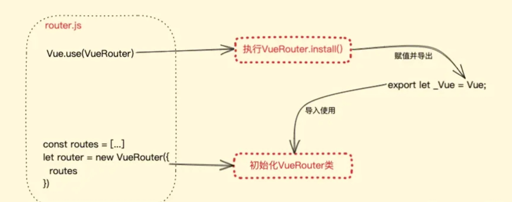

## VueRouter
### VueRouter 路由钩子函数
```js
路由的钩子函数总结有 6 个

全局的路由钩子函数：beforeEach、afterEach

单个的路由钩子函数：beforeEnter

组件内的路由钩子函数：beforeRouteEnter、beforeRouteLeave、beforeRouteUpdate
```
### VueRouter 的 router 和 route 的区别?
- $route 对象
  - $route 对象表示当前的路由信息，包含了当前 URL 解析得到的信息。包含当前的路径，参数，query 对象等。
  - $route.path 字符串，对应当前路由的路径，总是解析为绝对路径，如"/foo/bar"。
  - $route.params 一个 key/value 对象，包含了 动态片段 和 全匹配片段，如果没有路由参数，就是一个空对象。
  - $route.query 一个 key/value 对象，表示 URL 查询参数。例如，对于路径 /foo?user=1，则有$route.query.user == 1,如果没有查询参数，则是个空对象。
  - $route.hash 当前路由的 hash 值 (不带#) ，如果没有 hash 值，则为空字符串。锚点\*
  - $route.fullPath 完成解析后的 URL，包含查询参数和 hash 的完整路径。
  - $route.matched 数组，包含当前匹配的路径中所包含的所有片段所对应的配置参数对象。
  - $route.name 当前路径名字
  - $route.meta 路由元信息
  - 路由钩子函数
- $router 对象
  - $router 对象是全局路由的实例，是 router 构造方法的实例。
  - 路由实例方法：
    - push
      - 字符串 this.$router.push('home')
      - 对象 this.$router.push({path:'home'})
      - 命名的路由 this\$router.push({name:'user',params:{userId:123}})
      - 带查询参数，变成 register?plan=123this.$router.push({path:'register',query:{plan:'123'}})
    - go
      - 页面路由跳转
      - 前进或者后退 this.$router.go(-1) // 后退
    - replace
      - push 方法会向 history 栈添加一个新的记录，而 replace 方法是替换当前的页面，
      - 不会向 history 栈添加一个新的记录
      - 一般使用 replace 来做 404 页面
### hash 路由和 history 路由实现原理说一下 (history 模式和 hash 模式的区别)
- 客户端路由的实现方式。
- location.hash 的值实际就是 URL 中#后面的东西,Hash模式是基于锚点，以及onhashchange事件。
- history 实际采用了 HTML5 中提供的 API 来实现，主要有 history.pushState()和 history.replaceState()。
- hash 模式
  - location.hash 的值实际就是 URL 中#后面的东西 它的特点在于：hash 虽然出现 URL 中，但不会被包含在 HTTP 请求中，对后端完全没有影响，因此改变 hash 不会重新加载页面。
  - 可以为 hash 的改变添加监听事件（onhashchange）
  - `window.addEventListener("hashchange", funcRef, false);`
  - 每一次改变 hash（window.location.hash），都会在浏览器的访问历史中增加一个记录利用 hash 的以上特点，就可以来实现前端路由“更新视图但不重新请求页面”的功能了
- history 模式
  - 需要服务器的支持，一刷新就要去服务端去请求，不然就会找不到页面，需要服务端配合
  - 利用了 HTML5 History Interface 中新增的 pushState()（客户端） 和 replaceState() 方法。
  - 这两个方法应用于浏览器的历史记录站，在当前已有的 back、forward、go 的基础之上，它们提供了对历史记录进行修改的功能。
  - 这两个方法有个共同的特点：当调用他们修改浏览器历史记录栈后，虽然当前 URL 改变了，但浏览器不会刷新页面，这就为单页应用前端路由“更新视图但不重新请求页面”提供了基础。
### VueRouter 中路由方法 pushState 和 replaceState 能否触发 popSate 事件
- 不能
- HTML5 新接口，可以改变网址(存在跨域限制)而不刷新页面，这个强大的特性后来用到了单页面应用
- 仅改变网址,网页不会真的跳转,也不会获取到新的内容,本质上网页还停留在原页面
```js
window.history.pushState(state, title, targetURL);
@状态对象：传给目标路由的信息,可为空
@页面标题：目前所有浏览器都不支持,填空字符串即可
@可选url：目标url，不会检查url是否存在，且不能跨域。如不传该项,即给当前url添加data

window.history.replaceState(state, title, targetURL);
@类似于pushState,但是会直接替换掉当前url,而不会在history中留下记录
```
- popstate 事件会在点击后退、前进按钮(或调用 history.back()、history.forward()、history.go()方法)时触发
### VueRouter路由钩子函数是什么 执行顺序是什么
路由钩子的执行流程, 钩子函数种类有:全局守卫、路由守卫、组件守卫。
- 完整的导航解析流程:
  - 导航被触发。
  - 在失活的组件里调用 beforeRouteLeave 守卫。
  - 调用全局的 beforeEach 守卫。
  - 在重用的组件里调用 beforeRouteUpdate 守卫。重用的组件。
  - 在路由配置里调用 beforeEnter。
  - 解析异步路由组件。
  - 在被激活的组件里调用 beforeRouteEnter。
  - 调用全局的 beforeResolve 守卫。
  - 导航被确认。
  - 调用全局的 afterEach 钩子。
  - 触发 DOM 更新。
  - 调用 beforeRouteEnter 守卫中传给 next 的回调函数，创建好的组件实例会作为回调函数的参数传入。
### VueRouter跳转方式有哪些
- router.push(location, onComplete?, onAbort?)
  - 想要导航到不同的 URL，则使用 router.push 方法。这个方法会向 history 栈添加一个新的记录，所以，当用户点击浏览器后退按钮时，则回到之前的 URL。
- router.replace(location, onComplete?, onAbort?)
  - 跟 router.push 很像，唯一的不同就是，它不会向 history 添加新记录，而是跟它的方法名一样 —— 替换掉当前的 history 记录。
- router.go(n)
  - 这个方法的参数是一个整数，意思是在 history 记录中向前或者后退多少步，类似 window.history.go(n)。
### VueRouter 添加参数
- VueRouter 传递参数
  - 编程式的导航 router.push
    - this.$router.push({ name: 'news', params: { userId: 123 }})
      - 命名路由搭配 params，刷新页面参数会丢失
    - this.\$router.push({ path: '/news', query: { userId: 123 }});
      - 查询参数搭配 query，刷新页面数据不会丢失
  - 声明式的导航 `<router-link>`
    - `<router-link :to="{ name: 'news', params: { userId: 1111}}">click to news page</router-link>`
```js
有两种:
query 和 params

query 和 params 的区别：

params 传参只能由 name 引入路由，如果写成 path 页面会显示 undefined 报错。
query 传参的话可以使用 path 也可以使用 name 引入路由，不过建议使用 path 引入路由。
```
### location.href 和 VueRouter 的区别
- vue-router 使用 pushState 进行路由更新，静态跳转，页面不会重新加载；location.href 会触发浏览器，页面重新加载一次
- vue-router 使用 diff 算法，实现按需加载，减少 dom 操作
- vue-router 是路由跳转或同一个页面跳转；location.href 是不同页面间跳转；
- vue-router 是异步加载 this.\$nextTick(()=>{获取 url})；location.href 是同步加载
## 手写VueRouter


### VueRouter实现原理
#### hash模式
hash 是 URL 中 hash (#) 及后面的那部分，常用作锚点在页面内进行导航，改变 URL 中的 hash 部分不会引起页面刷新

通过 hashchange 事件监听 URL 的变化，改变 URL 的方式只有这几种：
- 通过浏览器前进后退改变 URL
- 通过`<a>`标签改变 URL
- 通过window.location改变URL

根据当前路由地址找到对应组件重新渲染。
#### history模式
history 提供了 pushState 和 replaceState 两个方法，这两个方法改变 URL 的 path 部分不会引起页面刷新。

history 提供类似 hashchange 事件的 popstate 事件，但 popstate 事件(浏览器历史操作的变化)有些不同：
- 通过浏览器前进、后退改变 URL 时会触发 popstate 事件
- 通过js调用history的back，go，forward方法课触发该事件
- 通过pushState/replaceState或`<a>`标签改变 URL 不会触发 popstate 事件。
- 好在我们可以拦截 pushState/replaceState的调用和`<a>`标签的点击事件来检测 URL 变化
### 原生js实现前端路由
#### 基于 hash 实现
```html
<!DOCTYPE html>
<html lang="en">
<body>
<ul>
    <ul>
        <!-- 定义路由 -->
        <li><a href="#/home">home</a></li>
        <li><a href="#/about">about</a></li>

        <!-- 渲染路由对应的 UI -->
        <div id="routeView"></div>
    </ul>
</ul>
</body>
<script>
    let routerView = routeView
    window.addEventListener('hashchange', ()=>{
        let hash = location.hash;
        routerView.innerHTML = hash
    })
    window.addEventListener('DOMContentLoaded', ()=>{
        if(!location.hash){//如果不存在hash值，那么重定向到#/
            location.hash="/"
        }else{//如果存在hash值，那就渲染对应UI
            let hash = location.hash;
            routerView.innerHTML = hash
        }
    })
</script>
</html>
```
- 我们通过a标签的href属性来改变URL的hash值（当然，你触发浏览器的前进后退按钮也可以，或者在控制台输入window.location赋值来改变hash）
- 我们监听hashchange事件。一旦事件触发，就改变routerView的内容，若是在vue中，这改变的应当是router-view这个组件的内容
- 为何又监听了load事件？这时应为页面第一次加载完不会触发 hashchange，因而用load事件来监听hash值，再将视图渲染成对应的内容。
#### 基于 history 实现
```html
<!DOCTYPE html>
<html lang="en">
<body>
<ul>
    <ul>
        <li><a href='/home'>home</a></li>
        <li><a href='/about'>about</a></li>

        <div id="routeView"></div>
    </ul>
</ul>
</body>
<script>
    let routerView = routeView
    window.addEventListener('DOMContentLoaded', onLoad)
    window.addEventListener('popstate', ()=>{
        routerView.innerHTML = location.pathname
    })
    function onLoad () {
        routerView.innerHTML = location.pathname
        var linkList = document.querySelectorAll('a[href]')
        linkList.forEach(el => el.addEventListener('click', function (e) {
            e.preventDefault()
            history.pushState(null, '', el.getAttribute('href'))
            routerView.innerHTML = location.pathname
        }))
    }

</script>
</html>
```
- 我们通过a标签的href属性来改变URL的path值（当然，你触发浏览器的前进后退按钮也可以，或者在控制台输入history.go,back,forward赋值来触发popState事件）。这里需要注意的就是，当改变path值时，默认会触发页面的跳转，所以需要拦截 `<a>` 标签点击事件默认行为， 点击时使用 pushState 修改 URL并更新手动 UI，从而实现点击链接更新 URL 和 UI 的效果。
- 我们监听popState事件。一旦事件触发，就改变routerView的内容。
- load事件则是一样的
### VueRouter本质
1. 安装VueRouter，再通过`import VueRouter from 'vue-router'`引入
2. 先 `const router = new VueRouter({...})`,再把`router`作为参数的一个属性值，`new Vue({router})`
3. 通过`Vue.use(VueRouter) `使得每个组件都可以拥有`router`实例。而Vue.use的一个原则就是执行对象的install这个方法
### Vue.use
`Vue.use(plugin);`

1. 参数
```js
{ Object | Function } plugin
```
2. 用法
安装Vue.js插件。如果插件是一个对象，必须提供install方法。如果插件是一个函数，它会被作为install方法。调用install方法时，会将Vue作为参数传入。install方法被同一个插件多次调用时，插件也只会被安装一次。
3. 作用
注册插件，此时只需要调用install方法并将Vue作为参数传入即可。但在细节上有两部分逻辑要处理：
- 插件的类型，可以是install方法，也可以是一个包含install方法的对象。
- 插件只能被安装一次，保证插件列表中不能有重复的插件。
4. 实现
- `src\core\global-api\use.js`
```js
export function initUse (Vue: GlobalAPI) {
  // Vue.use(VueRouter, options)
  Vue.use = function (plugin: Function | Object) {
    const installedPlugins = (this._installedPlugins || (this._installedPlugins = []))
    if (installedPlugins.indexOf(plugin) > -1) {
      return this
    }

    // additional parameters
    // 把数组中的第一个元素(plugin)去除
    const args = toArray(arguments, 1)
    // 把this(Vue)插入第一个元素的位置
    args.unshift(this)
    if (typeof plugin.install === 'function') {
      plugin.install.apply(plugin, args)  // plugin.install(args[0], args[1])
    } else if (typeof plugin === 'function') {
      plugin.apply(null, args)
    }
    installedPlugins.push(plugin)
    return this
  }
}
```
- 在Vue.js上新增了use方法，并接收一个参数plugin。
- 首先判断插件是不是已经别注册过，如果被注册过，则直接终止方法执行，此时只需要使用indexOf方法即可。
- toArray方法我们在就是将类数组转成真正的数组。使用toArray方法得到arguments。除了第一个参数之外，剩余的所有参数将得到的列表赋值给args，然后将Vue添加到args列表的最前面。这样做的目的是保证install方法被执行时第一个参数是Vue，其余参数是注册插件时传入的参数。
- 最后，将插件添加到installedPlugins中，保证相同的插件不会反复被注册。
### VueRouter模拟实现


#### 回顾核心代码


#### VueRouter 基本结构
```js
import install from "./intall";
import createMatcher from "./create-matcher";
import HashHistory from "./history/hash";
import HTML5History from "./history/html5";
const inBrowser = typeof window !== "undefined";

export default class VueRouter {
  constructor(options) {
    // 记录所有的路由规则
    this._routes = options.routes || [];
    // createMatcher 返回 match 匹配的方法 和 addRoutes 动态添加路由的方法
    // 创建路由matcher对象，传入routes路由配置列表及VueRouter实例，主要负责url匹配
    this.matcher = createMatcher(this._routes);
    // 增加一个属性，记录所有 beforeEach 注册的钩子函数
    this.beforeHooks = []
    // 定义 beforeEach 方法
    beforeEach (fn) {
      this.beforeHooks.push(fn)
    }
    let mode = options.mode || "hash";
   
    this.mode = mode;

    switch (mode) {
      case "hash":
        this.history = new HashHistory(this);
        break;
      case "history":
        this.history = new HTML5History(this);
        break;
      default:
        if (process.env.NODE_ENV !== "production") {
          throw new Error(`[vue-router] invalid mode: ${mode}`);
        }
    }
  }

  // 初始化事件监听器，监听路由地址的变化
  // 改变 url 中的路由地址
  // app是Vue的实例
  init(app) {
    const history = this.history;
    const setUpListener = (_) => {
      history.setUpListener();
    };
    // init 的最后调用 父类中的 listen 方法
    // 在回调中给 _route 重新赋值，更新视图
    history.listen((route) => {
      app._route = route;
    });
    history.transitionTo(history.getCurrentLocation(), setUpListener);
  }
  // install 中调用 init()
}
VueRouter.install = install;

```
### install方法
- 注册 VueRouter 插件，并给 Vue 根实例，以及每一个子组件对象设置 _routerRoot ，让子组件可以获取到根实例，以及根实例中存储的 _router 对象


```js
import Link from "./components/link";
import View from "./components/view";
export let _Vue = null;
export default function install(Vue) {
  // 第一就是通过它防止插件多次注册安装，因为插件安装方法 install 里我们给此方法添加了一个 installed 属性，当此属性存在且为 true 且 _Vue 已被赋值为构造函数 Vue 时 return，代表已经注册过该插件，无需重复注册。
  // 第二个作用就是构造函数 Vue 上面挂载了很多实用 API 可供我们在 VueRouter 类里使用，当然也可以通过引入 Vue 来使用它的 API，但是一旦引入包使用，打包的时候也会将整个 Vue 打包进去，即然 install 里会把这个构造函数作为参数传过来，恰巧我们写 router 配置文件时，安装插件（Vue.use）是写在初始化 VueRouter 实例前面的，也就是 install 执行较早，这个时候我们把构造函数参数赋值给一个变量在 VueRouter 类里使用简直完美
  if (install.installed && _Vue === Vue) return;
  install.installed = true;
  _Vue = Vue;
  // 全局注册混入，每个 Vue 实例都会被影响
  // 首先写一个mixin，全局注册混入，让每个 Vue 实例都会被影响。混入里写一个 beforeCreate 钩子，因为此生命周期 options最早挂载完成。又因全局混入，所以beforeCreate钩子里我们写了一个通过组件实例中的this.options 最早挂载完成。又因全局混入，所以 beforeCreate 钩子里我们写了一个通过组件实例中的 this.options最早挂载完成。
著作权归作者所有。商业转载请联系作者获得授权，非商业转载请注明出处。
  _Vue.mixin({
    // 根实例，以及所有的组件增加router属性
    beforeCreate() {
      // 给所有vue实例，增加router属性
      // 判断当前是否是 Vue 的根实例
      // 初始化的时候有传new Vues
      if (this.$options.router) {
        // 在 Vue 根实例添加 _router 属性（ VueRouter 实例）
        this._router = this.$options.router;
        // 根实例记录自己，目的是在子组件中通过 _routerRoot 获取到 _router 对象
        this._routerRoot = this;
        // 初始化router对象
        this._router.init(this);
        this._route = {};
        // 可以根据current变化   更改视图
        Vue.util.defineReactive(this, "_route", this._router.history.current);
      } else {
        // 给子组件设置 routerRoot，让子组件能够通过 routerRoot 找到 _router 对象
        // 为每个组件实例定义_routerRoot，回溯查找_routerRoot
        this._routerRoot = (this.$parent && this.$parent._routerRoot) || this
      }
    },
    Object.defineProperty(Vue.prototype, "$router", {
      get() {
        return this._routerRoot._router;
      },
    });
    Object.defineProperty(Vue.prototype, '$route', {
      get() {
        return this._routerRoot._route;
      }
    });
  });
  _Vue.component(Link.name, Link);
  _Vue.component(View.name, View);

}
```
- 挂载 install
```js
import install from "./intall";
import createMatcher from "./create-matcher";
export default class VueRouter {
  constructor(options) {
    // 记录所有的路由规则
    this._routes = options.routes || [];
    // createMatcher 返回 match 匹配的方法 和 addRoutes 动态添加路由的方法
    this.matcher = createMatcher(routes);
  }

  // 初始化事件监听器，监听路由地址的变化
  // 改变 url 中的路由地址
  // app是Vue的实例
  init(app) {}
}
VueRouter.install = install;
```
### router-link、router-view
```js
export default {
  name: "RouterLink",
  props: {
    to: {
      type: [String, Object],
      require: true,
    },
  },
  // template: `<a :href="{{ '#' + this.to}}"><slot name="default"></slot></a>`
  render(h) {
    ender(h) {
      const href = typeof this.to === 'string' ? this.to : this.to.path
      const router = this.$router
      let data = {
        attrs: {
          href: router.mode === "hash" ? "#" + href : href
        }
      };
      return h("a", data, [this.$slots.default])
  },
};


export default {
  name: "RouterView",
  render(h) {
    return h();
  },
};
```
### createMatcher
- 创建并返回一个匹配器，包含 match 方法和 addRoutes 方法
    - match 根据路由地址匹配相应的路由规则对象
    - addRoutes 动态添加路由
- 把所有的路由规则解析成路由表
    - pathList 是一个数组，存储所有的路由地址
    - pathMap 路由表，路由地址 -> record 一个记录（path、component、parent）
```js
import { createRouteMap } from "./create-route-map";
export default function createMatcher(routes) {
  // routes 所有的路由规则
  // 把路由规则解析成数组和对象的形式存储到 pathList pathMap
  const { pathList, pathMap } = createRouteMap(routes);
  function createRoute(record, path) {
    const matched = [];
    while (record) {
      matched.unshift(record);
      record = record.parent;
    }
    return {
      matched,
      path,
    };
  }
  function match(path) {
    const record = pathMap[path];
    if (record) {
      // 创建路由对象
      // router ==> {matched,path} matched ==> [record1,record2]
      return createRoute(record, path);
    }
    // 创建空的注释结点
    return createRoute(null, path);
  }
  function addRoutes(routes) {
    createRouteMap(routes, pathList, pathMap);
  }
  return {
    match,
    addRoutes,
  };
}
```
#### createMatcher -- match
- 根据路由地址，匹配一个路由数据对象 route { matched, path }
    - create-matcher.js 中
```js
function createRoute(record, path) {
    const matched = [];
    while (record) {
      // 父路由永远在第一个
      matched.unshift(record);
      record = record.parentRecord;
    }
    return {
      matched,
      path,
    };
  }
  function match(path) {
    const record = pathMap[path];
    if (record) {
      // 创建路由对象
      // router ==> {matched,path} matched ==> [record1,record2]
      return createRoute(record, path);
    }
    // 创建空的注释结点
    return createRoute(null, path);
  }
```
- createRoute 根据路由地址，创建 route 路由规则对象
    - route --> { matched: [ musicRecord ], path: '/music' }
    - 如果是子路由的话，找到他的所有父路由对应的 record 插入到数组的第一项中
    - matched 数组中 -> [musicRecord, popRecord]
### createRouteMap
- 遍历所有的路由规则，生成路由表
- 如果有子路由的话，递归添加子路由到路由表
```js
export default function createRouteMap(routes, oldPathList, oldPathMap) {
  // 存储所有的路由地址
  const pathList = oldPathList || [];
  // 路由表，路径和组件的相关信息
  const pathMap = oldPathMap || {};
  // 遍历路由规则，解析成路由表
  routes.forEach((route) => {
    addRouteRecord(route, pathList, pathMap);
  });
  return {
    pathList,
    pathMap,
  };
}
// 添加路由表
function addRouteRecord(route, pathList, pathMap, parentRecord) {
  const path = parent ? `${parent.path}/${route.path}` : route.path;
  const record = {
    path: path,
    component: route.component,
    parentRecord: parentRecord, // 如果是子路由的话，记录子路由的 parent record
  };

  // 如果路由表中有已经有该路径，不做处理
  if (!pathMap[path]) {
    pathMap[path] = record;
    pathList.push(path);
  }
  // 如果有子路由，递归添加到对应的 pathList 和 pathMap 中
  if (route.children) {
    route.children.forEach((childRoute) => {
      addRouteRecord(childRoute, pathList, pathMap, route);
    });
  }
}
```
### $route/$router
### History 历史管理
- hash 模式
- html 5 模式
- History 父类
    - router 属性
    - current 属性，记录当前路径对应的路由规则对象 {path:'/', matched: []}
    - transitionTo(path, onComplete)
        - 跳转到指定的路径，根据当前路径获取匹配的路由规则对象 route，然后更新视图
```js
import createRoute from "../util/route";
export default class History {
  constructor(router) {
    this.router = router;
    // 当前路径获取到的匹配的结果
    //  { path:'/', matched: [] }
    this.current = createRoute(null, "/");
    // 增加属性
    this.cb = null;
  }
  // 增加一个 listen 方法
  // 在 transitionTo 中调用，触发回调，给 _route 赋值
  listen(cb) {
    this.cb = cb;
  }
  transitionTo(path, onComplete) {
    // 根据路径获取匹配到的路由规则对象，渲染页面
    // { path: '/music/pop', matched: [musicRecord, popRecord] }
    const current = this.router.matcher.match(path);
    // 在页面跳转之前（重新渲染之前）
    // 执行钩子函数，传入 to 和 from
    this.router.beforeHooks.forEach((hook) => {
      hook(current, this.current);
    });
    // 调用 listen 中设置的回调，并且把 最新的 current 传递给 cb
    // cb 中把当前的 current 赋值给 app._route 响应式数据发生变化，更新视图
    this.current = current;
    this.cb && this.cb(this.current);
    onComplete && onComplete();
  }
}
```
- HashHistory
    - 继承 History
    - 确保首次访问地址为 #/
    - getCurrentLocation() 获取当前的路由地址（# 后面的部分）
    - setUpListener() 监听路由地址改变的事件
```js
import History from "./base";
export default class HashHistory extends History {
  constructor(router) {
    super(router);
    // 保证首次访问的时候有 #/
    ensureSlash();
  }
  getCurrentLocation() {
    return window.location.hash.slice(1);
  }
  setUpListener() {
    window.addEventListener("hashchange", () => {
      this.transitionTo(this.getCurrentLocation());
    });
  }
}
// 确保第一次访问有#号
function ensureSlash() {
  // 判断#后面有内容
  if (window.location.hash) {
    return;
  }
  window.location.hash = "/";
}
```
- HTML5History
```js
import History from './base'
export default class HTML5History extends History {}
```
### router-view处理视图
- 获取当前组件的 $route 路由规则对象
- 找到里面的 matched 匹配的 record （里面有 component）
- 如果是 /music 的话，matched 匹配到一个，直接渲染对应的组件
- 如果是 /music/pop 的话，matched 匹配到两个 record（第一个是父组件，第二个是子组件）
```js
export default {
  name: "RouterView",
  render(h) {
    // 根据路径找到 route ，看里面的 matched 有几个
    // this.$route
    let depth = 0;
    const route = this.$route;

    // 标识当前组件是一个 router-view
    this.routerView = true;

    let parent = this.$parent;
    while (parent) {
      // 如果当前组件的父组件也是 router-view 这时候让depth++
      if (parent.routerView) {
        depth++;
      }
      parent = parent.$parent;
    }

    const record = route.matched[depth];
    if (!record) {
      return h();
    }
    const component = record.component;
    return h(component);
  },
};
```
