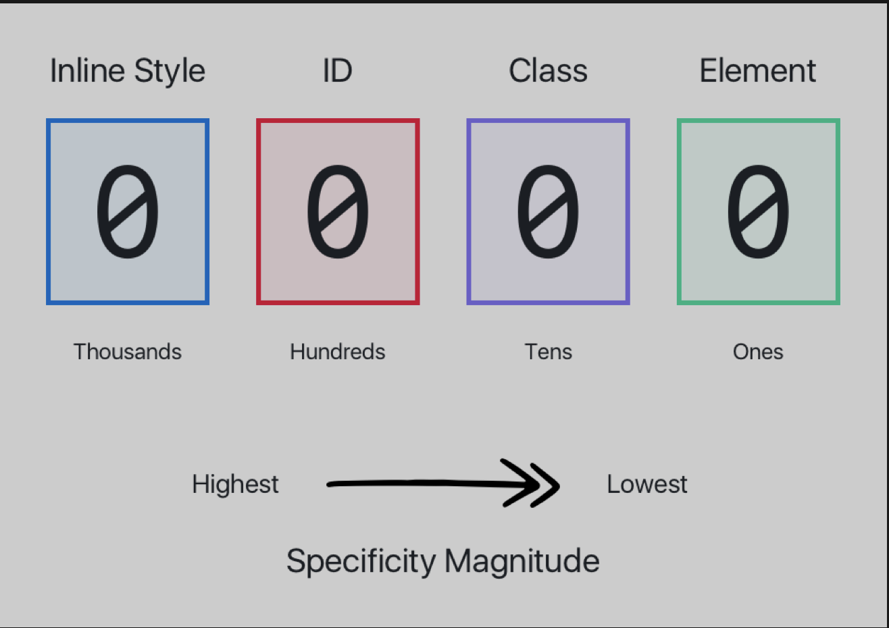

#  HTMLCSS 日常总结
## CSS基础
#### 1.选择器
##### 基础选择器
- 标签选择器：`h1`
- 类选择器：`.checked` 
- ID 选择器：`#picker`
- 通配选择器：`*`
##### 属性选择器

- `[attr]`：指定属性的元素；
- `[attr=val]`：属性等于指定值的元素；

```html
<pml-planet>Venus</pml-planet>
<pml-planet moons="1">Venus</pml-planet>
<pml-planet moons="2">Venus</pml-planet>

pm-planet[moons] { font-weight: bold; }
img[alt] { border:3px solid red; }
a[href][title] { font-weight: bold; }

<!--必须要精确-->
pm-planet[moons="1"] { font-weight: bold; }
a[href="http://www.w3.org/"][title="W3C Home"] { font-weight: bold; }
```

- `[attr*=val]`：属性包含指定值的元素；
```html
<input type="tel" title="Telephone number should be formatted as XXX-XXX-XXXX"/>

input[title*="format"] { background-color:#dedede; }
```

- `[attr^=val]` ：属性以指定值开头的元素；
- `[attr$=val]`：属性以指定值结尾的元素；
- `[attr~=val]`：属性包含指定值(完整单词)的元素(不推荐使用)；
```html
<span class="barren rocky">Mercury</span>
<span class="cloudy barren">Venus</span>

span[class~="barren"] { font-style:italic; }
```

- `[attr|=val]`：属性以指定值(完整单词)开头的元素(不推荐使用):以bar和一个英文波折号开头或者bar本身；
```html
<h1 lang="en">Hello!</h1>
<p lang="en-us">Greetings</p>
<div lang="en-au">G'day!</div>

*[lang|="en"] { color: white; }
```

- 不区分大小写

```html
a[href$='.PDF' i] <!-- 不区分大小写 -->   .pdf、.PDF、.Pdf  只针对于属性值不区分大小写，对于属性还是区分的
```

##### 组合选择器
- 相邻兄弟选择器：`A + B`（AB使用同一个父元素，使用一个连接符只能选择  紧邻   同胞中的第二个元素）
- 普通兄弟选择器：`A ~ B`（可以选择A后面同属于一个父元素的另一个元素）
- 子选择器：`A > B`（A后面直接子代，和A直连（直接子代） 的B）
- 后代选择器：`A B`(A后代所有的B或者样式，不管B在多少层嵌套多少级)
##### 伪类
##### 条件伪类
- `:lang()`：基于元素语言来匹配页面元素；
- `:dir()`：匹配特定文字书写方向的元素；
- `:has()`：匹配包含指定元素的元素；
- `:is()`：匹配指定选择器列表里的元素；
- `:not()`：用来匹配不符合一组选择器的元素（只能写一中选择符）；
##### 行为伪类
- `:active`：鼠标激活的元素；
- `:hover`： 鼠标悬浮的元素；
- `::selection`：鼠标选中的元素；
##### 状态伪类
- `:target`：当前锚点的元素；
- `:link`：未访问的链接元素；
- `:visited`：已访问的链接元素；
- `:focus`：输入聚焦的表单元素；
- `:required`：输入必填的表单元素；
- `:valid`：输入合法的表单元素；
- `:invalid`：输入非法的表单元素；
- `:in-range`：输入范围以内的表单元素；
- `:out-of-range`：输入范围以外的表单元素；
- `:checked`：选项选中的表单元素；
- `:optional`：选项可选的表单元素；
- `:enabled`：事件启用的表单元素；
- `:disabled`：事件禁用的表单元素；
- `:read-only`：只读的表单元素；
- `:read-write`：可读可写的表单元素；
- `:blank`：输入为空的表单元素；
- `:current()`：浏览中的元素；
- `:past()`：已浏览的元素；
- `:future()`：未浏览的元素；

推荐的顺序：link-visited-focus-hover-active

##### 结构伪类
- `:root`：文档的根元素；
- `:empty`：无子元素的元素(没有任何子元素，甚至连文本节点都没有)；
- `:first-letter`：元素的首字母；
- `:first-line`：元素的首行；
- `:nth-child(n)`：元素中指定顺序索引的元素；
- `:nth-last-child(n)`：元素中指定逆序索引的元素；；
- `:nth-of-type(n)`：标签中指定顺序索引的标签；
- `:nth-last-of-type(n)`：标签中指定逆序索引的标签；
- `:first-of-type` ：标签中为首的标签（选择一个元素中某种元素的第一个，同一个父元素的元素是一组，从这样的一组元素中选择某种元素的第一个）；
- `:last-of-type`：标签中为尾标签（选择一个元素中某种元素的最后一个，同一个父元素的元素是一组，从这样的一组元素中选择某种元素的最后一个）；
- `:only-of-type`：父元素仅有该标签的标签（匹配同胞中唯一的那种元素）；
- `:first-child`：元素中为首的元素（选择一个元素中的第一个子元素）；
- `:last-child` ：元素中为尾的元素（选择一个元素中的最后一个子元素）；
- `:only-child`：父元素仅有该元素的元素（选择的元素是另一个元素的唯一子元素，只匹配完全没有同胞的元素）；
##### 伪元素
- `::before`：在元素前插入内容；
- `::after`：在元素后插入内容；
- `::first-letter:`选择伪元素用于装饰任何`非行内元素`的首字母。只能应用到块级元素。
- `::first-line:`装饰`非行内元素`的首行文本。只能应用到块级元素。

特指度来看优先级。



特别重要  在样式后面加入`!important`。这个是最牛逼的，没有比这个优先级高的。

#### CSS特性

##### 继承性
CSS 属性很多，但并不是所有的属性默认都是能继承父元素对应属性的，那哪些属性存在默认继承的行为呢？一定是那些不会影响到页面布局的属性，可以分为如下几类：
- 字体相关：`font-family`、`font-style`、`font-size`、`font-weight` 等；
- 文本相关：`text-align`、`text-indent`、`text-decoration`、`text-shadow`、`letter-spacing`、`word-spacing`、`white-space`、`line-height`、`color` 等；
- 列表相关：`list-style`、`list-style-image`、`list-style-type`、`list-style-position` 等；
- 其他属性：`visibility`、`cursor` 等；
对于其他默认不继承的属性也可以通过以下几个属性值来控制继承行为：
- `inherit`：继承父元素对应属性的计算值；
- `initial`：应用该属性的默认值，比如 `color` 的默认值是 `#000；`
- `unset`：如果属性是默认可以继承的，则取 `inherit` 的效果，否则同 `initial`；
- `revert`：效果等同于 `unset`，兼容性差。

##### 层叠性

按特指度排序应用到特定元素上的所有声明。特指度高的声明具有较高的权重。

样式表或者文档中靠后的声明权重较高。导入样式表中的声明放在当前样式表中所有声明的前面。

在声明权重上，考虑5个方面：

1. 读者提供的样式中以`！important`标记的声明
2. 创作人员编写的样式中以`！important`标记的声明
3. 创作人员编写的常规声明
4. 读提供的常规声明
5. 用户代理的默认声明

##### 盒模型
在 CSS 中任何元素都可以看成是一个盒子，而一个盒子是由 4 部分组成的：内容（content）、内边距（padding）、边框（border）和外边距（margin）。
盒模型有 2 种：标准盒模型和 IE 盒模型，本别是由 W3C 和 IExplore 制定的标准。

`标准盒模型认为：盒子的实际尺寸 = 内容（设置的宽/高） + 内边距 + 边框`

`IE 盒模型认为：盒子的实际尺寸 = 设置的宽/高 = 内容 + 内边距 + 边框`

现在高版本的浏览器基本上默认都是使用标准盒模型，而像 IE6 这种老古董才是默认使用 IE 盒模型的。
在  CSS3 中新增了一个属性 box-sizing，允许开发者来指定盒子使用什么标准，它有 2 个值：
- `content-box`：标准盒模型；
- `border-box`：IE 盒模型
- `BFC (Block Formatting Context) 块级格式化上下文；`
1. 自适应两栏布局
2. 清除内部浮动
3.  防止垂直 margin 合并

`IFC (Inline Formatting Context) 行内格式化上下文；`

`FFC (Flex Formatting Context) 弹性格式化上下文；`

`GFC (Grid Formatting Context) 格栅格式化上下文；`

##### 值和单位
`em:`

em 是 CSS 中的相对长度单位中的一个。居然是相对的，那它到底是相对的谁呢？它有 2 层意思：
• 在 font-size 中使用是相对于父元素的 font-size 大小，比如父元素 font-size: 16px，当给子元素指定 font-size: 2em 的时候，经过计算后它的字体大小会是 32px；
• 在其他属性中使用是相对于自身的字体大小，如 width/height/padding/margin 等；
我们都知道每个浏览器都会给 HTML 根元素 html 设置一个默认的 font-size，而这个值通常是 16px。这也就是为什么 1em = 16px 的原因所在了。

`rem:`

rem(root em) 和 em 一样，也是一个相对长度单位，不过 rem 相对的是 HTML 的根元素 html。
rem 由于是基于 html 的 font-size 来计算，所以通常用于自适应网站或者 H5 中。
比如在做 H5 的时候，前端通常会让 UI 给 750px 宽的设计图，而在开发的时候可以基于 iPhone X 的尺寸 375px * 812px 来写页面，这样一来的话，就可以用下面的 JS 依据当前页面的视口宽度自动计算出根元素 html 的基准 font-size 是多少。

```javascript
(function (doc, win) {
    var docEl = doc.documentElement,
        resizeEvt = 'orientationchange' in window ? 'orientationchange' : 'resize',
        psdWidth = 750,  // 设计图宽度
        recalc = function () {
            var clientWidth = docEl.clientWidth;
            if ( !clientWidth ) return;
            if ( clientWidth >= 640 ) {
                docEl.style.fontSize = 200 * ( 640 / psdWidth ) + 'px';
            } else {
                docEl.style.fontSize = 200 * ( clientWidth / psdWidth ) + 'px';
            }
        };

    if ( !doc.addEventListener ) return;
    // 绑定事件的时候最好配合防抖函数
    win.addEventListener( resizeEvt, debounce(recalc, 1000), false );
    doc.addEventListener( 'DOMContentLoaded', recalc, false );
    
    function debounce(func, wait) {
        var timeout;
        return function () {
            var context = this;
            var args = arguments;
            clearTimeout(timeout)
            timeout = setTimeout(function(){
                func.apply(context, args)
            }, wait);
        }
    }
})(document, window);
```

`vw/vh`
vw 和 vh 分别是相对于屏幕视口宽度和高度而言的长度单位：
• 1vw = 视口宽度均分成 100 份中 1 份的长度；
• 1vh = 视口高度均分成 100 份中 1 份的长度；
在 JS 中 100vw = window.innerWidth，100vh = window.innerHeight。

`vw/vh `的出现使得多了一种写自适应布局的方案，开发者不再局限于 rem 了。
相对视口的单位，除了 vw/vh 外，还有 vmin 和 vmax：
• vmin：取 vw 和 vh 中值较小的；
• vmax：取 vw 和 vh 中值较大的；

##### 媒体查询

##### 自定义属性
之前我们通常是在预处理器里才可以使用变量，而现在 CSS 里也支持了变量的用法。通过自定义属性就可以在想要使用的地方引用它。
自定义属性也和普通属性一样具有级联性，申明在 `:root `下的时候，在全文档范围内可用，而如果是在某个元素下申明自定义属性，则只能在它及它的子元素下才可以使用。
自定义属性必须通过` --x `的格式申明，比如：`--theme-color: red`; 使用自定义属性的时候，需要用 `var` 函数。

```css
/*<!-- 定义自定义属性 -->*/
:root {
    --theme-color: red;
}

/*<!-- 使用变量 -->*/
h1 {
    color: var(--theme-color);
}
```

##### 1px 边框解决方案
Retina 显示屏比普通的屏幕有着更高的分辨率，所以在移动端的 1px 边框就会看起来比较粗，为了美观通常需要把这个线条细化处理。

```css
/* 只设置单条底部边框：*/
.scale-1px-bottom {
    position: relative;
    border:none;
}
.scale-1px-bottom::after {
    content: '';
    position: absolute;
    left: 0;
    bottom: 0;
    background: #000;
    width: 100%;
    height: 1px;
    -webkit-transform: scaleY(0.5);
    transform: scaleY(0.5);
    -webkit-transform-origin: 0 0;
    transform-origin: 0 0;
}
/*同时设置 4 条边框：*/
.scale-1px {
    position: relative;
    margin-bottom: 20px;
    border:none;
}
.scale-1px::after {
    content: '';
    position: absolute;
    top: 0;
    left: 0;
    border: 1px solid #000;
    -webkit-box-sizing: border-box;
    box-sizing: border-box;
    width: 200%;
    height: 200%;
    -webkit-transform: scale(0.5);
    transform: scale(0.5);
    -webkit-transform-origin: left top;
    transform-origin: left top;
}
```

##### 清除浮动
BFC 清除浮动
```css
.parent {
    overflow: hidden;
}
```
clear 清除浮动
```css
.clearfix {
    zoom: 1;
}
.clearfix::after {
    content: "";
    display: block;
    clear: both;
}
```

##### 清除浏览器默认样式

```css
html, body, div, span, applet, object, iframe,
h1, h2, h3, h4, h5, h6, p, blockquote, pre,
a, abbr, acronym, address, big, cite, code,
del, dfn, em, img, ins, kbd, q, s, samp,
small, strike, strong, sub, sup, tt, var,
b, u, i, center,
dl, dt, dd, ol, ul, li,
fieldset, form, label, legend,
table, caption, tbody, tfoot, thead, tr, th, td,
article, aside, canvas, details, embed, 
figure, figcaption, footer, header, hgroup, 
menu, nav, output, ruby, section, summary,
time, mark, audio, video {
    margin: 0;
    padding: 0;
    border: 0;
    font-size: 100%;
    font: inherit;
    vertical-align: baseline;
}
/* HTML5 display-role reset for older browsers */
article, aside, details, figcaption, figure, 
footer, header, hgroup, menu, nav, section {
    display: block;
}
body {
    line-height: 1;
}
ol, ul {
    list-style: none;
}
blockquote, q {
    quotes: none;
}
blockquote:before, blockquote:after,
q:before, q:after {
    content: '';
    content: none;
}
table {
    border-collapse: collapse;
    border-spacing: 0;
}
```

##### 长文本处理
字符超出换行
```css
.warp {
    overflow-wrap: break-word;
}
```

字符超出使用连字符
```css
.hyphens {
    hyphens:auto;
}
```
单行文本省略
```css
.ellipsis {
    white-space: nowrap;
    overflow: hidden;
    text-overflow: ellipsis
}
```
多行文本省略
```css
.ellipsis {
    display: -webkit-box; /*重点，不能用block等其他，将对象作为弹性伸缩盒子模型显示*/
    -webkit-box-orient: vertical; /*从上到下垂直排列子元素（设置伸缩盒子的子元素排列方式）*/
    -webkit-line-clamp: 3; /*行数，超出三行隐藏且多余的用省略号表示...*/
    line-clamp: 3;
    word-break: break-all;
    overflow: hidden;
    max-width: 100%;
}
```

##### 水平居中

`单行的文本、inline 或 inline-block 元素`
此类元素需要水平居中，则父级元素必须是块级元素(block level)，且父级元素上需要这样设置样式：
```css
.parent {
    text-align: center;
}
```

##### 垂直居中
方法一：通过设置上下内间距一致达到垂直居中的效果：
```css
.single-line {
    padding-top: 10px;
    padding-bottom: 10px;
}
```
方法二：通过设置 height 和 line-height 一致达到垂直居中：
```css
.single-line {
    height: 100px;
    line-height: 100px;
}
```

固定宽高的块级盒子
方法一：absolute + 负 margin
```css
.parent {
    position:relative;
}
.child {
    width: 100px;
    height: 100px;
    position: absolute;
    left: 50%;
    top: 50%;
    margin: -50px 0 0 -50px;
}
```
方法二：absolute + margin auto
```css
.parent {
    position:relative;
}
.child {
    width: 100px;
    height: 100px;
    position: absolute;
    left: 0;
    top: 0;
    bottom: 0;
    right: 0;
    margin: auto;
}
```
方法三：absolute + calc
```css
.parent {
    position:relative;
}
.child {
    width: 100px;
    height: 100px;
    position: absolute;
    left:calc(50% - 50px);
    top:calc(50% - 50px);
}
```
不固定宽高的块级盒子
方法一：absolute + transform
```css
.parent {
    position:relative;
}
.child {
    position: absolute;
    left: 50%;
    top: 50%;
    transform: translate(-50%,-50%);
}
```
方法二：line-height + vertical-align
```css
.parent {
    line-height: 150px;
    text-align: center;
}
.child {
    display: inline-block;
    line-height: initial;
    vertical-align:center;
}
```
方法三：flex
```css
.parent {
    display:flex;
    justify-content:center;
    align-items:center;
}
```
方法四：grid
```css
.parent {
   display:grid;
}
.child {
    display: inline-block;
    justify-content:center;
    align-self: center;
}
```
##### 常用布局 ？？？？？？？
- 圣杯布局
  
  两者的功能相同，都是为了实现一个两侧宽度固定，中间宽度自适应的三栏布局。（
  
- 双飞翼布局
  
  两者的功能相同，都是为了实现一个两侧宽度固定，中间宽度自适应的三栏布局。（
  
- 三行布局（头尾定高主栏自适应）

- 多列等高布局

#### HTML 标签有哪些行内元素

- a
- img
- picture
- span
- input
- textarea
- select
- label

#### CSS前缀

|   前缀   |               厂商               |
| :------: | :------------------------------: |
|  -epub-  |             ePub格式             |
|  -moz-   | 基于Mozilla的浏览器（如Firefox） |
|   -ms-   |      微软Internet Explorer       |
|   -o-    |        基于Opera的浏览器         |
| -webkit- |  基于Webkit的浏览器（Chrome ）   |


## CSS 高级技巧汇总

#### 设置input的placeholder的字体样式
```css
/*设置input占位符的样式*/

input::-webkit-input-placeholder {    /* Chrome/Opera/Safari */
    color: red;
}
input::-moz-placeholder { /* Firefox 19+ */  
    color: red;
}
input:-ms-input-placeholder { /* IE 10+ */
    color: red;
}
input:-moz-placeholder { /* Firefox 18- */
    color: red;
}

input {
    border: none;
    outline: none;
}
```
#### 隐藏滚动条或更改滚动条样式
```html
.scroll-container {
width: 500px;
height: 150px;
border: 1px solid #ddd;
padding: 15px;
overflow: auto;     /*必须*/
}

.scroll-container::-webkit-scrollbar {
width: 8px;
background: white;
}

.scroll-container::-webkit-scrollbar-corner,
/* 滚动条角落 */
.scroll-container::-webkit-scrollbar-thumb,
.scroll-container::-webkit-scrollbar-track {      /*滚动条的轨道*/
border-radius: 4px;
}

.scroll-container::-webkit-scrollbar-corner,
.scroll-container::-webkit-scrollbar-track {
/* 滚动条轨道 */
background-color: rgba(180, 160, 120, 0.1);
box-shadow: inset 0 0 1px rgba(180, 160, 120, 0.5);
}

.scroll-container::-webkit-scrollbar-thumb {
/* 滚动条手柄 */
background-color: #00adb5;
}
<p class="scroll-container">
        庭院深深，不知有多深？杨柳依依，飞扬起片片烟雾，一重重帘幕不知有多少层。豪华的车马停在贵族公子寻欢作乐的地方，她登楼向远处望去，却看不见那通向章台的大路。春已至暮，三月的雨伴随着狂风大作，再是重门将黄昏景色掩闭，也无法留住春意。泪眼汪汪问落花可知道我的心意，落花默默不语，纷乱的，零零落落一点一点飞到秋千外。庭院深深，不知有多深？杨柳依依，飞扬起片片烟雾，一重重帘幕不知有多少层。豪华的车马停在贵族公子寻欢作乐的地方，她登楼向远处望去，却看不见那通向章台的大路。春已至暮，三月的雨伴随着狂风大作，再是重门将黄昏景色掩闭，也无法留住春意。泪眼汪汪问落花可知道我的心意，落花默默不语，纷乱的，零零落落一点一点飞到秋千外。庭院深深，不知有多深？杨柳依依，飞扬起片片烟雾，一重重帘幕不知有多少层。豪华的车马停在贵族公子寻欢作乐的地方，她登楼向远处望去，却看不见那通向章台的大路。春已至暮，三月的雨伴随着狂风大作，再是重门将黄昏景色掩闭，也无法留住春意。泪眼汪汪问落花可知道我的心意，落花默默不语，纷乱的，零零落落一点一点飞到秋千外。庭院深深，不知有多深？杨柳依依，飞扬起片片烟雾，一重重帘幕不知有多少层。豪华的车马停在贵族公子寻欢作乐的地方，她登楼向远处望去，却看不见那通向章台的大路。春已至暮，三月的雨伴随着狂风大作，再是重门将黄昏景色掩闭，也无法留住春意。泪眼汪汪问落花可知道我的心意，落花默默不语，纷乱的，零零落落一点一点飞到秋千外。
</p>
```

#### 卡券效果制作
```html
.coupon {
 width: 300px;
  height: 100px;
  line-height: 100px;
  margin: 50px auto;
  text-align: center;
  position: relative;
  background: radial-gradient(circle at right bottom, transparent 10px, #ffffff 0) top right /50% 51px no-repeat,
  radial-gradient(circle at left bottom, transparent 10px, #ffffff 0) top left / 50% 51px no-repeat,
  radial-gradient(circle at right top, transparent 10px, #ffffff 0) bottom right / 50% 51px no-repeat,
  radial-gradient(circle at left top, transparent 10px, #ffffff 0) bottom left / 50% 51px no-repeat;
  filter: drop-shadow(2px 2px 2px rgba(0, 0, 0, .2));
}
.coupon span {
  display: inline-block;
  vertical-align: middle;
  margin-right: 10px;
  color: red;
  font-size: 50px;
  font-weight: 400;
}
<p class="coupon">
 <span>200</span>优惠券
</p>

```

#### css 如何实现左侧固定300px，右侧自适应的布局

```css
.container
  .left
  .main


//flex布局
.container {
  display: flex;
}

.left {
  flex-basis: 300px;
  flex-shrink: 0;
}

.main {
  flex-grow: 1;
}


//grid布局

```

#### html 的默认 display 属性是多少

```markdown
html` 根元素的默认 `display` 为 `block`
```

####  对一个非定长宽的块状元素如何做垂直水平居中

```css
 .container {
      position: relative;
  }
  .container .item {
      width: 100px;
      height: 50px;
      position: absolute;
      top: 0;
      left: 0;
      bottom: 0;
      right: 0;
      margin: auto;
 }
```

#### '+' 与 '~' 选择器有什么不同

- `+` 选择器匹配紧邻的兄弟元素
- `~` 选择器匹配随后的所有兄弟元素

#### position: sticky 如何工作，适用于哪些场景

`position: sticky` 可理解为 `relative` 与 `fixed` 的结合体

#### 伪类与伪元素有什么区别

1. 伪类使用单冒号，而伪元素使用双冒号。如 `:hover` 是伪类，`::before` 是伪元素
2. 伪元素会在文档流生成一个新的元素，并且可以使用 `content` 属性设置内容

####  css 如何匹配前N个子元素及最后N个子元素

- 如何匹配最前三个子元素: `:nth-child(-n+3)`
- 如何匹配最后三个子元素: `:nth-last-child(-n+3)`

#### 如何使用 CSS 实现网站的暗黑模式 (Dark Mode)

```css
@media (prefers-color-scheme: dark) {
    :root{
    }
}
```

#### css 如何实现响应式布局大屏幕三等分、中屏幕二等分、小屏幕一等分

```html
<section class="container">
  <section class="item"></section>
  <section class="item"></section>
  <section class="item"></section>
  <section class="item"></section>
  <section class="item"></section>
  <section class="item"></section>
</section>
```

使用 Grid 布局可以轻松解决这个问题，如若使用其它方案，控制好等分的同时再控制好间距也是一个十分头疼的问题:

1. `grid-template-columns`: 控制等分
2. `gap`: 控制间隙

```css
@media (min-width: 768px) {
  .container {
    grid-template-columns: repeat(2, minmax(0,1fr));
  }
}

@media (min-width: 1024px) {
  .container {
    grid-template-columns: repeat(3, minmax(0, 1fr));
  }
}

.container {
  display: grid;
}

.conainer {
  gap: 1rem;
}
```

`TailwindCSS` 是一款非常方便的 CSS 原子类框架，只需要一行即可搞定

```html
<section class="grid grid-cols-1 md:grid-cols-2 lg:grid-cols-3 gap-4"></section>
```

### 终极解决方案

`Grid` 布局可以自动判断容器大小，无论大小屏幕自动撑满并均分，请看以下属性

```css
.container {
  grid-template-columns: repeat(auto-fill, minmax(300px, 1fr))
}
```

1. `repeat`: 用以 N 整分
2. `auto-fill`：表示自动填充
3. `minmx`: 即书面意思，最小宽度为 `300px`

#### CSS如何设置一行超出显示省略号或者多行省略

```css
overflow: hidden;
text-overflow: ellipsis;
white-space: nowrap;


overflow: hidden;
display: -webkit-box;
-webkit-box-orient: vertical;
-webkit-line-clamp: 2;
```

#### flex 布局中 align-content 与 align-items 有何区别

- `align-content` 作用于纵轴多行元素，一行元素不起作用
- `align-items` 作用于纵轴单行元素

####  flex 布局中 order 有何作用

`order` 属性定义Flex布局中子元素的排列顺序，数值越小，排列越靠前，默认为0。

#### 子元素垂直居中，并且长度为父容器一半的正方形

```html
<section class="container">
  <section class="item"></section>
</section>
```

以前采用百分比撑高 `padding`，那这种方案已经过时，会挤压 Content 内容，无法在其中填充内容(需要绝对定位)。

可使用最新的属性 `aspect-ratio`，即长宽比

```css
.container {
  display: grid;
  place-items: center;
}

.item {
  width: 50%;
  aspect-ratio: 1/1;
}
```

#### 简述 css 中 position 的值

- `static`: 默认值，无定位，`top`、`right`、`bottom`、`left` 不起任何作用
- `relative`: 相对定位
- `absolute`: 绝对定位，脱离文档流，上下左右以最近的定位父元素为参照系
- `fixed`: 脱离文档流，上下左右以浏览器视口为参照系
- `sticky`: `relative` 与 `fixed` 的结合体

#### rem、em、vw、wh 的值各是什么意思

- `rem`: 根据根元素(即 `html`)的 `font-size`
- `em`: 根据**「自身元素」**的 `font-size`
- `vw`: viewport width
- `vh`: viewport height

