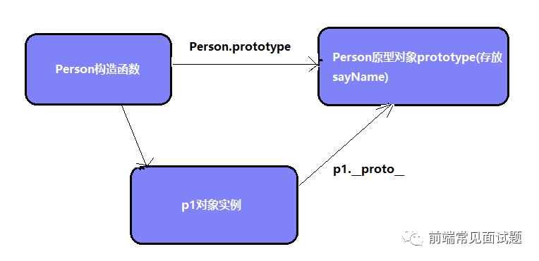
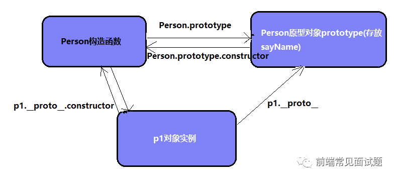
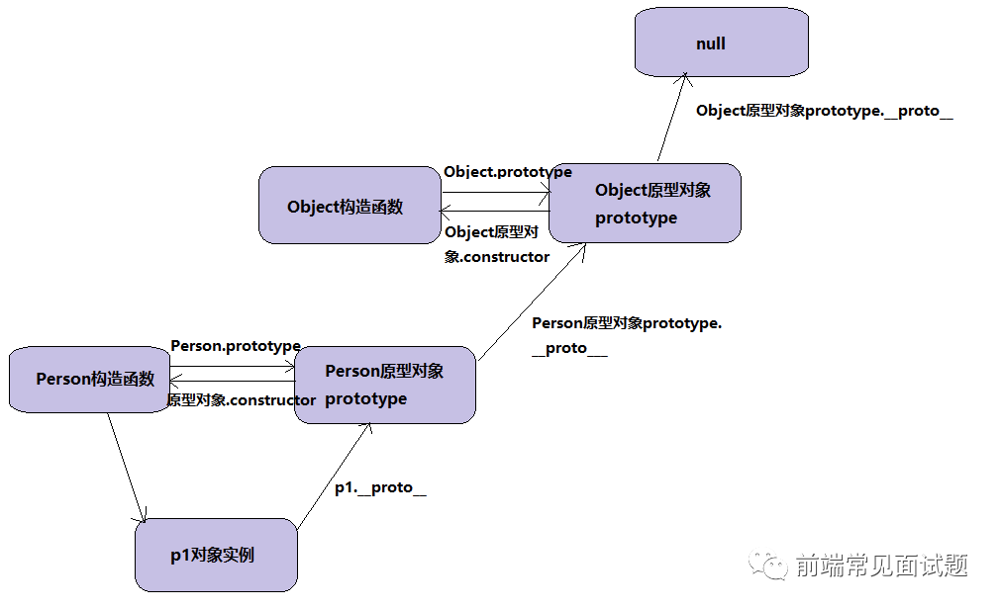

# 	JavaScrip知识点日常总结

## javascript基础
### javascript中call()、apply()、bind()
例子
```javascript
var name = '小王',
    age = 12
var obj = {
    name: '小张',
    objAge: this,
    myFun: function () {
        console.log(this.name + 'myFun' + this.age); //这个时候this指向obj
    }
}
var name = '小王'
function getName() {
    console.log(this.name); //此时的this指向  window
}
```
这两者`this` 的差别，第一个打印里面的`this` 指向`obj`，第二个全局声明的`getName()`函数 `this` 是`window` ；
#### `call()`、`apply()`、`bind()` 都是用来重定义 `this` 这个对象的
```javascript
var name = '小王',
    age = 12
var obj = {
    name: '小张',
    objAge: this.age,
    myFun: function () {
        console.log(this.name + '年龄' + this.age);
    }
}
var db = {
    name: '小张',
    age: 13
}
//都是重新改变this指向的 
obj.myFun.call(db); //小张年龄99     从原来obj->db
obj.myFun.apply(db); //小张年龄99    从原来obj->db
obj.myFun.bind(db)(); //小张年龄99   从原来obj->db
```
::: tip 提示
`bind` 方法后面多了个`()`外 ，结果返回都一致！`bind` 返回的是一个新的函数，你必须调用它才会被执行。其他的都是自动执行的。
:::
```javascript
var name = '小王',
    age = 12
var obj = {
    name: '小张',
    objAge: this.age,
    myFun: function (from, to) {
        console.log(this.name + '年龄' + this.age + '来自' + from + '去往' + to);
    }
}
var db = {
    name: '小张',
    age: 13
}
obj.myFun.call(db, '成都', '上海'); //小张 年龄 99  来自 成都去往上海
obj.myFun.apply(db, ['成都', '上海']); //小张 年龄 99  来自 成都去往上海  
obj.myFun.bind(db, '成都', '上海')(); //小张 年龄 99  来自 成都去往上海
obj.myFun.bind(db, ['成都', '上海'])(); //小张 年龄 99  来自 成都,上海去往undefined
```
::: tip 提示
1.  `call 、bind 、 apply `这三个函数的第一个参数都是 this 的指向对象，第二个参数差别就来了：
2.  `call`的参数是直接放进去的，第二第三第n个参数`全都用逗号分隔`，直接放到后面 `obj.myFun.call(db,'成都', ... ,'string' )`；
3.  `apply`的所有参数都必须`放在一个数组里`面传进去 `obj.myFun.apply(db,['成都', ..., 'string' ])`;
4.  `bind`除了返回是函数以外，它的参数和`call`一样。
5.  `bind`方法在这里再多说一下，bind的时候传的参数会预先传给返回的方法，调用方法时就不用再传参数了。
6.  如果`call()`和`apply()`的`第一个参数是null或者undefined，那么this的指向就是全局变量，在浏览器里就是window对象`。
:::

#### 手写bind()方法 /Function.prototype.bind？？？？？

```js
Function.prototype.myBind = function (target) {
    var target = target || window;
    var _args1 = [].slice.call(arguments, 1);
    var self = this;
    var temp = function () {};
    var F = function () {
        var _args2 = [].slice.call(arguments, 0);
        var parasArr = _args1.concat(_args2);
        return self.apply(this instanceof temp ? this : target, parasArr)
    }
    temp.prototype = self.prototype;
    F.prototype = new temp();
    return F;
}
```

#### 手写call()方法/Function.prototype.call ？？？？？

```js
Function.prototype.myCall = function () {
    var ctx = arguments[0] || window;
    //fn被占用  设置一个唯一值
  	const fn = Symbol()
    ctx[fn] = this;
    var args = [];
    for (var i = 1; i < arguments.length; i++) {
        args.push(arguments[i])
    }
    var result = ctx.fn(...args);
    delete ctx.fn;
    return result;S
}
```

#### 手写apply()方法/Function.prototype.apply ？？？？？

```js
Function.prototype.myApply = function () {
     if (typeof arguments[0] === "undefined" || arguments[0] === null) {
                arguments[0] = window
            }
 		//fn被占用  设置一个唯一值
    const fn = Symbol()
    ctx[fn] = this;
    if (!arguments[1]) {
        var result = ctx.fn();
        delete ctx.fn;
        return result;
    }
    var result = ctx.fn(...arguments[1]);
    delete ctx.fn;
    return result;
}
```

### JavaScript构造函数、原型、原型链

典型的OOP的语言中(如Java)，都存在类的概念，类就是对象的模板，对象就是类的实例，但在ES6之前，JS并没有类的概念。

1. 对象字面量
```javascript
let obj = {}
```
2. new Object()
```javascript
let obj = new Object()
```
3. 自定义构造函数
```javascript
function Person (name, age) {
    this.name = name
    this.age = age
    this.sayName = function () {
        console.log(this.name)
    }
}
let p1 = new person('Jerry', 18)
```
:::tip 提示
构造函数是一种特殊的函数，主要用来初始化对象，即为对象成员变量赋初始值，它总与new一起使用。我们可以把对象中一些公共的属性和方法抽取出来，然后封装到这个函数里面。
使用构造函数时注意：
1.  构造函数用于创建某一类对象，其首字母大写
2.  构造函数要和new一起使用
:::

构造函数中可以添加一些成员，可以在构造函数本身上添加，也可以在构造函数内部的this上添加，通过两种方式添加的成员，就分别成为静态成员和实例成员。
- 静态成员：在构造函数本身上添加的成员，只能由构造函数本身来访问
- 实例成员：在构造函数内部创建的对象成员，只能由实例化的对象来访问
```javascript
function Person(name, age) {
  this.name = name
  this.age = age
  this.sayName = function () {
    console.log(this.name)
  }
}
// 实例成员就是构造函数内部通过this添加的成员：name、age、sayName就是实例成员，实例成员只能通过实例化的对象来访问
let p1 = new Person('Jerry', 18)
Person.gender = 'male' // 静态成员，在否早函数本身上添加的成员gender就是静态成员
console.log(Person.gender)  //male => 静态成员只能通过构造函数来访问率
console.log(p1.gender)  // undefined => 不能通过对象来访问
```
构造函数方法很好用，但是存在浪费内存的问题
```javascript
function Person(name, age) {
  this.name = name
  this.age = age
  this.sayName = function () {
    console.log(this.name)
  }
}
let p1 = new Person('Jerry', 18)
let p2 = new Person('Jack', 19)
console.log(p1.sayName === p2.sayName) // false
```
4. 构造函数原型prototype

**构造函数通过原型分配的函数是所有对象共享的js规定，每一个构造函数都有一个prototype属性，指向另一个对象。prototype就是一个对象，这个对象的所有属性和方法都会被构造函数所拥有。**
```javascript
function Person(name, age) {
  this.name = name
  this.age = age
}
Person.prototype.sayName = function () {
  console.log(this.name)
}
let p1 = new Person('Jerry', 18)
let p2 = new Person('Jack', 19)
console.log(p1.sayName()) // Jerry
console.log(p2.sayName()) // Jack
console.log(p1.sayName === p2.sayName)  // true
p1.__proto__ === Person.prototype // true
```
::: tip 提示
一般情况下，公共的属性定义到构造函数里，公共的方法放在原型对象身上。
1. 原型是什么：一个对象，我们也成为prototype为原型对象
2. 原型的作用是什么：共享方法
:::

3. 对象原型__proto__

::: tip 提示
对象都会有一个属性__proto__指向构造函数的prototype原型对象，对象可以使用构造函数prototype原型对象的属性和方法，就是因为对象有__proto__原型的存在
- __proto__对象原型和原型对象prototype是等价的
- __proto__对象原型的意义就在于为对象的查找机制提供一个方向，或者说一条路线，但是他是一个非标准属性，因此实际开发中，不可以使用这个属性，它只是内部指向原型对象prototype
:::

6. 对象原型__proto__

**对象原型(proto)和构造函数(prototype)原型对象里面都有一个属性constructor属性，constructor我们成为构造函数，因为它指构造函数本身 contructor主要用于记录该对象引用于哪个构造函数，它可以让原型对象重新指向原来的构造函数。**


7. constructor构造函数

**对象原型(proto)和构造函数(prototype)原型对象里面都有一个属性constructor属性，constructor我们成为构造函数，因为它指构造函数本身 contructor主要用于记录该对象引用于哪个构造函数，它可以让原型对象重新指向原来的构造函数**

```javascript
function Person(name, age) {
    this.name = name
    this.age = age
}
Person.prototype = {
// 如果修改了原来的原型对象，给原型对象赋值的是一个对象，则必须手动利用constructor指回原来的构造函数
    constructor: Person,
    sayName: function () {
    }
}
let p1 = new Person('Jerry', 18)
let p2 = new Person('Jack', 20)
console.log(Person.prototype.constructor)
console.log(p1.__proto__.constructor)
```
:::danger
一般情况下，对象的方法都在构造函数的原型对象中设置，如果多个对象的方法，我们可以给原型对象采取对象形式赋值，但是这样就会覆盖构造函数原型对象原来的内容，这样修改后的原型对象constructor就不再指向当前构造函数了。此时，我们可以在修改后的原型对象中，添加一个constructor指向原来的构造函数。
:::

8. 构造函数、实例、原型对象三者之间的关系
   
   
9. 原型链
   
   ::: tip 提示 
   1. 只要是对象就有__proto__原型，指向原型对象。
   2. Person原型对象里面的__proto__原型指向的是Object.prototype。
   3. Object.prototype原型里的__proto__原型指向为null, 只要是对象，它里面都有一个原型__proto__，它指向的是原型对象prototype,原型对象里也有一个__proto__，它指向的是Object原型对象prototype， Object原型对象里也有一个__proto__,它指向的是null。
   
   简单来说就是，每个对象都有一个原型， 每一个原型又是一个对象，所以原型又有自己的原型，这样一环扣一环形成一条链，就叫原型链。
   :::

10. JS的成员查找机制（规则）
    1. 当访问一个对象的属性(包括方法)时，首先查找这个对象自身有没有该属性
    2. 如果没有就查找它的原型(也就是__proto__指向的prototype原型对象)
    3. 如果还没有就查找原型对象的原型(Object的原型对象)
    4. 依次类推一直找到Object为止(null)
    6. __proto__对象原型的意义就在于为对象成员查找机制提供一个方向，或者说一条路线

11. 原型对象this指向
   调用方式|this指向
   :----:|:----:
   普通函数调用|window
   构造函数调用|实例对象，原型对象里的方法也指向实例对象
   对象方法调用|该方法所属对象
   事件绑定对象|绑定事件对象
   定时器函数|window
   立即执行函数|window

改变函数内部this主席昂，常用的方法：`bind()、call()、apply()`
call()方法：调用一个对象，即调用函数的方式，改变函数的this指向。主要作用实现继承。
```javascript
foo.call(thisArg, arg1,arg2,...)
```
apply()方法：调用一个函数，`即调用函数的方式`，改变函数的this指向。
```javascript
foo.apply(thisArg, [argArray])

// thisArg：在foo函数运行时指定的this值
// argArray: 传递的值，必须包含在数组里
// 返回值就是函数的返回值，因为他就是调用函数
```
```javascript
// 利用apply借助于数学内置对象求最大最小值
var arr = [1,20,30,60]
var max = Math.max.apply(Math, arr)
max //  60
```
bind()方法不会调用函数，但是能改变函数内部this指向。
```javascript
foo.bind(thisArg, arg1, arg2,...)

// thisArg: 在foo函数运行时指定的this值
// arg1, arg2：传递的其他参数
// 返回由指定的this值和初始化参数改造的原函数拷贝，即原函数改变this之后产生的新函数
```
```javascript
var btn = document.querySelector('button');
btn.onclick = function() {
   this.diabled = true; //这个 this 指向 btn 按钮
   // var that = this;
   setTimeout(function() { //定时器里面的 this 指向的是 window
      // that.disabled = false;
      this.disabled = false;
   }.bind(this), 3000); //这个 this 指向 btn 这个对象
}
```
::: tip 提示
- `call()`经常做继承。
- `apply()`经常跟数组有关系。
- `bind()`不立即调用函数，如果有的函数我们不需要立即调用，但是又想改变这个函数内部`this`指向，此时用`bind()`。
:::

12. 内置函数 

可以通过原型对象，对原来的内置对象进行扩展自定义的方法，比如给数组增加自定义求偶数和的功能
```javascript
Array.prototype.sum = function () {
  let sum = 0
  for (let i = 0; i < this.length; i++) {
    sum += this[i]
  }
  return sum
}
let arr = [1, 2, 3, 4, 5, 6, 7, 8, 9, 10]
console.log(arr.sum())
console.log(Array.prototype)
```
### javascript `this`重点

在面试的文件中有的！！

### 深浅拷贝

```js

```

### 手写相关函数

#### 手写`——proto__`

```js
Object.defineProperty(Object.prototype, "__proto__", {
    get: function() {
        return Object.getPrototypeOf(this);
    },
    // ES6中的Object.setPrototypeOf
    set: function(o) {
        Object.setPrototypeOf(this, o);
        return o;
    }
})
```

#### 手写instanceof

```js
function _instanceof(A, B) {
    var O = B.prototype;// 取B的显示原型
    A = A.__proto__;// 取A的隐式原型
    while (true) {
        //Object.prototype.__proto__ === null
        if (A === null)
            return false;
        if (O === A)// 这里重点：当 O 严格等于 A 时，返回 true
            return true;
        A = A.__proto__;
    }
}
```

#### 手写new运算符

```js
/**
 * Con 目标对象
 * args 参数
 */
function myNew(Con, ...args) {
  // 创建一个空的对象
  let obj = {};
  // 链接到原型，obj 可以访问到构造函数原型中的属性
  obj.__proto__ = Con.prototype;
  // 绑定 this 实现继承，obj 可以访问到构造函数中的属性
  let ret = Con.call(obj, ...args);
  // 优先返回构造函数返回的对象
  return ret instanceof Object ? ret : obj;
}


function Person(name) {
  this.name = name;
}
Person.prototype.getName = function() {
  console.log(`your name is ${this.name}`);
};
let p2 = myNew(Person, "lisi");
// your name is lisi
p2.getName();
```

#### 手写forEach方法

```js
Array.prototype.myForEach = function (func, context) {
  	let arr = Array.prototype.slice.call(this)
    for (var i = 0; i < arr.length; i++) {
        func.call(context, arr[i], i, this)
    }
}
```

#### 手写map函数
```javascript
Array.prototype.map = function(fn) {
    const result = [];
    for (let i=0;i<this.length;i++) {
        if (!this.hasOwnProperty(i)) continue; // 处理稀疏数组的情况
        // 运行传递过来的函数  是一个匿名函数
        result.push(fn(this[i],i,this))
    }
    return result
}
const arr = [1,2,3,,5]
const result = arr.map(item => item*2)
console.log(result)


//es5实现map函数
const selfMap = function (fn,context){
  //当前带有length的对象转化为数组
  let arr = Array.prototype.slice.call(this)
  let mappedArr = []
  for(let i = 0;i < arr.length;i++){
    if(!arr.hasOwnProperty(i)) continue
    mappedArr.push(fn.call(context,arr[i],i,this))	
  }
  return mappedArr
}
值得一提的是，map 的第二个参数为第一个参数回调中的 this 指向，如果第一个参数为箭头函数，那设置第二个 this 会因为箭头函数的词法绑定而失效


//使用reduce实现数组map方法
const selfMap2 = function(fn,context){
  let arr = Array.prototype.slice.call(this)
  return arr.reduce((pre,cur,index) => {
    return [...pre,fn.call(context,cur,index,this)]
  },[])
}

```

#### 手写filter函数
```javascript
Array.prototype.filter = function (fn){
    const result = [];
    for (let i=0;i<this.length;i++) {
        if (!this.hasOwnProperty(i)) continue; // 处理稀疏数组的情况
        fn(this[i],i,this) && result.push(this[i])
    }
    return result
}
const arr = [1,2,3,,5]
const result = arr.filter(item => item > 2)
console.log(result)


//es5实现
const seltFilter = function(fn,context){
  let arr = Array.prototype.slice.call(this)
  let filteredArr = []
  for(let i = 0;i < arr.length;i++){
    if (!this.hasOwnProperty(i)) continue; // 处理稀疏数组的情况
    fn.call(context,arr[i],i,this) && filteredArr.push(arr[i])
  }
}

//使用reduce实现数组filter方法
const selfFilter2 = function(fn,context){
  return this.reduce((pre,cur,index) => {
    return  fn.call(context,arr[i],i,this) ? [...pre,...cur] :[...pre]
  })
}
```

#### 手写reduce函数
```javascript
Array.prototype.reduce = function (fn,initValue){
    let result = initValue?initValue:this[0]
    for (let i=0;i<this.length;i++) {
        if (!this.hasOwnProperty(i)) continue; // 处理稀疏数组的情况
        result = fn(result, this[i], i, this)
    }
    return result
}
const arr = [1,,2,3,,5]
const result = arr.reduce((a,b) => a*b,2)
console.log(result)


//es5
const findRealELementIndex = function(arr,initiIndex){
  let index
  for(let i = initIndex || 0;i < arr.length;i++){
    if(!arr.hasOwnProperty(i)) continue
    index = i
    break
  }
  return index
}
const selfReduce = function(fn,initalValue){
  let arr = Array.prototype.slice.call(this)
  let res
  
  if(initalValue === undefined){
    res = arr[findRealElementIndex(arr)]
    for(let i = 0;i < arr.lenght -1;i++){
      //reduce遍历时候 需要跳过稀疏元素，遍历到最后一个非稀疏元素
      if(!arr.hasOwnProperty(i)) continue
      let realElementIndex = findRealElementIndex(arr,i+1)
      res = fn.call(null,res,arr[realElementIndex],realElementIndex,this)
    }
  }else {
    res = initalValue
    for(let i = 0;i <arr.length;i++){
      if(!arr.hasOwnProperty(i)) continue
      res = fn.call(null,res,arr[i],i,this)
    }
  }
  return res
}


//另一种es5的方法
Array.prototype.myReduce = function (func, initialValue) {
    var len = this.length,
        nextValue,
        i;
    if (!initialValue) {
        // 没有传第二个参数
        nextValue = this[0];
        i = 1;
    } else {
        // 传了第二个参数
        nextValue = initialValue;
        i = 0;
    }
    for (; i < len; i++) {
        nextValue = func(nextValue, this[i], i, this);
    }
    return nextValue;
}
```

#### 手写every函数
```javascript
Array.prototype.every = function (fn){
    let bool = true;
    for (let i=0;i<this.length;i++) {
        if (!this.hasOwnProperty(i)) continue; // 处理稀疏数组的情况
        if (!fn(this[i],i,this)){
            bool = false
            break
        }
    }
    return bool
}
const arr = [1,2,3,,5]
const result = arr.every(item => item > 3)
console.log(result)
```

#### 手写some函数
```javascript
Array.prototype.some = function (fn){
    let bool = false;
    for (let i=0;i<this.length;i++) {
        if (!this.hasOwnProperty(i)) continue; // 处理稀疏数组的情况
        if (fn(this[i],i,this)){
            bool = true
            break
        }
    }
    return bool
}
const arr = [1,2,3,,5]
const result = arr.some(item => item > 3)
console.log(result)


//es5
const selfSome = function(fn,context){
  let arr = Array.prototype.slice.call(this)
  if(!arr.length) return false
  let flag = false
  for(let i = 0;i < arr.length;i++){
    if(!arr.hasOwnProperty(i)) continue
    let res = fn.call(context,arr[i],i,this)
    if(res) {
      flag = true
      break
    }
  }
  return flag
}

执行 some 方法的数组如果是一个空数组，最终始终会返回 false，而另一个数组的 every 方法中的数组如果是一个空数组，会始终返回 true


```

#### 手写find方法
```javascript
// 只查找第一个
Array.prototype.find = function (fn){
    let result
    for (let i=0;i<this.length;i++) {
        if (!this.hasOwnProperty(i)) continue; // 处理稀疏数组的情况
        if (fn(this[i],i,this)){
            result = this[i]
            break
        }
    }
    return result
}
const arr = [1,2,3,,5,4]
const result = arr.find(item => item > 3)
console.log(result)
```

#### 手写拉平数组
```javascript
// 利用es6语法flat(num)方法将数组拉平
// 该方法不传参数默认只会拉平一层，如果想拉平多层嵌套的数组，需要传入一个整数，表示要拉平的层级。该返回返回一个新的数组，对原数组没有影响。
function flattening1(arr,num=1) {
    if (!Array.isArray(arr)) return
    return arr.flat(num)
}
// 利用 reduce() 方法将数组拉平。
// 利用 reduce 进行迭代，核心的思想是递归实现。
function flattening2(arr) {
    if (!Array.isArray(arr)) return
    return arr.reduce((a, b)=>{
        return a.concat(Array.isArray(b)?flattening2(b):b);
    }, [])
}
// 模拟栈实现数组拉平
// 该方法是模拟栈，在性能上相对最优解。
function flattening3(arr) {
    if (!Array.isArray(arr)) return
    const stack = [...arr]
    const res = []
    while (stack.length){
        let value = stack.shift()
        Array.isArray(value) ? stack.push(value) : res.push(value)
    }
    return res
}

const arr = [1, 2, 3, 4, [1, 2, 3, [1, 2, 3, [1, 2, 3]]], 5, ["string", { type: "对象" }]];
const result1 = flattening1(arr,1)
const result2 = flattening2(arr)
const result3 = flattening2(arr)
console.log(result3)


//使用reduce实现数组的flat方法
```
#### 手写图片懒加载&惰性函数
实现图片懒加载其核心的思想就是将 img 的 src 属性先使用一张本地占位符，或者为空。然后真实的图片路径再定义一个 data-set 属性存起来，待达到一定条件的时将 data-img 的属性值赋给 src。
如下是通过scroll滚动事件监听来实现的图片懒加载，当图片都加载完毕移除事件监听，并且将移除 html 标签。
```javascript
const lazyLoad = function(imgs){
    let count = 0
    const deleteImgs = []
    const handler = () => {
        imgs.forEach((item,index) => {
            // getBoundingClientRect用于获取某个元素相对于视窗的位置集合
            const react = item.getBoundingClientRect()
            if (react.top<window.innerHeight){
                item.src = dataset.src
                count++
                deleteImgs.push(index)
                if (count === deleteImgs.length) document.removeEventListener('scroll',lazyLoad)
            }
        })
        imgs = imgs.filter((item,index)=>!deleteImgs.includes(index))
    }
    return handler()
}
```

scroll滚动事件容易造成性能问题。那可以通过 IntersectionObserver 自动观察 img 标签是否进入可视区域。
实例化 IntersectionObserver 实例，接受两个参数：callback 是可见性变化时的回调函数，option 是配置对象（该参数可选）。
当 img 标签进入可视区域时会执行实例化时的回调，同时给回调传入一个 entries 参数，保存着实例观察的所有元素的一些状态，比如每个元素的边界信息，当前元素对应的 DOM 节点，当前元素进入可视区域的比率，每当一个元素进入可视区域，将真正的图片赋值给当前 img 标签，同时解除对其的观察。
```javascript
const lazyLoad = function(imgs){
  const observer = new InteractionObserver((entities)=>{
      entities.forEach((entity) => {
          if(entity.intersectionRatio > 0) {
              entity.target.src = dataset.src
              observer.unobserve(entity.target)
          }
      })
  })
  imgs.forEach((img) => observer.observe(img))
}
```

#### 手写预加载
```javascript
let images = [...document.querySelectorAll('img')]
const loadedImages = function(...imgs){
    const imagesArr = []
    let count = 0
    for (let i=0;i<images.length;i++) {
        const img = new Image()
        img.onload = function(){
            imgs[i].src = imagesArr[i]
            count++
            if (count === imagesArr.length) {
                console.log("加载完成")
            }
        }

    }
    return {
        setSrc: function(...args) {
            imgs.forEach((img) => img.src = '///loading.png')
            imagesArrr = args
        }
    }
}
```

#### 手写节流&防抖
针对高频的触发的函数，我们一般都会思考通过节流或者防抖去实现性能上的优化。
节流实现原理是通过定时器以和时间差做判断。定时器有延迟的能力，事件一开始不会立即执行，事件结束后还会再执行一次；而时间差事件一开始就立即执行，时间结束之后也会立即停止。
结合两者的特性封装节流函数：
```javascript
//防抖
function debounce(handle, delay) {
    var timer = null;
    return function () {
        var _self = this,
            _args = arguments;
        clearTimeout(timer);
        timer = setTimeout(function () {
            handle.apply(_self, _args)
        }, delay)
    }
}

//节流
function throttle(handler, wait) {
    var lastTime = 0;
    return function (e) {
        var nowTime = new Date().getTime();
        if (nowTime - lastTime > wait) {
            handler.apply(this, arguments);
            lastTime = nowTime;
        }
    }
}
```
#### **JS函数防抖和函数节流**

1. 函数防抖(debounce)
   - **概念：** `在事件被触发n秒后再执行回调，如果在这n秒内又被触发，则重新计时。`
   - **生活中的实例：** `如果有人进电梯（触发事件），那电梯将在10秒钟后出发（执行事件监听器），这时如果又有人进电梯了（在10秒内再次触发该事件），我们又得等10秒再出发（重新计时）。`**生活中的实例：** `我们知道目前的一种说法是当 1 秒内连续播放 24 张以上的图片时，在人眼的视觉中就会形成一个连贯的动画，所以在电影的播放（以前是，现在不知道）中基本是以每秒 24 张的速度播放的，为什么不 100 张或更多是因为 24 张就可以满足人类视觉需求的时候，100 张就会显得很浪费资源。`
   - **事件响应函数在一段规定时间（前/后）才执行。如果在规定时间内，再次触发，重新计算时间。**
2. 函数节流(debounce)
   - **概念：** `规定一个单位时间，在这个单位时间内，只能有一次触发事件的回调函数执行，如果在同一个单位时间内某事件被触发多次，只有一次能生效。`
   - **生活中的实例：** `我们知道目前的一种说法是当 1 秒内连续播放 24 张以上的图片时，在人眼的视觉中就会形成一个连贯的动画，所以在电影的播放（以前是，现在不知道）中基本是以每秒 24 张的速度播放的，为什么不 100 张或更多是因为 24 张就可以满足人类视觉需求的时候，100 张就会显得很浪费资源。`、

对于函数防抖，有以下几种应用场景：

- 防止表单多次提交。
- 对于输入框连续输入进行AJAX验证时，用函数防抖能有效减少请求次数。搜索框输入查询（监听输入框输入内容，设定每隔一段时间访问接口。
- 判断`scroll`是否滑到底部，`滚动事件`+`函数防抖`
- 浏览器窗口缩放时，resize事件。

总的来说，适合多次事件**一次响应**的情况

```js

function debounce(fn, wait = 200, immediate = false) {
  let timer = null, 
      isEnd = true, // 默认后执行  用变量来判断先后执行
      result
  let debounced = function (...args) {
    if (timer) clearTimeout(timer)
    if (immediate) { // 立即执行
      // 改变this指向
      isEnd && (result = fn.apply(this, args))
      isEnd = false
    }
    // 后执行
    timer = setTimeout(() => {
      (!immediate) && (result = fn.apply(this, args))
      isEnd = true
    }, wait)
    return result
  }
  debounced.cancel = function () {
    if (timer) clearTimeout(timer)
    timer = null
  }
  return debounced
}


//解决函数异步问题 
//  配合async 和  awit使用
function debounce(fn, wait, immediate) {
  let timer = null, result
  let debounced = function (...args) {
    // 使用Promise
    return new Promise(res => {
      if (timer) clearInterval(timer)
      if (immediate) {// 立即执行
        if (!timer) {
          result = fn.apply(this, args)
          res(result)
        }
        timer = setTimeout(() => {
          timer = null
        }, wait);
      } else {
        timer = setTimeout(() => {
          result = fn.apply(this, args)
          res(result)
        }, wait);
      }
    })
  }
  debounced.cancel = function () {
    if (timer) clearTimeout(timer)
    timer = null
  }
  return debounced
}


var fn = function () {
  console.log('boom')
}

setInterval(debounce(fn,500),1000) // 第一次在1500ms后触发，之后每1000ms触发一次

setInterval(debounce(fn,2000),1000) // 不会触发一次（我把函数防抖看出技能读条，如果读条没完成就用技能，便会失败而且重新读条）

```

对于函数节流，有如下几个场景：

- 游戏中的刷新率
- DOM元素拖拽
- Canvas画笔功能

总的来说，适合**大量事件**按时间做**平均**分配触发。

```js
function throttle(fn, gapTime) {
  let _lastTime = null;

  return function () {
    let _nowTime = + new Date()
    if (_nowTime - _lastTime > gapTime || !_lastTime) {
      fn();
      _lastTime = _nowTime
    }
  }
}

let fn = ()=>{
  console.log('boom')
}

setInterval(throttle(fn,1000),10)

```

函数防抖和函数节流是**在时间轴上控制函数的执行次数**。防抖可以类比为`电梯不断上乘客`,节流可以看做`幻灯片限制频率播放电影`。

## javascript语法简明手册

### Chrome控制台
1. copy()函数
    + 将已有对象的JSON表达式复制到缓冲区
2. console.dir() 
    + 查看所有对象的属性和方法
3.  console.error()
    + 提供栈追踪
4. console.time()和console.timeEnd()
    + 可以跟踪函数所消耗的时间，对代码优化很有帮助
```js
console.time()
let arr = new Array(10000)
for (let i = 0; i<arr.length; i++) {
    arr[i] = new Object()
}
console.timeEnd()
```
5. console.clear()

### javascript基础
#### DOMContentLoaded
为了等待DOM事件，添加事件监听器。该事件监听器。DOMContentLoaded。
```html
<html>
    <head>
        <title>DOM Loaded.</title>
        <script type="text/javascript">
            function load(){
                console.log('DOM Loaded.')
            }
            document.addEventListener("DOMContentLoaded",load)
        </script>
    </head>
</html>
```
该入口点需要保证所有DOM元素都已经加载到内存中，而且在使用javascript来访问他们时不会发生错误。
请根据是仅需要等待DOM还是需要等待其他媒介，来决定程序入口是DOMContentLoaded、readyState还是本地的window.onload方法。
1. readyState
在绑定DOMContentLoaded事件之前，需要检查readyState
```js
<html>
    <head>
        <title>DOM Loaded.</title>
        <script type="text/javascript">
            function load(){
                console.log('DOM Loaded.')
            }
            if(document.readyState == 'loading') {
                document.addEventListener("DOMContentLoaded",load)
            }else {
            load()
        }
        </script>
    </head>
</html>
```
2. window.onload
使用window。onload方法，一直等到所有图像和相关媒介都下载完成。
```js
<html>
    <head>
        <title>DOM Loaded.</title>
        <script type="text/javascript">
            window.onload = function() {
            // 等待各种东西加载完毕
        }
        </script>
    </head>
</html> 
```
#### export、export default和module.exports的用法及区别
##### Node应用由模块组成，采用CommonJS模块规范。module.exports。
CommonJS规范规定，每个模块内部，module变量代表当前模块。这个变量是一个对象，它的exports属性（即module.exports）是对外的接口。加载某个模块，其实是加载该模块的module.exports属性。
```js
// 导出
var x = 5;
var addX = function (value) {
  return value + x;
};
module.exports.x = x;
module.exports.addX = addX;


// 导入
// require方法用于加载模块。
var example = require('./example.js');

console.log(example.x); // 5
console.log(example.addX(1)); // 6
```
##### ES6使用export和import来导出、导入模块
在一个文件或模块中，export、import可以有多个，export default仅有一个。通过export方式导出，在导入时要加{ }，export default则不需要。
export命令规定是对外的接口，必须与模块内部的变量建立一一对应关系.
```js
// test-es6.js
const name = 'linda'
const age = 20
function add(x,y) {
    return x+y
}
export {name,age,add}


import {name,age,add} from "./test-es6.js"
```
```js
//a.js
export const str = "blablabla~";
export function log(sth) { 
  return sth;
}

//b.js
import { str, log } from 'a'; //也可以分开写两次，导入的时候带花括号
```

export default 命令，为模块指定默认输出，import时可以自己起名字。使用export default命令，为模块指定默认输出，这样就不需要知道所要加载模块的变量名。
```js
//a.js
const str = "blablabla~";
export default str;

//b.js
import str from 'a'; //导入的时候没有花括号
```
##### ES10动态导入
ES10 可以将导入赋值给一个变量。
```js
element.addEventListener('click',async() => {
    const module = await import('./api/click.js')
    module.clickEvent()
})
```

#### 字面量与构造函数
值|类型(typeof x)|构造函数
:---:|:---:|:---:
1|"number"|Number()
3.14|"number"|Number()
some text .|"string"|String()
[]|"object"|Array()
{}|"object"|Object()
true|"boolean"|Boolean()
f f(){}|"function"|Function()

#### 引用传递
:::tip 提示
常将数据从一处复制到另一处。人们很自然地会想到将当前值从一个变量赋给另一个变量时，会生成一个副本。javascript是通过引用进行赋值，实际上并不会生成原始变量的副本。
:::

```js
let x = { p:1 }  // 创建新变量x
let y = x // y是x的引用
x.p = 2 // 修改x的原始值
console.log(y.p) // 2
```
引用链
```js
let a = { p:1 }
let b = a
let c = b
let d = c
let e = d
let f = e
let g = f

a.p = 5
console.log(g.p)
```

#### 作用域的怪癖
##### 怪癖1：函数内的let和const与全局变量
```js
let a = "global a"
let b = "global b"

function x(){
    console.log("x(): global b = " + b)  //"global b"
    console.log("x(): global a = " + a)  // ReferenceError
    let a = 1 // 不提升
}

x()
```
::: danger 重点
如果函数内部已经存在变量a（并且是使用let或const定义的），那么在函数内部的变量a的定义之前使用a，就会发生ReferenceError错误，即使存在全局变量a，也是如此！
这在语法上称为“暂时性死区”（英temporal dead zone，简 TDZ），即代码块开始到变量声明语句完成之间的区域。
:::
##### 怪癖2：var依附于window/this对象，而let和const不会
::: danger 重点
在全局作用域中，this引用指向window对象或全局语境的实例。当使用var关键字定义变量时，这些变量就依附于window对象，而使用let和const定义的变量不会这样。
:::
```js
console.log(this === window) // window

var c = 'c' // 依附于window（全局作用域中的this）
let d = 'd' // 独立于this

console.log(c) // c
console.log(this.c) // c
console.log(window.c) // c 

console.log(d) // d
console.log(this.d) // 未定义
console.log(window.d) // 未定义
```
### javascript语句
#### 求值语句
```js
let a = 1       // underfined
a;              // 1
```
一些语句的求值结果是undefined
语句|求值结果
:---:|:---:
;|undefined
1;|1
"text";|"text"
[];|[]
{};|undefined
let a = 1;|undefined
let b = [];|undefined
let c = {};|undefined
let d = new String("text");|undefined
let e = new Number(123);|undefined
new String("text");|"text"
new Number(125);|125
let f = function() {return 1};|undefined
f()|1
let o = (a,b) => a+b;|undefined
o(1,2)|3
function name() {}|undefined
::: tip 重点
尽管一些求值规则容易理解，但是特殊的规则可能需要死记硬背。
:::

### javascript基本类型
#### 基本类型
JavaScript包含7种类型：`boolean`、`null`、`undefined`、`number`、`bigint`、`string`和`symbol`。

类型|值|构造函数|typeof
:---:|:---:|:---:|:---:
null|null|无|"object"
undefined|undefined|无|"object"
number|123 3.14|Number()|"number"
bigint|123n 256n|Bigint()|"bigint"
string|"hello"|String()|"string"
boolean|true false|Boolean()|"boolean"
symbol||无|"symbol"

#### Symbol特别注意
```js
// 不能使用new初始化symbol
let sym = new Symbol('sym'); // TypeError
// 正确创建方式
let sym = Symbol('sym');
// 创建唯一的symbol
Symbol('sym') === Symbol('sym')  // false
// 每当调用Symbol('sym')时，就会创建唯一的symbol。symbol可以用来定义私有对象的属性。
```
利用symbol定义对象属性
```js
let sym = Symbol('unique')
let bol = Symbol('distinct')
let one = Symbol('only-one')
let obj = { property: "regular property",[sym]:1,[bol]:2 }
ogj[one] = 3
```
同时显示私有属性和公开属性
```js
console.log(obj)
/*
{
  property: 'regular property',
  [Symbol(unique)]: 1,
  [Symbol(distinct)]: 2,
  [Symbol(only-one)]: 3
}
 */
```
基于symbol的私有属性对Object.entries、Object.keys、Object.values以及其他迭代器（如for...in...循环）,JSON.stringify是不可见的。
```js
for(let prop in obj) {
    console.log(prop + ": " + obj[prop])
}
console.log(Object.entries(obj))
console.log(JSON.stringify(obj))
/*
property: regular property
[ [ 'property', 'regular property' ] ]
{"property":"regular property"}

 */
```
symbol属性可以通过Object.getOwnPropertySymbols方法公开symbol属性。
```js
console.log(Object.getOwnPropertySymbols(obj))
[ Symbol(unique), Symbol(distinct), Symbol(only-one) ]
```
全局symbol注册表
有一种创建字符串键的方法可以覆盖使用相同的名字创建的symbol,这就是symbol的全局注册表。可以使用Symbol.for和Symbol.keyFor进行访问。
```js
let sym = Symbol.from('age')
let bol = Symbol.from('age')
obj[sym] = 20
obj[bol] = 25

console.log(obj[sym])  // 25
```
### 强制类型转换
```js
// 数值与字符串相加时候，数值总会先执行加法。
1 + 1 + 1 + 2 + "" => "5"
```

```js
// 数值与其他类型比较，都会讲其他类型转化为数值。
```
### 作用域
作用域包含3中类型：全局作用域、块级作用域和函数作用域。
#### 变量定义
1. 区分大小写
2. 定义变量（var,let,const）
#### 变量提升
全局作用域中定义的变量基本上可以面向全局语境中定义的全部其他作用域，包括`块级作用域`、`for-loop作用域`、`函数作用域`、`事件回调函数`
```js
console.log(apple) // undefined
{
    var apple = 1
}

var apple
console.log(apple) // undefined
{
    apple = 1
}
```
#### 函数提升
```js
fun()  // Hello from fun() function.
function fun() {
    console.log("Hello from fun() function.")
}

function fun() {
    console.log("Hello from fun() function.")
}
fun()  // Hello from fun() function.
```
#### 在函数作用域中定义变量
在自己的块级作用域找不到var定义时，它就会在父级作用域中查找。如果在自己的块级作用域找到该变量，那么它就会继承变量的值。在函数作用域中定义的变量基本上只接受单向访问。
函数支持闭包模式。在该模式下，它们的变量对全局作用域是不可见的，但是可以被它们内部的其他函数作用域访问。
#### 作用域可见性的区别
全局作用域中
当变量定义在全局作用域中时，var、let和const在作用域可见性方面没有区别。它们对内部的块级作用域、函数作用域和时间回调函数作用域都是有效的。
关键字let和const限制变量，使用变量仅在其定义的作用域内有效。
#### 在函数作用域中
在函数内，包括var在内的所有变量类型都仅适用于其他作用域。无论你使用哪一个关键字，都无法在变量定义的函数作用域外部访问该变量。
#### 闭包
函数闭包就是一个函数位于另一个函数的内部。
```js
var plus = (function() {
    var counter = 0
    return function() {
        counter += 1
        return counter
    }
})()
plus()  // 1
plus()  // 2
plus()  // 3
```
在plus的作用域内，另一个匿名函数被创建，它能使私有变量counter自增1，并将结果的返回值传给全局作用域。在全局作用域不可以直接访问counter变量，也不可以修改该变量。
至于闭包内的代码才允许其内部函数来修改该变量，并保持该变量不被泄露到全局作用域。
#### 在块级作用域中
let和const隐蔽变量的可见性，使其仅对变量定义所在的作用域及其内部作用可见。
在类中
```js
class Cat{
    constructor() {
        let property = 1   // 局部变量
        this.something = 2  // 对象属性
    }
    method() {
        console.log(this.property)  //undefined
        console.log(this.something) //2
    }
    
}
```
const和数组
const数组的值是可以修改的，只是不可以再将新的对象赋给初始变量名。
```js
const A = []
A[0] = 'a'
A = [] // 类型错误，赋值给常量
```
const和对象字面量与数组相似。

### 运算符
### 位运算符
运算符|名称|实例|结果
:----:|:----:|:----:|:----:
&|按位与|a&b|1
`|`|按位或|`a|b`|13
^|按位异或|a^b|12
~|按位非|~a|-6
>>|按位右移|a>>1|2
<<|按位左移|a<<2|10
#### typeof
运算符|结果
:----:|:----:
typeof 125|"number"
typeof 100n|"bigint"
typeof '125'|"string"
typeof NaN|"number"
typeof true|"boolean"
typeof []|"object"
typeof {}|"object"
typeof Object|"object"
typeof new Object()|"object"
typeof null|"object"
#### delete
delete关键字删除对象属性
```js
let bird = {
    name:'raven',
    speed:'30mpg'
}
delete bird.speed
```
#### in
in运算符可以用来检查属性名是否存在于对象中。
```js
"c" in { "a" : 1,"b" : 2,"c" :3}  //true
```
检查是否存在索引值
```js
"c" in ["a","b","c"] //false
0 in ["a","b","c"]  // true
```
检查length属性
```js
"length" in [] //true
```
### ...rest和...spread
#### rest属性
...rest语法可以帮助你从函数的单个参数名中提取多项，并应用它们。单个rest参数包含传递给函数的一个或者多个参数。
```js
// 
let f = (...items) => items.map(item => console.log(item))
let f = (...i) => i.map(v => console.log(v))
f(1,2,3,4,5,6)   -> [1,2,3,4,5,6]
```
#### spread属性
spread和rest相反，它可以帮助你从对象中提取组成部分。
```js
let {鸡腿,空心菜,土豆} = 购物车
```
#### ...rest和...spread
- ...rest:将所有剩余的参数（"其余的参数"）收集到一个数组中。
- ...spread:将迭代器展开为一个或多个参数
#### 语法详解
rest餐宿可以为函数书籍任意数量的参数，并将它们存储到一个数组中。
rest必须是唯一的参数标识或是参数列表中的最后一个。
```js
function sum(...args) {
    console.log(args) // [1,2,3]
}
sum(1,2,3)
function sum(a,...args) {
    console.log(args) // [2,3]
}
sum(1,2,3)
```
...spread和...rest相反,他从一个数组中取出值。
```js
function print(a,...args) {
    console.log(a);
    console.log(args)
}
print(...[1,2,3],4,5) //在这里是...spread   => print(1,2,3,4,5)
// a = 1
// args = [2,3,4,5]
```
#### spread来扁平化数组
```js
let names = ['felix','luna']
const cats = [...names,'daisy']
console.log(cats)  // ['felix','luna','daisy']
```
#### 解构赋值
解构赋值可用于从数组和对象中提取多项，并将它们赋给变量。
解构不是隐式递归的，不会扫描到二级对象。
如果未在对象中找到变量，得到的结果就是undefined
```js
[a,b] = [10,20]
console.log(a,b)

[a,b,...rest] = [30,40,50,60,70]
console.log(a,b) // 30,40
console.log(rest) //[50,60,70]

// 提取匹配名称的对象属性
let { oranges } = { organes:1 }
console.log(organes)  // 1

let fruit_basket = {
    apples : 0,
    grapes : 1,
    mangos : 3
}
let { grapes } = fruit_basket
console.log(grapes)

// 解构与重命名同时进行
let { automobile:car } = { automobile:"Tesla" }
console.log(car)
```
#### 合并对象和数组
```js
let a = { p:1,q:2,m:() => {}}
let b = { r:3,s:4,n:() => {}}
let c  = {...a,...b}


let a = [1,2]
let b = [3,4]
let c = [...a,...b]  //[1,2,3,4]
```

### 闭包
就是用来让全局访问函数内部的变量的和方法。
JavaScript中，即使`调用完函数，该函数内部定义的变量和方法仍会保留在内存中。在函数执行完后保留函数内部定义的变量或者方法的链接，这就是闭包工作方式的一部分。`
闭包用来模拟类似于对象的私有方法内容。
#### 什么是闭包
在函数退出后，闭包还能够保留对所有局部函数变量的引用。
JavaScript允许在一个函数中定义另一个函数，从技术上讲，这就是闭包。
```js
// 闭包结构
// 函数global定义在与window一起创建的现有的执行语境中。
// 新的执行语境。在声明绑定实例化的过程中，在JavaScript解释器的内部，inner将会作为一个新的局部对象被创建，其作用域指向global的执行语境的变量环境。
function global(){
    function inner(){
        console.log("inner");
    }
    inner();
}
global() // inner
```
我们可以通过函数返回私有方法（内部函数），开公开对他们的引用。
```js
function sendEmail(from,sub,message) {
    let msg = `"${sun}" > "${message}" received from ${from}`
    let send = function(){
        console.log(msg)
    }
    return send
}
let ref = sendEmail('Jason','Re:sunject','Good news')

ref()
```
我们可以在全局作用域中通过引用来调用send方法。即使在调用完sendEmail函数之后，变量msg和send仍会保留在内存中。
#### 漂亮闭包
```js
let get = null
function closure(){
    this.inc = 0
    get = () => this.inc
    function increase() {this.inc++}
    function decrease() {this.inc--}
    function set(v) {this.inc = v}
    function del() {
        delete this.inc
        this.inc = null
        console.log("this.inc deleted")
    }
    function readd(){
        if(!this.inc) {
            this.inc = "re-added"
        }
    }
    return [increase,decrease,set,del,readd]
}
```
#### 闭包小结
如果在一个函数中声明另一个函数，就创建了闭包。
当调用的函数包含另一个函数时，`就会新建执行语境`，它持有所有局部变量的全新副本。通过链接到全局作用域中定义的变量名，或在外层函数中使用return关键字返回闭包，就可以在全局作用域中创建他们的引用。

`闭包使你可以持有局部函数变量的引用，在函数退出后仍然可使用。`
#### 柯里化函数
```js
let planets = function(a) {
    return function(b) {
        return "xx" + a + "and" + b;
    }
}
let favoritePlanets = planets("Jupiter")
favoritePlanets("Earth") //xxxJupiterandEarth
favoritePlanets("Jupiter") //xxxJupiterandJupiter
favoritePlanets("Saturn") //xxxJupiterandSaturn

planets("Jupiter")("Earth")   //xxxJupiterandEarth


let planets = (a) => (b) => "xx" + a + "and" + b;
```
#### js闭包的9大使用场景
1. 返回值（最常用）
以闭包的形式将 name 返回。
```js
function fn(){
    var name = 'hello'
    return function() {
        return name
    }
}
var fnc = fn()
console.log(fnc())  // hello
```
2. 函数赋值
在闭包里面给fn2函数设置值，闭包的形式把name属性记忆下来，执行会输出 hello。
```js
var fn2
function fn() {
    var name = 'hello'
    fn2 = function() {
        return name
    }
}
fn()
console.log(fn2())
```
3. 函数参数
用闭包返回一个函数，把此函数作为另一个函数的参数，在另一个函数里面执行这个函数，最终输出 hello。
```js
function fn(){
    var name="hello";
    return function callback(){
        return name;
    }
}
var fn1 = fn()//执行函数将返回值（callback函数）赋值给fn1，
 
function fn2(f){
    //将函数作为参数传入
    console.log(f());//执行函数，并输出
}
fn2(fn1)//执行输出fn2
```
4. IIFE（自执行函数）
直接在自执行函数里面将封装的函数fn1传给fn2，作为参数调用同样可以获得结果 hello。
```js
(function(){
    var name="hello";
    var fn1= function(){
        return name;
    }
    //直接在自执行函数里面调用fn2，将fn1作为参数传入
    fn2(fn1);
})()
function fn2(f){
    //将函数作为参数传入
    console.log(f());//执行函数，并输出
}
```
5. 循环赋值
```js
//每秒执行1次，分别输出1-10
for(var i=1;i<=10;i++){
    (function(j){
        //j来接收
        setTimeout(function(){
            console.log(j);
        },j*1000);
    })(i)//i作为实参传入
}
```
6. getter和setter
第一次输出 hello 用setter以后再输出 world ，这样做可以封装成公共方法，防止不想暴露的属性和函数暴露在外部。
```js
function fn(){
    var name='hello'
    setName=function(n){
        name = n;
    }
    getName=function(){
        return name;
    }

    //将setName，getName作为对象的属性返回
    return {
        setName:setName,
        getName:getName
    }
}
var fn1 = fn();//返回对象，属性setName和getName是两个函数
console.log(fn1.getName());//getter
fn1.setName('world');//setter修改闭包里面的name
console.log(fn1.getName());//getter
```
7. 迭代器（执行一次函数往下取一个值）
```js
var arr =['aa','bb','cc'];
function incre(arr){
    var i=0;
    return function(){
        //这个函数每次被执行都返回数组arr中 i下标对应的元素
         return arr[i++] || '数组值已经遍历完';
    }
}
var next = incre(arr);
console.log(next());//aa
console.log(next());//bb
console.log(next());//cc
console.log(next());//数组值已经遍历完
```
8. 首次区分（相同的参数，函数不会重复执行）
可以明显的看到首次执行的会被存起来，再次执行直接取。
```js
var fn = (function(){
 var arr=[];//用来缓存的数组
 return function(val){
     if(arr.indexOf(val)==-1){//缓存中没有则表示需要执行
         arr.push(val);//将参数push到缓存数组中
         console.log('函数被执行了',arr);
         //这里写想要执行的函数
     }else{
         console.log('此次函数不需要执行');
     }
     console.log('函数调用完打印一下，方便查看已缓存的数组：',arr);
 }
})();

fn(10);
fn(10);
fn(1000);
fn(200);
fn(1000);
```
9.  缓存
```js
//比如求和操作，如果没有缓存，每次调用都要重复计算，采用缓存已经执行过的去查找，查找到了就直接返回，不需要重新计算    
var fn=(function(){
  var cache={};//缓存对象
  var calc=function(arr){//计算函数
      var sum=0;
      //求和
      for(var i=0;i<arr.length;i++){
          sum+=arr[i];
      }
      return sum;
  }

  return function(){
      var args = Array.prototype.slice.call(arguments,0);//arguments转换成数组
      var key=args.join(",");//将args用逗号连接成字符串
      var result , tSum = cache[key];
      if(tSum){//如果缓存有   
          console.log('从缓存中取：',cache[key])//打印方便查看
          result = tSum;
      }else{
          //重新计算，并存入缓存同时赋值给result
          result = cache[key]=calc(args);
          console.log('存入缓存：',cache)//打印方便查看
      }
      return result;
  }
})();
fn(1,2,3,4,5);
fn(1,2,3,4,5);
fn(1,2,3,4,5,6);
fn(1,2,3,4,5,8);
fn(1,2,3,4,5,6);
```
### 循环
循环引入了迭代器的概念。一些内嵌类型是可迭代的。迭代器可以传递给for...of循环，而不是传统的for循环。迭代器抽象了列表的索引值，帮助你集中精力来解决问题。

数组就是迭代类型，而对象则不是（对象是枚举类型）。迭代类型对集合中的各顺序有要求。这就是数组拥有这种索引的原因。枚举类型并不要求迭代时属性按照一定的顺序出现。

- for
- for...of
- for...in
- while
- Array.forEach
- Array.keys
- Array.values
- Array.map
- Array.every
- Array.some
- Array.filter
- Array.reduce

#### for...of  只能处理可迭代的值
1. for...of和生成器
```js
function* generator(){
    yield 1
    yield 2
    yield 3
}
for (let value of generator()){
    console.log(value)
}


let gen = generator()
console.log(gen.next().value)
console.log(gen.next().value)
console.log(gen.next().value)
```
2. for...of和字符串
```js
let string = 'text'
for (let value of string) {
    console.log(value)
}
```
3. for...of和数组
```js
let array = [1, 2]
for (let value of array) {
    console.log(value)
}
```
4. for...of循环和转化的可迭代对象
```js
let enumerable = { property : 1,method : () => {}}

for(let key of Object.keys(enumerable)) console.log(key)

for(let key of Object.values(enumerable)) console.log(key)

for(let key of Object.entries(enumerable)) console.log(key)
```

`for...of `只能遍历对象中有内置的`@@iterator`

#### for...in  只能处理可枚举的对象属性

```js
let object = {
    a : 1, 
    b : 2,
    c : 3,
    method: () => {}
}

for(let key in object) {
    console.log(key,object[key])
}
```
for...in循环只迭代可枚举的对象属性。尽管所有的对象属性都存在于 对象之中，但并非所有的对象属性都是可枚举的。for...in迭代器将所有不可枚举的属性。

在for...in循环的输出中不会出现构造函数和原型属性。尽管他们也存在于对象中，但被认知是不可枚举的。

### 数组和字符串
#### 数组
- Array.prototype.sort()
- Array.forEach((item,index,object) => { ... })  
- Array.every((value) => value < 10)  
  - 一则假则为假
  - 一则真则为真
- Array.some((value) => value < 10)  
  - 一则真则为真
- Array.filter((value) => value < 10)
  - 返回符合条件项的新数组
- Array.map((value) => value = value + 1)
  - 返回修改之后的副本
- Array.reduce((a,b) => a + b)

可用之处很多的

```js
const array  = [5,4,7,8,9,2];

//求和
array.reduce((a,b) => a+b); // 输出: 35

//最大值
array.reduce((a,b) => a>b?a:b);// 输出: 9

//最小值
array.reduce((a,b) => a<b?a:b);// 输出: 2
```

- Array.flat(depth)
  - 扁平化多维数组
  - 指定嵌套数组结构应展平的深度的深度级别。默认为 1。
- Array.flatMap()
  - 返回一个新数
  - 一个新数组，每个元素都是回调函数的结果，并展平到深度为 1。
#### 字符串
- String.prototype.matchAll()
  - matchAll()方法返回与正则表达式匹配字符串的所有结果的迭代器，包括捕获组。
  - 使用matchAll可用，您可以避免while循环并exec使用g.
  - 通过使用matchAll，您可以获得一个迭代器，用于更方便的for...of、 array spread、 或Array.from()
  - 使用string.matchAll,而不是带全匹配符/g的regex.exec和string.match
  ```js
    const regexp = /t(e)(st(\d?))/g;
    const str = 'test1test2';
  
    const array = [...str.matchAll(regexp)];
  
    console.log(array[0]);
    // expected output: Array ["test1", "e", "st1", "1"]
  
    console.log(array[1]);
    // expected output: Array ["test2", "e", "st2", "2"]
  
    const regexp = RegExp('foo[a-z]*','g');
    const str = 'table football, foosball';
    const matches = str.matchAll(regexp);
  
    for (const match of matches) {
    console.log(`Found ${match[0]} start=${match.index} end=${match.index + match[0].length}.`);
    }
    // expected output: "Found football start=6 end=14."
    // expected output: "Found foosball start=16 end=24."
  
    // matches iterator is exhausted after the for..of iteration
    // Call matchAll again to create a new iterator
    Array.from(str.matchAll(regexp), m => m[0]);
    // Array [ "football", "foosball" ]
  
    // 捕获组
    var regexp = /t(e)(st(\d?))/g;
    var str = 'test1test2';
  
    str.match(regexp);
    // Array ['test1', 'test2']
    let array = [...str.matchAll(regexp)];
    array[0];
    // ['test1', 'e', 'st1', '1', index: 0, input: 'test1test2', length: 4]
    array[1];
    // ['test2', 'e', 'st2', '2', index: 5, input: 'test1test2', length: 4]
  ```
#### 比较两个对象
```js
function is_array(value) {
    return typeof value.reduce == 'function'&&typeof value.filter == 'function'
            &&typeof value.map == 'function' && typeof value.length == 'number'
}
function arrcmp(a,b) {
    if(!is_array(a)&&is_array(b)) return false
    if(a.length != b.length) return false
    for(let i = 0;i < a.length;i++){
        if(a[i] != b[i]){
            return false
        }
    }
    return true
}

function objcmp(a,b){
    let A = Object.getOwnPropertyNames(a)
    let B = Object.getOwnPropertyNames(b)
    if(A.length !== B.length){
        return false
    }
    for(let i = 0;i < A.length;i++){
        let propName = A[i]
        let p1 = a[propName]
        let p2 = b[propName]
         if(!is_array(p1)&&is_array(p2)) {
            if(!arrcmp(p1,p2)){
                return false
            }
         }else {
             if(p1.constructor === Object && p2.constructor === Object){
                 if(!objcmp(p1,p2)){
                     return false
                 }else if(p1 !== p2){
                     return false
                 }
             }
         }
    }
    return true
}
```

### 函数

普通函数和箭头函数。

普通函数：函数调用+构造函数。函数的作用域中存在一个类数组argument对象，它持有参数的长度和传递给函数值，即使是函数定义中并不存在的参数名也是如此。

箭头函数：this关键字指向this表示的作用域外的任意内容。箭头函数的作用域中并不存在类数组的arguements对象。

#### 函数结构

return关键字不是必须的。不过，即使未指定return关键字，在函数体内的所有语句都执行完后，函数仍会返回。

在ES5的函数中，this关键字指向函数被执行的语境。它通常是全局的window对象。如果函数使用new关键字来实例化对象，那么this关键字将指向函数实例化的对象实例。

argument类数组对象，它持有参数的长度和传递给函数值，即使是函数定义中并不存在的参数名也是如此。

#### 匿名函数

匿名函数通常用作时间回调，在这种情况下，我们通常不需要知道函数的名称，只是在事件完成后的某个时刻执行改函数。

将函数赋值给变量，使其成为有名函数。

#### 高阶函数

真正使函数抽象化的是高阶函数本身无须具体知道它在做什么。它只是针对一组执行操作的逻辑框架。

`高阶函数`是将函数作为其参数或返回函数（或二者同时存在）的函数。

一个函数要符合高阶函数的条件，就需要将`函数作为参数`或`返回函数`。只要满足其中一个条件，我们创建的就是高阶函数。

```js
function add_one(value){
  return value + 1
}
function map(array,f) {
  let copy = []
  for (let index = 0;index < array.lenght; index++){
    let original = array[index]
    let modified = f(original)
    copy[index] = modified
  }
  return cpoy
}
```

通过隐藏迭代步骤，剩下的工作就是编写实际的函数，分别比较、添加或过滤每个值。这有助于集中精力解决问题，而不必要编写和重写大量代码。同时，这也会让代码看起来更整洁。

#### 箭头函数

ES6引入箭头函数，这是为JavaScript中创建`函数表达式`提供了一种简单的语法。箭头函数并不适用function关键字进行定义。

```js
() => {}

let fun = () => {
  return 1
}

let fun = () => 1


```

#### 箭头函数结构

箭头函数没有类似数组的arguments对象，也不能用作构造函数。this关键字指向箭头函数外部作用域中的相同值。

#### ES风格函数的相似

```js
function classic_one(){
  console.log(this)  //window
}
function classic_two(){
  console.log(this) //window
}
let arrow = () => {
  console.log(this) //window
}
```

当定义在全局作用域中时，对于this绑定来说，传统函数和箭头函数之间似乎没有什么区别。

箭头函数并不绑定this关键字，它从外部作用域中查找this的值，这与其他的变量一样。可以说箭头函数拥有“透明”的作用域。

箭头函数无argument对象

箭头函数无构造函数

继承的this语境。

普通函数：谁执行了这个函数，this就指向谁。

箭头函数根据其`使用位置`而非定义而为位置继承词法作用域。在那个语境中执行这个箭头函数，箭头函数中的this就指向它。

#### 动态创建HTML元素

```js
let E = document.createElement('div')


let div = document.createElement('div')
div.setAttribute('id','element')
div.style.position = 'absoute'


let div = document.createElement('div')
document.body.appendChild(div)


let div = document.createElement('div')
div.setAttribute('id-1','element')
document.getElementById("id-1").appendChild(div)
document.querySelector("id-1").appendChild(div)


也可以写函数创建
```

#### 函数柯里化？？？？？？？？

```js
// 待定不会
```

### 原型

在定义函数时，会执行两个动作：一个动作是创建函数对象，这是因为函数是对象；另一个动作是创建一个完全独立的原型对象；定义的函数的原型属性将指向该原型对象。

我们创建的每个函数都有一个 [[prototype\]](https://link.juejin.cn/?target=%E5%8E%9F%E5%9E%8B))属性，这个属性是一个指针，指向一个对象，而这个对象的用途是包含可以由特定类型的所有实例共享的属性和方法。那么 prototype 就是调用 `构造函数` 而创建的那个对象`实例`的`的原型对象`。使用原型对象的好处是可以让所有对象实例共享它所包含的属性和方法。

最主要的就是节省内存，如果属性和方法定义在原型上，那么所有的实例对象就能共享。

```js
// 定义Human函数
function Human(name){}
// 检查是否创建了原型对象
typedof Human.prototype; // "object"
```

Human.prototype将指向原型对象。该对象拥有另一个名为constructor的属性，该属性指回Human函数。


Human是一个构造函数，用于创建Human类型的对象。它的原型对象指向内存中的单独实体—**原型对象**

原型属性不可以用于对象的实例，只可以用于构造函数。在实例上，可以通过`__proto__`来访问原型,最好是使用静态方法`Object.getPrototypeOf(instance)`，会返回与`__proto__`相同的原型对象。

#### 对象字面量的原型

```js
let literal = {
	prop:123,
  meth:function() {}
}

literal.__proto__    // Object
literal.__proto__.constructor    // f Object { [本地代码] }
literal.constructor    // f Object { [本地代码] }
```

创建literal时候，`literl.__proto__`就会连接到Object.prototype。


JavaScript内部已经创建了Object.prototype。每当定义新对象时，都会创建一个二级对象，作为其原型。

#### 原型链接

```js
let instance = new Object()
instance.prop = 123
instance.meth = function(){}
```

Object的构造函数，会得到一个构造好的链接。


在原型对象中使用.constructor（构造器）属性来区分，我这个原型对象被那个构造函数引用了。

.prototype属性执行单独的对象—内置的原型对象，在该示例中即Object.prototype,它类似于前面示例中的Human.prototype。

`__proto__` 属性是对象实例和构造函数的原型对象的链接。  就是一级一级往上找原型对象。

Object类型的**对象实例**拥有`__proto__`属性，后者指向构造函数的原型对象。Object创建的二级原型对象和`__proto__`指向Object的原型对象的实例。


- js 每个对象都会拥有`prototype`属性的。这个属性指向一个对象，这个对象的所有属性和方法都会被构造函数的实例所继承。

- 只有对象（任何对象）只有`__proto__`去找它的原型对象。( 实例都包含一个指向构造函数的`原型对象`的内部指针。)。
- 实例都会有一个`constructor`属性去指向它的构造函数。
- 在原型对象中使用`.constructor`（构造器）属性来区分，我这个原型对象被那个构造函数引用了。


- 每个`构造函数`都有一个`原型对象`
- `原型对象`都包含一个指向`构造函数`的`指针.constructor`
- 而`实例`都包含一个指向`原型对象`的`指针.__proto__`

### 原型链   


 可以看出 `p1.__proto__.__proto__` 指向了 `Object.prototype`，`p1.__proto__.__proto__.__proto__` 最后指向了 null，由此可以看出了构建了一条**原型链**。

**原型链的构建依赖于实例对象的 `__proto__` ，并不是原对象的 `prototype`**

任何一个`实例对象`通过`原型链`找到它上面的`原型对象`，原型对象上的方法都是被对象实例所共享的。


####  查找方法


**如果在对象上没有找到需要的属性或者方法引用，引擎就会继续在 `[[ptototype]]`关联的对象上进行查找，同理，如果在后者中也没有找到需要的引用就会继续查找它的[[prototype]],以此类推。这一系列对象的链接被称为“原型链”。**

调用Array.toString时，实际的动作是：JavaScript先在Array对象的原型上查找toString方法，但并未找到该方法；接下来，JavaScript决定在Array的父类Object的原型属性上查找toString方法，最终它找到Object.prototype.toString,并且执行后者。


#### 父对象

Array、Number等是如何知道Object是其父对象的呢？这正是原型继承的目的：在子对象和父对象之间创建链接。这通常被称为原型链。

#### 扩展自己的对象

Array和Number的父对象是Object。可以试着创建一些对象构造函数，并将他们的原型对象上的`__proto__`属性重新连接到父对象。

#### construcor属性


Function.construct是Function（循环），而Object.construct也是Function。这表示Function类是使用函数构造的，而Function本身就是类。这就是循环依赖关系。

#### Function


#### 原型实践（创建对象的集中方法）

#### 对象字面量（创建对象方法1）

```js
let cat = {}

cat.name = "Felix"
cat.hunger = 0
cat.energy = 1
cat.state = "idele"

cat.sleep = function(amount) {
  this.state = "sleeping"
  console.log(`${this.name} is ${this.state}`)
  this.energy += 1
  this.hunger += 1
}

cat.wakeup = function(amount) {
  this.state = "idle"
  console.log(`${this.name} woke up.`)
}
```

#### 使用Function构造函数（创建对象方法2）

```js
function Cat(name){
  this.name = name
}
var cat = new Cat('Felix')


function Cat(name,hunger,energy,state){
  let cat = {}

  cat.name = "Felix"
  cat.hunger = 0
  cat.energy = 1
  cat.state = "idele"

  cat.sleep = function(amount) {
    this.state = "sleeping"
    console.log(`${this.name} is ${this.state}`)
    this.energy += 1
    this.hunger += 1
  }

  cat.wakeup = function(amount) {
    this.state = "idle"
    console.log(`${this.name} woke up.`)
  }
  return cat
}

let felix = Cat("Felix",10,5,"idel")
felix.sleep() 
felix.wakeup()

let luna = Cat("luna",10,5,"idel")
luna.sleep() 
luna.wakeup()
```

#### 原型（Object.create来创建对象）（创建对象方法3）

`Object.create()`方法创建一个新对象，使用现有的对象来提供新创建的对象的`__proto__`。

```js
const me = Object.create(person); // me.__proto__ === person
```

我们发现一个问题。felix和luna的所有方法占用的内存空间是之前的两倍。这是因为我们为每只猫创建了两个对象字面量。这就是原型要解决的问题。

```js
const prototype = {
  sleep(amout) { //实现  }
  wakeup(amout) { //实现  }
  eat(amout) { //实现  }
  wander(amout) { //实现  }
}
```

包装好的所有方法都共享内存中的一个位置。

```js
const prototype = {
  sleep(amout) { //实现  }
  wakeup(amout) { //实现  }
  eat(amout) { //实现  }
  wander(amout) { //实现  }
}
    
function Cat(name,hunger,energy,state){
  let cat = {}

  cat.name = "Felix"
  cat.hunger = 0
  cat.energy = 1
  cat.state = "idele"

  cat.sleep = prototype.sleep
  cat.wakeup = prototype.wakeup
  return cat
}
```

##### 使用Object.create来创建对象

```js
const cat = {
  name:"Felix",
  state:"idle",
  hunger:1
}
const kitten = Object.create(cat)
kitten.name = "Luna"
kitten.state = "sleeping"

console.log(kitten)   // {name:"Luna",state:"sleeping"}

console.log(kitten.hunger) //1
```

这使用Object.create方法创建的对象特有的动作。当我们试着获取kitten.hunger时，JavaScript将查看kitten.hunger,但找到它（因为它并不是直接在kitten对象的实例上创建的）。

然后，JavaScript会查看cat对象中的hunger属性。因为kitten是使用Object.create(cat)创建的，所以kitten认为cat是它的父对象，因此它会查看cat对象。

最后，kitten在cat.hunger中找到hunger属性，在控制台上输出1。同样，hunger属性在内存中存储一次。

```js
const prototype = {
  sleep(amout) { //实现  }
  wakeup(amout) { //实现  }
  eat(amout) { //实现  }
  wander(amout) { //实现  }
}
    
function Cat(name,hunger,energy,state){
  let cat = Object.create(prototype)

  cat.name = name
  cat.hunger = hunger
  cat.energy = energy
  cat.state = state
  
  return cat
}
let felix = Cat("Felix",10,5,"idel")
felix.sleep() 

let luna = Cat("luna",10,5,"idel")
luna.sleep() 
```

现在语法是最佳的，sleep在内存中仅定义一次。无论创建多少个felix或luna，都不是会因为方法而浪费内存，因为他们只定义一次。

- 字面量和`new`关键字创建的对象是`Object`的实例，原型指向`Object.prototype`，继承内置对象`Object`

- `Object.create(arg, pro)`创建的对象的原型取决于`arg`，`arg`为`null`，新对象是空对象，没有原型，不继承任何对象；`arg`为指定对象，新对象的原型指向指定对象，继承指定对象。

#### instanceof


1、instanceof的作用是用来做检测类型：

（1）instanceof可以检测某个对象是不是另一个对象的实例；

```js
var Person = function() {};
var student = new Person();
console.log(student instanceof Person);  // true
```

（2）instanceof可以检测父类型；

```js
function Person() {};
function Student() {};
var p = new Person();
Student.prototype=p; //继承原型
var s=new Student();
console.log(s instanceof Student); //true
console.log(s instanceof Person); //true

// 但是，instanceof不适合检测一个对象本身的类型。
```

2、instanceof 检测一个对象A是不是另一个对象B的实例的原理：

其实 `instanceof` 主要的实现原理就是只要右边变量的 `prototype` 在左边变量的原型链上即可。因此，`instanceof` 在查找的过程中会遍历左边变量的原型链，直到找到右边变量的 `prototype`，如果查找失败，则会返回 false，告诉我们左边变量并非是右边变量的实例。

查看对象B的prototype指向的对象是否在对象A的[[prototype]]链上。如果在，则返回true,如果不在则返回false。不过有一个特殊的情况，当对象B的prototype为null将会报错(类似于空指针异常)。

```js
function _instanceof(A, B) {
    var O = B.prototype;// 取B的显示原型
    A = A.__proto__;// 取A的隐式原型
    while (true) {
        //Object.prototype.__proto__ === null
        if (A === null)
            return false;
        if (O === A)// 这里重点：当 O 严格等于 A 时，返回 true
            return true;
        A = A.__proto__;
    }
}
```

#### 构造函数

```js
console.log(typeof Object.prototype) //"object"
```

我们将所有的Cat函数直接附加到其内置的原型属性，而不是我们先前创建的prototype对象。

```js
function Cat(name,hunger,energy,state){
  let cat = Object.create(Cat.prototype)
  
  cat.name = name
  cat.hunger = hunger
  cat.energy = energy
  cat.state = state
  
  return cat
}
Cat.prototype.sleep = function() { //实现 }
Cat.prototype.wakeup = function() { //实现 }
Cat.prototype.eat = function() { //实现 }
Cat.prototype.wander = function() { //实现 }

let luna = Cat("Luan",5,1,"sleeping")
luna.sleep()
```

在这种情况下，JavaScript将先在luna对象上查找sleep方法，但是找不到它；然后JavaScript会在Cat.prototype上查找sleep方法，并在找到后进行调用。 

因此原型对象主要是作为一种特殊的查找对象保护在内存中，并在使用其构造函数实例化的所有对象实例之间进行共享。

#### new运算符


`new`运算符的步骤。

` let p1 = new Person();`

- step1，让变量`p1`指向一个空对象   `let p1 = {};`
- step2， 让 `p1` 这个对象的 `__proto__` 属性指向 `Person` 对象的原型对象。   `p1.__proto__ = Person.prototype;`
- step3， 让 `p1` 来执行 `Person` 方法。  `Person.call(p1);`

```js
/**
 * Con 目标对象
 * args 参数
 */
function myNew(Con, ...args) {
  // 创建一个空的对象
  let obj = {};
  // 链接到原型，obj 可以访问到构造函数原型中的属性
  obj.__proto__ = Con.prototype;
  // 绑定 this 实现继承，obj 可以访问到构造函数中的属性
  let ret = Con.call(obj, ...args);
  // 优先返回构造函数返回的对象
  return ret instanceof Object ? ret : obj;
}


function Person(name) {
  this.name = name;
}
Person.prototype.getName = function() {
  console.log(`your name is ${this.name}`);
};
let p2 = myNew(Person, "lisi");
// your name is lisi
p2.getName();
```

自己实现一个new运算符原理

```js
function Cat(name,hunger,energy,state){
  cat.name = name
  cat.hunger = hunger
  cat.energy = energy
  cat.state = state
}
Cat.prototype.sleep = function() { //实现 }
Cat.prototype.wakeup = function() { //实现 }
Cat.prototype.eat = function() { //实现 }
Cat.prototype.wander = function() { //实现 }

let luna =new Cat("Luan",5,1,"sleeping")
luna.sleep()
```

#### class关键字

```js
class Cat {
  constructor(name,hunger,energy,state){
    this.name = name
    this.hunger =hunger
    this.energy = energy
    this.state = state
  }
  sleep(amout) { //实现  }
  wakeup(amout) { //实现  }
  eat(amout) { //实现  }
  wander(amout) { //实现  }
}
```

### 面向对象编程

```js
//print.js
const print = () => console.log(message)
export default print


// Ingredient
export default class Ingredient {
  constructor(name,type,calories){
    this.name = name
    this.type = type
    this.calories =calories
    this.minutes = {
      fried:0,
      boiled:0,
      baked:0
    }
  }
  static meat = 0
	static vegetable = 1
	static fruit = 2
	static meat = 3
	static sauce = 4
	static grain = 5
	static cheese = 6
	static spice = 7
}

//FoodFactory
export default class FoodFactory {
  constructor(){}
}
FoodFactory.make = function(what){
  return new Ingredient(what.name,what.type,what.calories)
}

//Fridge
export default class Fridge {
  constructor(ingredients){
    this.items = ingredients
  }
  get(type){
    return this.items.filter(i => i.type == type,0)
  }
}
```

### 事件

#### 浏览器事件

内置的浏览器事件是预设好的，并且在动作发生时，由浏览器执行。

#### 合成事件

可以使用事件对象来创建和调度自己的事件。以这种方式创建的事件称为合成事件。

```js
let startEvent = new Event('start')

document.addEventListener('start',() => {
  // 实现
},false)
```

1. 事件捕获与事件冒泡

addEventListener方法的最后一个参数useCaptue设为false，以禁止事件捕获模式。

addEventListener会同时监听捕获和冒泡。最后一个参数useCaptue使程序员可以自己选择事件传播模式。


2. dispatchEvent

```js
document.dispatchEvent(startEvent)
```

3. removeEventListener

```js
document.addEventListener('click',callback)
```

4. CustomEvent对象

时间可以携带附加数据，指定时间的详细信息。

```js
let info = {
  detail: {
    position:[125,210],
    info:"map location"
	}
}
// 自定义的事件名字，并且携带相关信息
let eventPin = new CustomEvent('pin',info)
let callback = function(event){
  console.log(event)
}
document.addEventListener('pin',callback)
document.dispatchEvent(eventPin)

```

5. setTimeout

定时器

```js
let callback = function() { console.log('event') }
let timer = setTimeout(callback,1000)
clearTimeout(timer)
timer = null
```

6. setInterval

时间间隔持续执行回调函数。

```js
let interval = setInterval(callback,1000)
clearInterval(interval)
interval = null
```

#### 拦截浏览器事件

```js
window.onload = function(evevt) {}
window.onresize = function(evevt) {}
window.focus = function(evevt) {}
window.onmousemove = function(evevt) {}
window.onmouseover = function(evevt) {}
window.onmouseout = function(evevt) {}


document.getElementById('id').onclick = function(event){
  console.log(event)
}
```

#### 显示鼠标位置

```js
window.onmouseove = function(event){
  //获取相对于文档的鼠标坐标
  let mouseX = event.pageX
  let mouseY = event.pageY
  //获取相对于元素区域的鼠标坐标
  let localX = event.clientX
  let localY = event.clientY
}
```

### 网路请求

```js
const Http = new XMLHttpRequest()
const url = "object.js"

Http.onreadystatechange = function(){
	//检查请求是否成功
  if(this.readyState == 4 && this.status == 200){
    let json = JSON.parse(Http.responseText)
    console.log(json)
    
    let id = json.id
    let name = json.name
    
    let userId = document.getElementById("id")
    if(userId) userId.innerHTML = id
    let userName = document.getElementById("name")
    if(username) userId.innerHTML = name
  }
}
Http.open('GET',url)
Http.send()
```

#### Promise

```js
// Promise.resolve
let promise = Promise.resolve("message")

promise.then(function(message)){
	console.log("then: "+message)       
}

promise.catch(function(error)){
	console.log("catch: "+error)       
}

promise.finally(function(msg)){
  console.log("finally: "+msg)   
}


// Promise.reject
let promise = Promise.reject("message")
promise.catch(function(error)){
	console.log("catch: "+error)       
}

//组装
let promise = new Promise(function(resolve,reject){
  let condition = ture
  if(condition) {
    resolve("message")
  }else {
    reject("error")
  }
}).then(function(msg){
  console.log(msg)
}).catch(function(error){
  console.log(error)
}).finally(() => {
  console.log("finally")
})


// Promise.all
var array = [promise,threat,wish]
Promise.all(array).then(function(value){
  console.log(values)
})
```

#### axios

#### Fetch API

```JS
let loading_animation = ture

fetch(request).then(respose => {
  var type = response.headers.get("content-type")
  if(type && type.includes("application/json")){
    return respose.json()
  }
  throw new TypeError("Content is not in JSON format")
}).then(json => {
  
}).catch(error => {
  
}).finally(() => {
  loading_animation = false
})
```

#### async/await

解决Promise的代码与一般的回调存在类似的问题。

#### 生成器

```js
function* generator() {
  try {
    yield 1
    yield 2
    yield 2
  }catch(error){
    console.log('Error caugth',error)
  }
}
let g = generator()
g.next()  //{value:1,done:false}
g.next()  //{value:2,done:false}
g.next()  //{value:3,done:false}

g.throw(new Error('Something went wrong'))

```

### 事件循环 ？？？？

### 调用栈？？？？


## 你不知道的JavaScript上卷

### 作用域

- 分词/词法分析
- 解析/语法分析   AST
- 代码生成

JavaScript的编译过程不是发生在构建之前的。大部分情况下编译发生在代码执行前的几微秒。

编译器首先会将这段程序分解成词法单元，然后将词法单元解析成一个树结构。但是当编译器开始进行代码生成时，它对这段程序的处理方式会和预期的有所不同。


作用域嵌套


变量进行赋值，那么就会使用LHS查询；如果目的是获取变量的值，就会使用RHS查询。赋值操作符会导致LHS查询。=操作符或调用函数时候传入参数的操作都会导致关联作用域的赋值操作。


### 词法作用域

词法作用域就是定义在词法阶段的作用域。换句话说，词法作用域是由你在写代码时将变量和块作用域写在哪里来决定的，因此当词法分析器处理代码时会保持作用域不变。

词法作用域是一套关于引擎如何寻找变量以及会在何处找到变量的规则。词法作用域最重要的特征是它的定义过程发生在代码的书写阶段。


### 函数作用域和块作用域

#### 函数中的作用域

无论标识符声明出现在作用域中的何处，这个标识符所代表的变量或函数都将附属于所处作用域的气泡。

函数作用域的含义是指：属于这个函数的全部变量都可以在整个函数的范围内使用及复用。嵌套的作用域中也可以使用。

#### 隐藏内部实现

从所写代码中选出一个任意片段，然后用函数声明对它进行包装，实际上就是把这些代码“隐藏”起来了。

“隐藏”作用域中的变量和函数所带来的的另一个好处，是可以避免同名标识符之间的冲突，两个标识符可能具有相同的名字但用途却不一样，无意见可能造成命名冲突。冲突会导致变量的值被意外覆盖。

#### 函数作用域

在任意代码片段外部添加包装函数，可以将内部的变量和函数定义“隐藏”起来，外部作用域无法访问包装函数内部的任何内容。

**立即执行函数**

```js
var a = 2

(function foo(){
  var a = 3
  console.log(a)
})()
console.log(a)
```

由于函数被包含在一对`( )`括号内部，因此成为了一个表达式，通过在末尾加上另一个`( )`可以立即执行这个函数，比如`(function foo(){...})()`。第一个`( )`将函数变成表达式，第二个`( )`执行了这个函数。

进阶用法是把它们当作函数调用并传递参数进去。

```js
var a = 2

(function IFEE(global){
  var a = 3
  console.log(a) //3
  console.log(global.a) //2
})(window)
console.log(a) //2
```

我们将`window`对象的引用传递进去，但是将参数命名为`global`,因此在代码风格上对全局对象的引用变得比引用一个没有“全局”字样的变量更加清晰。

高级进阶用法倒置代码的运行数顺序，将需要运行的函数防灾第二位。

```js
(function IFEE(def){
  def(window)
})(function def(global){
  var a  = 3
  console.log(a)
  console.log(global.a)
})
```

#### 块作用域

**with**

`with`关键字。它不仅是一个难于理解的结构，同时也是块作用域的一个例子。用`with`从对象中创建出的作用域仅在`with`声明而非外部作用域中有效。

**try/catch**

```js
try{
  undefind() //执行一个非法操作来强制制造一个异常
}catch(err){
  console.log(err) //能够正常执行
}

console.log(err) //ReferenceError:err not found
```

**let**

`let`关键字可以将变量绑定到所在的任意作用域中（通常是{...}内部）。换机话所，let为其声明的变量隐式地劫持了所在的块作用域。

```js
var foo = ture
if(foo){
  let bar = foo*2
  bar = something(bar)
  console.log(bar)
}

console.log(bar) //ReferenceError
```

使用let关键字声明不会再块作用域中进行提升。

1.**垃圾回收**

作用域非常有用的原因和闭包及回收内存垃圾的回收机制相关。

```js
function process(data){
  //do
}
var someReallyBigData = {...}
                         
process(someReallyBigData)
var btn = document.getElementById('my_button')
btn.addEventListener('click',function click(evt){
  console.log("do")
})

//process执行完之后，在内存中占用大量空间的数据结构就可以被垃圾回收了。但是，由于click函数形成了一个覆盖整个作用域的闭包，javascript引擎极有可能依然保存着这个结构。
```

```js
function process(data){
  //do
}
//块级作用域  可以让引擎清楚的知道没有必要继续保存无关哇数据结构了
{
  var someReallyBigData = {...}                        
	process(someReallyBigData)
}
var btn = document.getElementById('my_button')
btn.addEventListener('click',function click(evt){
  console.log("do")
})


```

2.**循环**

```js
for(let i = 0;i<10;i++){
  console.log(i)
}

console.log(i) //ReferenceError
```

for循环头部的let不仅将i绑定到了for玄幻的块中，事实上它将其重新绑定到了循环的每一个迭代中，确保使用上一个循环迭代结束时的值重新进行赋值。

**const**

除了let以外，ES6还引入了const。

```js
var foo = true

if(foo) {
  var a = 2
  const b = 3 //包含在if中的块作用域常量
  
  a = 3
  b = 4 //错误
}
console.log(a) //3
console.log(b) //ReferenceError
```

### 提升

引擎会在解释JavaScript代码之前首先对其进行编译。编译阶段中的一部分工作就是找到所有的声明，并用合适的作用域将它们关联起来。

```js
a = 2
var a 
console.log(a)  //2

---------->转化为
var a
a = 2
console.log(a) //2


console.log(a) //undefined
var a =2
---------->转化为
var a
console.log(a) //undefined
a = 2

```

先有蛋（声明）后有鸡（赋值）

只有声明本身会被提升，而赋值或其他运行逻辑会留在原地。如果提升改变了代码执行的顺序，会造成非常严重的破坏。

```js
foo()
function foo(){
  console.log(a)
  var a = 2
}
---------->转化为
function foo(){
  var a
  console.log(a) //undefined
  a = 2
}
foo()
```

函数声明会被提升，但是函数表达式却不会提升。

```js
foo() //不是ReferenceError,而是TypeError
var foo = function bar(){
  //....
}
```

即使是具名的函数表达式，名称标识符在赋值之前也无法在所在作用域中使用：

```js
foo() //TypeError
bar() //ReferenceError

var foo = function bar() {
  //...
}
---------->转化为
var foo
foo() //TypeError
bar() //ReferenceError
foo = function() {
  var bar = ....
}
```

函数声明和变量声明都会被提升。但是一个值得注意的细节（出现多个重复的声明的代码中）是函数会首先被提升，然后是变量

```js
foo()
var foo
function(){
  console.log(1)
}
foo = function(){
  console.log(2)
}
---------->转化为
function foo(){
  console.log(1)
}
foo()
foo = function() {
  console.log(2)
}

//var foo尽管出现在function foo()...的声明之前，但它是重复的声明，因为函数声明会被提升到普通变量之前。
```

```js
foo() // foo is not a function

var a = true

if(a){
    function foo(){
        console.log("a")
    }
}else{
    function foo(){
        console.log("b")
    }
}
```

### 作用域闭包

闭包是基于词法作用域书写代码时所产生的自然结果。

当函数可以记住并且访问所在的词法作用域时，就产生了闭包，及时函数是在当前词法作用域之外执行。

```js
function foo() {
  var a = 2
  function bar() {
    console.log(a)
  }
  return bar
}
var baz = foo()
baz()   //2  这就是闭包效果
```

拜bar()所在声明的位置所赐，它拥有涵盖foo()内部作用域的闭包，使得该作用域能够一直存活，以供bar()在之后任何时间进行引用。bar()依然持有对该作用域的引用，而这个引用就叫做闭包。可以访问定义时的词法作用域。

这个函数在定义时的词法作用域以外的值进行传递，当函数在别处被调用时都可以观察到闭包。

```js
function foo(){
  var a = 2
  function baz() {
    console.log(a)
  }
  bar (baz)
}
function bar(fn){
  fn()
}
foo()
```

把内部函数baz传递给bar，当调用这个函数时（现在叫做fn），它涵盖的foo（）内部作用域的闭包就可以观察到了，因为它能够访问a。

```js
var fn

function foo(){
  var a = 2
  function baz(){
    console.log(a)
  }
  fn = baz //将baz分配给全局变量
}

function bar(){
  fn() //闭包
}
foo()
bar() //2
```

无论通过何种手段将内部函数传递到所在的词法作用域以外，它都会持有对原始定义作用域的引用，无论在何处执行这个函数都会使用闭包。

 ```js
 function wait(message){
   setTimeout(function timer(){
     console.log(message)
   },1000)
 }
 wait("hello,closure!")
 
 
 
 function setupBot(name,selector){
   $(selector).click(function activator(){
     console.log("Activating:" + names)
   })
 }
 setupBot("Closure Bot 1","#bot_1")
 setupBot("Closure Bot 2","#bot_2")
 ```

定时器、事件监听器、Ajax请求、跨窗口通信、Web Workers或者任何其他的异步 （或者同步）任务中，只要使用了**回调函数**，实际上就是在使用闭包。

```js
for(var i = 1;i<=5;i++){
  setTimeout(function timer(){
    console.log(i)   // 6 6 6 6 6
  },i*1000)
}
//他们都被封闭到一个共享的全局作用域中，因此实际上只有一个i。

//修改之后
//声明一个立即执行函数来创建作用域
for(var i = 1;i<=5;i++){
  (function(){
    var j = i
    setTimeout(function timer(){
      console.log(j)
    },j*1000)
  })()
}
for(var i = 1;i<=5;i++){
  (function(j){
    setTimeout(function timer(){
      console.log(j)
    },j*1000)
  })(i)
}
```

每次迭代我们需要一个**块作用域**。`let`

```js
for(let i = 1;i<=5;i++){
  setTimeout(function timer(){
    console.log(i)   // 1 2 3 4 5 6
  },i*1000)
}

// 块作用域和闭包联手便可天下无敌。
```

与回调无关的。**模块**

```js
//函数闭包模块
function CoolModule(){
  var something = "cool"
  var another = [1,2,3]
  function doSomethig(){
    console.log(somethin)
  }
  function doAnother(){
    console.log(another.join("!"))
  }
  return {
    doSomethig,
    doAnother
  }
}
var foo = CoolModule()

foo.doSomething() //cool
foo.doAnother() //1!2!3!

```

模块模式需要具备两个必要条件。

1. 必须有外部的封闭函数，该函数必须至少被调用一次（每次调用都会创建一个新的模块实例）。
2. 封闭函数必须返回至少一个内部函数，这样内部函数才能在私有作用域中形成闭包，并且可以返回或者修改私有的状态。

```js
//只要一个实例时候，使用单例模式    也就是立即执行函数
var foo = (function CoolModule(){
  var something = "cool"
  var another = [1,2,3]
  function doSomethig(){
    console.log(somethin)
  }
  function doAnother(){
    console.log(another.join("!"))
  }
  return {
    doSomethig,
    doAnother
  }
})()

foo.doSomething() //cools
foo.doAnother() //1!2!3!
```

模块也是普通函数，可以接受参数。

```js
function CoolModule(id){
  function identify(){
    console.log(id)
  }
  return {
    identify
  }
}
var foo1 = CoolModule("foo 1")
var foo2 = CoolModule("foo 2")
foo1.identify() //"foo 1"
foo2.identify() //"foo 2"
```

模块模式另一个简单但强大的用法是命名将要作为公共API返回的对象。

```js
var foo = (function CoolModule(){
	function change(){
    publicApi.identify = identify2
  }
  function identify1(){
      console.log(id)
  }
  function identify2(){
      console.log(id.toUpperCase())
  }
  var publicAPI = {
    change,
    identify
  }
  return publicApi
})("foo module")

foo.identify() //foo module
foo.change()
foo.identify2() //FOO MODULE
```

现代模块化机制

```js

var MyModules = (function Manger(){
    var module = {};
    
    function define(name,deps,impl){
        for(var i=0;i<deps.length;i++>){
            deps[i] = module[deps[i]]
        }
        module[name] = impl.apply(impl,deps)
    }
    function get(name){
        return module[name]
    }
    return {
        define,
        get
    }
})()


MyModules.define('bar',[],function(){
    function hello(who){
        return "Let me introduce: "+ who
    }
    return { 
        hello
    }
})
MyModules.define('foo',['bar'],function(){
    var hungry = "hippo"
    function awesome(){
        console.log(bar.hello(hungry).toUpperCase());
    }
    return {
        awesome
    }
})
var bar = MyModules.get("bar")
var foo = MyModules.get("foo")

console.log(bar.hello('hippo'))

foo.awesome()

//foo和bar模块都是通过一个返回公共api的函数来定义的。foo甚至接受bar的实例作为依赖参数，并且相应地使用它。
```

未来的模块化机制

```js
bar.js
function hello(who){
  return "xxx"
}
export hello


foo.js
import hello from "bar"
var hungry = "hippo"
function awesome(){
  console.log(hello(hungry).toUpperCase())
}
export awesome


baz.js
module foo from "foo"
module bar from "bar"
console.log(bar.hello("rhino"))
foo.awesome()
```

**当函数可以记住并访问所在的词法作用域，即使函数是在当前词法作用域之外执行，这时就产生了闭包**。

### 关于this

this关键字是JavaScript是最复杂的机制之一。

```js
function identify() {
  return this.name.toUpperCase()
}
function speak() {
  let greeting = "Hello,I'm" + identify.call(this)
  console.log(greeting)
}
let me = {
  name:'Kyle'
}
let you = {
  name:'Reader'
}

identify.call(me) //KYLE
identify.call(you) //READER

speak.call(me) //Hello,我是KYLE
speak.call(you) //Hello,我是READER
```

this提供一种更优雅的方法来隐私“传递”一个对象引用，因此可以将API设计得更加简洁并且易于复用。随着你的使用模式原来越复杂，显示。

```JS
//
//误解1:指向自身
//
function foo(num){
  console.log("foo: " + num)
  
  //记录foo被调用的次数
  this.count++
}
foo.count = 0
for(i = 0;i<10;i++){
  if(i>5){
    foo(i)
  }
}
console.log(foo.count) //0 


function foo(num){
  console.log("foo: " + num)
  
  //记录foo被调用的次数
  foo.count++
}
foo.count = 0
for(i = 0;i<10;i++){
  if(i>5){
    foo(i)
  }
}
console.log(foo.count) //4


function foo(num){
  console.log("foo: " + num)
  
  //记录foo被调用的次数  在当前的调用方式下（参考下方代码），this确实指向foo
  this.count++
}
foo.count = 0
for(i = 0;i<10;i++){
  if(i>5){
    foo.all(foo,i)
  }
}
console.log(foo.count) //4


//
//误解2:它的作用域  this指向函数作用域
//
// this在任何情况下都不指向函数的词法作用域。
function foo(){
  var a = 2
  this.bar()
}
function bar(){
  console.log(this.a)
}
foo() //ReferenceError:a is not defined
```

每当你想把this和词法作用域的查找混合使用的时，一定要提醒自己，这是无法实现的。

**this绑定和函数声明的位置没有任何关系，只取决于函数的调用方式**。

**当一个函数被调用的时，会创建一个活动记录（执行上下文）。这个记录会包含函数在哪里被调用（调用栈）、函数的调用方法、传入的参数等信息。this就是记录的其中一个属性，会在函数执行的过程中用到。**

**this实际上是在函数被调用时发生的绑定的，它指向什么完全取决于函数在哪里被调用。**


### this的全面解析

排除了一些对this的错误理解并且明白了每个函数的this是在调用时绑定的，完全取决于函数的调用位置（函数的调用方法）。

#### **调用位置**

理解调用位置：调用位置就是函数在代码中被调用的位置（而不是声明位置）。

最重要的就是分析调用栈（就是为了到达当前执行位置所调用的所有函数）。

```js
function baz(){
  // 当前调用栈是baz
  // 因此当前调用位置是全局作用域
  console.log("baz")
  bar()//<--bar调用位置
}
function bar()
  // 当前调用栈是baz -> bar 
  // 因此当前调用位置在baz中
  console.log("bar")
  foo() //<--foo调用位置
}
function foo(){
  // 当前调用栈是baz -> bar -> foo
  // 因此当前调用位置在bar中
  console.log("foo")
}
baz() //<--baz的调用位置
```

#### 绑定规则

1. **默认绑定**

首先是最常用的函数调用类型：独立函数调用。

```js
function foo(){
  // 函数调用的时候应用了this的默认绑定，因此this指向全局对象。
  console.log(this.a)
}
var a = 2
foo() // 2
```

在非严格模式下this的默认绑定，因此this指向全局对象。在严格模式下this会绑定到undefined。

```js
function foo(){
  "use strict"
  console.log(this.a)
}
var a = 2
foo() // TypeError:this is undefined
```

2. **隐式绑定**

调用位置是否有上下文对象，或者说是否被某个对象拥有或者包含。

```js
function foo(){
  console.log(this.a)
}
var obj = {
  a:2,
  // foo()是声明式的，无论直接在obj中定义还是先定义再添加为引用属性，这个函数严格来说都不属于obj对象
  foo:foo
}
obj.foo() //2
```

然而，调用位置会使用`obj`上下文来引用函数，因此你可以说函数被调用时obj对象“拥有”或者“包含”函数引用。

当函数引用有上下文对象时，`隐式绑定`规则会把函数调用中的`this`绑定到这个上下文对象。因为调用`foo()`时this被绑定到`obj`，因此`this.a`和`obj.a`是一样的。

**对象引用链中只有上一层或者最后一层在调用位置起作用**

```js
function foo(){
  console.log(this.a)
}
var obj2 = {
  a:42,
  foo:foo
}
var obj1 = {
  a:2,
  obj2:obj2
}
obj1.obj2.foo() //42  this绑定的只有上一层或者最后一层在调用位置起作用
```

**隐式丢失**

一个最常见的this绑定问题就是`隐式绑定`的函数会丢失绑定的对象，也就是说它会应用`默认绑定`，从而把`this`绑定到全局对象或者`undefined`上，取决于是否严格模式。

```JS
function foo(){
  console.log(this.a)
}
var obj = {
  a:2,
  foo:foo
}
var bar = obj.foo //函数别名
var a = "oops,global" //a是全局对象的属性
//  this绑定的只有上一层或者最后一层在调用位置起作用
bar() // "oops,global" 
```

```js
function foo(){
  console.log(this.a)
}
function doFoo(fn){
  //fn其实引用的是foo
  fn() //<--调用位置
}
var obj = {
  a:2,
  foo:foo
}
var a = "opp,global" //a是全局对象的属性
doFoo(obj.foo) //"oops,global" 
```

```js
function foo(){
  console.log(this.a)
}
var obj = {
  a:2,
  foo:foo
}
var a = "opp,global" //a是全局对象的属性
setTimeout(obj.foo,100) //"opp,global"
```

回调函数丢失`this`绑定是非常常见的。调用回调函数的函数可能会修改`this`。在一些流行的JavaScirpt库中事件处理器常会把回调函数的`this`强制绑定到触发事件的`DOM`元素上。

3. **显示绑定**

使用自带函数`call() apply()`方法。它们第一个参数是对象，它们会把这个对象绑定到this，接着调用函数时指定这个`this`。

你可以直接指定`this`的绑定对象，因此我们称之为显示绑定。

```js
function foo(){
  console.log(this.a)
}
var obj = {
  a:2,
}
foo.call(obj) //2   强制吧this绑定在obj上
```

如果你传入了原始值（字符串类型，布尔类型，数字类型）来当作this的绑定对象，这个原始值会被转成它的对象形式（`new String(...)、new Boolean(...)或者new Number()`）。这个称为装箱。

`显示绑定`仍然无法解决我们之前提出的的丢失绑定问题。

- 硬绑定

```js
function foo(){
  console.log(this.a)
}

var obj = {
  a:2
}

var bar = function(){
  foo.call(obj)
}

bar() //2
setTimeout(bar,100) //2
// 硬绑定的bar不可能再修改它的this
bar.call(window) //2	
```

我们创建了函数`bar()`，并在它的内部手动调用了`foo。call(obj)`，因此强制把`foo`的`this`绑定到了`obj`。无论之后如何调用函数`bar`，它总会手动在`obj`上调用`foo`。这种绑定是一种显式的强制绑定，因此我们称之为`硬绑定`。

**硬绑定的典型应用场景就是创建一个包裹函数，传入所有的参数并返回接收到的所有值。**

```js
function foo(something){
  console.log(this.a,something)
}

var obj = {
  a:2
}

var bar = function(){
  return foo.apply(obj,argument)
}

var b = bar(3)  // 2 3
console.log(b)  // 5


function foo(something){
  console.log(this.a,something)
  return this.a + something
}
// 简单的辅助绑定函数
function bind(fn,obj){
  return function() {
    return fn.apply(obj,argument)
  }
}
var bar = bind(foo,obj)

var b = bar(3) //2 3
console.log(b) // 5


//es5
function foo(something){
  console.log(this.a,something)
  return this.a + something
}
var bar = foo.bind(obj)
var b = bar(3) //2 3
console.log(b) // 5
```

- API调用的“上下文”

一些函数都提供了一个可选参数，通常被称为“上下文(context)”，其作用和`bind(...)`一样，确保你的回调函数使用指定的`this`。

```js
function foo(el){
  console.log(el,this.id)
}
var obj = {
  id:"awesome"
}
// 调用foo(...)时候this绑定到obj
[1,2,3].forEarch(foo,obj)
```

4. **new绑定**

`JavaScript`中的“构造函数”。在`JavaScript`中，构造函数只是一些使用`new`操作符时被调用的函数。它们并不会属于某个类，也不会实例化一个类。它们只是被`new`操作符调用的普通函数而已。

使用`new`来调用函数，或者说发生构造函数调用时，会自动执行下面的操作。

- 创建（或者说构造）一个全新的对象。
- 这个新对象会被执行【【原型】】连接
- 这个新对象会被绑定到函数调用的this
- 如果函数没有返回其对象，那么new表达式中的函数会自动返回这个现对象

```js
function foo(a) {
  this.a =  a
}
var bar = new foo(2)
console.log(bar.a) //2
```

使用`new` 来调用`foo(...)`时，我们会构造一个新的对象并把它绑定到`foo(...)`调用中的`this`上。`new`是最后一种可以影响调用时`this`绑定行为的方法。

#### 优先级

显示绑定 > new绑定 > 隐式绑定

1. **判断this**

现在我们可以根据优先级来判断函数在某个位置应用的是那条规则。


#### 绑定列外

- **被忽略的`this`**

如果你把`null`或者`undefined`作为`this`的绑定对象传入`call`、`apply`或者`bind`。这些值在调用时会被忽略，实际应用的是默认绑定规则。

```js
function foo(){
  console.log(this.a)
}
var a = 2
foo.call(null) //2


function foo(a,b){
  console.log("a:" + a +",b:"+b)
}
// 把数组”展开“成参数
foo.apply(null,[2,3]) //a:2,b:3
// 使用bind(...)进行柯里化
var bar = foo.bind(null,2)
bar(3) //a:2,b:3
```

这两种方法都需要传入一个参数当做`this`的绑定对象。如果函数并不关心`this`的话，你仍然需要传入一个占位值，这时`null`可能是一个不错的选择。

**更安全的`this`**

一种”更安全“的做法是传入一个特殊对象，把`this`绑定到这个对象不会对你的程序产生任何副作用。使用一个空的非委托对象（`DMZ`）。

```js
function foo(a,b){
  console.log("a:" + a +",b:"+b)
}
//我们的DMZ空对象
var ø = Object.create(null)
// 把数组”展开“成参数
foo.apply(ø,[2,3]) //a:2,b:3
// 使用bind(...)进行柯里化
var bar = foo.bind(ø,2)
bar(3) //a:2,b:3
```

直接可以看出来我们希望这`this`是空的。

- 间接引用

有可能（有意无意的）创建一个函数的”间接引用“,在这中情况下，调用这个函数会应用默认绑定规则。

`间接引用`最容易发在赋值时发生：

```js
function foo(){
  console.log(this.a)
}
var a = 2 
var o = {a:3,foo:foo}
var p = {a:4}
o.foo() //3
(p.foo = o.foo)() //2
```

赋值表达式`p.foo = o.foo`的`返回值`是`目标函数的引用`，因此调用位置是`foo()`而不是`p.foo()`或者`o.foo()`。会应用默认绑定。

:::tip 注意

注意：对于默认绑定来说，决定`this`绑定对象的并不是调用位置是否处于严格模式，而是函数体是否处于严格模式。如果函数体处于严格模式，`this`会被绑定到`undefined`，否则`this`会被绑定到全局对象。

:::

- 软绑定 ????????????

硬绑定这种方式可以把`this`强制绑定到指定的对象（除了使用`new`时），防止函数调用应用默认绑定规则。问题在于，硬绑定会大大降低函数的灵活性，使用硬绑定之后就如法使用隐式或者显示绑定修改`this`。

可以给默认绑定指定一个全局对象和`undefined`以外的值，那就可以实现和硬绑定相同的效果，同时保留隐式绑定或者显示绑定来修改`this`的能力。

```js
if(!Function.prototype.softBind){
  Function.prototype.softBind = function(obj){
    var fn = this
    // 获取所有curried参数
    var curried = [].slice.call(arguments,1)
    var bound = function(){
      return fn.apply(
      	(!this || this === (window || global)) ? obj : this
        curried.concat.apply(curried,arguments)
      )
    }
    bound.prototype = Object.create(fn.prototype)
    return bound
  }
}


function foo(){
  console.log("name:" + this.name)
}
var obj = {name:"obj"},
    obj2 = {name:"obj2"},
    obj3 = {name:"obj3"}
var fooOBJ = foo.softBind(obj)
fooOBJ()  //name:obj
obj2.foo = foo.softBind(obj)
obj2.foo() //name:obj2   <----看！！！
fooOBJ.call(obj3) //name: obj3   <----看！！！
setTimeout(obj2.foo,10) //name:obj   <----应用了软绑定
```

首先检查调用时的`this`，如果`this`绑定到全局对象或者`undefined`，那就把指定的默认对象`obj`绑定到`this`否则不会修改`this`。这段代码还支持可选柯里化。

#### this词法

箭头函数不使用`this`的四种标准，而是根据外层（函数或者全局）作用域来决定`this`。

```js
function foo(){
  //返回一个箭头函数
  return (q) => {
    //this继承自foo()
    console.log(this.a)
  }
}
var obj1 = {
  a:2
}
var obj2 = {
  a:3
}
var bar = foo.call(obj1)
bar.call(obj2) //2,不是3！
```

`foo()`内部创建的箭头函数会捕获`foo()`的`this`绑定到`obj1`,`bar`(引用箭头函数)的`this`也会被绑定到`obj1`，箭头函数的绑定无法修改。

```js
function foo(){
  setTimeout(() => {
    //这里的this在词法上继承自foo()
    console.log(this.a)
  })
}
var obj1 = {
  a:2
}
foo.call(obj) //2
```

#### 小结

- 由`new`调用？绑定到县创建的对象。
- 由`call`或者`apply`（或者`bind`）调用？绑定到指定对象。
- 由上下文对象调用？绑定到那个上下文对象。
- 默认：在严格模式下绑定到`undefined`，否则绑定到全局对象。

一定要注意，有些调用可能无意中使用默认绑定规则。如果想”更安全“地忽略`this`绑定，你可使用一个`DMZ`对象，比如`ø = Object.cerate(null)`,以保护全局对象。

ES6的箭头函数并不会使用四条标准的绑定规则，而是根据当前的词法作用域来决定`this`，具体来说，箭头函数会继承外层函数的`this`绑定（无论`this`绑定到什么）。

### 对象

#### 语法

对象定义的两种形似：**声明（文字）**和**构造形式**。

```js
// 对象的文字
var myObj = {
  key:value
}
// 构造形式
var myObj = new Object()
myObj.key = value
```

#### 类型

JavaScript中一共有六种主要类型（术语是“语言类型”）。

- string
- number
- boolean
- null
- undefined
- object

**内置对象**

对象的子类型，通产称为内置对象。

- String
- Number
- Boolean
- Object
- Function
- Array
- Date
- RegExp
- Error

JavaScript会自动把字面量转换为相应的对象。

`null`和`undefined`没有对应的构造形式，它们只有文字形式。相反，`Date`只有构造，没有文字形式。

#### 内容

对象的内容是由一些存储在特定命名位置的（任意类型）值组成的，我们称之为属性。

存储在对象容器内部的是这些属性的名称，它们就像指针（引用）一样，指向这些值真正的存储位置。

```js
var myObject = {
  a : 2
}
myObject.a; //2    属性访问
myOject['a'] //2   键访问
```

1. **可计算属性名**

ES6增加了`可计算属性名`，可以在文字形式中使用`[]`包裹一个表达式来当作属性名字。

```js
var perfix = "foo"

var myObject = {
  [prefix + "bar"]:"hello",
  [prefix + "baz"]:"world"
}
myObject["foobar"];//hello
myObject["foobaz"];//world


var myObject = {
  [Symbol.something]:"hello world"
}
```

2. **属性和方法**

```js
function foo(){
  console.log("foo")
}
var someFoo = foo //对foo的变量引用
var myObjetct = {
  someFoo:foo
}
foo; //function foo(){...}
someFoo; //function foo(){...}
myObject.someFoo //function foo(){...}
```

`someFoo`和`myObject.someFoo`知识对于同一个函数的不同引用，并不能说明这个函数是特别的或者”属于“某个对象。如果`foo()`定义时在内部有一个`this`引用，那这两个函数引用的唯一区别就是`myObject.someFoo`中的`this`会被隐式绑定到一个对象。无论哪种引用形式都不能称之为”方法“。

即使你在对象的文字形式中声明一个函数表达式，这个函数也不会”属于“这个对象-它们只是对于相同函数对象的多个引用。

```js
var myObjetc = {
  foo:function(){
    console.log("foo")
  }
}
var someFoo = myObject.foo
someFoo //function foo(){...}
myObject.foo //function foo(){...}
```

3. **数组**

```js
var myArray = ['foo',42,'bar']
myArray.length //3
```

数组当做一个普通的键/值对象来使用，并且不添加任何数值索引。

对象来存储键/值对，只用数组来存储数值下标/值对。

4. **赋值对象**

```js
function anotherFunction(){ /* ...*/ }

var anotherObject = {
  c:true
}

var anotherArray = []

var myObject = {
  a:2,
  b:anotherObject, //引用，不是复本
  c:anotherArray, //另一个引用
  d:anotherFunction
}
anotherArray.push(anotherObject,myObject)

```

首先判断是`浅拷贝`还是`深拷贝`。

```js
//深复制
var newObj = JSON.parse(JSON.stringify(someObj))


//浅复制
var newObj = Object.assign({},myObject)
newObj.a //2
newObj.b === anotherObject //true
newObj.c === anotherArray //true
newObj.d === anotherFunction //true
//源对象属性的一些特性（比如writable）不会被复制到目标对象。
```

5. **属性描述符**

从ES5开始，所有的属性都具备了属性描述符。

```js
var myObject = {
  a:2
}

Object.getOwnPropertyDescriptor(myObject,"a")
/*
{ 
  value: 2,  //值
  writable: true,  //可写
  enumerable: true,  //可枚举
  configurable: true  //可配置
}
*/
```

创建普通属性时属性描述符会使用默认值，我们也可以使用`Object.defineProperty(..。)`来添加一个新属性或者修改一个已有属性。

```js
var myObject = {}

Object.defineProperty(myObject,"a",{ 
  value: 2,  //值
  writable: true,  //可写
  enumerable: true,  //可枚举
  configurable: true  //可配置
})
myObject.a //2
```

如果对象的某个属性是某个对象/函数的最后一个`引用者`对这个属性执行`delete`操作之后，这个未引用的对象/函数就可以被垃圾回收。

6. **不变性**

希望属性或者对象时不可改变的。有很多多种方法。所有的方法创建的都是浅不变性，也就是说，它们只会影响目标对象和它的直接属性。如果目标对象引用了其他对象（数组,对象，函数等），其他对象的内容不受影响，仍然可变。

```js
myImmutableObject.foo //[1,2,3]
myImmutableObject.foo.push(4)
myImmutableObject.foo //[1,2,3,4]
```

- **对象常量**

结合`writable:false`和`configurable:false`就可以创建一个真正的常量属性（不可修改、重定义或者删除）。

```js
var myObject = {}
Object.defineProperty(myObject,"FAVORITE_NUMBER",{
  value:2,
  writable:false,
  configurable:false
})
```

- **禁止扩展**

禁止一个对象添加新属性并且保留已有属性。

```js
var myObject = {
  a:2
}

Object.preventExtensions(myObject)

myObject.b = 3
myObject.b //undefined
//在非严格模式下，创建属性b会静默失败。在严格模式下，将会抛出TypeError错误
```

- **密封**

`Object.seal(...)`会创建一个密封的对象，这个方法实际上就是表用了`Object.preventExtensions(...)`并把所有现有属性标记为`configurable:false`。

所以，密封之后不仅不能添加新属性，也不能重新配置或者删除任何现有属性（虽然可以修改属性的值）。

- **冻结**

`Object.freeze(...)`会创建一个冻结对象，这个方法实际上就是表用了`Object.seal(...)`并把所有现有属性标记为`writable:false`。这样就无法修改它们的值。

这个方法是你可以应用在对象上的级别最高的不可变性，它会禁止对于对象及其任意直接属性修改。（引用其他对象时不受影响的）

”深度冻结“一个对象。首先在一个对象上调用`Object.freeze(...)`然后遍历它引用的所有对象并在这些对象上调用`Object.freeze(...)`。但是一定要小心，因为这样做有可能会在无意中冻结其他（共享）对象。

7. **[[Get]]**

```js
var myObject = {
  a:2
}
myObject.a //2    [[[Get]]()]
```

8. **[[Put]]**

`[[Put]]`来设置或者创建这个属性。但是`[[Put]]`被触发时，实际的行为取决于许多因素，包括对象中是否已经存在这个属性。

- 属性是否是访问描述符？如果是并且存在`setter`就调用`setter`。
- 属性的数据描述符中的`writable`是否为`false`?如果是，非严格模式下静默失败，在严格模式下抛出`TypeError`异常。
- 如果都不是，就将该值设置为属性值。

9. **Getter和Setter**

对象默认的`[[Put]]`和`[[Get]]`操作分别可以控制属性值的设置和获取。

改写整个对象（不仅仅是某个属性）的默认`[[Put]]`和`[[Get]]`操作。

使用`setter和getter`，部分改写默认操作，只能应用到单个属性上，无法使用在整个对象上。

```js
var myObject = {
  // a定义一个getter
  get a(){
    return 2
  }
}
Object.defineProperty("myObject",b,{
  //描述符
  //给b设置一个getter
  get:function(){
    return this.a * 2
  }
  //确保b会出现在对象的属性列表中
  enumerable:true
})
myObject.a //2
myObject.a //4
```

```js
var myObject = {
  // a定义一个getter
  get a(){
    return this._a_
  }
  set a(val){
    this._a_ = val * 2
  }
}
myObject.a = 2
myObject.a //4
```

10. **存在性**

判断对象中是否存在这个属性：

```js
var myObject = {
  a:2
}
("a" in myObject) //true
("b" in myObject) //false
myObject.hasOwnProperty("a")//true
myObject.hasOwnProperty("b")//false


Object.prototype.hasOwnProperty(myObject,"a")//true
```

in运算符实际上检查的是某个属性名是否存在，不是值是否存在。

```js
var myObject = {};

Object.defineProperty(myObject,"a",{
  enumerable:true,
  value:2
})
Object.defineProperty(myObject,"b",{
  enumerable:false,
  value:3
})
myObject.b //3
("b" in myObject) //true
myObject.hasOwnProperty("b") //true

for(var key in myObject){
  console.log(key)//a
}

myObject.propertyIsEnumerable("a") //true
myObject.propertyIsEnumerable("b") //false

Object.keys(myObject) //['a']
Object.getOwnPropertyNames(myObject) //['a','b']
```

#### 遍历

`for...in...`遍历对象是无法直接获取属性值的，因为实际上遍历的是对象中的所有可枚举属性，需要动手获取属性值。

使用`for...of..`遍历对象。

```js
var myObject = {
  a:2,
  b:3
}
Object.defineProperty(m,Object,Symbol.iterator,{
  enumerable:false,
  writable:false,
  configurable:true,
  value:function(){
    var o = this
    var indx =0
    var ks = Object.keys(o)
    // 闭包
    return {
      next:function(){
        return {
          value:o[ks[indx++]],
          done:(indx > ks.length)
        }
      }
    }
  }
})
var it = myObject[Symbol.iterator]()
it.next() //{value:2,done:false}
it.next() //{value:3,done:false}
it.next() //{value:undefined,done:true}

for(var v of myOject){
  console.log(v)
}
```

### **混合对象"类"**

在子类（而不是它们创建的实例对象！）中也可以相对引用它继承的父类，这种`相对`引用通常被称为`super`。

子类得到的仅仅是继承自父类行为的一份副本。子类对继承到的一个方法进行”重写“，不会影响父类中的方法，这两个方法互不影响，因此才能使用相对多态引用访问父类中的方法。（如果重写会影响父类的方法，那重写之后父类中的原始方法就不存在了，自然也无法运用）。

多态并不表示子类和父类有关联，子类得到的只是父类的一份副本。类的继承其实就是复制。

模拟类的复制行为（继承）,这个方法就是`混入`。

1. **显示混入**

```js
function mixin(sourceObj,targetObj){
  for(var key in sourceObj){
    if(!(key in targetObje)){
      targetObj[key] = sourceObj[key]
    }
  }
  return targetObj
}
var Vehicle = {
  engines:1,
  ignition:function(){
    console.log("Turning on my engine")
  },
  dirve:function(){
    this.ignition()
    console.log("Steering and moving forward")
	}
}

var Car = mixin(Vehicle,{
  wheels:4,
  drive:function(){
    Vehicle.dirve.call(this)
    console.log("Rolling on all" + this.wheels+" wheels!")
  }
})
```

2. **寄生继承**

```js
function Vehicle() {
    this.engines = 1
}

Vehicle.prototype.igniton = function () {
    console.log("Turning on my engine")
}

Vehicle.prototype.drive = function (){
    this.igniton()
    console.log("Steering and moving forward")
}

function Car() {
    let car = new Vehicle()
    car.wheels = 4
    let vehDriver = car.drive
    car.drive  = function (){
        vehDriver.call(this)
        console.log("Rolling on all" + this.wheels + " wheels")
    }
    return car
}
let myCar = new Car()
myCar.drive()
Turning on my engine
Steering and moving forward
Rolling on all4 wheels
```

3. **隐式混入**

```js
let Something = {
    cool:function(){
        this.greeting = "Hello World"
        this.count = this.count ? this.count + 1 :1
    }
}
Something.cool()
Something.greeting
Something.count

let Another = {
    cool:function(){
        //隐式的吧Something混入Another
        Something.cool.call(this)
    }
}
Another.cool()
Another.greeting
Another.count
```

### **原型**

#### **[[Prototype]]**

`JavaScript`中的对象有一个特殊的`[[Prototype]]`内置属性，其实就是对于其他对象的引用。几乎所有的对象在创建时候`[[Prototype]]`属性都会被赋予一个非空值。

```js
//创建一个关联到anotherObject的对象
var myObject = Object.create(anotherObjetc)
for(var k in myObject){
  console.log("found:" + k)
}
("a" in myObject)
```

通过各种语法进行属性检查查找都会查找`[[Prototype]]`链，直到找到属性或者查找完整条原型链。

1. **Object.prototype**

所有`普通`的`[[Prototype]]`链最终都会指向内置的`Object.prototype`。由于所有的“普通”(内置，不是特定主机的扩展)对象都“源于”(或者说把`[[Prototype]]`链的顶端设置为)这个`Object.prototype`对象，所有它包含`JavaScript`中许多通用的功能。

2. **属性设置和屏蔽**

```js
myObject.foo = "bar"
```

如果`foo`不是直接存在于`myObject`中，`[[Prototype]]`链就会被遍历，类似`[[Get]]`操作。如果原型链上找不到`foo`，`foo`就会被直接添加到`myObject`上。

如果属性名`foo`即出现在`myObject`中也出现在`myObject`的`[[Prototype]]`链上层，那就会发生屏蔽。`myObject`中包含的`foo`属性会屏蔽原型链上层的所有`foo`属性，因为`myObject.foo`总会选择原型链中最底层的`foo`属性。


如果需要屏蔽方法进行委托的话就不得不使用丑陋的显示伪多态。

```js
var anotherObejct = {
  a:2
}
var myObject = Obejct.create(anotherObject)
anotherObject.a //2
myObject.a //2
anotherObejct.hasOwnPrototype("a") //true
myObject.hasOwnPrototype("a") //false

myObject.a++ //隐式屏蔽！myObject.a = myObject.a + 1

anotherObject.a //2
myObject.a //3    
myObject.hasOwnPrototype("a") //true
```


#### **类**

在`JavaScript`中，类如法描述对象的行为（因为根本不存在类！）对象直接定义自己的行为。`JavaScript`中只有对象。

1. **类函数**

```js
function Foo(){
	//....
}
Foo.prototype; //{}
```

通过调用`new Foo()`创建的每个对象将最终被`[[Prototype]]`链接到这个`“Foo.prototype”`对象。

```js
function Foo(){  
  //....
}
var a = new Foo()
Object.getPrototypeOf(a) === Foo.protptype //true
```

通过调用`new Foo()`创建`a`,`a`内部的`[[Prototype]]`链接到这个`“Foo.prototype”`对象。

最后我们得到了两个对象，他们之间相互关联，就是这样。我们并没有初始化一个类，实际上我们并没有从“类”中复制任何行为到一个对象中，只是让两个对象相互互联。

**关于名称**


继承意味着复制操作，`Javascript`（默认）并不会复制对象属性。相反，`Javascript` 会在两个对象之间创建一个关联，这样一个对象就可以通过`委托`访问另一个对象的属性和函数。`委托`这个术语可以更加准确地描述 `Javascript` 中对象的关联机制。

还有个偶尔会用到的 Javascript 术语`差异继承`。基本原则是在描述对象行为时，使用其`不同于普遍描述的特质`。举例来说，描述汽车时你会说汽车是有四个轮子的一种交通工具，但是你不会重复描述交通工具具备的通用特性（比如引擎）。

但是和原型继承一样，差异继承会更多是你脑中构建出的模型，而非真实情况。它忽略了个事实，那就是对象` B `实际上并不是被差异构造出来的，我们只是定义了` B` 的一些指定特性，其他没有定义的东西都变成了“洞”。而这些洞（或者说缺少定义的空白处）最终会被委托行为“填满”。

默认情况下，对象并不会像差异继承暗示的那样通过复制生成。因此，差异继承也不适合用来描述 Javascript 的[[Prototype]]机制。

1. **构造函数**

```js
function Foo(){
  // ...
}
var a = new Foo()


function Foo(){
  // ...
}
Foo.prototype.constructor === Foo //true
var a = new Foo()
a.constructor === Foo //true
```

`Foo. Prototype` 默认（在代码中第一行声明时！）有一个公有并且不可枚举的属性。`.constructor`，这个属性引用的是对象关联的函数（本例中是 `Foo`）。可以看到通过`“构造函数”`调用 `new Foo（）`创建的对象也有一个，`constructor` 属性，指向“创建这个对象的函数”。

- **构造函数还是调用**

当你在普通的函数调用前面加上 `new` 关键字之后，就会把这个函数调用变成一个`“构造函数调用”`。实际上，`new` 会劫持所有普通函数并用`构造对象的形式来调用它`。

```js
function NothingSpecial(){
  cosole.log("Dont't mind me!")
}
var a = new NothingSpecial()
 // Dont't mind me!

a // {}
```

`Nothingspecial` 只是一个普通的函数，但是使用 `new` 调用时，它就会构造一个对象并赋值给 `a`，这看起来像是 `new` 的一个副作用（无论如何都会构造一个对象）。这个调用是一个构造函数调用，但是 `NothingSpecial `本身并不是一个构造函数。

换句话说，在 `Javascript` 中对于“构造函数”最准确的解释是，所有带 `new` 的函数调用。函数不是构造函数，但是当且仅当使`用 new 时，函数调用会变成“构造函数调用”`

2. **技术**

```js
function Foo(name){
    this.name = name
}
Foo.prototype.myName = function(){ 
    return this.name
}
var a = new Foo("a")
var b = new Foo("b")
 
a.myName() //a
b.myName() //b
```

因此，在创建的过程中，`a` 和` b` 的内部`[[Prototype]]`都会`关联`到` Foo. Prototype `上。当 `a` 和` b `中无法找到`myName` 时，它会通过`委托`在` Foo. Prototype `上找到。

实际上，`.constructor` 引用同样被`委托`给了` Foo. Prototype`，而 `Foo. Prototype. constructor `默认指向 Foo。

`Foo. Prototype `的 `constructor` 属性只`是 Foo 函数`在`声明时的默认属性`。如果你创建了一个新对象并替换了函数默认的`.prototype `对象引用，那么新对象并`不会`自动获得`.constructor 属性`。

```js
function Foo(){ /*....*/ }
Foo.prototype = { /*....*/ } //创建一个新原型对象

var a1 = new Foo()
a1.constructor === Foo //false
a1.constructor === Object //true
```

`a1 `并没有，`constructor` 属性，所以它会委托`[[Prototype]]`链上的` Foo.prototype`。但是这个对象也没有，`constructor` 属性（不过默认的` Foo.prototype `对象有这属性！），所以它会继续委托，这次会委托给委托链顶端的` Object. prototype`。这个对象有`constructor` 属性，指向内置的` Object（）`函数。

```js
function Foo(){ /*....*/ }
Foo.prototype = { /*....*/ } //创建一个新原型对象

// 需要修复在Foo.prototype上修复丢失的.constructor属性
// 新对象属性起到Foo.prototype的作用
Object.defineProperty(Foo.prototype,"constructor",{
    enumerable:false,
    writable:false,
    configurable:true,
    value:Foo //让.constructor指向Foo
})
```

`.constructor `并不是一个不可属性。它是不可枚举的，但是它的值是可写的（可以被修改）。此外，你可以给任意`[[Prototype]]`链中的任意对象添加一个名为 `constructor` 的属性或者对其进行修改，你可以任意对其赋值。

和`[[Get]]`算法査找`[[Prototype]]`链的机制一样，`.constructor `属性引用的目标可能和你想的完全不同。

#### (原型)继承

实际上，我们已经了解了通常被称作`原型继承`的机制，`a` 可以“继承”`Foo.prototype `并访问` Foo.prototype `的 `myName（）`函数。但是之前我们只把继承看作是类和类之间的关系。


展示出对象（实例）`a1` 到` Foo.prototype` 的`委托`关系，还展示出` Bar.prototype` 到` Foo.prototype `的`委托`关系，而`后者和类继承很相似`，只有箭头的方向不同。`图中由下到上的箭头表明这是委托关联，不是复制操作`。

典型的”原型风格“继承

```js
function Foo(name){
  this.name = name
}
Foo.prototype.myName = function(){
  return this.name
}
function Bar(name,label){
  Foo.call(this,name)
  this.label = label
}
// 我们创建了一个新的Bar.prototype的对象并关联到Foo.prototype
Bar.prototype = Object.create(Foo.prototype)

// 注意！现在没有Bar.prototype.constructor了
// 如果你需要这个属性的话可能需要手动修复一下
Bar.prototype.myLabel = function(){
  return this.label
}
var a = new Bar("a","obj a")
a.myName() //"a"
a.myLabel() //"obj a"
```

这段代码的核心部分就是语句` Bar.prototype=Object.create (Foo.prototype）`。调用`Object.create (..) `会凭空创建一个“新”对象并把新对象内部的`[[Prototype]]`关联到你指定的对象（本例中是 `Foo.prototype`）。

换句话说，这条语句的意思是：“创建一个新的 `Bar.prototype `对象并把它关联到` Foo.prototype`

```js
// 我们创建了一个新的Bar.prototype的对象并关联到Foo.prototype
// ES6之前
Bar.prototype = Object.create(Foo.prototype)
// ES6之后
Object.setPrototypeOf(Bar.prototype ，Foo.prototype)
```

检查一个实例（JavaScript中的对象）的继承祖先（JavaScript中的委托关联）通常被称为`内省`或者`反射`。

```js
function Foo(){
  // ...
}
Foo.prototype.blah = ....
var a = new Foo()
```

通过内省找出`a`的`”祖先“（委托关联）`。

```js
a  instanceof Foo //true
// a 的整个[[Prototype]]链中是否有Foo.prototype指向的对象 


Foo.prototype.isPrototypeOf(a) //true
// 在a的整个[[Prototype]]链中是否出现过Foo.prototype
b.isPrototypeOf(c)  //b是否出现在c的[[Prototype]]链


a.__proto__ === Foo.prototype //true
```

#### 对象关联

`[[Prototype]]`机制就是存在于对象中的一个`内部链接`，它会引用其他对象。

1. **创建关联**

`[[Prototype]]`建立对象间的关联。

```js
var foo = {
  something:function(){
    console.log("something!")
  }
}
var bar = Obejct.create(foo)
bar.something() //something
```

`Object.create (...) `会创建一个新对象`（bar）`并把它关联到我们指定的对象`（foo）`，这样我们就可以充分发挥`[[Prototy]]`机制的威力（委托）并且避免不必要的麻烦（比如使用 `new` 的构造函数调用会生成，`.prototype `和，`.constructor `引用）。

`不需要类创建两个对象之间的关系，只需要用过委托来关联对象就足够了。`

```js
if(!Object.create){
  Object.create = function(o){
    function F(){}
    F.prototype = o
    return new F()
  }
}
```

```js
var anotherObject = {
    a:2
}
var myObject = Object.create(anotherObject,{
    b:{
        enumerable:false,
        writable:true,
        configurable:false,
        value:3
    },
    c:{
        enumerable:true,
        writable:false,
        configurable:false,
        value:4
    }
})
```

2. **关联关系是备用的**

对象之间的关联关系是处理”缺失“属性或者方法时的一种备用选项。


### 行为委托

如果在第一个对象上没有找到需要的属性或者方法引用，引擎就会继续在`[[Prototype]]`关联的对象上进行査找。同理，如果在后者中也没有找到需要的引用就会继续査找它的`[[Prototype]]`，以此类推。这一系列对象的链接被称为“原型链”。

换句话说，Javascript中这个机制的本质就是对象之间的关联关系。

#### 面向委托的设计

```js
Task = {
    setID:function(id) {
        this.id = ID
    },
    outputID:function() {
        console.log(this.id)
    }
}

// XYZ委托Task
XYZ = Object.create(Task)

XYZ.prepareTask = function(ID,Label) {
    this.setID(ID)
    this.label = Label
}

XYZ.outputTaskDetails = function(){
    this.outputID()
    console.log(this.label)
}

// ABC = Object.create(Task)
```

在这段代码中，Task 和 XYZ 并不是类（或者函数），它们是对象。XYZ 通过 Object.create (..) 创建，它的`[[Prototype]]`委托了 Task 对象。


在 API 接口的设计中，委托最好在内部实现，不要直接暴露出去。在之前的例子中我们并没有让开发者通过 API 直接调用 XYZ.setID()。（当然，可以这么做！）相反，我们把委托隐藏在了 API 的内部，XYZ. Preparetask （）会 委托 Task.setID (...)。

	- **相互委托（禁止）**

你无法在两个或两个以上互相（双向）委托的对象之间创建循环委托。如果你把 B 关联到 A 然后试着把 A 关联到 B，就会出错。

	- **调试**

“类”设计模式和“委托”设计模式不一样。

2. **比较思维模型**

“类”设计模式和“委托”设计模式不一样。

下面是典型的（“原型”）面向对象风格：

```js
function Foo() {
    this.me = who
}
Foo.prototype.identity = function(){
    return "I am " + this.me
}
function Bar(who) {
    Foo.call(this.who)
}
Bar.prototype = Object.create(Foo.prototype)
Bar.prototype.speak = function(){
    alert("Hello, " + this.identity() + ". " )
}
var b1 = new Bar("b1")
var b2 = new Bar("b2")

b1.speak()
b2.speak()
```

下面是对象关联风格的代码：

```js
Foo = {
    init: function(who) {
        this.me = who;
    },
    identity: function() {
        return "I am " + this.me
    }
}
Bar = Object.create(Foo);

Bar.speak = function(){
    alert("Hello, " + this.identity() + ". " )
}
var b1 = Object.create(Bar)
b1.init("b1")
var b2 = Object.create(Bar)
b2.init("b2")
b1.speak()
b2.speak()
```

我们只是把对象关联起来，并不需要那些既复杂又令人困惑的模仿类的行为（构造函数、原型以及new）。

类风格代码的思维模型强调实体以及实体间的关系。


对象关联风格代码的思维模型：


#### 类和对象

控件“类”

```js
// 父类
function Widget(width, height) {
    this.width = width || 50;
    this.height = height || 50;
    this.$elem = null;
}

Widget.prototype.render = function($where) {
    if(this.$elem) {
        this.$elem.css({
            width: this.width + 'px',
            height: this.height + 'px'
        }).appendTo($where)
    }
}
// 子类
function Button(width, height,label) {
    // 调用super构造函数
    Widget.call(this,width,height)
    this.label = label || 'Default'
    this.$elem = $('<button>').text(this.label)
}

// 让Button继承Widget
Button.prototype = Object.create(Widget.prototype)

// 重写render()
Button.prototype.render = function($where) {
    // super调用
    Widget.prototype.render.call(this,$where)
    this.$elem.click(this.onClick.bind(this))
}

Button.prototype.onClick = function(evt) {
    console.log("Button '" + this.label + "'clicked！")
}

$(document).ready(function(){
    var $body = $(document.body)
    var btn1 = new Button(125,30,"Hello")
    var btn1 = new Button(125,40,"World")

    btn1.render($body)
    btn2.render($body)
})


class Widget {
    constructor(width, height){
        this.width = width || 50;
        this.height = height || 50;
        this.$elem = null;
    }
    render($where) {
        if(this.$elem) {
            this.$elem.css({
                width: this.width + 'px',
                height: this.height + 'px'
            }).appendTo($where)
        }
    }
}
class Button extends Widget {
    constructor(width, height,label){
        super(width, height)
        this.label = label || 'Default'
        this.$elem = $('<button>').text(this.label)
    }
    render($where){
        super.render($where)
        this.$elem.click(this.onClick.bind(this))
    }
    onClick(evt) {
        console.log("Button '" + this.label + "'clicked！")
    }
}
$(document).ready(function(){
    var $body = $(document.body)
    var btn1 = new Button(125,30,"Hello")
    var btn1 = new Button(125,40,"World")

    btn1.render($body)
    btn2.render($body)
})
```

委托控件

```js

var Widget = {
    init:function(width, height){
        this.width = width || 50;
        this.height = height || 50;
        this.$elem = null;
    },
    insert:function($where){
        if(this.$elem) {
            this.$elem.css({
                width: this.width + 'px',
                height: this.height + 'px'
            }).appendTo($where)
        }
    }
}

var Button = Object.create(Widget)

Button.setup = function(width, height, label){
    // 委托调用
    this.init(width, height)
    this.label = label || 'Default'
    this.$elem = $('<button>').text(this.label)
}

Button.build = function($where){
    this.insert($where)
    this.$elem.click(this.onClick.bind(this))
}

Button.onClick = function(evt) {
    console.log("Button '" + this.label + "'clicked！")
}
$(document).ready(function(){
    var $body = $(document.body)
    var btn1 = Object.create(Button)
    btn1.setup(125,30,"Hello")
    var btn2 = Object.create(Button)
    btn2.setup(125,40,"World")

    btn1.render($body)
    btn2.render($body)
})
```


类

```js
// 父类
function Controller() {
    this.error = []
}
Controller.prototype.showDialog = function(title,msg) {
    // 给用户显示标题和消息
}
Controller.prototype.success = function(msg) {
    this.showDialog("Success",msg);
}
Controller.prototype.failure = function(err) {
    this.errors.push(err)
    this.showDialog("Error",err)
}

// 子类
function LoginController() {
    Controller.call(this)
}

// 子类关联到父类
LoginController.prototype = Object.create(Controller.prototype)
LoginController.prototype.getUser = function(){
    return document.getElementById("Login_username").value
}
LoginController.prototype.getPassword = function(){
    return document.getElementById("Login_password").value 
}
LoginController.prototype.validateEntry = function(user,pw){
    user = user || this.getUser()
    pw = pw || this.getPassword()

    if(!(user&&pwd)){
        return this.failure("Please enter a username & password!")
    }
    else if(pw.length < 5){
        return this.failure("Password must be 5+ characters!")
    }
    return true
}
LoginController.prototype.failure = function(err){
    // super调用
    Controller.prototype.failure.call(this,"Login invalid: " + err)
}
// 子类
function AuthController(login){
    Controller.call(this,login)
    // 合成
    this.login = login
}
// 把子类关联到父类
AuthController.prototype = Object.create(Controller.prototype)
AuthController.prototype.server = function(url,data) {
    return $.ajax({
        url,
        data
    })
}
AuthController.prototype.checkAuth = function(){
    var user = this.login.getUser()
    var pwd = this.login.getPassword()
    if(this.login.validateEntry(user,pwd)){
        this.server("/check-auth",{
            user,
            pwd
        }).then(this.success.bind(this))
        .fail(this.failure.bind(this))
    }
}
// 重写基础的success
AuthController.prototype.success = function() {
    // super调用
    Controller.prototype.success.call(this,'Authenticated!')
}

// 重写基础的failure
AuthController.prototype.failure = function(err) {
    // super调用
    Controller.prototype.failure.call(this,"Auth Failed: " + err)
}
var auth = new AuthController(
    // 除了继承还要合成
    new LoginController()
)
auth.checkAuth()
```

反类

```js
var LoginController = {
    errors:[],
    getUser:function(){
        return document.getElementById("Login_username").value
    },
    getPassword:function(){
        return document.getElementById("Login_password").value 
    },
    validateEntry:function(user,pw){
        user = user || this.getUser()
        pw = pw || this.getPassword()
    
        if(!(user&&pwd)){
            return this.failure("Please enter a username & password!")
        }
        else if(pw.length < 5){
            return this.failure("Password must be 5+ characters!")
        }
        return true
    },
    showDialog:function(title,msg) {
        // 给用户显示标题和消息
    },
    
    failure:function(err) {
        this.errors.push(err)
        this.showDialog("Error",err)
    }
}
// 让AuthController委托LoginController
var AuthController = Object.create(LoginController)
AuthController.errors = []
AuthController.checkAuth = function(){
    var user = this.login.getUser()
    var pwd = this.login.getPassword()
    if(this.login.validateEntry(user,pwd)){
        this.server("/check-auth",{
            user,
            pwd
        }).then(this.success.bind(this))
        .fail(this.failure.bind(this))
    }
}
AuthController.server = function(url,data) {
    return $.ajax({
        url,
        data
    })
}
AuthController.accepted = function() {
    this.showDialog("Success",msg);
}
AuthController.rejected = function(err) {
    this.failure("Auth Failed: " + err)
}
```


#####  更好的语法

```js
// 类
class Foo(){
  methodName(){
    
  }
}


// 委托对象
var LoginController = {
  errors:[],
  getUser(){
    
  },
  getPassword(){
    
  }
}
// 现在把AuthController关联到LoginController
Object.setPrototypeOf(AuthController,LoginController)
```


 ES6中为了实现类，新增加了关键字class,extends,super，用来实现传统的面相对象编程。然而，class语法并没有解决所有的问题。class基本上只是现在的prototype机制的一种语法糖。也就是说class并不会向传统的面向类的语言一样在声明是静态复制所有行为。如果你有意或者无意修改或者替换了父“类”中的一个方法，那子“类”和所有实例都会受到影响，因为它们在定义时并没有进行复制，只是使用基于prototype的实时委托。

