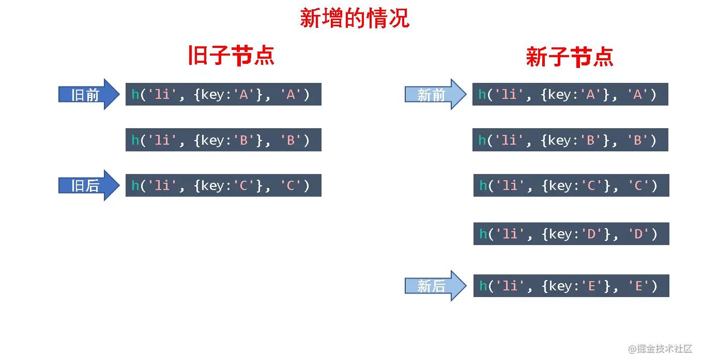
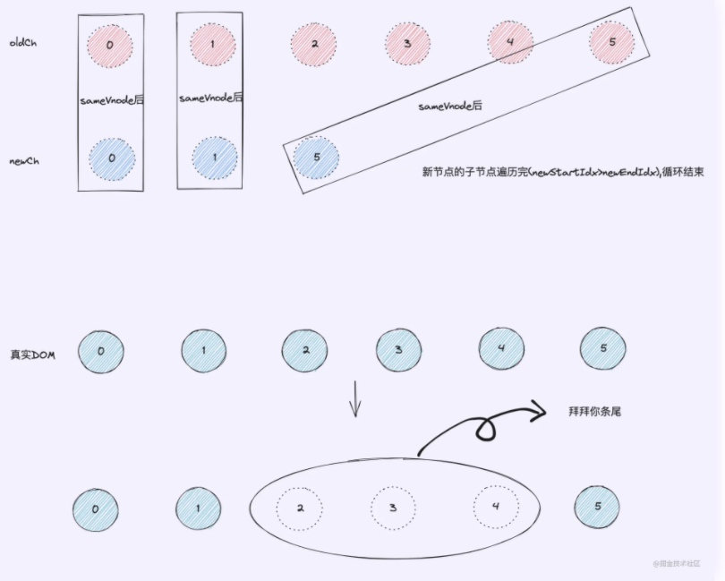
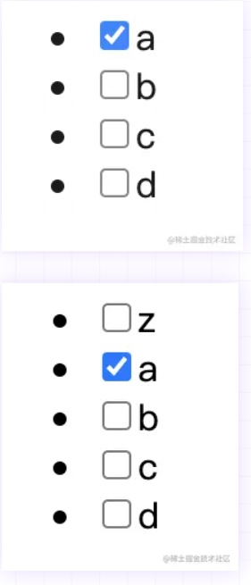

# Vue使用技巧
## Vue
### Vue.js 响应式原理
#### 准备工作
1. **数据驱动**
- 数据响应式、双向绑定、数据驱动
    - 数据响应式
        - 数据模型仅仅是普通的 Javascript 对象，而当我们修改数据时，视图会进行更新，避免了繁琐的 DOM 操作，提高开发效率
    - 双向绑定
        - 数据改变，视图改变；视图改变，数据也随之改变
        - 我们可以使用 v-model 在表单元素上创建双向数据绑定
    - 数据驱动是 Vue 最独特的特性之一
        - 开发过程中仅需要关注数据本身，不需要关心数据是如何渲染到视图

2. 响应式原理原理
**Vue2.x**
普通的 JavaScript 对象传入 Vue 实例作为 data 选项，Vue 将遍历此对象所有的 property，并使用 Object.defineProperty 把这些 property 全部转为 getter/setter。Object.defineProperty 是 ES5 中一个无法 shim 的特性，这也就是 Vue 不支持 IE8 以及更低版本浏览器的原因。

**Vue3.x**
data 函数中返回一个普通的 JavaScript 对象时，Vue 会将该对象包裹在一个带有 get 和 set 处理程序的 Proxy 中。


3. 发布订阅模式
我们假定，存在一个“信号中心“某个任务执行完成。就向信号中心发布“(publish）个信号，其他任务可以向信号中心“订阅“(subscribe）这个信号，从而知道什么时候自己可以开始执行。这就叫做发布订阅模" (Publish-subscribe pattern)
- 发布/订阅模式
    - 订阅者
    - 发布者
    - 信号中心
```js
 // 事件触发器
    class EventEmitter {
      constructor () {
        // { 'click': [fn1, fn2], 'change': [fn] }
        this.subs = Object.create(null)
      }

      // 注册事件
      $on (eventType, handler) {
        this.subs[eventType] = this.subs[eventType] || []
        this.subs[eventType].push(handler)
      }

      // 触发事件
      $emit (eventType) {
        if (this.subs[eventType]) {
          this.subs[eventType].forEach(handler => {
            handler()
          })
        }
      }
    }

    // 测试
    let em = new EventEmitter()
    em.$on('click', () => {
      console.log('click1')
    })
    em.$on('click', () => {
      console.log('click2')
    })

    em.$emit('click')
```

2. 观察者模式(Vue使用的)
- 观察者（订阅者）- Watcher
    - update (）：当事件发生时，具体要做的事情
- 目标（发布者）-Dep
    - subs 数组：存储所有的观察者
    - addsub：添加观察者
    - notify：当事件发生，调用所有观察者的 update（）方法
没有事件中心
```js
// 发布者-目标
    class Dep {
      constructor () {
        // 记录所有的订阅者
        this.subs = []
      }
      // 添加订阅者
      addSub (sub) {
        if (sub && sub.update) {
          this.subs.push(sub)
        }
      }
      // 发布通知
      notify () {
        this.subs.forEach(sub => {
          sub.update()
        })
      }
    }
    // 订阅者-观察者
    class Watcher {
      update () {
        console.log('update')
      }
    }

    // 测试
    let dep = new Dep()
    let watcher = new Watcher()

    dep.addSub(watcher)

    dep.notify()
```


#### 模拟Vue响应式


1. Vue
```js
class Vue {
  constructor (options) {
    // 1. 通过属性保存选项的数据
    this.$options = options || {}
    this.$data = options.data || {}
    this.$el = typeof options.el === 'string' ? document.querySelector(options.el) : options.el
    // 2. 把data中的成员转换成getter和setter，注入到vue实例中
    this._proxyData(this.$data)
    // 3. 调用observer对象，监听数据的变化   
    new Observer(this.$data)  
    // 4. 调用compiler对象，解析指令和差值表达式
    new Compiler(this)
  }
  _proxyData (data) {
    // 遍历data中的所有属性
    Object.keys(data).forEach(key => {
      // 把data的属性注入到vue实例中
      Object.defineProperty(this, key, {
        enumerable: true,
        configurable: true,
        get () {
          return data[key]
        },
        set (newValue) {
          if (newValue === data[key]) {
            return
          }
          data[key] = newValue
        }
      })
    })
  }
}
```
2. Observer

- 功能
    - 负责把 data 选项中的属性转换成响应式数据
    - data 中的某个属性也是对象，把该属性转换成响应式数据
    - 数据变化发送通知
```js
class Observer {
  constructor (data) {
    this.walk(data)
  }
  walk (data) {
    // 1. 判断data是否是对象
    if (!data || typeof data !== 'object') {
      return
    }
    // 2. 遍历data对象的所有属性
    Object.keys(data).forEach(key => {
      this.defineReactive(data, key, data[key])
    })
  }
  defineReactive (obj, key, val) {
    let that = this
    // 负责收集依赖，并发送通知
    let dep = new Dep()
    // 如果val是对象，把val内部的属性转换成响应式数据
    this.walk(val)
    Object.defineProperty(obj, key, {
      enumerable: true,
      configurable: true,
      get () {
        // 收集依赖
        Dep.target && dep.addSub(Dep.target)
        return val
      },
      set (newValue) {
        if (newValue === val) {
          return
        }
        val = newValue
        that.walk(newValue)
        // 发送通知
        dep.notify()
      }
    })
  }
}
```

3. Compiler

- 功能
    - 负责编译模板，解析指令差值表达式
    - 负责页面的首次染
    - 当数据变化后重新渲染视图
```js
class Compiler {
  constructor(vm) {
    this.el = vm.$el;
    this.vm = vm;
    this.compile(this.el);
  }
  // 编译模板，处理文本节点和元素节点
  // el 模板
  compile(el) {
    // el 所有的子节点
    let childNodes = el.childNodes;
    Array.from(childNodes).forEach((node) => {
      // 处理文本节点 差值表达式也是的
      if (this.isTextNode(node)) {
        this.compileText(node);
      } else if (this.isElementNode(node)) {
        // 处理元素节点
        this.compileElement(node);
      }
      // 判断node节点，是否有子节点，如果有子节点，要递归调用compile
      if (node.childNodes && node.childNodes.length) {
        this.compile(node);
      }
    });
  }
  // 编译元素节点，处理指令
  compileElement(node) {
    // 遍历所有的属性节点
    Array.from(node.attributes).forEach((attr) => {
      // 判断是否是指令
      let attrName = attr.name;
      if (this.isDirective(attrName)) {
        // v-text --> text
        // 属性的名字
        attrName = attrName.substr(2);
        // 属性的值
        let key = attr.value;
        this.update(node, key, attrName);
      }
    });
  }

  update(node, key, attrName) {
    //动态的选取方法   根据我们的属性名字attrName
    let updateFn = this[attrName + "Updater"];
    // 让this 指向 Compiler 对象
    updateFn && updateFn.call(this, node, this.vm[key], key);
  }

  // 处理 v-text 指令
  textUpdater(node, value, key) {
    node.textContent = value;
    new Watcher(this.vm, key, (newValue) => {
      node.textContent = newValue
    })
  }
  // v-model
  modelUpdater(node, value, key) {
    node.value = value;
    new Watcher(this.vm, key, (newValue) => {
      node.value = newValue;
    });
    // 双向绑定
    node.addEventListener("input", () => {
      this.vm[key] = node.value;
    });
  }

  // 编译文本节点，处理差值表达式
  compileText(node) {
    let reg = /\{\{(.+?)\}\}/;
    let value = node.textContent;
    if (reg.test(value)) {
      let key = RegExp.$1.trim();
      node.textContent = value.replace(reg, this.vm[key]);

      // 创建watcher对象，当数据改变更新视图
      new Watcher(this.vm, key, (newValue) => {
        node.textContent = newValue;
      });
    }
  }
  // 判断元素属性是否是指令
  isDirective(attrName) {
    return attrName.startsWith("v-");
  }
  // 判断节点是否是文本节点
  isTextNode(node) {
    return node.nodeType === 3;
  }
  // 判断节点是否是元素节点
  isElementNode(node) {
    return node.nodeType === 1;
  }
}
```
4. Dep(发布者)


```js
class Dep {
  constructor () {
    // 存储所有的观察者
    this.subs = []
  }
  // 添加观察者
  addSub (sub) {
    if (sub && sub.update) {
      this.subs.push(sub)
    }
  }
  // 发送通知
  notify () {
    this.subs.forEach(sub => {
      sub.update()
    })
  }
}
```
5.Watcher(观察者)

- 功能
    - 当数据变化触发依赖，dep 通知所有的 Watcher 实例更新视图
    - 自身实例化的时候往 dep 对象中添加自己

```js
class Watcher {
  constructor (vm, key, cb) {
    this.vm = vm
    // data中的属性名称
    this.key = key
    // 回调函数负责更新视图
    this.cb = cb

    // 把watcher对象记录到Dep类的静态属性target
    Dep.target = this
    // 触发get方法，在get方法中会调用addSub
    this.oldValue = vm[key]
    Dep.target = null
  }
  // 当数据发生变化的时候更新视图
  update () {
    let newValue = this.vm[this.key]
    if (this.oldValue === newValue) {
      return
    }
    this.cb(newValue)
  }
}
```

6. 小结

### Diff算法核心原理
#### 什么是虚拟DOM
- 虚拟DOM，是由普通的JS对象来描述DOM对象
- 虚拟DOM是一个对象，一个什么样的对象呢？一个用来表示真实DOM的对象。
- Virtual DOM 的好处是当状态改变时不需要立即更新 DOM，只需要创建一个虚拟树来描述 DOM， Virtual DOM 内部将弄清楚如何有效(diff)的更新 DOM
- Virtual DOM的好处
    - 虚拟 DOM 可以维护程序的状态，跟踪上一次的状态。数据没有变化就用原来的状态
    - 通过比较前后两次状态的差异更新真实 DOM
- 虚拟 DOM 的作用
    - 维护视图和状态的关系
    - 复杂视图情况下提升渲染性能
    - 除了渲染 DOM 以外，还可以实现**跨平台** SSR(Nuxt.js/Next.js)、原生应用(Weex/React Native)、小程序(mpvue/uni-app)等
- Vue 2.x 内部使用的 Virtual DOM 就是改造的 Snabbdom
```html
<ul id="list">
    <li class="item">哈哈</li>
    <li class="item">呵呵</li>
    <li class="item">嘿嘿</li>
</ul>
```
```js
let oldVDOM = { // 旧虚拟DOM
        tagName: 'ul', // 标签名
        props: { // 标签属性
            id: 'list'
        },
        children: [ // 标签子节点
            {
                tagName: 'li', props: { class: 'item' }, children: ['哈哈']
            },
            {
                tagName: 'li', props: { class: 'item' }, children: ['呵呵']
            },
            {
                tagName: 'li', props: { class: 'item' }, children: ['嘿嘿']
            },
        ]
    }
```
修改一个元素：
```html
<ul id="list">
    <li class="item">哈哈</li>
    <li class="item">呵呵</li>
    <li class="item">林三心哈哈哈哈哈</li> // 修改
</ul>
```
```js
let newVDOM = { // 新虚拟DOM
        tagName: 'ul', // 标签名
        props: { // 标签属性
            id: 'list'
        },
        children: [ // 标签子节点
            {
                tagName: 'li', props: { class: 'item' }, children: ['哈哈']
            },
            {
                tagName: 'li', props: { class: 'item' }, children: ['呵呵']
            },
            {
                tagName: 'li', props: { class: 'item' }, children: ['林三心哈哈哈哈哈']
            },
        ]
    }
```
平常说的新旧两个虚拟DOM，这个时候的新虚拟DOM是数据的最新状态，那么我们直接拿新虚拟DOM去渲染成真实DOM的话，效率真的会比直接操作真实DOM高吗？那肯定是不会的。

第1种方式中间还夹着一个虚拟DOM的步骤，所以虚拟DOM比真实DOM快这句话其实是错的，或者说是不严谨的。那正确的说法是什么呢？虚拟DOM算法操作真实DOM，性能高于直接操作真实DOM，虚拟DOM和虚拟DOM算法是两种概念。虚拟DOM算法 = 虚拟DOM + Diff算法。

#### 什么是Diff算法

只有一个li标签修改了文本，其他都是不变的，所以没必要所有的节点都要更新，只更新这个li标签就行，Diff算法就是查出这个li标签的算法。

**Diff算法是一种对比算法。**对比两者是旧虚拟DOM和新虚拟DOM，对比出是哪个虚拟节点更改了，找出这个虚拟节点，并只更新这个虚拟节点所对应的真实节点，而不用更新其他数据没发生改变的节点，实现精准地更新真实DOM，进而提高效率。

使用虚拟DOM算法的损耗计算： 总损耗 = 虚拟DOM增删改+（与Diff算法效率有关）真实DOM差异增删改+（较少的节点）排版与重绘
直接操作真实DOM的损耗计算： 总损耗 = 真实DOM完全增删改+（可能较多的节点）排版与重绘

- Diff同层对比
    - 新旧虚拟DOM对比的时候，Diff算法比较只会在同层级进行, 不会跨层级比较。 所以Diff算法是:深度优先算法。 时间复杂度:O(n)


- Diff对比流程
    - 当数据改变时，会触发setter，并且通过Dep.notify去通知所有订阅者Watcher，订阅者们就会调用patch方法，给真实DOM打补丁，更新相应的视图。


#### patch方法
这个方法作用就是，对比当前同层的虚拟节点是否为同一种类型的标签(同一类型的标准，下面会讲)：
- 是：继续执行patchVnode方法进行深层比对
- 否：没必要比对了，直接整个节点替换成新虚拟节点
```js
function patch(oldVnode, newVnode) {
  // 比较是否为一个类型的节点
  if (sameVnode(oldVnode, newVnode)) {
    // 是：继续进行深层比较
    patchVnode(oldVnode, newVnode)
  } else {
    // 否
    const oldEl = oldVnode.el // 旧虚拟节点的真实DOM节点
    const parentEle = api.parentNode(oldEl) // 获取父节点
    createEle(newVnode) // 创建新虚拟节点对应的真实DOM节点
    if (parentEle !== null) {
      api.insertBefore(parentEle, newVnode.el, api.nextSibling(oldEl)) // 将新元素添加进父元素
      api.removeChild(parentEle, oldVnode.el)  // 移除以前的旧元素节点
      // 设置null，释放内存
      oldVnode = null
    }
  }

  return newVnode
}
```
#### sameVnode方法
patch关键的一步就是sameVnode方法判断是否为同一类型节点.
```js
function sameVnode(oldVnode, newVnode) {
  return (
    oldVnode.key === newVnode.key && // key值是否一样
    oldVnode.tagName === newVnode.tagName && // 标签名是否一样
    oldVnode.isComment === newVnode.isComment && // 是否都为注释节点
    isDef(oldVnode.data) === isDef(newVnode.data) && // 是否都定义了data
    sameInputType(oldVnode, newVnode) // 当标签为input时，type必须是否相同
  )
}
```
#### patchVnode方法
- 这个函数做了以下事情：
    - 找到对应的真实DOM，称为el
    - 判断newVnode和oldVnode是否指向同一个对象，如果是，那么直接return
    - 如果他们都有文本节点并且不相等，那么将el的文本节点设置为newVnode的文本节点。
    - 如果oldVnode有子节点而newVnode没有，则删除el的子节点
    - 如果oldVnode没有子节点而newVnode有，则将newVnode的子节点真实化之后添加到el
    - 如果两者都有子节点，则执行updateChildren函数比较子节点，这一步很重要
```js
function patchVnode(oldVnode, newVnode) {
  const el = newVnode.el = oldVnode.el // 获取真实DOM对象
  // 获取新旧虚拟节点的子节点数组
  const oldCh = oldVnode.children, newCh = newVnode.children
  // 如果新旧虚拟节点是同一个对象，则终止
  if (oldVnode === newVnode) return
  // 如果新旧虚拟节点是文本节点，且文本不一样
  if (oldVnode.text !== null && newVnode.text !== null && oldVnode.text !== newVnode.text) {
    // 则直接将真实DOM中文本更新为新虚拟节点的文本
    api.setTextContent(el, newVnode.text)
  } else {
    // 否则

    if (oldCh && newCh && oldCh !== newCh) {
      // 新旧虚拟节点都有子节点，且子节点不一样

      // 对比子节点，并更新
      updateChildren(el, oldCh, newCh)
    } else if (newCh) {
      // 新虚拟节点有子节点，旧虚拟节点没有

      // 创建新虚拟节点的子节点，并更新到真实DOM上去
      createEle(newVnode)
    } else if (oldCh) {
      // 旧虚拟节点有子节点，新虚拟节点没有

      //直接删除真实DOM里对应的子节点
      api.removeChild(el)
    }
  }
}
```
#### updateChildren方法
这是patchVnode里最重要的一个方法，新旧虚拟节点的子节点对比，就是发生在updateChildren方法中。
是怎么样一个对比方法呢？就是首尾指针法，新的子节点集合和旧的子节点集合，各有首尾两个指针。
```html
<ul>
    <li>a</li>
    <li>b</li>
    <li>c</li>
</ul>

// 修改数据后

<ul>
    <li>b</li>
    <li>c</li>
    <li>e</li>
    <li>a</li>
</ul>
```

- 然后会进行互相进行比较，总共有五种比较情况：
    1. oldS 和 newS 使用sameVnode方法进行比较，sameVnode(oldS, newS)
    2. oldS 和 newE 使用sameVnode方法进行比较，sameVnode(oldS, newE)
    3. oldE 和 newS 使用sameVnode方法进行比较，sameVnode(oldE, newS)
    4. oldE 和 newE 使用sameVnode方法进行比较，sameVnode(oldE, newE)
    5. 如果以上逻辑都匹配不到，再把所有旧子节点的 key 做一个映射到旧节点下标的 key -> index 表，然后用新 vnode 的 key 去找出在旧节点中可以复用的位置。

```js
function updateChildren(parentElm, oldCh, newCh) {
  let oldStartIdx = 0, newStartIdx = 0
  let oldEndIdx = oldCh.length - 1
  let oldStartVnode = oldCh[0]
  let oldEndVnode = oldCh[oldEndIdx]
  let newEndIdx = newCh.length - 1
  let newStartVnode = newCh[0]
  let newEndVnode = newCh[newEndIdx]
  let oldKeyToIdx
  let idxInOld
  let elmToMove
  let before
  while (oldStartIdx <= oldEndIdx && newStartIdx <= newEndIdx) {
    if (oldStartVnode == null) {
      oldStartVnode = oldCh[++oldStartIdx]
    } else if (oldEndVnode == null) {
      oldEndVnode = oldCh[--oldEndIdx]
    } else if (newStartVnode == null) {
      newStartVnode = newCh[++newStartIdx]
    } else if (newEndVnode == null) {
      newEndVnode = newCh[--newEndIdx]
    } else if (sameVnode(oldStartVnode, newStartVnode)) {
      patchVnode(oldStartVnode, newStartVnode)
      oldStartVnode = oldCh[++oldStartIdx]
      newStartVnode = newCh[++newStartIdx]
    } else if (sameVnode(oldEndVnode, newEndVnode)) {
      patchVnode(oldEndVnode, newEndVnode)
      oldEndVnode = oldCh[--oldEndIdx]
      newEndVnode = newCh[--newEndIdx]
    } else if (sameVnode(oldStartVnode, newEndVnode)) {
      patchVnode(oldStartVnode, newEndVnode)
      api.insertBefore(parentElm, oldStartVnode.el, api.nextSibling(oldEndVnode.el))
      oldStartVnode = oldCh[++oldStartIdx]
      newEndVnode = newCh[--newEndIdx]
    } else if (sameVnode(oldEndVnode, newStartVnode)) {
      patchVnode(oldEndVnode, newStartVnode)
      api.insertBefore(parentElm, oldEndVnode.el, oldStartVnode.el)
      oldEndVnode = oldCh[--oldEndIdx]
      newStartVnode = newCh[++newStartIdx]
    } else {
      // 使用key时的比较
      if (oldKeyToIdx === undefined) {
        oldKeyToIdx = createKeyToOldIdx(oldCh, oldStartIdx, oldEndIdx) // 有key生成index表
      }
      idxInOld = oldKeyToIdx[newStartVnode.key]
      if (!idxInOld) {
        api.insertBefore(parentElm, createEle(newStartVnode).el, oldStartVnode.el)
        newStartVnode = newCh[++newStartIdx]
      }
      else {
        elmToMove = oldCh[idxInOld]
        if (elmToMove.sel !== newStartVnode.sel) {
          api.insertBefore(parentElm, createEle(newStartVnode).el, oldStartVnode.el)
        } else {
          patchVnode(elmToMove, newStartVnode)
          oldCh[idxInOld] = null
          api.insertBefore(parentElm, elmToMove.el, oldStartVnode.el)
        }
        newStartVnode = newCh[++newStartIdx]
      }
    }
  }
  if (oldStartIdx > oldEndIdx) {
    before = newCh[newEndIdx + 1] == null ? null : newCh[newEndIdx + 1].el
    addVnodes(parentElm, before, newCh, newStartIdx, newEndIdx)
  } else if (newStartIdx > newEndIdx) {
    removeVnodes(parentElm, oldCh, oldStartIdx, oldEndIdx)
  }
}
```
#### 用index做key

### Diff算法核心原理2（Snabbdom 源码解析）
```js
import { h } from 'snabbdom/build/package/h'
import { init } from 'snabbdom/build/package/init'
// 导入需要的模块
import { styleModule } from 'snabbdom/build/package/modules/style'
import { eventListenersModule } from 'snabbdom/build/package/modules/eventlisteners'

// 使用 init() 函数创建 patch()
// init() 的参数是数组，将来可以传入模块，处理属性/样式/事件等
let patch = init([
  // 注册模块
  styleModule,
  eventListenersModule
])

// 使用 h() 函数创建 vnode
let vnode = h('div.cls', {
  // 设置 DOM 元素的行内样式
  style: { color: '#DEDEDE', backgroundColor: '#181A1B' },
  // 注册事件
  on: { click: clickHandler }
}, [
  h('h1', 'Hello Snabbdom'),
  h('p', '这是段落')
])

function clickHandler () {
  // 此处的 this 指向对应的 vnode
  console.log(this.elm.innerHTML)
}
```
#### 概述
- 如何学习源码
    - 先宏观了解
    - 带着目标看源码
    - 看源码的过程要不求甚解
    - 调试
    - 参考资料
- Snabbdom 的核心
    - 使用 h() 函数创建 JavaScript 对象(VNode)描述真实 DOM
    - init() 设置模块，创建 patch()
    - patch() 比较新旧两个 VNode
    - 把变化的内容更新到真实 DOM 树上
- Snabbdom 源码
    - https://github.com/snabbdom/snabbdom
  ```
  ├── package
  │   ├── helpers
  │   │   └── attachto.ts		定义了 vnode.ts 中 AttachData 的数据结构
  │   ├── modules
  │   │   ├── attributes.ts
  │   │   ├── class.ts
  │   │   ├── dataset.ts
  │   │   ├── eventlisteners.ts
  │   │   ├── hero.ts				example 中使用到的自定义钩子
  │   │   ├── module.ts			定义了模块中用到的钩子函数
  │   │   ├── props.ts
  │   │   └── style.ts
  │   ├── h.ts							h() 函数，用来创建 VNode
  │   ├── hooks.ts					所有钩子函数的定义
  │   ├── htmldomapi.ts			对 DOM API 的包装
  │   ├── init.ts						加载 modules、DOMAPI，返回 patch 函数
  │   ├── is.ts							判断数组和原始值的函数
  │   ├── jsx-global.ts			jsx 的类型声明文件
  │   ├── jsx.ts						处理 jsx
  │   ├── thunk.ts					优化处理，对复杂视图不可变值得优化
  │   ├── tovnode.ts				DOM 转换成 VNode
  │   ├── ts-transform-js-extension.cjs
  │   ├── tsconfig.json			ts 的编译配置文件
  │   └── vnode.ts					虚拟节点定义
  ```
#### h 函数
- h() 函数介绍
    - 在使用 Vue 的时候见过 h() 函数
    ```js
    new Vue({
      router,
      store,
      render: h => h(App)
    }).$mount('#app')
    ```
    - h() 函数最早见于 [hyperscript](https://github.com/hyperhype/hyperscript)，使用 JavaScript 创建超文本
    - Snabbdom 中的 h() 函数不是用来创建超文本，而是创建 VNode
- 源码位置：src/package/h.ts
  ```js
  // h 函数的重载
  export function h (sel: string): VNode
  export function h (sel: string, data: VNodeData | null): VNode
  export function h (sel: string, children: VNodeChildren): VNode
  export function h (sel: string, data: VNodeData | null, children: VNodeChildren): VNode
  export function h (sel: any, b?: any, c?: any): VNode {
    var data: VNodeData = {}
    var children: any
    var text: any
    var i: number
    // 处理参数，实现重载的机制
    if (c !== undefined) {
      // 处理三个参数的情况
      // sel、data、children/text
      if (b !== null) {
        // 模块中所需要的数据
        data = b
      }
      if (is.array(c)) {
        children = c
      // 判断是否为字符串和数字
      } else if (is.primitive(c)) {
        text = c
      } else if (c && c.sel) {
        children = [c]
      }
    } else if (b !== undefined && b !== null) {
      if (is.array(b)) {
        children = b
      } else if (is.primitive(b)) {
        // 如果 c 是字符串或者数字
        text = b
      } else if (b && b.sel) {
        // 如果 b 是 VNode
        children = [b]
      } else { data = b }
    }
    if (children !== undefined) {
      // 处理 children 中的原始值(string/number)
      for (i = 0; i < children.length; ++i) {
        // 如果 child 是 string/number，创建文本节点
        if (is.primitive(children[i])) children[i] = vnode(undefined, undefined, undefined, children[i], undefined)
      }
    }
    if (
      sel[0] === 's' && sel[1] === 'v' && sel[2] === 'g' &&
      (sel.length === 3 || sel[3] === '.' || sel[3] === '#')
    ) {
      // 如果是 svg，添加命名空间
      addNS(data, children, sel)
    }
    // 返回 VNode
    return vnode(sel, data, children, text, undefined)
  };
  ```
#### VNode
- 一个 VNode 就是一个虚拟节点用来描述一个 DOM 元素，如果这个 VNode 有 children 就是 Virtual DOM 
- 源码位置：src/package/vnode.ts
```js
/**
 * 把传入的 参数 作为 对象返回
 * @param {string} sel 选择器
 * @param {object} data 数据
 * @param {array} children 子节点
 * @param {string} text 文本
 * @param {dom} elm DOM
 * @returns object
 */
export interface VNode {
  // 选择器
  sel: string | undefined;
  // 节点数据：属性/样式/事件等
  data: VNodeData | undefined;
  // 子节点，和 text 只能互斥
  children: Array<VNode | string> | undefined;
  // 记录 vnode 对应的真实 DOM
  elm: Node | undefined;
  // 节点中的内容，和 children 只能互斥
  text: string | undefined;
  // 优化用
  key: Key | undefined;
}

export function vnode (sel: string | undefined,
                      data: any | undefined,
                      children: Array<VNode | string> | undefined,
                      text: string | undefined,
                      elm: Element | Text | undefined): VNode {
  const key = data === undefined ? undefined : data.key
  return { sel, data, children, text, elm, key }
}
```
#### snabbdom
- patch(oldVnode, newVnode)
- 打补丁，把新节点中变化的内容渲染到真实 DOM，最后返回新节点作为下一次处理的旧节点
- 对比新旧 VNode 是否相同节点(节点的 key 和 sel 相同)
- 如果不是相同节点，删除之前的内容，重新渲染
- 如果是相同节点，再判断新的 VNode 是否有 text，如果有并且和 oldVnode 的 text 不同，直接更新文本内容
- 如果新的 VNode 有 children，判断子节点是否有变化，判断子节点的过程使用的就是 diff 算法
- diff 过程只进行同层级比较


#### init
- **功能：**init(modules, domApi)，返回 patch() 函数（高阶函数）
- 为什么要使用高阶函数？（可以先缓存一下数据）
    - 因为 patch() 函数再外部会调用多次，每次调用依赖一些参数，比如：modules/domApi/cbs
    - 通过高阶函数让 init() 内部形成闭包，返回的 patch() 可以访问到 modules/domApi/cbs，而不需要重新创建
- init() 在返回 patch() 之前，首先收集了所有模块中的钩子函数存储到 cbs（回调函数） 对象中
- 源码位置：src/package/init.ts
```js
  const hooks: Array<keyof Module> = ['create', 'update', 'remove', 'destroy', 'pre', 'post']
  export function init (modules: Array<Partial<Module>>, domApi?: DOMAPI) {
    let i: number
    let j: number
    const cbs: ModuleHooks = {
      create: [],
      update: [],
      remove: [],
      destroy: [],
      pre: [],
      post: []
    }
    // 初始化 api
    const api: DOMAPI = domApi !== undefined ? domApi : htmlDomApi
    // 把传入的所有模块的钩子方法，统一存储到 cbs 对象中
    // 最终构建的 cbs 对象的形式 cbs = [ create: [fn1, fn2], update: [], ... ]
  	for (i = 0; i < hooks.length; ++i) {
      // cbs['create'] = []
      cbs[hooks[i]] = []
      for (j = 0; j < modules.length; ++j) {
        // const hook = modules[0]['create']
        const hook = modules[j][hooks[i]]
        if (hook !== undefined) {
          (cbs[hooks[i]] as any[]).push(hook)
        }
      }
    }
    ……
    return function patch (oldVnode: VNode | Element, vnode: VNode): VNode {
      ……
    }
  }
  ```
#### patch
- **功能：**
  - 传入新旧 VNode，对比差异，把差异渲染到 DOM
  - 返回新的 VNode，作为下一次 patch() 的 oldVnode
- **执行过程：**
  - 首先执行**模块**中的**钩子**函数 `pre`
  - 如果 oldVnode 和 vnode 相同（key 和 sel 相同）
    - 调用 patchVnode()，找节点的差异并更新 DOM
  - 如果 oldVnode 是 DOM 元素
    - 把 DOM 元素转换成 oldVnode
    - 调用 createElm() 把 vnode 转换为真实 DOM，记录到 vnode.elm
    - 把刚创建的 DOM 元素插入到 parent 中
    - 移除老节点
    - 触发**用户**设置的 `create ` **钩子**函数


- pactch(oldVnode,newVnode)
- 把新节点中变化的内容渲染到真实DOM,最后返回新节点作为下一次处理的旧节点(核心)
- 对比新旧VNode是否相同节点(节点的key和sel相同)
- 如果不是相同节点,删除之前的内容,重新渲染
- 如果是相同节点,再判断新的VNode是否有text,如果有并且和oldVnode的text不同直接更新文本内容(patchVnode)
- 如果新的VNode有children,判断子节点是否有变化(updateChildren,最麻烦,最难实现)


- 源码位置：src/package/init.ts
```js
  return function patch (oldVnode: VNode | Element, vnode: VNode): VNode {
    let i: number, elm: Node, parent: Node
    // 保存新插入节点的队列，为了触发钩子函数
    const insertedVnodeQueue: VNodeQueue = []
    // 执行模块的 pre 钩子函数
    for (i = 0; i < cbs.pre.length; ++i) cbs.pre[i]()
  	// 如果 oldVnode 不是 VNode，创建 VNode 并设置 elm 
    if (!isVnode(oldVnode)) {
      // 把 DOM 元素转换成空的 VNode
      oldVnode = emptyNodeAt(oldVnode)
    }
  	// 如果新旧节点是相同节点(key 和 sel 相同)
    if (sameVnode(oldVnode, vnode)) {
      // 找节点的差异并更新 DOM
      patchVnode(oldVnode, vnode, insertedVnodeQueue)
    } else {
      // 如果新旧节点不同，vnode 创建对应的 DOM
      // 获取当前的 DOM 元素
      elm = oldVnode.elm!
      parent = api.parentNode(elm) as Node
  		// 触发 init/create 钩子函数,创建 DOM
      createElm(vnode, insertedVnodeQueue)
  
      if (parent !== null) {
        // 如果父节点不为空，把 vnode 对应的 DOM 插入到文档中
        api.insertBefore(parent, vnode.elm!, api.nextSibling(elm))
        // 移除老节点
        removeVnodes(parent, [oldVnode], 0, 0)
      }
    }
  	// 执行用户设置的 insert 钩子函数
    for (i = 0; i < insertedVnodeQueue.length; ++i) {
      insertedVnodeQueue[i].data!.hook!.insert!(insertedVnodeQueue[i])
    }
    // 执行模块的 post 钩子函数
    for (i = 0; i < cbs.post.length; ++i) cbs.post[i]()
    return vnode
  }
  ```
#### createElm
- **功能：**
  - createElm(vnode, insertedVnodeQueue)，返回创建的 DOM 元素
  - 创建 vnode 对应的 DOM 元素 
- **执行过程：**
  - 首先触发**用户**设置的 **init** **钩子**函数
  - 如果选择器是!，创建评论节点
  - 如果选择器为空，创建文本节点
  - 如果选择器不为空
    - 解析选择器，设置标签的 id 和 class 属性
    - 执行**模块**的 **create** **钩子**函数
    - 如果 vnode 有 children，创建子 vnode 对应的 DOM，追加到 DOM 树
    - 如果 vnode 的 text 值是 string/number，创建文本节点并追击到 DOM 树
    - 执行**用户**设置的 **create** **钩子**函数
    - 如果有用户设置的 insert 钩子函数，把 vnode 添加到队列中
- 源码位置：src/package/init.ts
```js
    function createElm (vnode: VNode, insertedVnodeQueue: VNodeQueue): Node {
      let i: any
      let data = vnode.data
      
      if (data !== undefined) {
        // 执行用户设置的 init 钩子函数
        const init = data.hook?.init
        if (isDef(init)) {
          init(vnode)
          data = vnode.data
        }
      }
      const children = vnode.children
      const sel = vnode.sel
      // 把vnode转换成真实的DOM对象  （没有渲染到页面）
      if (sel === '!') {
        // 如果选择器是!，创建注释节点
        if (isUndef(vnode.text)) {
          vnode.text = ''
        }
        // 创建注释节点
        vnode.elm = api.createComment(vnode.text!)
      } else if (sel !== undefined) {
        // 如果选择器不为空 
        // 解析选择器
        // Parse selector
        const hashIdx = sel.indexOf('#')
        const dotIdx = sel.indexOf('.', hashIdx)
        const hash = hashIdx > 0 ? hashIdx : sel.length
        const dot = dotIdx > 0 ? dotIdx : sel.length
        const tag = hashIdx !== -1 || dotIdx !== -1 ? sel.slice(0, Math.min(hash, dot)) : sel
        const elm = vnode.elm = isDef(data) && isDef(i = data.ns)
          ? api.createElementNS(i, tag)
          : api.createElement(tag)
        if (hash < dot) elm.setAttribute('id', sel.slice(hash + 1, dot))
        if (dotIdx > 0) elm.setAttribute('class', sel.slice(dot + 1).replace(/\./g, ' '))
        // 执行模块的 create 钩子函数
        for (i = 0; i < cbs.create.length; ++i) cbs.create[i](emptyNode, vnode)
        // 如果 vnode 中有子节点，创建子 vnode 对应的 DOM 元素并追加到 DOM 树上
        if (is.array(children)) {
          for (i = 0; i < children.length; ++i) {
            const ch = children[i]
            if (ch != null) {
              // 递归调用创建子节点
              api.appendChild(elm, createElm(ch as VNode, insertedVnodeQueue))
            }
          }
        } else if (is.primitive(vnode.text)) {
          // 如果 vnode 的 text 值是 string/number，创建文本节点并追加到 DOM 树
          api.appendChild(elm, api.createTextNode(vnode.text))
        }
        const hook = vnode.data!.hook
        if (isDef(hook)) {
          // 执行用户传入的钩子 create
          hook.create?.(emptyNode, vnode)
          if (hook.insert) {
            // 把 vnode 添加到队列中，为后续执行 insert 钩子做准备
            insertedVnodeQueue.push(vnode)
          }
        }
      } else {
        // 如果选择器为空，创建文本节点
        vnode.elm = api.createTextNode(vnode.text!)
      }
      // 返回新创建的 DOM                                
      return vnode.elm
    }
  ```
#### removeVnodes
```js
 function removeVnodes(
    parentElm: Node,
    vnodes: VNode[],
    startIdx: number,
    endIdx: number
  ): void {
    for (; startIdx <= endIdx; ++startIdx) {
      let listeners: number;
      let rm: () => void;
      const ch = vnodes[startIdx];
      if (ch != null) {
        // 元素节点
        if (isDef(ch.sel)) {
          invokeDestroyHook(ch);
          listeners = cbs.remove.length + 1;
          // 防止重复删除元素
          rm = createRmCb(ch.elm!, listeners);
          for (let i = 0; i < cbs.remove.length; ++i) cbs.remove[i](ch, rm);
          const removeHook = ch?.data?.hook?.remove;
          if (isDef(removeHook)) {
            // 用户自定义的函数
            removeHook(ch, rm);
          } else {
            // 删除元素
            rm();
          }
        // 文本节点
        } else {
          // Text node
          api.removeChild(parentElm, ch.elm!);
        }
      }
    }
  }
```
#### addvnodes
```js
function addVnodes(
    parentElm: Node,
    before: Node | null,
    vnodes: VNode[],
    startIdx: number,
    endIdx: number,
    insertedVnodeQueue: VNodeQueue
  ) {
    for (; startIdx <= endIdx; ++startIdx) {
      const ch = vnodes[startIdx];
      if (ch != null) {
        api.insertBefore(parentElm, createElm(ch, insertedVnodeQueue), before);
      }
    }
  }
```
#### sameVnode
```js
/**
 * 判断两个虚拟节点是否是同一节点
 * @param {vnode} vnode1 虚拟节点1
 * @param {vnode} vnode2 虚拟节点2
 * @returns boolean
 */
function sameVnode(vnode1: VNode, vnode2: VNode): boolean {
  const isSameKey = vnode1.key === vnode2.key;
  const isSameIs = vnode1.data?.is === vnode2.data?.is;
  const isSameSel = vnode1.sel === vnode2.sel;

  return isSameSel && isSameKey && isSameIs;
}
```
#### patchVnode

- **功能：**
  - patchVnode(oldVnode, vnode, insertedVnodeQueue)
  - 对比 oldVnode 和 vnode 的差异，把差异渲染到 DOM 
- **执行过程：**
  - 首先执行**用户**设置的 **prepatch** **钩子**函数
  - 执行 create 钩子函数
    - 首先执行**模块**的 **create** **钩子**函数
    - 然后执行**用户**设置的 **create** **钩子**函数
  - 如果 **vnode.text** 未定义
    - 如果 `oldVnode.children` 和 `vnode.children` 都有值
      - 调用 `updateChildren()`
      - 使用 diff 算法对比子节点，更新子节点
    - 如果 `vnode.children` 有值，`oldVnode.children` 无值
      - 清空 DOM 元素
      - 调用 `addVnodes()`，批量添加子节点
    - 如果 `oldVnode.children` 有值，`vnode.children` 无值
      - 调用 `removeVnodes()`，批量移除子节点
    - 如果 **oldVnode.text** 有值
      - 清空 DOM 元素的内容
  - 如果设置了 `vnode.text` 并且和和 `oldVnode.text` 不等
    - 如果老节点有子节点，全部移除
    - 设置 DOM 元素的 `textContent` 为 `vnode.text`
  - 最后执行用户**设置的** **postpatch** **钩子**函数
- 源码位置：src/package/init.ts
```js
  function patchVnode (oldVnode: VNode, vnode: VNode, insertedVnodeQueue: VNodeQueue) {
      const hook = vnode.data?.hook
      // 首先执行用户设置的 prepatch 钩子函数
      hook?.prepatch?.(oldVnode, vnode)
      const elm = vnode.elm = oldVnode.elm!
      const oldCh = oldVnode.children as VNode[]
      const ch = vnode.children as VNode[]
    	// 如果新老 vnode 相同返回
      if (oldVnode === vnode) return
      if (vnode.data !== undefined) {
        // 执行模块的 update 钩子函数
        for (let i = 0; i < cbs.update.length; ++i) cbs.update[i](oldVnode, vnode)
        // 执行用户设置的 update 钩子函数
        vnode.data.hook?.update?.(oldVnode, vnode)
      }
    	// 如果 vnode.text 未定义
      if (isUndef(vnode.text)) {
        // 如果新老节点都有 children
        if (isDef(oldCh) && isDef(ch)) {
          // 调用 updateChildren 对比子节点，更新子节点
          if (oldCh !== ch) updateChildren(elm, oldCh, ch, insertedVnodeQueue)
        } else if (isDef(ch)) {
          // 如果新节点有 children，老节点没有 children
        	// 如果老节点有text，清空dom 元素的内容
          if (isDef(oldVnode.text)) api.setTextContent(elm, '')
          // 批量添加子节点
          addVnodes(elm, null, ch, 0, ch.length - 1, insertedVnodeQueue)
        } else if (isDef(oldCh)) {
          // 如果老节点有children，新节点没有children
        	// 批量移除子节点
          removeVnodes(elm, oldCh, 0, oldCh.length - 1)
        } else if (isDef(oldVnode.text)) {
          // 如果老节点有 text，清空 DOM 元素
          api.setTextContent(elm, '')
        }
      } else if (oldVnode.text !== vnode.text) {
        // 如果没有设置 vnode.text
        if (isDef(oldCh)) {
          // 如果老节点有 children，移除
          removeVnodes(elm, oldCh, 0, oldCh.length - 1)
        }
        // 设置 DOM 元素的 textContent 为 vnode.text
        api.setTextContent(elm, vnode.text!)
      }
      // 最后执行用户设置的 postpatch 钩子函数
      hook?.postpatch?.(oldVnode, vnode)
    }
  ```
#### updateChildren
在这里要使用 4 个指针,从四种比较顺序的顺序来开始命中优化策略，命中一个，指针进行移动(新前和旧前向下移动，新后和旧后向上移动)，没有命中，就使用下一个策略，如果四个策略都没有命中，只能靠循环来找
- **功能：**
  - diff 算法的核心，对比新旧节点的 children，更新 DOM
- **执行过程：**
  - 要对比两棵树的差异，我们可以取第一棵树的每一个节点依次和第二课树的每一个节点比较，但是这样的时间复杂度为 O(n^3)
  - 在DOM 操作的时候我们很少很少会把一个父节点移动/更新到某一个子节点
  - 因此只需要找**同级别**的子**节点**依次**比较**，然后再找下一级别的节点比较，这样算法的时间复杂度为 O(n)


- 在进行同级别节点比较的时候，首先会对新老节点数组的开始和结尾节点设置标记索引，遍历的过程中移动索引
  - 在对**开始和结束节点**比较的时候，总共有四种情况
    - oldStartVnode / newStartVnode (旧开始节点 / 新开始节点)
    - oldEndVnode / newEndVnode (旧结束节点 / 新结束节点)
    - oldStartVnode / oldEndVnode (旧开始节点 / 新结束节点)
    - oldEndVnode / newStartVnode (旧结束节点 / 新开始节点)

 - 开始节点和结束节点比较，这两种情况类似
    - oldStartVnode / newStartVnode (旧开始节点 / 新开始节点)
    - oldEndVnode / newEndVnode (旧结束节点 / 新结束节点)
  - 如果 oldStartVnode 和 newStartVnode 是 sameVnode (key 和 sel 相同)
    - 调用 patchVnode() 对比和更新节点
    - 把旧开始和新开始索引往后移动  oldStartIdx++ / oldEndIdx++


   - oldStartVnode / newEndVnode (旧开始节点 / 新结束节点) 相同
     	- 调用 patchVnode() 对比和更新节点
      - 把 oldStartVnode 对应的 DOM 元素，移动到右边
        	- 更新索引


   - oldEndVnode / newStartVnode (旧结束节点 / 新开始节点) 相同
    - 调用 patchVnode() 对比和更新节点
     - 把 oldEndVnode 对应的 DOM 元素，移动到左边
     - 更新索引


    - 如果不是以上四种情况
    - 遍历新节点，使用 newStartNode 的 key 在老节点数组中找相同节点
    - 如果没有找到，说明 newStartNode 是新节点
      - 创建新节点对应的 DOM 元素，插入到 DOM 树中
    - 如果找到了
      - 判断新节点和找到的老节点的 sel 选择器是否相同
      - 如果不相同，说明节点被修改了
        - 重新创建对应的 DOM 元素，插入到 DOM 树中
      - 如果相同，把 elmToMove 对应的 DOM 元素，移动到左边


 - 循环结束
    - 当老节点的所有子节点先遍历完 (oldStartIdx > oldEndIdx)，循环结束
    - 新节点的所有子节点先遍历完 (newStartIdx > newEndIdx)，循环结束
  - 如果老节点的数组先遍历完(oldStartIdx > oldEndIdx)，说明新节点有剩余，把剩余节点批量插入到右边


- 如果新节点的数组先遍历完(newStartIdx > newEndIdx)，说明老节点有剩余，把剩余节点批量删除


    
- 源码位置：src/package/init.ts

  ```js
  function updateChildren (parentElm: Node,
    oldCh: VNode[],
    newCh: VNode[],
    insertedVnodeQueue: VNodeQueue) {
    let oldStartIdx = 0
    let newStartIdx = 0
    let oldEndIdx = oldCh.length - 1
    let oldStartVnode = oldCh[0]
    let oldEndVnode = oldCh[oldEndIdx]
    let newEndIdx = newCh.length - 1
    let newStartVnode = newCh[0]
    let newEndVnode = newCh[newEndIdx]
    let oldKeyToIdx: KeyToIndexMap | undefined
    let idxInOld: number
    let elmToMove: VNode
    let before: any
    // 旧前<=旧后&&新前<=新后
    while (oldStartIdx <= oldEndIdx && newStartIdx <= newEndIdx) {
      // 索引变化后，可能会把节点设置为空
      if (oldStartVnode == null) {
        // 节点为空移动索引
        oldStartVnode = oldCh[++oldStartIdx] // Vnode might have been moved left
      } else if (oldEndVnode == null) {
        oldEndVnode = oldCh[--oldEndIdx]
      } else if (newStartVnode == null) {
        newStartVnode = newCh[++newStartIdx]
      } else if (newEndVnode == null) {
        newEndVnode = newCh[--newEndIdx]
      // 比较开始和结束节点的四种情况
      } else if (sameVnode(oldStartVnode, newStartVnode)) {
        // 1. 比较老开始节点和新的开始节点
        patchVnode(oldStartVnode, newStartVnode, insertedVnodeQueue)
        oldStartVnode = oldCh[++oldStartIdx]
        newStartVnode = newCh[++newStartIdx]
      } else if (sameVnode(oldEndVnode, newEndVnode)) {
        // 2. 比较老结束节点和新的结束节点
        patchVnode(oldEndVnode, newEndVnode, insertedVnodeQueue)
        oldEndVnode = oldCh[--oldEndIdx]
        newEndVnode = newCh[--newEndIdx]
      } else if (sameVnode(oldStartVnode, newEndVnode)) { // Vnode moved right
        // 3. 比较老开始节点和新的结束节点
        patchVnode(oldStartVnode, newEndVnode, insertedVnodeQueue)
        api.insertBefore(parentElm, oldStartVnode.elm!, api.nextSibling(oldEndVnode.elm!))
        oldStartVnode = oldCh[++oldStartIdx]
        newEndVnode = newCh[--newEndIdx]
      } else if (sameVnode(oldEndVnode, newStartVnode)) { // Vnode moved left
        // 4. 比较老结束节点和新的开始节点
        patchVnode(oldEndVnode, newStartVnode, insertedVnodeQueue)
        api.insertBefore(parentElm, oldEndVnode.elm!, oldStartVnode.elm!)
        oldEndVnode = oldCh[--oldEndIdx]
        newStartVnode = newCh[++newStartIdx]
      } else {
        // 开始节点和结束节点都不相同
        // 使用 newStartNode 的 key 再老节点数组中找相同节点
        // 先设置记录 key 和 index 的对象
        if (oldKeyToIdx === undefined) {
          oldKeyToIdx = createKeyToOldIdx(oldCh, oldStartIdx, oldEndIdx)
        }
        // 遍历 newStartVnode, 从老的节点中找相同 key 的 oldVnode 的索引
        idxInOld = oldKeyToIdx[newStartVnode.key as string]
        // 如果是新的vnode
        if (isUndef(idxInOld)) { // New element
          // 如果没找到，newStartNode 是新节点
          // 创建元素插入 DOM 树
          api.insertBefore(parentElm, createElm(newStartVnode, insertedVnodeQueue), oldStartVnode.elm!)
        } else {
          // 如果找到相同 key 相同的老节点，记录到 elmToMove 遍历
          elmToMove = oldCh[idxInOld]
          if (elmToMove.sel !== newStartVnode.sel) {
            // 如果新旧节点的选择器不同
            // 创建新开始节点对应的 DOM 元素，插入到 DOM 树中
            api.insertBefore(parentElm, createElm(newStartVnode, insertedVnodeQueue), oldStartVnode.elm!)
          } else {
            // 如果相同，patchVnode()
            // 把 elmToMove 对应的 DOM 元素，移动到左边
            patchVnode(elmToMove, newStartVnode, insertedVnodeQueue)
            oldCh[idxInOld] = undefined as any
            api.insertBefore(parentElm, elmToMove.elm!, oldStartVnode.elm!)
          }
        }
        // 重新给 newStartVnode 赋值，指向下一个新节点
        newStartVnode = newCh[++newStartIdx]
      }
    }
    // 循环结束，老节点数组先遍历完成或者新节点数组先遍历完成
    if (oldStartIdx <= oldEndIdx || newStartIdx <= newEndIdx) {
      if (oldStartIdx > oldEndIdx) {
        // 如果老节点数组先遍历完成，说明有新的节点剩余
        // 把剩余的新节点都插入到右边
        before = newCh[newEndIdx + 1] == null ? null : newCh[newEndIdx + 1].elm
        addVnodes(parentElm, before, newCh, newStartIdx, newEndIdx, insertedVnodeQueue)
      } else {
        // 如果新节点数组先遍历完成，说明老节点有剩余
        // 批量删除老节点
        removeVnodes(parentElm, oldCh, oldStartIdx, oldEndIdx)
      }
    }
  }
  ```
#### key的作用
- Diff操作可以更加快速;
- Diff操作可以更加准确;(避免渲染错误)
- 不推荐使用索引作为key


Diff操作可以更加准确;(避免渲染错误):
实例:a,b,c三个dom元素中的b,c间插入一个z元素
- 没有设置key

- 当设置了key:


Diff操作可以更加准确;(避免渲染错误)
实例:a,b,c三个dom元素,修改了a元素的某个属性再去在a元素前新增一个z元素
- 没有设置key:

因为没有设置key,默认都是undefined,所以节点都是相同的,更新了text的内容但还是沿用了之前的dom,所以实际上a->z(a原本打勾的状态保留了,只改变了text),b->a,c->b,d->c,遍历完毕发现还要增加一个dom,在最后新增一个text为d的dom元素
- 设置了key:

当设置了key,a,b,c,d都有对应的key,a->a,b->b,c->c,d->d,内容相同无需更新,遍历结束,新增一个text为z的dom元素


不推荐使用索引作为key:
设置索引为key:

这明显效率不高,我们只希望找出不同的节点更新,而使用索引作为key会增加运算时间,我们可以把key设置为与节点text为一致就可以解决这个问题:


## Vue Router
### Hash 和 History 模式区别
- Hash 模式
    - https://music.163.com/#/playlist?id=3102961863 
- History 模式
    - https://music.163.com/playlist/3102961863

**原理及其区别**
- `Hash`模式是基于锚点，以及` onhashchange `事件 
    - URL中排后面的内容作为路径地址
    - 监听` hashchange `事件
    - 根据当前路由地址找到对应组件重新渲染 

- `History`模式是基于` HTML5 `中的` History Api`
    - `history.pushState`IE10 以后才支持
    - `history.replaceState()`

    - 通过` history.pushState（）`方法改变地址栏
    - 监听` popstate `事件
    - 根据当前路由地址找到对应组件重新渲染

#### History模式的使用
- History 需要服务器的支持
    - 单页应用中，服务端不存在http://www.testurl.com/login这样的地址会返回找不到该页面
    - 在服务端应该除了静态资源外都返回单页应用的 index.html

### Vue Router实现原理


- Vue 的构建版本
    - 运行时版：不支持 template 模板，需要打包的时候提前编译
    ```js
    //自己写render函数
    ```
    - 完整版：包含运行时和编译器，体积比运行时版大 10K 左右，程序运行的时候把模板转换成 render 函数 
    ```js
    //在vue.config.js中开启
    //runtimeCompiler
    // 是否使用包含运行时编译器的 Vue 构建版本。设置为 true 后你就可以在 Vue 组件中使用 template 选项了，但是这会让你的应用额外增加 10kb 左右。
    module.exports = {
        runtimeCompiler:true
    }
    ```

```js
let _Vue = null
export default class VueRouter {
    constructor(options) {
        this.options = options
        //根据地址找组件
        this.routeMap = {}
        //要是响应式的对象
        this.data = _Vue.observable({
            //当前路由地址
            current:'/'
        })
        this.init()
    }


    // 传入Vue的构造函数和可配置的选项
    static install (Vue){
        // 1. 判断当前插件是否已经安装
        if(VueRouter.install.installed){
            return;
        }
        VueRouter.install.installed = true
        // 2. 把Vue构造函数记录到全局变量(要在VueRouter实例方法中使用这个构造函数)
        _Vue = Vue
        // 3. 把Vue实例时候传入的router对象注入到所有Vue实例上
        // 挂载到原型上，所有的实例都是可以访问到的
        // _Vue.prototype.$router = this.$options.router (this -> VueRouter,而不是 Vue)
        // 混入
        _Vue.mixin({
            beforeCreate(){
                //只有为Vue构造函数的时候才执行，其他的组件不执行
                if(this.$options.router){
                    //混入使这个this指向Vue
                    _Vue.prototype.$router = this.$options.router
                }
            }
        })
    }

    init() {
        this.createRouteMap()
        this.initComponents(_Vue)
        this.initEvent()
    }

    // 遍历所有的路由规则，把路由规则解析成键值对的形式，存储到routeMap
    createRouteMap() {
        this.options.routes.forEach(route => {
            this.routeMap[route.path] = route.component
        });
    }

    //创建router-link  router-view组件
    initComponents(Vue){
        Vue.component('router-link',{
            props:{
                to:String
            },
            // template:'<a :href="to"><slot></slot></a>'
            render(h){
                return h('a',{
                    attrs: {
                        href:this.to
                    },
                    on:{
                        click:this.clickhander
                    }
                },[
                    this.$slots.default
                ])
            },
            methods:{
                clickhander(e){
                    history.pushState({},"",this.to)
                    this.$router.data.current=this.to
                    e.preventDefault()
                }
            }
        })

        //让this 指向  vuerouter
        const self = this
        Vue.component('router-view',{
            render(h){
                const component =  self.routeMap[self.data.current]
                return h(component)
            }
        })
    }

    initEvent(){
        //history popstate,只改变  地址  不发送请求
        window.addEventListener("popstate",()=>{
            // 处理前进和后退   来改变当前地址，去获取相应组件 来进行渲染
            this.data.current = window.location.pathname
        })
    }
    
}
```  